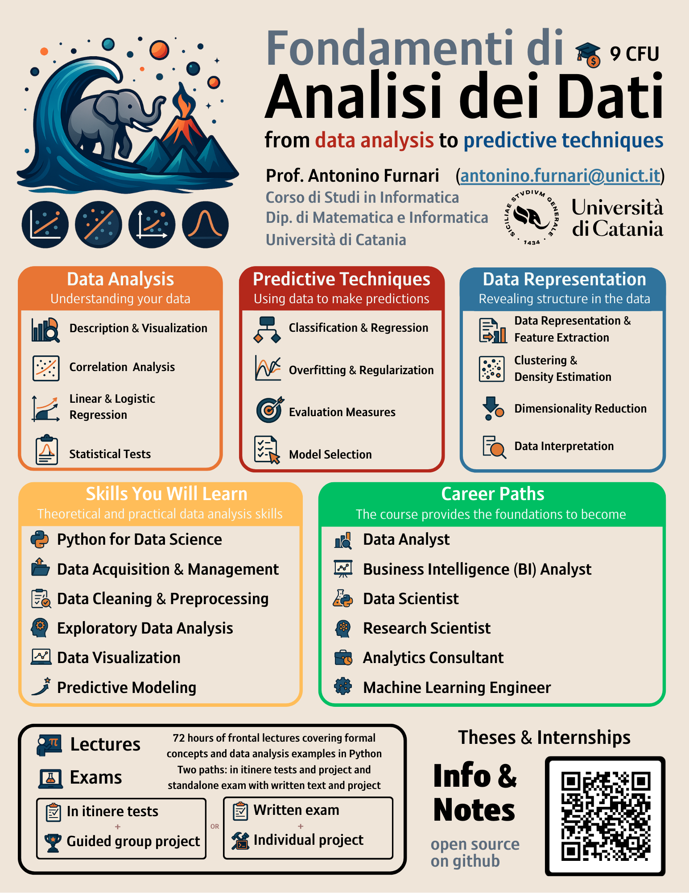

# Fundamentals of Data Analysis
This page contains information on the Fundamentals of Data Analysis course, including the syllabus, lecture notes, and other resources.

The course has been updated through the years. Please find each year's details in the following.

## Fondamenti di Analisi dei Dati e Laboratorio 2025/2026
<a name="top">

<h3 style="margin-top:0">Changes in the academic year 2025/2026</h3>

In academic year 2025/2026, the syllabus and course have been completely revised to adapt the load for the transition of the course from the Master's Degree to the Bachelor's Degree.
The resulting course now focuses on core concepts without delving too much into details covered by other courses or more suited for Master's studies.

<h3>Structure of the course</h3>

The course includes a theory module (6 CFU) and a laboratory module (3 CFU). Theory sessions focus on core topics and algorithms, but also cover intuition and examples. Laboratory sessions focus on the solution of real data analysis problems using the Python language and related data science libraries through live coding sessions in the classroom.

<h3> Examination</h3>

The examination consists of a written exam and project in Python. Passing two in-itinere tests held during the course allows to be exempted from the written exam.

<h3>Data Science Challenge</h3>

At the end of the course, a challenge on data analysis will be organized. Students will have to solve a real data analysis project in 24/48 hours and present the results afterwards. The challenge can be tackled by small groups of 1-3 students. If the presentation is deemed to be sufficient, students are exempted from the project.

<h3>Notes</h3>

High-quality, open-source notes will be provided during the course. For reference, consider last years' notes which can be found <a href="http://antoninofurnari.github.io/fadlecturenotes2425/" target="_blank">here</a>. Please consider that last years' notes are significantly more extensive than the ones intended for this year (and released lecture by lecture during the year) due to changes in the syllabus. Old notes will be always available for reference, but their content are not subject to examination. The student will instead refer to the current year's notes.

<h3>Synthetic Syllabus</h3>

<a href="fad_infographic.pdf" target="_blank">This flier</a> reports brief information on the course. A tentative syllbus is reported in the following:

<ul>
    <li><b>Introduction to Data Analysis:</b> Aims, relevance of data, the data analysis lifecycle, and course structure.</li>
    <li><b>Exploratory Data Analysis and Descriptive Statistics:</b> Data acquisition, types of data, tabular datasets, measures of central tendency and spread, data visualization, wrangling, and normalization.</li>
    <li><b>Introduction to Laboratories:</b> Python fundamentals, essential libraries (Numpy, Scipy, Matplotlib, Seaborn, Plotly, Statsmodels, Scikit-Learn), and hands-on data cleaning.</li>
    <li><b>Probability for Data Analysis and Data Distributions:</b> Uncertainty, random variables, probability estimation, joint and conditional probabilities, expectation, variance, covariance, common probability distributions</li>
    <li><b>Data Association:</b> Pearson Chi-square statistic, Cramer V, Covariance, and various correlation coefficients (Pearson, Point-biserial, Spearman, Kendall).</li>
    <li><b>Statistical Inference tools for Data Analysis:</b> Sampling, standard error, confidence intervals, bias-variance trade-off, hypothesis testing, and normality assessment.</li>
    <li><b>Linear Regression:</b> Simple and multiple linear regression, estimating coefficients, model accuracy assessment, variable selection, qualitative predictors, and interaction terms.</li>
    <li><b>Logistic Regression:</b> Relationship between continuous and binary variables, logistic function, model interpretation, and multinomial logistic regression.</li>
    <li><b>Introduction to Predictive Analysis:</b> Overfitting, empirical risk minimization, generalization, model selection (train/val/test split, cross-validation), and regularization (Ridge, Lasso).</li>
    <li><b>Classification Problems:</b> Classification vs. regression, evaluation measures, logistic regression as a discriminative classifier, softmax regression, and handling data imbalance.</li>
    <li><b>Data Representation and Clustering:</b> Importance of data representation, feature extractors, supervised vs. unsupervised learning, and K-Means clustering.</li>
    <li><b>Density Estimation:</b> Parametric vs. non-parametric density estimation, Kernel Density Estimation, Parzen Window, and Maximum Likelihood.</li>
    <li><b>Principal Component Analysis (PCA) for Unsupervised Dimensionality Reduction:</b> Definition of PCA and applications.</li>
    <li><b>Supervised Dimensionality Reduction:</b> Fisher Linear Discriminant and Linear Discriminant Analysis (LDA).</li>
</ul>

## Fondamenti di Analisi dei Dati e Laboratorio 2024/2025
<ul>
<li>
<a href="https://antoninofurnari.github.io/fadlecturenotes2425/">Lecture Notes</a> 
</li>
<li>
<a href="https://web.dmi.unict.it/corsi/l-31/insegnamenti?seuid=3E9BAE80-A48F-4247-8448-1B70CBC0A9FE">Syllabus</a> 
</li>
</ul>

## Fondamenti di Analisi dei Dati e Laboratorio 2023/2024
<ul>
<li>
<a href="https://antoninofurnari.github.io/fadlecturenotes2324/">Lecture Notes</a> 
</li>
<li>
<a href="https://web.dmi.unict.it/corsi/lm-18/insegnamenti?seuid=90338D5D-A89C-494D-BC2B-4BD3B1D32B7E">Syllabus</a> 
</li>
</ul>