In this laboratory we will see how to:
 * Train a K-Means Clustering Model
 * Build a Bag of Visual Words (BOVW) model;
 * Use the BOVW model to represent images;
 * Build a classifier using the BOVW representations;
 * Build a Content Based Image Retrieval (CBIR) system;

 ## 1. K-Means Clustering
 
The K-Means algorithm aims to find groups (**clusters**) of data in a multidimensional space. Let's see an example of use of the K-Means algorithm. Consider the "Old Faithful" dataset. The dataset contains measurements on the eruptions of Old Faithful geyser in Yellowstone National Park, USA. In particular, each record reports the duration of an eruption and the time elapsed between the current eruption and the next one. Let's load the dataset:


```python
from statsmodels.datasets import get_rdataset
faithful = get_rdataset('faithful')
print("Number of records:",len(faithful.data))
faithful.data.head()
```

    Number of records: 272


<div>
<style scoped>
    .dataframe tbody tr th:only-of-type {
        vertical-align: middle;
    }

    .dataframe tbody tr th {
        vertical-align: top;
    }

    .dataframe thead th {
        text-align: right;
    }
</style>
<table border="1" class="dataframe">
  <thead>
    <tr style="text-align: right;">
      <th></th>
      <th>eruptions</th>
      <th>waiting</th>
    </tr>
  </thead>
  <tbody>
    <tr>
      <th>0</th>
      <td>3.600</td>
      <td>79</td>
    </tr>
    <tr>
      <th>1</th>
      <td>1.800</td>
      <td>54</td>
    </tr>
    <tr>
      <th>2</th>
      <td>3.333</td>
      <td>74</td>
    </tr>
    <tr>
      <th>3</th>
      <td>2.283</td>
      <td>62</td>
    </tr>
    <tr>
      <th>4</th>
      <td>4.533</td>
      <td>85</td>
    </tr>
  </tbody>
</table>
</div>


Let's apply a normalization by mean and standard deviation (z-scoring) to the data and plot it:


```python
from matplotlib import pyplot as plt
faithful.data = (faithful.data-faithful.data.mean())/faithful.data.std()

faithful.data.plot(x='eruptions',y='waiting',kind='scatter')
plt.grid()
plt.show()
```


    

    


<table class="question">
<tr>
<td></td>
<td>

**Question 1**

Does the data shown above have any particular characteristics?


 </td>
</tr>
</table>

Now let's train the K-Means algorithm by specifying $2$ as the number of clusters:


```python
from sklearn.cluster import KMeans
kmeans = KMeans(n_clusters=2)
kmeans.fit(faithful.data)
```


    KMeans(n_clusters=2)


The K-Means algorithm assigned each training data to one of the clusters. We can access the assignants variable as follows:


```python
clusters = kmeans.labels_
print(clusters)
```

    [0 1 0 1 0 1 0 0 1 0 1 0 0 1 0 1 1 0 1 0 1 1 0 0 0 0 1 0 0 0 0 0 0 0 0 1 1
     0 1 0 0 1 0 1 0 0 0 1 0 1 0 0 1 0 1 0 0 1 0 0 1 0 1 0 1 0 0 0 1 0 0 1 0 0
     1 0 1 0 0 0 0 0 0 1 0 0 0 0 1 0 1 0 1 0 1 0 0 0 1 0 1 0 1 0 0 1 0 1 0 0 0
     1 0 0 1 0 1 0 1 0 1 0 0 1 0 0 1 0 1 0 1 0 1 0 1 0 1 0 1 0 0 1 0 0 0 1 0 1
     0 1 0 0 1 0 0 0 0 0 1 0 1 0 1 0 0 0 1 0 1 0 1 1 0 0 0 0 0 1 0 0 1 0 0 0 1
     0 0 1 0 1 0 1 0 0 0 0 0 0 1 0 1 0 0 1 0 1 0 0 1 0 1 0 1 0 1 0 1 0 1 0 1 0
     1 0 0 0 0 0 0 0 0 1 0 1 0 1 1 0 0 1 0 1 0 1 0 0 1 0 1 0 1 0 0 0 0 0 0 0 1
     0 0 0 1 0 1 1 0 0 1 0 1 0]


Each element has been assigned to one of two clusters identified with $1$ or $0$. For convenience, let's build a new dataframe in which we rename the variables to "X" and "Y" and add a variable "C" indicating the cluster each record has been associated with:


```python
import pandas as pd
data = pd.DataFrame()
data['X'] = faithful.data['eruptions']
data['Y'] = faithful.data['waiting']
data['C'] = clusters.astype(int)
data.head()
```


<div>
<style scoped>
    .dataframe tbody tr th:only-of-type {
        vertical-align: middle;
    }

    .dataframe tbody tr th {
        vertical-align: top;
    }

    .dataframe thead th {
        text-align: right;
    }
</style>
<table border="1" class="dataframe">
  <thead>
    <tr style="text-align: right;">
      <th></th>
      <th>X</th>
      <th>Y</th>
      <th>C</th>
    </tr>
  </thead>
  <tbody>
    <tr>
      <th>0</th>
      <td>0.098318</td>
      <td>0.596025</td>
      <td>0</td>
    </tr>
    <tr>
      <th>1</th>
      <td>-1.478733</td>
      <td>-1.242890</td>
      <td>1</td>
    </tr>
    <tr>
      <th>2</th>
      <td>-0.135612</td>
      <td>0.228242</td>
      <td>0</td>
    </tr>
    <tr>
      <th>3</th>
      <td>-1.055558</td>
      <td>-0.654437</td>
      <td>1</td>
    </tr>
    <tr>
      <th>4</th>
      <td>0.915755</td>
      <td>1.037364</td>
      <td>0</td>
    </tr>
  </tbody>
</table>
</div>


So let's plot the data by visualizing which cluster they have been associated with:


```python
def plot2d(data):
    classes = sorted(data.C.unique())
    for c in classes:
        plt.plot(data.where(data.C==c).dropna().X.values,
                 data.where(data.C==c).dropna().Y.values,'o', markersize=10, label=str(c))

plt.figure(figsize=(12,8))
plot2d(data)
plt.legend()
plt.grid()
plt.show()
```


    


<table class="question">
<tr>
<td></td>
<td>

**Question 2**

Is the cluster assignment plausible? Run the K-Means algorithm several times. Does the solution change? Because? Are the solutions found equivalent?


 </td>
</tr>
</table>

We can access the centroids found by the K-Means algorithm as follows:


```python
kmeans.cluster_centers_
```


    array([[ 0.70839746,  0.67549972],
           [-1.25776692, -1.19935664]])


Similarly to what an algorithm of the Nearest Neighbor type does, the K-Means also implicitly defines decision regions and a decision boundary. Let's see this information in our case:


```python
def plot_kmeans_decision_boundary(data, kmeans):
    plot2d(data)
    X = np.linspace(data.X.min(), data.X.max(),200)
    Y = np.linspace(data.Y.min(), data.Y.max(),200)
    X,Y = np.meshgrid(X,Y)
    
    Z = kmeans.predict(np.c_[X.ravel(), Y.ravel()])
    
    Z = np.array(Z).reshape(X.shape)
    
    plt.pcolormesh(X, Y, Z, antialiased=True, cmap='Set3')
    
    centers = kmeans.cluster_centers_
    
    plt.plot(centers[:,0],centers[:,1],'kX',markersize=10,label='centroids')
```


```python
import numpy as np
plt.figure(figsize=(12,8))
plot_kmeans_decision_boundary(data,kmeans)
plt.legend()
plt.show()
```

    

    


### 1.1 Example with the DIGITS dataset
 
Now let's try to use a larger dataset with multiple sized samples. Consider the "digits" dataset of handwritten digits provided by scikit-learn:


```python
from sklearn.datasets import load_digits
digits = load_digits()
print("Numero di campioni: %d, Numero di dimensioni: %d" % digits.data.shape)
```

    Numero di campioni: 1797, Numero di dimensioni: 64


Each element of the dataset is a 64-dimensional vector representing an image $8 \times 8$. Therefore we can visualize each sample as an image by means of a _reshape_ operation. For example:


```python
plt.imshow(digits.data[0].reshape((8,8)),cmap='gray')
plt.title("Etichetta: %d" % digits.target[0])
plt.show()
```


    

    


Let's assume for a moment that the dataset is not labeled, but still assume that we know that it contains images of the handwritten 10 digits. Let's try using the K-Means algorithm to try and split the data into $10$ groups:


```python
kmeans = KMeans(n_clusters=10)
kmeans.fit(digits.data)
```


    KMeans(n_clusters=10)


The KMeans algorithm found $10$ centroids and assigned each training sample to one of the centroids. The centroids have the same dimensionality as the input data ($64$ items) and therefore they too can be seen as $8 \times 8$ images. In particular, each centroid is the average image of all images that have been associated with that cluster. We visualize the 10 centroids in the form of images:


```python
plt.figure(figsize=(12,4))

centroidi = kmeans.cluster_centers_

for i in range(10):
    plt.subplot(2,5,i+1)
    plt.imshow(centroidi[i].reshape((8,8)),cmap='gray')
    
plt.show()
```


    
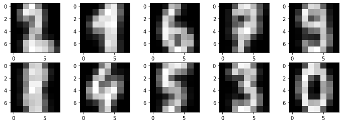
    


We would expect that the K-Means has put in a given cluster all and only the elements belonging to a given class (for example, a cluster should contain all and only the samples with the label "0"). If so, the cluster is said to be "pure". Different clusters can have different degrees of purity.

<table class="question">
<tr>
<td></td>
<td>

**Question 3**

Looking at the centroid images, can we predict which clusters are purer and which are less pure?

 </td>
</tr>
</table>

We can measure the purity of a cluster as follows:
  * We determine the most frequent label among those of the training samples assigned to the cluster;
  * We count the fraction of elements assigned to the cluster that have the label corresponding to the most frequent one.
Let's see how to do it:


```python
from scipy.stats import mode
cluster_assignments = kmeans.labels_

purity = np.zeros(10)
most_frequent_label = np.zeros(10)

for c in range(10):
    training_labels = digits.target[cluster_assignments==c]
    most_frequent_label[c] = mode(training_labels).mode
    purity[c] = (training_labels==most_frequent_label[c]).mean()
    
    print("Cluster %d. Most frequent label: %d. Purity: %0.2f" % (c,most_frequent_label[c],purity[c]))
```

    Cluster 0. Most frequent label: 2. Purity: 0.85
    Cluster 1. Most frequent label: 1. Purity: 0.62
    Cluster 2. Most frequent label: 6. Purity: 0.97
    Cluster 3. Most frequent label: 7. Purity: 0.84
    Cluster 4. Most frequent label: 9. Purity: 0.56
    Cluster 5. Most frequent label: 8. Purity: 0.45
    Cluster 6. Most frequent label: 4. Purity: 0.98
    Cluster 7. Most frequent label: 5. Purity: 0.91
    Cluster 8. Most frequent label: 3. Purity: 0.87
    Cluster 9. Most frequent label: 0. Purity: 0.99


Let's now display this information together with the images related to the centroids:


```python
plt.figure(figsize=(12,5))

centroidi = kmeans.cluster_centers_

for i in range(10):
    plt.subplot(2,5,i+1)
    plt.imshow(centroidi[i].reshape((8,8)),cmap='gray')
    plt.title("%d / %0.2f" % (most_frequent_label[i],purity[i]))
    
plt.show()
```


    
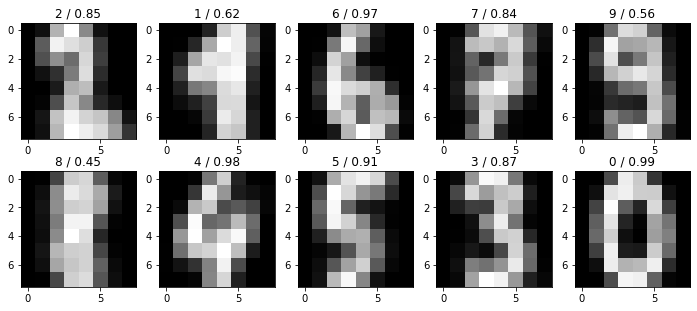
    


<table class="question">
<tr>
<td></td>
<td>

**Question 4**

Do the predictions made previously match the purity values found? Why are some clusters purer and others less pure?


 </td>
</tr>
</table>

## 2. Bag of Visual Words
### 2.1 Dataset
For this laboratory, we will use a simple dataset of images belonging to $8$ different scene types: `coast`, `mountain`, `forest`, `open country`, `street`, `inside city`, `tall buildings`, `highways`. Let's donwload the data from the following URL:

https://people.csail.mit.edu/torralba/code/spatialenvelope/spatial_envelope_256x256_static_8outdoorcategories.zip

After downloading, extract all files in a `scenes` directory. This directory should contain $2688$ images. Let's retrieve the list of filenames using the `glob` function:


```python
from glob import glob
filenames = glob('scenes/*.jpg')
print(filenames[:10])
```

    ['scenes/mountain_natu749.jpg', 'scenes/highway_gre141.jpg', 'scenes/insidecity_art1496.jpg', 'scenes/highway_bost389.jpg', 'scenes/highway_gre155.jpg', 'scenes/insidecity_hous28.jpg', 'scenes/opencountry_land352.jpg', 'scenes/opencountry_fie24.jpg', 'scenes/opencountry_fie30.jpg', 'scenes/insidecity_hous14.jpg']


As we can see, the class (e.g., "coast") is contained as part of the filename. We can "extract" the correct class from each filename as follows:


```python
classes = list(map(lambda x: x.split('/')[1].split('_')[0], filenames))
print(classes[:10])
```

    ['mountain', 'highway', 'insidecity', 'highway', 'highway', 'insidecity', 'opencountry', 'opencountry', 'opencountry', 'insidecity']


We can now create a DataFrame including filenames and related classes:


```python
import pandas as pd
data=pd.DataFrame({'filename':filenames, 'class':classes})
data.head()
```


<div>
<style scoped>
    .dataframe tbody tr th:only-of-type {
        vertical-align: middle;
    }

    .dataframe tbody tr th {
        vertical-align: top;
    }

    .dataframe thead th {
        text-align: right;
    }
</style>
<table border="1" class="dataframe">
  <thead>
    <tr style="text-align: right;">
      <th></th>
      <th>filename</th>
      <th>class</th>
    </tr>
  </thead>
  <tbody>
    <tr>
      <th>0</th>
      <td>scenes/mountain_natu749.jpg</td>
      <td>mountain</td>
    </tr>
    <tr>
      <th>1</th>
      <td>scenes/highway_gre141.jpg</td>
      <td>highway</td>
    </tr>
    <tr>
      <th>2</th>
      <td>scenes/insidecity_art1496.jpg</td>
      <td>insidecity</td>
    </tr>
    <tr>
      <th>3</th>
      <td>scenes/highway_bost389.jpg</td>
      <td>highway</td>
    </tr>
    <tr>
      <th>4</th>
      <td>scenes/highway_gre155.jpg</td>
      <td>highway</td>
    </tr>
  </tbody>
</table>
</div>


We will need the data to be split into training and test set. This can be easily done as follows:


```python
from sklearn.model_selection import train_test_split
#we will use a seed for repeatability of the split
import numpy as np
np.random.seed(123)
data_train, data_test = train_test_split(data, test_size=0.25)
print(len(data_train), len(data_test))
data_train.head()
```

    2016 672


<div>
<style scoped>
    .dataframe tbody tr th:only-of-type {
        vertical-align: middle;
    }

    .dataframe tbody tr th {
        vertical-align: top;
    }

    .dataframe thead th {
        text-align: right;
    }
</style>
<table border="1" class="dataframe">
  <thead>
    <tr style="text-align: right;">
      <th></th>
      <th>filename</th>
      <th>class</th>
    </tr>
  </thead>
  <tbody>
    <tr>
      <th>2065</th>
      <td>scenes/street_art762.jpg</td>
      <td>street</td>
    </tr>
    <tr>
      <th>633</th>
      <td>scenes/mountain_nat1207.jpg</td>
      <td>mountain</td>
    </tr>
    <tr>
      <th>1955</th>
      <td>scenes/opencountry_land617.jpg</td>
      <td>opencountry</td>
    </tr>
    <tr>
      <th>970</th>
      <td>scenes/street_urb244.jpg</td>
      <td>street</td>
    </tr>
    <tr>
      <th>515</th>
      <td>scenes/coast_n672003.jpg</td>
      <td>coast</td>
    </tr>
  </tbody>
</table>
</div>


We can now write a simple function to show some examples. To load the image, we will use the `io` module of the `scikit-image` library for image processing:


```python
from matplotlib import pyplot as plt
from skimage import io
def showImage(data, index):
    row = data.iloc[index]
    im = io.imread(row['filename'])
    plt.title(f"Class: {row['class']}")
    plt.axis('off')
    plt.imshow(im)
```


```python
showImage(data_train,0)
```


    
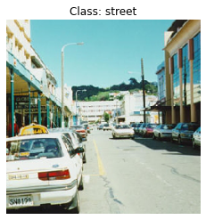
    


```python
showImage(data_train,1)
```


    
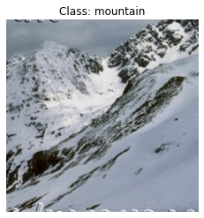
    


```python
showImage(data_train,2)
```


    
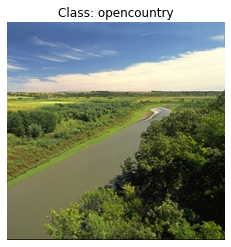
    


#### 2.1.1 Data Subset
We are going to use this data to demonstrate how to build and use a Bag of Visual Words model. For the purpose of this laboratry, let's consider a data subset of a few images. This is to avoid long waiting time while experimenting with the model. Let's consider a subset of just the $5\%$ of the images:


```python
_, data_small = train_test_split(data, test_size=0.05)
np.random.seed(145)
print(len(data_small))
```

    135


The new small subset contains just $135$ images. Let's split it into training and test set:


```python
data_small_train, data_small_test = train_test_split(data_small, test_size=0.15)
print(len(data_small_train), len(data_small_test))
```

    114 21


### 2.2 Building the Bag of Visual Words Model
We will now see how to build a Bag of Visual Words model to properly represent images. This will involve the following steps, as shown in the image below:
 * Extracting all patches from training images;
 * Describing all patches using the SIFT descriptor;
 * Clustering the descriptors using K-Means;

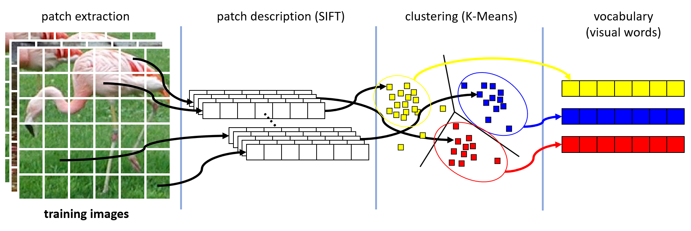

### 2.3 Patch Extraction and Description
We will start with patch extraction and description. For this purpose, we will use `cyvlfeat` a Python wrapper to the VLFeat library (http://vlfeat.org/) originally designed for MATLAB and C. We can install the library by typing the command:

`conda install -c conda-forge cyvlfeat`

As can be seen from the official page of `cyvlfeat` (https://github.com/menpo/cyvlfeat), the wrapper gives access to many features of VLFeat. We will use only the `dsift` function. This function, conveniently allows to extract and describe all patches in an image in a single pass. This happens by first computing the gradients of the whole image and then sliding a window over the image and computing the SIFT descriptor using the gradients under the window. This is shown in the image below:


(Image from <a href="https://www.vlfeat.org/">https://www.vlfeat.org/</a>)

As shown in the image, the `dsift` function will require the following parameters:
 * `bounds`: the coordinate of a bounding box from which to extract patches. This is needed in the case in which we want to sample patches only from a part of the image. By default this is set to the whole image;
 * `size`: this is the size of single SIFT cell, which is by default set to $3$. Considering that a SIFT descriptor includes a $4\times4$ grid, the default patch size is $4 \times 3 = 12$ pixes;
 * `step`: this specifies the sampling step. It is set to $1$ by default, which moves the sliding window by $1$ pixel at a time;
 
Let's try to load an image and use this function to extract SIFT descriptors (visual words) from it:


```python
from cyvlfeat.sift import dsift
#the dsift funciton requires the input image to be grayscale
#hence we need to pass the as_gray=True parameter to the imread function
im = io.imread(data_small_train.iloc[0]['filename'], as_gray=True)
positions, descriptors = dsift(im)
```

The `dsift` funciton returns two outputs: the `positions` of the extracted patches in the image, and the extracted `descriptors`:


```python
print(positions.shape)
print(descriptors.shape)
print(positions[:3])
```

    (61009, 2)
    (61009, 128)
    [[4.5 4.5]
     [4.5 5.5]
     [4.5 6.5]]


<table class="question">
<tr>
<td></td>
<td>

**Question 5**

Why is the number of columns of `descriptors` equal to $128$?


 </td>
</tr>
</table>

By using the default parameters, we have extracted a large number of patch descriptors from a single image. We can play with the available parameters to reduce the number of patches extracted. For instance, let's extract patches at a step of $10$ pixels and with a bin size of $5$:


```python
positions, descriptors = dsift(im, size=5, step=10)
print(positions.shape, descriptors.shape)
```

    (625, 2) (625, 128)


<table class="question">
<tr>
<td></td>
<td>

**Question 6**

Do the extracted patches have some overlap? How many pixels are in common between two patches extracted one after another? What is the size of each patch? What is the size of the descriptors? Is it the same as before? Why?


 </td>
</tr>
</table>

To have an idea of how patches extracted from the same image can have different descriptors, let's select two random patches and plot their descriptors:


```python
np.random.seed(16)
idx1,idx2 = np.random.choice(len(descriptors),2)
d1 = descriptors[idx1]
d2 = descriptors[idx2]

plt.figure(figsize=(18,4))
plt.subplot(121)
plt.bar(range(len(d1)), d1)
plt.subplot(122)
plt.bar(range(len(d2)), d2)
plt.show()

```


    
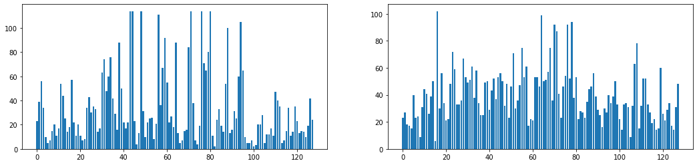
    


<table class="question">
<tr>
<td></td>
<td>

**Question 7**

Compare the two plots. Are the descriptors similar? Try to pick another pair. Is the situation different? How many bars are in each plot?

 </td>
</tr>
</table>

We can extract and describe patches from different images as follows:


```python
im0 = io.imread(data_small_train.iloc[0]['filename'], as_gray=True)
im1 = io.imread(data_small_train.iloc[1]['filename'], as_gray=True)
im2 = io.imread(data_small_train.iloc[2]['filename'], as_gray=True)
_, descriptors0 = dsift(im0, size=5, step=10)
_, descriptors1 = dsift(im1, size=5, step=10)
_, descriptors2 = dsift(im2, size=5, step=10)
print(descriptors0.shape, descriptors1.shape, descriptors1.shape)
```

    (625, 128) (625, 128) (625, 128)


To create a vocabulary of visual words, we will need to put together the patch descriptors computed over all the image of the dataset. We can concatenate the features of two or more images as follows:


```python
all_descriptors = np.vstack([descriptors0, descriptors1, descriptors1])
print(all_descriptors.shape)
```

    (1875, 128)


We can now write a function that extracts all descriptors from all the images contained in a DataFrame:


```python
#we will use tqdm to have a progress bar
from tqdm import tqdm
def extract_and_describe(data, size=5, step=10):
    descriptors = []
    for i, row in tqdm(data.iterrows(), "Extracting/Describing Patches", total=len(data)):
        im = io.imread(row['filename'], as_gray=True)
        _, desc = dsift(im, size=size, step=step)
        descriptors.append(desc)
    return np.vstack(descriptors)
```


```python
train_descriptors = extract_and_describe(data_small_train)
print(train_descriptors.shape)
```

    Extracting/Describing Patches: 100%|██████████| 114/114 [00:02<00:00, 38.42it/s]

    (71250, 128)


    


<table class="question">
<tr>
<td></td>
<td>

**Question 8**

Try with different parameters for step and size. Does the speed at which patches are extracted/described change? Do we obtain more/less features? Why?

 </td>
</tr>
</table>

### 2.4 Creating the Visual Vocabulary

We now need to create a vocabulary of visual words. First, we need to decide the size of our vocabulary. We will use $500$, but larger vocabularies can be used. To create the vocabulary, we have to cluster all training descriptors using the K-Means algorithm. In particular, we will use `MiniBatchKMeans` from `scikit-learn`, which is an implementation of K-Means optimized to work with large sets of data:


```python
from sklearn.cluster import MiniBatchKMeans
#this is to suppress warning
import warnings
warnings.filterwarnings("ignore")
#initialize the MiniBatchKMeans object
#using 500 as the number of clusters
kmeans = MiniBatchKMeans(500)
#we can use this object similarly to
#the other scikit-learn object
#let's use fil to train the 
#algorithm on the training descriptors
kmeans.fit(train_descriptors)
```


    MiniBatchKMeans(n_clusters=500)


We can access to the cluster centeroids (the visual words) as follows:


```python
kmeans.cluster_centers_.shape
```


    (500, 128)


Each visual words has the same shape of a descriptor and contains $128$ dimensions.

<table class="question">
<tr>
<td></td>
<td>

**Question 9**

Try fitting a K-Means with more visual words. Is the process slower? Why?

 </td>
</tr>
</table>

Let's now choose $6$ random visual words and plot them:


```python
np.random.seed(135)
centers = np.random.permutation(kmeans.cluster_centers_)
plt.figure(figsize=(16,6))
for i in range(6):
    plt.subplot(2,3,i+1)
    plt.bar(range(len(centers[i])),centers[i])

plt.show()
```


    
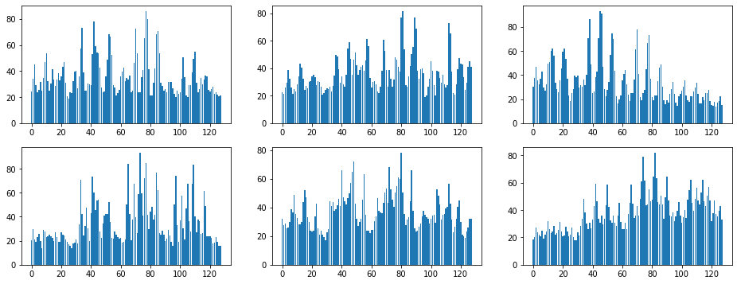
    


The K-Means object also allows to associate a new descriptor, the corresponding cluster. This is done using the `predict` method:


```python
kmeans.predict([train_descriptors[0]])
```


    array([174], dtype=int32)


<table class="question">
<tr>
<td></td>
<td>

**Question 10**

How is the "corresponding cluster" selected by the K-Means object?
    
 </td>
</tr>
</table>

### 2.5 Representing images with the Bag of Visual Words Model
We can now use the bag of visual words model to represent images. Given an input image, this can be done following these steps:
 * We extract and describe all the patches contained in the image. At this stage, it usually makes sense to use the same parameters used to extract the training descriptors;
 * Each descriptor is associated to the closest visual word in the vocabulary;
 * A Bag Of Words Representation is obtained from the extracted "tokens".
 
This is illustrated in the image below.


Let's start by writing a function which extract "tokens" from the image:


```python
def load_and_describe(filename, size=5, step=10, kmeans=kmeans):
    im = io.imread(filename, as_gray=True)
    _,descriptors = dsift(im, size=size, step=step)
    tokens = kmeans.predict(descriptors)
    return tokens
```

Let's now try to use this funciton on the first training image:


```python
im0_path = data_small_train.iloc[0]['filename']
im0_class = data_small_train.iloc[0]['class']
im = io.imread(im0_path)
plt.imshow(im)
plt.title(im0_class)
plt.show()
tokens = load_and_describe(im0_path)
#Let's show the first 50 tokens
tokens[:50]
```


    
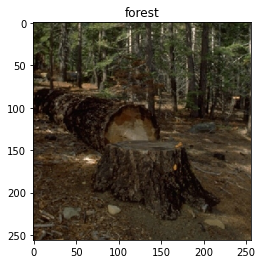
    


    array([174,  63, 267, 134,  96, 348,  61, 119, 163, 267,  96, 143,  63,
           328,  96, 378, 184,  36, 322,  17,  96, 211,  31,  60, 267, 275,
           246,  96, 174,  96, 184,  31,  96, 211, 329, 429, 348, 184, 149,
           149, 370, 149, 331, 288, 293, 322, 211, 296, 407,  36], dtype=int32)


We can create a first representation by counting the number of instances of each token. This can be done using the `histogram` funciton of `numpy`. Since we want the histogram to be normalized, we can pass the parameter `normed=True`:


```python
bovw_representation, _ = np.histogram(tokens, bins=500, range=(0,499),normed=True)
```

We can now load another images, compute its BOVW representations and compare it with the one we have just obtained:


```python
im1_path = data_small_train.iloc[1]['filename']
im1_class = data_small_train.iloc[1]['class']
im1 = io.imread(im1_path)
tokens1 = load_and_describe(im1_path)
bovw_representation1, _ = np.histogram(tokens1, bins=500, range=(0,499),normed=True)

plt.figure(figsize=(12,8))
plt.subplot(221)
plt.imshow(im)
plt.title(im0_class)
plt.subplot(222)
plt.bar(range(len(bovw_representation)),bovw_representation)

plt.subplot(223)
plt.imshow(im1)
plt.title(im1_class)
plt.subplot(224)
plt.bar(range(len(bovw_representation1)),bovw_representation1)
plt.show()
```


    
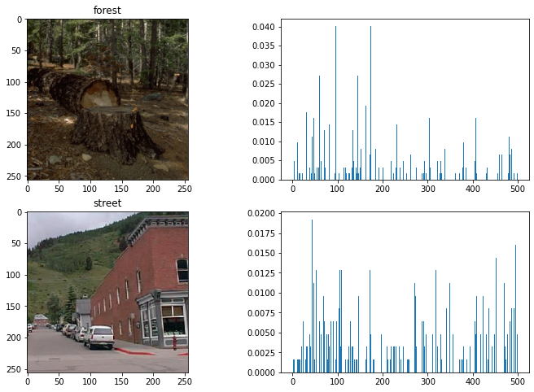
    


<table class="question">
<tr>
<td></td>
<td>

**Question 11**

Are the two representations similar? What would happen if we picked two images from the same class?    
 </td>
</tr>
</table>


#### 2.5.1 Representing all training and test images
We have now seen a simple way to compute Bag of Visual Words representation. However, this can be done more easily using the `scikit-learn` API for text processing. In particular, the `load_and_describe` function can be used as an **image tokenizer** with a `CountVectorizer` object to obtain visual words counts. Also, since we know that the vocabulary contains exactly 500 visual words and that tokens will be numbers comprised between $0$ ad $499$, we can pass this information to the count vectorizer with the parameter `vocabulary`. Let's create a `CountVectorizer` and fit it to the training set:


```python
from sklearn.feature_extraction.text import CountVectorizer
# Use vocabulary=range(500) to consider a fixed vocabulary of tokens 0-499
# Use lowercase=Flase as we are using numbers rather than words
count_vect = CountVectorizer(tokenizer=load_and_describe, vocabulary=range(500), lowercase=False)
count_vect.fit_transform(data_small_train['filename'])
```


    <114x500 sparse matrix of type '<class 'numpy.int64'>'
    	with 20409 stored elements in Compressed Sparse Row format>


Note that fitting the `CountVectorizer` object will take care of loading all images, extracting patches and describing them, matching descriptors to visual words, counting the number of instances of each visual word in each image. We can use the CountVectorizer to obtain visual words counts as follows:


```python
vwords_counts = count_vect.transform([im0_path])
vwords_counts.shape
```


    (1, 500)


We can finally obtain bag of words representation by considering some normalization function. To simply normalize as done in the previous example, we could use TF-IDF without IDF and specify the 'l1' norm:


```python
from sklearn.feature_extraction.text import TfidfTransformer
tfidf = TfidfTransformer(use_idf=False,norm='l1')
all_counts = count_vect.transform(data_small_train['filename'])
tfidf.fit(all_counts)
```


    TfidfTransformer(norm='l1', use_idf=False)


We can now compute the BOVW representation as:


```python
bovw = tfidf.transform(vwords_counts)
bovw.sum()
```


    1.000000000000001


Count vectorization and normalization can be performed in one step using the `TfidfVectorizer` object. Let's see an example with TF-IDF:


```python
from sklearn.feature_extraction.text import TfidfVectorizer
tfidf = TfidfVectorizer(tokenizer=load_and_describe, vocabulary=range(500), use_idf=True, lowercase=False)
tfidf.fit(data_small_train['filename'])
```


    TfidfVectorizer(lowercase=False,
                    tokenizer=<function load_and_describe at 0x7f84189d7040>,
                    vocabulary=range(0, 500))


We can now use this object to represent training and test images:


```python
x_train = tfidf.transform(data_small_train['filename'])
x_test = tfidf.transform(data_small_test['filename'])

y_train = data_small_train['class']
y_test = data_small_test['class']

print(x_train.shape, y_train.shape, x_test.shape, y_test.shape)
```

    (114, 500) (114,) (21, 500) (21,)


We can now apply the machine learning algorithms we have seen in the previous laboratories to this data. For instance, let's train a logistic regressor to classify the images:


```python
from sklearn.linear_model import LogisticRegression
lr = LogisticRegression()
lr.fit(x_train, y_train)
y_train_pred = lr.predict(x_train)
y_test_pred = lr.predict(x_test)
```

We can evaluate the predictions using the accuracy:


```python
from sklearn.metrics import accuracy_score
print(f"Training accuracy: {accuracy_score(y_train, y_train_pred):0.2f}")
print(f"Testing accuracy: {accuracy_score(y_test, y_test_pred):0.2f}")
```

    Training accuracy: 0.89
    Testing accuracy: 0.71


### 2.6 Content-Based Image Retrieval (CBIR)
Now that we can represent images, we can build and Content-Based Image Retrieval (CBIR) system. Given a query image, our CBIR will find images in the database which have a similar content, based on the image representation. To this aim, we will use our training set as the database and the test set as the set of query images.

Given a query image, we hence need a way to compute distances between the query representation and the representations of all images in the database. As this can be computationally expensive, we will use an approximate indexing approach called K-D Tree (https://en.wikipedia.org/wiki/K-d_tree). In particular, we will use the `KDTree` object from `scikit-learn`:


```python
from sklearn.neighbors import KDTree
#we need to call `todense` to convert
#the sparse matrix in a dense one
tree = KDTree(x_train.todense())
```

Now the `KDTree` has "memorized" and "indexed" the database of representations in order to be able to find the closest points to a query in an efficient way. Let's consider a query image with the related representation:


```python
query_id = 0
query_im = io.imread(data_small_test.iloc[query_id]['filename'])
query_features = np.array(x_test.todense()[query_id])
plt.figure(figsize=(12,8))
plt.subplot(121)
plt.imshow(query_im)
plt.subplot(122)
plt.bar(range(query_features.shape[1]),query_features[0])
plt.show()
```


    
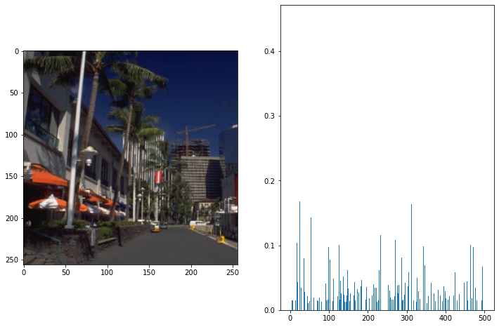
    


We can find the index of the most similar image in the database using the `query` method:


```python
distance, index = tree.query(query_features)
print(distance,index)
```

    [[1.09494036]] [[24]]


Let's load and show this image:


```python
index = index[0][0]
matched_im = io.imread(data_small_train.iloc[index]['filename'])
matched_features = np.array(x_train.todense()[index])
plt.figure(figsize=(12,8))
plt.subplot(121)
plt.imshow(matched_im)
plt.subplot(122)
plt.bar(range(matched_features.shape[1]),matched_features[0])
plt.show()
```


    
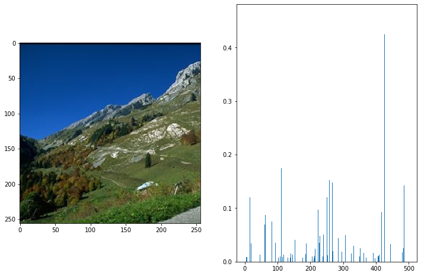
    


<table class="question">
<tr>
<td></td>
<td>

**Question 12**

Compare the query image and the matched ones. Are they similar? Are their representations similar?
    
 </td>
</tr>
</table>

We can get the ids of the closest `k` images by specifying a `k` parameter:


```python
tree.query(query_features, k=3)
```


    (array([[1.09494036, 1.13737878, 1.14285961]]), array([[ 24, 103,  68]]))


This will return the distances to the closest images in the database and the related indices.

### 2.7 Salvataggio su file
The models and features can be saved to file for later use. This is particularly useful when the computation takes a lot of time. For instance, we can save what we have computed so far as follows:


```python
import pickle
with open("scenes_bovw.pkl",'wb') as out:
    pickle.dump({ #we can put the variables we want to save in a dictionary
            'x_train':x_train,
            'x_test':x_test,
            'kmeans':kmeans
        },out)
```

The data saved to file can be read again using `pickle`:


```python
with open("scenes_bovw.pkl",'rb') as inp:
    data=pickle.load(inp)

print(data.keys())

x_train = data['x_train']
x_test = data['x_test']
kmeans = data['kmeans']
```

    dict_keys(['x_train', 'x_test', 'kmeans'])


## References
[1] G. Csurka, C. R. Dance, L. Fan, J. Willamowski, and C. Bray. Visual Categorization with Bags of Keypoints. Workshop on Statistical Learning in Computer Vision. ECCV 1 (1–22), 1–2. 

[2] K-Means (**scikit-learn**): http://scikit-learn.org/stable/modules/generated/sklearn.cluster.KMeans.html

[3] Bag of Visual Words models: http://www.robots.ox.ac.uk/~az/icvss08_az_bow.pdf

[4] CBIR: https://it.wikipedia.org/wiki/CBIR

[5] K-d tree: https://en.wikipedia.org/wiki/K-d_tree

[6] Pickle: https://wiki.python.org/moin/UsingPickle

# Exercises

<table class="question">
<tr>
<td></td>
<td>

**Exercise 1**

Consider the Boston dataset. Apply the K-Means to the data of the variable `medv`. So let's insert a new `priceRange` column in the dataset that contains the clusters associated with the related `medv` values. Divide the dataset into training and test sets and train a K-NN (find a suitable K) to predict the `priceRange` values starting from all the variables except `medv`. The results obtained are discussed.


 </td>
</tr>
</table>

<table class="question">
<tr>
<td></td>
<td>

**Exercise 2**
    
All the experiments in this laboratory have been performed considering a small set of images. Repeat the experiments using the whole dataset (splitted into training/test sets). Do the performances of the classifier improve?


 </td>
</tr>
</table>

<table class="question">
<tr>
<td></td>
<td>

**Exercise 3**

    
We have also considered a very coarse way to extract descriptors. Play with the patch extraction parameters in order to extract a larger set of descriptors and repeat all experiments on the whole dataset. Do the performances of the classifier improve?


 </td>
</tr>
</table>

<table class="question">
<tr>
<td></td>
<td>

**Exercise 4**

The performances of the logistic regressor for image classificaiton are a bit disappointing. Try to improve them by experimenting with different feature normalization methods. Compare the performance with Naive Bayes and K-NN.


 </td>
</tr>
</table>

<table class="question">
<tr>
<td></td>
<td>

**Exercise 5**

Write a `cbir` function which takes as input a query image and returns the $5$ most similar images. Compare the results obtained using the whole dataset as compared to the ones obtained with the small dataset. Which of the two systems is better?

 </td>
</tr>
</table>


