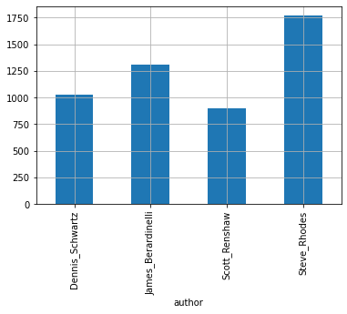
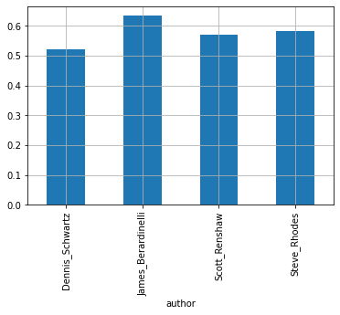
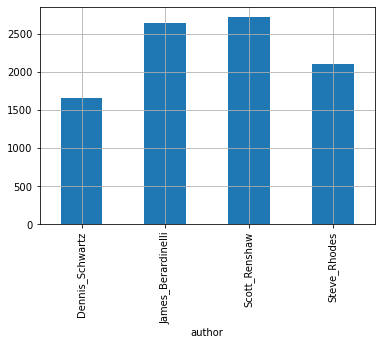
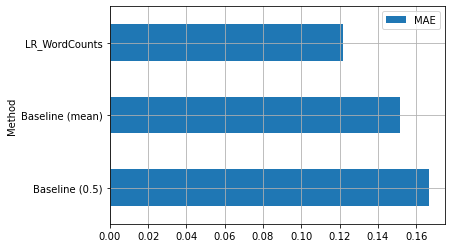
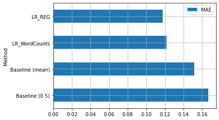
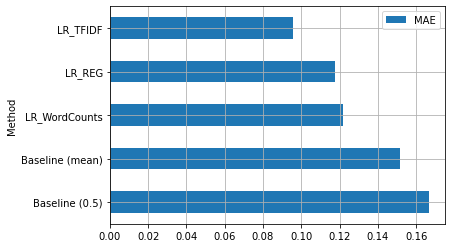
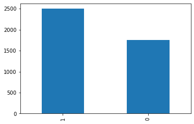

In this laboratory, we will see:
 * Linear Regression;
 * Polynomial Regression;
 * Logistic Regression.

## 1. Linear Regression

To experiment with linear regression, we will use a dataset of movie reviews collected from IMDb (https://www.imdb.com/). The dataset is available here: http://www.cs.cornell.edu/people/pabo/movie-review-data/ (in particular here: http://www.cs.cornell.edu/people/pabo/movie-review-data/scale_data.tar.gz ). 

### 1.1 Dataset
To make things faster, for this laboratory we will use a pre-processed version of this dataset available at http://antoninofurnari.it/downloads/reviews.csv. Let's load and inspect the csv with Pandas:


```python
import pandas as pd
reviews=pd.read_csv('http://antoninofurnari.it/downloads/reviews.csv')
reviews.info()
reviews.head()
```

    <class 'pandas.core.frame.DataFrame'>
    RangeIndex: 5006 entries, 0 to 5005
    Data columns (total 3 columns):
     #   Column  Non-Null Count  Dtype  
    ---  ------  --------------  -----  
     0   author  5006 non-null   object 
     1   review  5006 non-null   object 
     2   rating  5006 non-null   float64
    dtypes: float64(1), object(2)
    memory usage: 117.5+ KB


<div>
<style scoped>
    .dataframe tbody tr th:only-of-type {
        vertical-align: middle;
    }

    .dataframe tbody tr th {
        vertical-align: top;
    }

    .dataframe thead th {
        text-align: right;
    }
</style>
<table border="1" class="dataframe">
  <thead>
    <tr style="text-align: right;">
      <th></th>
      <th>author</th>
      <th>review</th>
      <th>rating</th>
    </tr>
  </thead>
  <tbody>
    <tr>
      <th>0</th>
      <td>Dennis_Schwartz</td>
      <td>in my opinion , a movie reviewer's most import...</td>
      <td>0.1</td>
    </tr>
    <tr>
      <th>1</th>
      <td>Dennis_Schwartz</td>
      <td>you can watch this movie , that is based on a ...</td>
      <td>0.2</td>
    </tr>
    <tr>
      <th>2</th>
      <td>Dennis_Schwartz</td>
      <td>this is asking a lot to believe , and though i...</td>
      <td>0.2</td>
    </tr>
    <tr>
      <th>3</th>
      <td>Dennis_Schwartz</td>
      <td>no heroes and no story are the main attributes...</td>
      <td>0.2</td>
    </tr>
    <tr>
      <th>4</th>
      <td>Dennis_Schwartz</td>
      <td>this is not an art movie , yet i saw it an art...</td>
      <td>0.2</td>
    </tr>
  </tbody>
</table>
</div>


The dataset contains $5006$ reviews. For each review, it is reported its author, the text of the review, and the rating given by the authors. Let's briefly explore some statistics of the data using `describe`:


```python
reviews.describe()
```


<div>
<style scoped>
    .dataframe tbody tr th:only-of-type {
        vertical-align: middle;
    }

    .dataframe tbody tr th {
        vertical-align: top;
    }

    .dataframe thead th {
        text-align: right;
    }
</style>
<table border="1" class="dataframe">
  <thead>
    <tr style="text-align: right;">
      <th></th>
      <th>rating</th>
    </tr>
  </thead>
  <tbody>
    <tr>
      <th>count</th>
      <td>5006.000000</td>
    </tr>
    <tr>
      <th>mean</th>
      <td>0.581422</td>
    </tr>
    <tr>
      <th>std</th>
      <td>0.181725</td>
    </tr>
    <tr>
      <th>min</th>
      <td>0.000000</td>
    </tr>
    <tr>
      <th>25%</th>
      <td>0.490000</td>
    </tr>
    <tr>
      <th>50%</th>
      <td>0.600000</td>
    </tr>
    <tr>
      <th>75%</th>
      <td>0.700000</td>
    </tr>
    <tr>
      <th>max</th>
      <td>1.000000</td>
    </tr>
  </tbody>
</table>
</div>


We got statistics for the only quantitative variable in the dataset (rating). We can note tha the ratings are number between $0$ and $1$. The mean rating is slightly below $0.6$. Let's now see the number of authors and the number of reviews per author:


```python
from matplotlib import pyplot as plt
reviews.groupby('author')['author'].count().plot.bar()
plt.grid()
plt.show()
```


    

    


We have $4$ authors and a variable number of reviews. Let's have a look at the average rating per author:


```python
reviews.groupby('author')['rating'].mean().plot.bar()
plt.grid()
plt.show()
```


    

    


The average rating is overall balanced across all authors. Let's see the average length of reviews per author:


```python
#first, let's introduce a new 'review_length' column
reviews['review_length']=reviews['review'].apply(len)
reviews.groupby('author')['review_length'].mean().plot.bar()
plt.grid()
plt.show()
```


    

    


The average length of reviews is less balanced, but still ok.

#### 1.1.1 Train/Test Splitting
Let's split our dataset randomly into training and test set. We will use $15\%$ of the data as test set:


```python
from sklearn.model_selection import train_test_split
import numpy as np
np.random.seed(123) # for replication
reviews_train, reviews_test = train_test_split(reviews, test_size=0.15)
```

### 1.2 Data Representation
We will begin by representing the data in a suitable way. For the moment, we will consider a Bag of Words representation. Let's use a CountVectorizer to obtain a set of features. We will fit the model on the training set and use it to transform both the training and testing data. We will also save the training and testing target values (the labels) into separate variables:


```python
from sklearn.feature_extraction.text import CountVectorizer
count_vect = CountVectorizer()
#training/testing features
x_train = count_vect.fit_transform(reviews_train['review'])
x_test = count_vect.transform(reviews_test['review'])
#training/testing labels
y_train = reviews_train['rating']
y_test = reviews_test['rating']
```

Let's see the dimensionality of the training and testing features:


```python
x_train.shape, x_test.shape
```


    ((4255, 39499), (751, 39499))

<table class="question">
<tr>
<td></td>
<td>

**Question 1**

How many words does our vocabulary contain? Why the numbers of columns in the training and testing design matrices are the same? While the numbers of rows are not the same?


 </td>
</tr>
</table>


<table class="question">
<tr>
<td></td>
<td>

**Question 2**

Representations are task-dependent. What is the main rationale behind using bag of words for this regression task? Can there be better representations of the data? (i.e., is this representation overlooking some aspects of the data?)

 </td>
</tr>
</table>

### 1.3 Linear Regression
To fit a linear regressor to the data, we have to use the `LinearRegression` object of `scikit-learn`, which has the same interface we have seen for other supervised machine learning algorithms such as Naive Bayes and KNN:


```python
from sklearn.linear_model import LinearRegression
reg = LinearRegression()
reg.fit(x_train, y_train)
```


    LinearRegression()


The linear regressor has now been properly tuned. We can access its parameters as follows:


```python
print(reg.coef_) # coefficients
print(reg.intercept_) # intercept
```

    [-0.00651757  0.0056682   0.00903341 ...  0.00282769 -0.00056079
     -0.0003679 ]
    0.48495048975822536


<table class="question">
<tr>
<td></td>
<td>

**Question 3**

How many parameters does the model have in total? Why?

 </td>
</tr>
</table>

We have fitted the linear model:

\begin{equation}
f(\mathbf{x}) = \theta_0 + \theta_1 x_1 + \theta_2 x_2 + ... + \theta_n x_n
\end{equation}

We can now apply this model to the training and test data by using the `predict` method:


```python
y_train_preds = reg.predict(x_train)
y_test_preds = reg.predict(x_test)
```

We now need to understand how good is our model at making predictions. We can compute the MAE score as follows:


```python
def MAE(y_true, y_pred):
    return (y_true-y_pred).abs().mean()
```

Let's see what are the MAE values on the training and test sets:


```python
print("MAE on the training set: {:0.4f}".format(MAE(y_train,y_train_preds)))
print("MAE on the test set: {:0.4f}".format(MAE(y_test,y_test_preds)))
```

    MAE on the training set: 0.0000
    MAE on the test set: 0.1218

<table class="question">
<tr>
<td></td>
<td>

**Question 4**

Compare the errors obtained on the training and test sets. Which one is higher? Which one is lower? Why is there such difference? What is happening?


 </td>
</tr>
</table>

How can we understand if the performance of our method is good? To see that, we can compare it with respect to a simple baseline which always predicts a rating of $0.5$:


```python
print("Baseline MAE: {:0.2f}".format(MAE(y_test,0.5)))
```

    Baseline MAE: 0.17


```python
print("Baseline MAE: {:0.2f}".format(MAE(y_test,y_train.mean())))
```

    Baseline MAE: 0.15


```python
print("Baseline MAE: {:0.2f}".format(MAE(y_test,y_train.median())))
```

    Baseline MAE: 0.15


We can see that our regressor performs better. For reference, we will create a dataframe containing the MAE scores for different classifiers:


```python
scores = pd.DataFrame(
    {
        'Method': ['Baseline (0.5)', 'Baseline (mean)', 'LR_WordCounts'], 
        'MAE': [MAE(y_test,0.5), MAE(y_test,y_train.mean()),  MAE(y_test,y_test_preds)]}
)
scores = scores.set_index('Method')
scores.plot.barh()
plt.grid()
plt.show()
```


    

    


### 1.4 Regularization
By comparing the training and testing perfomance, we could argue that we have an overfitting problem. We could try to address it by adding a regularization term to the cost function. Linear regression with regularization is implemented in `scikit-learn` with the `Ridge` object. Let's repeat the whole pipeline using the regularized regressor:


```python
from sklearn.linear_model import Ridge
count_vect = CountVectorizer()

x_train = count_vect.fit_transform(reviews_train['review'])
x_test = count_vect.transform(reviews_test['review'])

lr = Ridge()
lr.fit(x_train, y_train)

y_train_preds_reg = lr.predict(x_train)
y_test_preds_reg = lr.predict(x_test)

print("MAE on the training set: {:0.4f}".format(MAE(y_train,y_train_preds_reg)))
print("MAE on the test set: {:0.4f}".format(MAE(y_test,y_test_preds_reg)))
```

    MAE on the training set: 0.0016
    MAE on the test set: 0.1176

<table class="question">
<tr>
<td></td>
<td>

**Question 5**

What happened to the training performance? What happened to the testing performance? Why?

 </td>
</tr>
</table>

<table class="question">
<tr>
<td></td>
<td>

**Question 6**

Compute the L2 norm (vector module) of the coefficient obtained using the regularized linear regressor and the standard one. Which of the two has a smaller norm? Why?

 </td>
</tr>
</table>

It seems that regularization improved the results! Let's add this to our `scores`:


```python
new_score = pd.Series({'MAE':MAE(y_test,y_test_preds_reg)},name='LR_REG')
scores = scores.append(new_score)
scores.plot.barh()
plt.grid()
plt.show()
```


    

    


### 1.4 Improving the representation
We are currently using simple word counts as the representation for our reviews. However, this representation has some shortcomings:
 * Long and short reviews will get very different representations because there is no normalization;
 * Frequent words might dominate the representation.
 
We can try to fix this by using TF-IDF. Let's see if this improves results:


```python
from sklearn.feature_extraction.text import TfidfTransformer
count_vect = CountVectorizer()
tfidf = TfidfTransformer()

x_train_counts = count_vect.fit_transform(reviews_train['review'])
x_train = tfidf.fit_transform(x_train_counts)

x_test_counts = count_vect.transform(reviews_test['review'])
x_test = tfidf.transform(x_test_counts)

lr = Ridge()
lr.fit(x_train, y_train)

y_train_preds_tfidf = lr.predict(x_train)
y_test_preds_tfidf = lr.predict(x_test)

print("MAE on the training set: {:0.4f}".format(MAE(y_train,y_train_preds_tfidf)))
print("MAE on the test set: {:0.4f}".format(MAE(y_test,y_test_preds_tfidf)))
```

    MAE on the training set: 0.0560
    MAE on the test set: 0.0955


It seems that TF-IDF improved the results. Let's put this result in our `scores` DataFrame and compare:


```python
new_score = pd.Series({'MAE':MAE(y_test,y_test_preds_tfidf)},name='LR_TFIDF')
scores = scores.append(new_score)
scores.plot.barh()
plt.grid()
plt.show()
```


    

    


### 1.5 Our regressor at work
Let's see our model in action on some samples of the test set. We will define a function which takes a message and predicts a review score for it:


```python
def rate(text):
    #step 1: apply count vectorizer
    feats = count_vect.transform([text])
    #step 2: apply TFIDF
    feats = tfidf.transform(feats)
    #step 3: apply linear regression
    return lr.predict(feats)[0] #get the first value
```

We can now rate any test review:


```python
i=20
review = reviews_test.iloc[i]['review']
true_rating = reviews_test.iloc[i]['rating']
rating = rate(review)
print("True rating: {:0.2f}/Predicted rating: {:0.2f}".format(true_rating,rating))
print("Review: {}".format(review))
```

    True rating: 0.73/Predicted rating: 0.71
    Review: ron howard has a history of making entertaining films that tend towards weak conclusions ( one could call this the " happy endings " syndrome ) . joining parenthood and far and away in this category is mr . howard's newest release , the paper . for something that starts out as a boisterous , amusing , potentially-incisive look at the newspaper business and the people who run it , this motion picture finishes with a relative whimper . no viewer is likely to be bored during the paper . the film moves along quickly , using mobile cameras and rapid cuts to keep the energy level high and the pacing crisp . this is especially true in the newsroom scenes , as director ron howard attempts to convey the spirit and atmosphere of the disorganized-but-productive work environment . his eye for detail is evident . away from the paper's offices , the movie is less successful . the personal lives of henry and his co-workers aren't all that interesting , and seem scripted rather than real . this is especially true during the drawn-out melodrama that characterizes the last fifteen minutes . the contrivance used to incorporate these into the overall plot is a little too obvious . the climactic struggle that ensues between two of the main characters looks like it belongs more in a three stooges movie than a pseudo-real look at the behind-the-scenes newspaper business . but there's a lot in the paper that works . although most of the characters are types , the actors play them with sympathy and understanding . three-dimensionality may not be achieved , but attempts are made to give the men and women in this film some depth , and the freshness of the performances helps a great deal . randy quaid is magnificent as the gun- toting , paranoid mcdougal . although not a developed character in any sense , mcdougal has some of the best one-liners . the dialogue is frequently snappy--presumably the product of screenwriters with ears for the way people actually talk . there's a fair amount of natural humor , and only a few occasions when the laughs are forced . the paper is a crowd pleaser and , regardless of any viewer's experience ( or lack thereof ) with the behind-the-scenes wrangling that goes on in newspaper offices , the story is compelling enough to be affable and entertaining . while there are no startling revelations here , the film's atmosphere contains enough strength of realism that more than one viewer may momentarily think of the goings-on at the sun as they sit down with their morning cup of coffee and look at the day's headlines . 
    


We can also try to rate our own text:


```python
rate("This is a wonderful movie with a very intriguing and memorable story! \
      The actors are good and the director is awesome! \
      This is probably the best movie I watched this year \
     I would suggest watching it!")
```


    0.6663085163223353


```python
rate("This movie was pretty bad and booring.")
```


    0.10607236353046512


<table class="question">
<tr>
<td></td>
<td>

**Question 7**

What are the minimum and maximum lengths of strings our linear regressor can handle? Why? What if we do not apply TF-IDF?


 </td>
</tr>
</table>

## 2 Polynomial Regression
Let's now see an example with polynomial regression. Since applying polynomial regression to problems with a very large number of features can be very computationally expensive, we will first simplify our representation by including less words. We can do so by specifying a `min_df` parameter to the `CountVectorizer`. This will specify the minimum document frequency a word should have in order to be included. If we set this value to some number between $0$ and $1$, the number of words which are selected changes:


```python
#selects only words which appear at least in 50% of the documents
count_vect = CountVectorizer(min_df=0.5)
x_train_counts = count_vect.fit_transform(reviews_train['review'])
print(x_train_counts.shape)
```

    (4255, 53)


We can also decide to exclude words which are too frequent, by including a `max_df` term, which denotes the maximum document frequency a word should have to be included in the vocabulary:


```python
count_vect = CountVectorizer(min_df=0.5, max_df=0.8)
x_train_counts = count_vect.fit_transform(reviews_train['review'])
print(x_train_counts.shape)
```

    (4255, 37)

<table class="question">
<tr>
<td></td>
<td>

**Question 8**

How do `min_df` and `max_df` affect the number of words which are effectively selected? What is the result of using smaller and large values for the two parameters?

 </td>
</tr>
</table>

Let's try to solve the regression problem with this reduced set of features:


```python
count_vect = CountVectorizer(min_df=0.5, max_df=0.8)
x_train_counts = count_vect.fit_transform(reviews_train['review'])
x_test_counts = count_vect.transform(reviews_test['review'])

lr = Ridge()
lr.fit(x_train_counts, y_train)

y_train_preds = lr.predict(x_train_counts)
y_test_preds = lr.predict(x_test_counts)

print("MAE on the training set: {:0.4f}".format(MAE(y_train,y_train_preds)))
print("MAE on the test set: {:0.4f}".format(MAE(y_test,y_test_preds)))
```

    MAE on the training set: 0.1396
    MAE on the test set: 0.1444


Since we are discarding words, we obtained reduced performance. We will now apply polynomial regression using a polynomial of degree 2. To do so, we have to transform the data by adding new columns to the design matrix. This is done by the object `PolynomialFeatures`:


```python
from sklearn.preprocessing import PolynomialFeatures
#create a polynomial transform object with degree 2
pf = PolynomialFeatures(degree=2)

#apply the transformation to the training data
x_train_poly = pf.fit_transform(x_train_counts)
print(x_train_counts.shape, x_train_poly.shape)
```

    (4255, 37) (4255, 741)


As we can see, we have greatly increased the number of features using polynomial feature transformation. Let's see what happens if we train a linear regressor on these features. That will be a polynomial regressor:


```python
x_test_poly = pf.fit_transform(x_test_counts)

lr = Ridge()
lr.fit(x_train_poly, y_train)

y_train_preds = lr.predict(x_train_poly)
y_test_preds = lr.predict(x_test_poly)

print("MAE on the training set: {:0.4f}".format(MAE(y_train,y_train_preds)))
print("MAE on the test set: {:0.4f}".format(MAE(y_test,y_test_preds)))
```

    MAE on the training set: 0.1216
    MAE on the test set: 0.1519


As we can see, we didn't imporve the performance of the model. In general, whether polynomial regression is going to improve the results or not depends on the task. The common way to proceed is to test if it improves the results in order to decide if it should be included or not.


<table class="question">
<tr>
<td></td>
<td>

**Question 9**

Was the training slower or faster with the polynomial regression? In the case seen in this laboratory, was it worth to include it?

 </td>
</tr>
</table>

## 3 Logistic Regression
We will now see an example of logistic regression. For the purpose of this laboratory, we will define a simple binary classification task on the dataset at hand. In particular, we will attach each element of the dataset a label. We will consider a review `positive` if its rating is larger than $0.5$, and `negative` otherwise. We can compute these values as follows:


```python
y_train_class = (y_train>0.5)
print(y_train[:10], y_train_class[:10])
```

    4164    0.60
    893     0.70
    591     0.50
    1318    0.50
    4629    0.70
    627     0.60
    1896    0.74
    4542    0.70
    4672    0.70
    661     0.60
    Name: rating, dtype: float64 4164     True
    893      True
    591     False
    1318    False
    4629     True
    627      True
    1896     True
    4542     True
    4672     True
    661      True
    Name: rating, dtype: bool


```python
y_train_class.mean()
```


    0.5870740305522915


Since it is more convenient to have integers rather than booleans, we can cast them to integers as follows:


```python
y_train_class = (y_train>0.5).astype(int)
print(y_train[:10], y_train_class[:10])
```

    4164    0.60
    893     0.70
    591     0.50
    1318    0.50
    4629    0.70
    627     0.60
    1896    0.74
    4542    0.70
    4672    0.70
    661     0.60
    Name: rating, dtype: float64 4164    1
    893     1
    591     0
    1318    0
    4629    1
    627     1
    1896    1
    4542    1
    4672    1
    661     1
    Name: rating, dtype: int32


We can apply the same process to training and test labels:


```python
y_train_class = (y_train>0.5).astype(int)
y_test_class = (y_test>0.5).astype(int)
```

Let's check if the dataset is balanced, by counting the fraction of positives and negatives:


```python
y_train_class.value_counts().plot.bar()
plt.show()
```


    

    

<table class="question">
<tr>
<td></td>
<td>

**Question 10**

Is the dataset balanced? Why it is important to assess it?

 </td>
</tr>
</table>

We can train a logistic regressor with the API we have already seen for other classifiers:


```python
from sklearn.linear_model import LogisticRegression

count_vect = CountVectorizer()
tfidf = TfidfTransformer()
log = LogisticRegression()

x_train = count_vect.fit_transform(reviews_train['review'])
x_test = count_vect.transform(reviews_test['review'])
x_train = tfidf.fit_transform(x_train)
x_test = tfidf.transform(x_test)

log.fit(x_train, y_train_class)
```


    LogisticRegression()


We can access the internal parameters of the logistic regressor as follows:


```python
log.coef_, log.intercept_
```


    (array([[-0.26977792,  0.16778254,  0.52593232, ...,  0.16984559,
              0.02966805, -0.00539487]]),
     array([-0.16798022]))


<table class="question">
<tr>
<td></td>
<td>

**Question 11**

What is the total number of parameters? Why?

 </td>
</tr>
</table>


Let's compute training and testing predictions:


```python
y_train_preds = log.predict(x_train)
y_test_preds = log.predict(x_test)
```

Now we need to assess the performance of the logistic regressor. Let's use the accuracy:


```python
from sklearn.metrics import accuracy_score
print("Accuracy on training: {:0.2f}".format(accuracy_score(y_train_class, y_train_preds)))
print("Accuracy on test: {:0.2f}".format(accuracy_score(y_test_class, y_test_preds)))
```

    Accuracy on training: 0.91
    Accuracy on test: 0.80


We can obtain the same results by using the `score` method of the logistic regressor:


```python
print("Accuracy on training: {:0.2f}".format(log.score(x_train,y_train_class)))
print("Accuracy on test: {:0.2f}".format(log.score(x_test,y_test_class)))
```

    Accuracy on training: 0.91
    Accuracy on test: 0.80

<table class="question">
<tr>
<td></td>
<td>

**Question 12**

What can we say about the performance of our method? Is the algorithm overfitting? Is the performance good? Is accuracy enough to evaluate? Why?

 </td>
</tr>
</table>


Let's see also the confusion matrices:


```python
from sklearn.metrics import confusion_matrix
print("Training confusion matrix:\n",confusion_matrix(y_train_class, y_train_preds))
print("Test confusion matrix:\n",confusion_matrix(y_test_class, y_test_preds))
```

    Training confusion matrix:
     [[1453  304]
     [  64 2434]]
    Test confusion matrix:
     [[197 102]
     [ 47 405]]


To obtain single per-class scores, let's compute $F_1$ scores:


```python
from sklearn.metrics import f1_score
print("F1 training scores: {:0.2f}".format(f1_score(y_train_class,y_train_preds, labels=[1])))
print("F1 test scores: {:0.2f}".format(f1_score(y_test_class,y_test_preds, labels=[1])))
```

    F1 training scores: 0.93
    F1 test scores: 0.84

<table class="question">
<tr>
<td></td>
<td>

**Question 13**

What additional information are the confusion matrix and the $F_1$ scores providing? Is this information important? Why?

 </td>
</tr>
</table>

## Exercises

<table class="question">
<tr>
<td></td>
<td>

**Exercise 1**

In the example of linear regressor, try to replace the TF-IDF normalization with a simple L1 normalization in which each vector of word counts is divided by the sum of its values. How does this regressor performs with respect to the others?


 </td>
</tr>
</table>

<table class="question">
<tr>
<td></td>
<td>

**Exercise 2**

Try to improve the performance of the linear classifier by including as features a Bag of Words representation based on lemmas, POS, NER, etc.

 </td>
</tr>
</table>

<table class="question">
<tr>
<td></td>
<td>

**Exercise 3**

The `LogisticRegressor` object can be directly used on multi-class classification problems with `scikit-learn` (this is internally done with one of the possible approaches to adapt logistic regression to the multi-class case, including one-vs-all). Use logistic regression to solve the classification problem of the `fetch_20newsgroups` dataset (https://scikit-learn.org/stable/modules/generated/sklearn.datasets.fetch_20newsgroups.html). Evaluate the classifier using confusion matrix and $F_1$ scores. Try different classifiers, different representations and different parameters to achieve the highest performance on the test set.

 </td>
</tr>
</table>


# Referenze
 * Scikit-learn tutorial on text processing: https://scikit-learn.org/stable/tutorial/text_analytics/working_with_text_data.html
 * https://scikit-learn.org/stable/modules/generated/sklearn.linear_model.LinearRegression.html
 * https://scikit-learn.org/stable/modules/linear_model.html
 * https://scikit-learn.org/stable/modules/generated/sklearn.preprocessing.PolynomialFeatures.html
 * https://scikit-learn.org/stable/modules/generated/sklearn.linear_model.LogisticRegression.html
