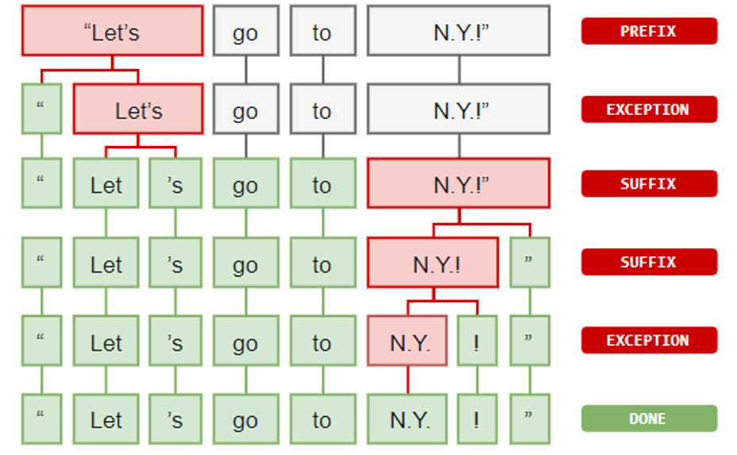
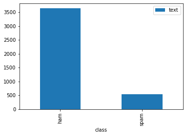

In this laboratory, we will see the main tools for text analysis. In particular, we will see:
 * The basic element of an NLP pipeline:
   * Word tokenization;
   * Identifying stop words;
   * Lemmatization;
   * POS tagging;
   * NER tagging;
   * Sentence segmentation.
 * The Bag Of Words (BOW) representation;
 * Text classification.

## 1. Text Processing Basics
We will use the `spaCy` Python library, which can be installed with the following commands from command line/anaconda prompt:

`conda install -c conda-forge spacy`

Alternativamente:

`pip install spacy`

Dopo:

`python -m spacy download en_core_web_sm`

To use spaCy, we first need to import it and load a corpus of text on which the algorithms have been trained. Assuming that we will work with the English language, we will load the `en` corpus:


```python
# import the spacy library and load the English web corpus
import spacy
nlp = spacy.load('en_core_web_sm')
```

The nlp object is associated with a vocabulary (i.e., a set of known words), which depends on the chosen corpus. We can see the length of the corpus as follows:


```python
len(nlp.vocab)
```


    773


We can see the list of al the words in the vocabulary as follows:


```python
words = [t.text for t in nlp.vocab]
print(words[:10])#print the first 10 words
```

    ['nuthin', 'ü.', 'p.m', 'Kan', 'Mar', "When's", ' ', 'Sept.', 'c.', 'Mont.']


To analyse text with spaCy, we first need to create a document object:


```python
#document object
doc = nlp("\"Let's go to N.Y.!\"")
doc
```


    "Let's go to N.Y.!"


When we define a document, the vocabulary is updated by inserting any word which is present in the document but was not present in the corpus. For instance, the size of the vocabulary is now larger:


```python
len(nlp.vocab)
```


    776


We can see which are the new words as follows:


```python
words2 = [t.text for t in nlp.vocab]
set(words2)-set(words)
```


    {'!', 'go', 'to'}


As we will see a spaCy document allows to easilly perform some basic text processing operations.

### 1.1 Tokenization
Given a spaCy document, it is possible to easilly iterate over tokens with a simple for loop:


```python
for t in doc:
    print(t)
```

    "
    Let
    's
    go
    to
    N.Y.
    !
    "


We can alternatively obtain the list of all tokens simply by passing doc to `list`:


```python
tokens = list(doc)
print(tokens)
```

    [", Let, 's, go, to, N.Y., !, "]


The `doc` object can also be indexed directly. So, if we want to access to the $5^{th}$ token, we can simply write:


```python
doc[4]
```


    to


We should note that each token is not a string, but actually a token object:


```python
type(doc[4])
```


    spacy.tokens.token.Token


We can access to the text contained in the token as follows:


```python
print(doc[4].text)
print(type(doc[4].text))
```

    to
    <class 'str'>


Similarly, it is possible to access multiple tokens by slicing. This will return a `span` object:


```python
print(doc[2:4])
print(type(doc[2:4]))
```

    's go
    <class 'spacy.tokens.span.Span'>


Even if we can index a document to obtain a token, tokens cannot be re-assigned:


```python
try:
    doc[2]='a'
except:
    print('Error!')
```

    Error!


As we can see, spaCy takes care of all steps required to obtain a proper tokenization, including recognizing prefixes, suffixes, infixes and exceptions, as shown in the image below (iamge from https://spacy.io/usage/spacy-101#annotations-token).



<table class="question">
<tr>
<td></td>
<td>

**Question 1**

Is the tokenization mechanism offered by spaCy useful at all? Compare the obtained tokenization with the result of splitting the string on spaces with `s.split(' ')`, where `s` is the variable containing the string.


 </td>
</tr>
</table>


### 1.2 Lemmatization

Lemmatization is a much more complex way to group words according to their meaning. This is done by looking both at a vocabulary (this is necessary to understand that, for instance 'knives' is the plural of 'knife') and at the context (for instance to understand if 'meeting' is used as a noun or as a verb). SpaCy performs lemmatization automatically and associates the correct lemma to each token. 

In particular, apart from `text`, each token is assigned two properties:
 * `lemma`: a numerical id which univocally identifies the lemma (this is for machines);
 * `lemma_`: a string explaining the lemma (this is for humans);
 
For instance:


```python
print(tokens[1].text)
print(tokens[1].lemma)
print(tokens[1].lemma_)
```

    Let
    278066919066513387
    let


Let's see an example with a sentence:


```python
doc = nlp("I will meet you in the meeting after meeting the runner when running.")
for token in doc:
    print("{} -> {}".format(token.text,token.lemma_))
```

    I -> I
    will -> will
    meet -> meet
    you -> you
    in -> in
    the -> the
    meeting -> meeting
    after -> after
    meeting -> meet
    the -> the
    runner -> runner
    when -> when
    running -> run
    . -> .


The lemmatizer correctly associated the first occurrence of "meeting" as a verb (its lemma is "meet") and the second one as a noun (its lemma is "meet").


### 1.3 Stop Words

Not all words are equally important. Some words such as "a" and "the" appear very frequently in the text and tell us little about the nature of the text (e.g., its category). These words are usually referred to as "stop words". SpaCy has a built in list of stop words for the English language. We can access them as follows:


```python
print(len(nlp.Defaults.stop_words))
#let's print the first 10 stop words
print(list(nlp.Defaults.stop_words)[:10]) 
```

    326
    ['get', 'see', 'without', 'so', '’ve', 'elsewhere', 'sixty', 'me', 'somewhere', 'herein']


We can check if a word is a stop word as follows:


```python
"the" in nlp.Defaults.stop_words
```


    True


To make things easier, spaCy allows to assess if a given token is a stop word using the attribute `is_stop`:


```python
for t in tokens:
    print("{} -> {}".format(t.text,t.is_stop))
```

    " -> False
    Let -> False
    's -> True
    go -> True
    to -> True
    N.Y. -> False
    ! -> False
    " -> False


As we can see, some commong words such as "'s", "go" and "to" are stop words.

Depending on the problem we are trying to solve, we may want to remove some stop words or add our own stop words. For instance, let's say we think "go" is valuable, and it should not be considered a stop word. We can remove it as follows:


```python
#we need to perform two steps
#also, remember to use only lowercase letters
nlp.Defaults.stop_words.remove('go')
nlp.vocab['go'].is_stop = False
```

Now, "go" is not considered as a stop word anymore:


```python
for t in nlp("\"Let's go to N.Y.!\""):
    print("{} -> {}".format(t.text,t.is_stop))
```

    " -> False
    Let -> False
    's -> True
    go -> False
    to -> True
    N.Y. -> False
    ! -> False
    " -> False


Similary, we can add a stop word as follows:


```python
nlp.Defaults.stop_words.add('!')
nlp.vocab['!'].is_stop = True
```

Let's check if "!" is now a stop word:


```python
for t in nlp("\"Let's go to N.Y.!\""):
    print("{} -> {}".format(t.text,t.is_stop))
```

    " -> False
    Let -> False
    's -> True
    go -> False
    to -> True
    N.Y. -> False
    ! -> True
    " -> False


<table class="question">
<tr>
<td></td>
<td>

**Question 2**

Why would we want to get rid of words which are very frequent? In which way is this related to the concept of information?


 </td>
</tr>
</table>


### 1.4 Part of Speech (POS) Tagging

SpaCy also allows to easily perform Part of Speech tagging. It is possible to assess which role a given token has in the text by using two properties of the tokens:
 * `pos`: a numerical id which identifies the type of POS (for machines);
 * `pos_`: a textual representation for the POS (for humans).

Let's see an example:


```python
print(tokens[2].text)
print(tokens[2].pos)
print(tokens[2].pos_)
```

    's
    95
    PRON


Let's see a more thorough example:


```python
for t in nlp("\"Let's go to N.Y.!\""):
    print("{} -> {}".format(t.text,t.pos_))
```

    " -> PUNCT
    Let -> VERB
    's -> PRON
    go -> VERB
    to -> ADP
    N.Y. -> PROPN
    ! -> PUNCT
    " -> PUNCT


The text contained in the `pos_` tags is a bit short. We can obtain a more datailed explanation with `spacy.explain`:


```python
for t in nlp("\"Let's go to N.Y.!\""):
    print("{} -> {}".format(t.text,spacy.explain(t.pos_)))
```

    " -> punctuation
    Let -> verb
    's -> pronoun
    go -> verb
    to -> adposition
    N.Y. -> proper noun
    ! -> punctuation
    " -> punctuation


We can access fine grained POS tags using `tag` and `tag_`:


```python
for t in nlp("\"Let's go to N.Y.!\""):
    print("{} -> {}".format(t.text,t.tag_))
```

    " -> ``
    Let -> VB
    's -> PRP
    go -> VB
    to -> IN
    N.Y. -> NNP
    ! -> .
    " -> ''


Similarly, we can obtain an explanation for each of the coarse grained tags:


```python
for t in nlp("\"Let's go to N.Y.!\""):
    print("{} -> {}".format(t.text,spacy.explain(t.tag_)))
```

    " -> opening quotation mark
    Let -> verb, base form
    's -> pronoun, personal
    go -> verb, base form
    to -> conjunction, subordinating or preposition
    N.Y. -> noun, proper singular
    ! -> punctuation mark, sentence closer
    " -> closing quotation mark


<table class="question">
<tr>
<td></td>
<td>

**Question 3**

What is the difference between coarse and fine grained tags? Are there applications in which coarse grained tags can still be useful?

 </td>
</tr>
</table>


### 1.5 Named Entity Recognition (NER)
Named entity recognition allows to identify which tokens refer to specific entities such as companies, organizations, cities, money, etc. Named entities can be accessed with the `ents` property of a spaCy document:


```python
doc = nlp('Boris Johnson is to offer EU leaders a historic grand bargain on Brexit — help deliver his new deal this week or agree a “no-deal” departure by October 31.')
doc.ents
```


    (Boris Johnson, EU, Brexit, this week, October 31)


Each entity has the following properties:
 * `text`: contains the text of the entity;
 * `label_`: a string denoting the type of entity;
 * `label`: an id for the entity;
As usual, we can use `spacy.explain` to get more information on an entity:


```python
for e in doc.ents:
    print("{} - {} - {} - {}".format(e.text, e.label, e.label_, spacy.explain(e.label_)))
```

    Boris Johnson - 380 - PERSON - People, including fictional
    EU - 383 - ORG - Companies, agencies, institutions, etc.
    Brexit - 380 - PERSON - People, including fictional
    this week - 391 - DATE - Absolute or relative dates or periods
    October 31 - 391 - DATE - Absolute or relative dates or periods


SpaCy has a built-in visualizer for named entity:


```python
from spacy import displacy
displacy.render(doc, style='ent', jupyter=True)
```


<span class="tex2jax_ignore"><div class="entities" style="line-height: 2.5; direction: ltr">
<mark class="entity" style="background: #aa9cfc; padding: 0.45em 0.6em; margin: 0 0.25em; line-height: 1; border-radius: 0.35em;">
    Boris Johnson
    <span style="font-size: 0.8em; font-weight: bold; line-height: 1; border-radius: 0.35em; vertical-align: middle; margin-left: 0.5rem">PERSON</span>
</mark>
 is to offer 
<mark class="entity" style="background: #7aecec; padding: 0.45em 0.6em; margin: 0 0.25em; line-height: 1; border-radius: 0.35em;">
    EU
    <span style="font-size: 0.8em; font-weight: bold; line-height: 1; border-radius: 0.35em; vertical-align: middle; margin-left: 0.5rem">ORG</span>
</mark>
 leaders a historic grand bargain on 
<mark class="entity" style="background: #aa9cfc; padding: 0.45em 0.6em; margin: 0 0.25em; line-height: 1; border-radius: 0.35em;">
    Brexit
    <span style="font-size: 0.8em; font-weight: bold; line-height: 1; border-radius: 0.35em; vertical-align: middle; margin-left: 0.5rem">PERSON</span>
</mark>
 — help deliver his new deal 
<mark class="entity" style="background: #bfe1d9; padding: 0.45em 0.6em; margin: 0 0.25em; line-height: 1; border-radius: 0.35em;">
    this week
    <span style="font-size: 0.8em; font-weight: bold; line-height: 1; border-radius: 0.35em; vertical-align: middle; margin-left: 0.5rem">DATE</span>
</mark>
 or agree a “no-deal” departure by 
<mark class="entity" style="background: #bfe1d9; padding: 0.45em 0.6em; margin: 0 0.25em; line-height: 1; border-radius: 0.35em;">
    October 31
    <span style="font-size: 0.8em; font-weight: bold; line-height: 1; border-radius: 0.35em; vertical-align: middle; margin-left: 0.5rem">DATE</span>
</mark>
.</div></span>


<table class="question">
<tr>
<td></td>
<td>

**Question 4**

How named entities are different from POS? Isn't this the same as knowing that a given token is a noun?

 </td>
</tr>
</table>


### 1.6 Sentence Segmentation
SpaCy also allows to perform sentence segmentation very easily by providing a `sents` property for each document:


```python
doc = nlp("I gave you $3.5. Do you remember? Since I owed you $1.5, you should now give me 2 dollars.")
list(doc.sents)
```


    [I gave you $3.5.,
     Do you remember?,
     Since I owed you $1.5, you should now give me 2 dollars.]


Also, we can check if a given token is the first token of a sentence using the property `is_sent_start`:


```python
for t in doc:
    print("{} -> {}".format(t,t.is_sent_start))
```

    I -> True
    gave -> False
    you -> False
    $ -> False
    3.5 -> False
    . -> False
    Do -> True
    you -> False
    remember -> False
    ? -> False
    Since -> True
    I -> False
    owed -> False
    you -> False
    $ -> False
    1.5 -> False
    , -> False
    you -> False
    should -> False
    now -> False
    give -> False
    me -> False
    2 -> False
    dollars -> False
    . -> False


<table class="question">
<tr>
<td></td>
<td>

**Question 5**

Is the sentence segmentation algorithm necessary at all? Compare the obtained segmentation with the result of splitting the string on punctuation with `s.split('.')`.


 </td>
</tr>
</table>


## 2. Bag of Words Representation

We will now see how to represent text using a bag of words representaiton. To deal with a concrete example, we will consider the classificaiton task of distinguishing spam messages from legitimate messages. We will consider the dataset of SMS spam, available here: https://www.kaggle.com/uciml/sms-spam-collection-dataset/version/1#.

The dataset can be downloaded after logging in. Download the file `spam.csv` and place it in the current working directory.

We will load the csv using Pandas:


```python
import pandas as pd
#due to the way the CSV file has been saved,
#we need to specify the latin-1 encoding
spam = pd.read_csv('spam.csv', encoding='latin-1')
```

For this lab, we will use only the first two columns (the others contain mostly `None` elements). We will also rename them from 'v1' and 'v2' to something more meaningful:


```python
spam=spam[['v1','v2']]
spam=spam.rename(columns={'v1':'class', 'v2':'text'})
spam.head()
```


<div>
<style scoped>
    .dataframe tbody tr th:only-of-type {
        vertical-align: middle;
    }

    .dataframe tbody tr th {
        vertical-align: top;
    }

    .dataframe thead th {
        text-align: right;
    }
</style>
<table border="1" class="dataframe">
  <thead>
    <tr style="text-align: right;">
      <th></th>
      <th>class</th>
      <th>text</th>
    </tr>
  </thead>
  <tbody>
    <tr>
      <th>0</th>
      <td>ham</td>
      <td>Go until jurong point, crazy.. Available only ...</td>
    </tr>
    <tr>
      <th>1</th>
      <td>ham</td>
      <td>Ok lar... Joking wif u oni...</td>
    </tr>
    <tr>
      <th>2</th>
      <td>spam</td>
      <td>Free entry in 2 a wkly comp to win FA Cup fina...</td>
    </tr>
    <tr>
      <th>3</th>
      <td>ham</td>
      <td>U dun say so early hor... U c already then say...</td>
    </tr>
    <tr>
      <th>4</th>
      <td>ham</td>
      <td>Nah I don't think he goes to usf, he lives aro...</td>
    </tr>
  </tbody>
</table>
</div>


Here `v1` represents the class, while `v2` contains the messages. Legitimate messages are called `ham`, as opposed to `spam` messages.

Let's inspect some messages:


```python
print(spam.iloc[0]['class'], '---', spam.iloc[0]['text'])
print()
print(spam.iloc[15]['class'], '---', spam.iloc[15]['text'])
print()
print(spam.iloc[25]['class'], '---', spam.iloc[25]['text'])
```

    ham --- Go until jurong point, crazy.. Available only in bugis n great world la e buffet... Cine there got amore wat...
    
    spam --- XXXMobileMovieClub: To use your credit, click the WAP link in the next txt message or click here>> http://wap. xxxmobilemovieclub.com?n=QJKGIGHJJGCBL
    
    ham --- Just forced myself to eat a slice. I'm really not hungry tho. This sucks. Mark is getting worried. He knows I'm sick when I turn down pizza. Lol


Since we will need to apply machine learning algorithms at some point, we should start by splitting the current dataset into training and testing sets. We will use the `train_test_split` function from `scikit-learn`. If the library is not installed, you can install it with the command:

`conda install scikit-learn`

or

`pip install scikit-learn`

Let's split the dataset:


```python
from sklearn.model_selection import train_test_split
#we will set a seed to make sure
#that the split is always performed in the same way
#this is for instructional purposes only
#and it is not generally done when
#analyzing data to make sure that the 
#split is truly random
import numpy as np
np.random.seed(1234)
#let's use 25% of the dataset as test set
train_set, test_set = train_test_split(spam, test_size=0.25)
```

Let's print some information about the two sets:


```python
train_set.info(); print('\n'); test_set.info()
```

    <class 'pandas.core.frame.DataFrame'>
    Int64Index: 4179 entries, 5062 to 2863
    Data columns (total 2 columns):
     #   Column  Non-Null Count  Dtype 
    ---  ------  --------------  ----- 
     0   class   4179 non-null   object
     1   text    4179 non-null   object
    dtypes: object(2)
    memory usage: 97.9+ KB
    
    
    <class 'pandas.core.frame.DataFrame'>
    Int64Index: 1393 entries, 1537 to 4118
    Data columns (total 2 columns):
     #   Column  Non-Null Count  Dtype 
    ---  ------  --------------  ----- 
     0   class   1393 non-null   object
     1   text    1393 non-null   object
    dtypes: object(2)
    memory usage: 32.6+ KB


Let's see the first elements of each set:


```python
train_set.head()
```


<div>
<style scoped>
    .dataframe tbody tr th:only-of-type {
        vertical-align: middle;
    }

    .dataframe tbody tr th {
        vertical-align: top;
    }

    .dataframe thead th {
        text-align: right;
    }
</style>
<table border="1" class="dataframe">
  <thead>
    <tr style="text-align: right;">
      <th></th>
      <th>class</th>
      <th>text</th>
    </tr>
  </thead>
  <tbody>
    <tr>
      <th>5062</th>
      <td>ham</td>
      <td>Ok i also wan 2 watch e 9 pm show...</td>
    </tr>
    <tr>
      <th>39</th>
      <td>ham</td>
      <td>Hello! How's you and how did saturday go? I wa...</td>
    </tr>
    <tr>
      <th>4209</th>
      <td>ham</td>
      <td>No da:)he is stupid da..always sending like th...</td>
    </tr>
    <tr>
      <th>4500</th>
      <td>ham</td>
      <td>So wat's da decision?</td>
    </tr>
    <tr>
      <th>3578</th>
      <td>ham</td>
      <td>Multiply the numbers independently and count d...</td>
    </tr>
  </tbody>
</table>
</div>


```python
test_set.head()
```


<div>
<style scoped>
    .dataframe tbody tr th:only-of-type {
        vertical-align: middle;
    }

    .dataframe tbody tr th {
        vertical-align: top;
    }

    .dataframe thead th {
        text-align: right;
    }
</style>
<table border="1" class="dataframe">
  <thead>
    <tr style="text-align: right;">
      <th></th>
      <th>class</th>
      <th>text</th>
    </tr>
  </thead>
  <tbody>
    <tr>
      <th>1537</th>
      <td>ham</td>
      <td>All sounds good. Fingers . Makes it difficult ...</td>
    </tr>
    <tr>
      <th>963</th>
      <td>ham</td>
      <td>Yo chad which gymnastics class do you wanna ta...</td>
    </tr>
    <tr>
      <th>4421</th>
      <td>ham</td>
      <td>MMM ... Fuck .... Merry Christmas to me</td>
    </tr>
    <tr>
      <th>46</th>
      <td>ham</td>
      <td>Didn't you get hep b immunisation in nigeria.</td>
    </tr>
    <tr>
      <th>581</th>
      <td>ham</td>
      <td>Ok anyway no need to change with what you said</td>
    </tr>
  </tbody>
</table>
</div>


<table class="question">
<tr>
<td></td>
<td>

**Question 6**


Compare the indexes of the two DataFrames with the indexes of the full `spam` DataFrame. In which order have the elements been sorted before splitting the dataset? Why?

 </td>
</tr>
</table>


We may want to check if how many elements belong to each category:


```python
from matplotlib import pyplot as plt
train_set.groupby('class').count().plot.bar()
plt.show()
```


    

    

<table class="question">
<tr>
<td></td>
<td>

**Question 7**

The dataset is very unbalanced. Why is this something we should keep in mind?

 </td>
</tr>
</table>


### 2.1 Tokenizating and counting words with CountVectorizer
In order to create our bag of words representation, we will need to tokenize each message, remove stop words and compute word counts. We could do this using spaCy. However, scikit-learn makes available some tools to perform feature extraction in an automated and efficient way. 

To perform tokenization, we will use the `CountVectorizer` object. This object allows to process a series of documents (the training set), extract a vocabulary out of it (the set of all words appearning in the document) transform each document into a vector which reports the number of instances of each word. Let's import and create a `CountVectorizer` object:


```python
from sklearn.feature_extraction.text import CountVectorizer
count_vect = CountVectorizer()
```

`CountVectorizer` uses a syntax which we will see is common to many `scikit-learn` objects:
 * A method `fit` can be used to tune the internal parameters of the `CountVectorizer` object. In this case, this is mainly the vocabulary. The input to the method is a list of text messages;
 * A method `transform` can be used to transform a list of documents into a sparse matrix in which each row is a vector containing the number of words included in each document. Since most of these numbers will be zero (documents don't usually contain all words), a sparse matrix is used instead of a conventional dense matrix to save memory;
 * A method `fit_transform` which performs `fit` and `transform` at the same time.
 
 Let's an example:


```python
count_vect.fit(['this is', 'a list of', 'short messages'])
```


    CountVectorizer()


We can access the vocabulary created by `CountVectorizer` as follows:


```python
count_vect.vocabulary_
```


    {'this': 5, 'is': 0, 'list': 1, 'of': 3, 'short': 4, 'messages': 2}


The vocabulary is a dictionary which maps each word to a unique integer identifier. `CountVectorizer` also automatically removed stop words such as `a`. We can now transform text using the `transform` method:


```python
features=count_vect.transform(['this is', 'a list of', 'short messages'])
features
```


    <3x6 sparse matrix of type '<class 'numpy.int64'>'
    	with 6 stored elements in Compressed Sparse Row format>


As previously mentioned, the output will be a sparse matrix for memory efficiency. Since the matrix is small in our simple example, we can visualize its dense version with no trouble:


```python
features=features.todense()
features
```

Each row fo the matrix corresponds to a document. Each column corresponds to a word, according to the ids included in the vocabulary dictionary. For instance, if we compare the first document with the corresponding vector:


```python
print ('this is',features[0])
```

We note that it contains one instance of `this` (index $5$ in the vocabulary) and one instance of `is` (index $0$).

Interestingly, if a new document contains words which were not contained in the original corpus of documents, they are simply discarded:


```python
features=count_vect.transform(['this is a new message'])
features.todense()
```

As we can see, `new` and `message` have been ignored as they were not in the original training set.

Let's compute word counts on all the training set:


```python
x_train = count_vect.fit_transform(train_set['text'])
x_train
```

<table class="question">
<tr>
<td></td>
<td>

**Question 8**

Why `x_train` is represented as a sparse matrix? How much memory would we need to store it as a dense matrix?


 </td>
</tr>
</table>


The feature matrix is now a large sparse matrix with many rows (the number of samples) and many columns (the number of words). We can check the length of the vocabulary also as follows:


```python
print(len(count_vect.vocabulary_))
```

## 3 Nearest Neighbor and Multinomial Naive Bayes Classification
Word counts are a simple representation for text. Let's see how well we can classify samples by using this representation. We will consider the K-Nearest Neighbor classifier for this task. Using it is very straightforward with scikit-learn. Let's import the `KNeighborsClassifier` object and create a 1-NN:


```python
from sklearn.neighbors import KNeighborsClassifier
knn = KNeighborsClassifier(n_neighbors=1)
```

This object has a similar interface:
 * A `fit` method is used to tune the parameters of the classifier. In this case, it is used to provide (and memorize) the training set. We need to provide both the input features and the corresponding labels:
 * A `predict` function is used to classify a sample;


```python
knn.fit(x_train, train_set['class'])
```

We can now use the `knn` object to classify a new message, but first, we need to extract features from our message. Let's consider an example from the test set:


```python
message = test_set.iloc[260]['text']
cl = test_set.iloc[260]['class']
message
```

To see if this is spam or ham, we need to first extract features form it:


```python
feats=count_vect.transform([message])
feats
```

Now we can classify it with `predict`:


```python
knn.predict(feats)
```

We can compare this with the actual class of the message:


```python
cl
```


```python
text = 'FREE MSG:We billed your mobile number by mistake from shortcode 83332.Please call 08081263000 to have charges refunded.This call will be free from a BT landline'
```


```python
knn.predict(count_vect.transform(["WAP link in the next txt message or click here"]))
```

Apparently, the KNN classifier got it wrong. A good idea would be to assess the performance on a larger set of samples. Let's do this for the whole test set:


```python
x_test = count_vect.transform(test_set['text'])
y_test_pred = knn.predict(x_test)
y_test_pred
```

We now need to evaluate how good our classifier is at guessing the right class. We can compute accuracy using the `accuracy_score` function from scikit-learn:


```python
from sklearn.metrics import accuracy_score
acc = accuracy_score(test_set['class'],y_test_pred)
acc
```

Alternatively, we can directly obtain the accuracy using the `score` method of the KNN object providing both the test features and labels:


```python
knn.score(x_test,test_set['class'])
```

<table class="question">
<tr>
<td></td>
<td>

**Question 9**

Our method achieved a good accuracy on the test set. Is this enough to evaluate its performance? What would be the performance of an approach systematically classifying messages as `ham`?


 </td>
</tr>
</table>


Scikit-learn also offers a `confusion_matrix` function to compute confusion matrices:


```python
from sklearn.metrics import confusion_matrix
#labels=['spam','ham'] is needed to make sure that the first class is spam (the positive class) and the second one is ham
cm = confusion_matrix(test_set['class'], y_test_pred, labels=['spam','ham'])
cm
```

<table class="question">
<tr>
<td></td>
<td>

**Question 10**

Compare the confusion matrix with the accuracy. Are we learning something different?

 </td>
</tr>
</table>


We can compute precision and recall as follows:


```python
from sklearn.metrics import precision_score, recall_score
#here labels=['spam'] is used to specify that "spam" is the "positive" class
precision = precision_score(test_set['class'], y_test_pred, average=None, labels=['spam'])[0]
recall = recall_score(test_set['class'], y_test_pred, average=None, labels=['spam'])[0]
precision, recall
```

We have a high precision and a low recall. Similarly, we can compute per-class $F_1$ scores with the `f1_score` function:


```python
from sklearn.metrics import f1_score
#average=None is needed to obtain per-class scores. This will be just one class in our case.
#labels=['spam'] is needed to indicate that we are considering "spam" as the positive class
f1_scores = f1_score(test_set['class'], y_test_pred, average=None, labels=['spam'])[0]
f1_scores
```

<table class="question">
<tr>
<td></td>
<td>

**Question 11**

What are the F1 scores telling us? Compare this with the accuracy and the confusion matrix.

 </td>
</tr>
</table>


We can easily repeat the process for a KNN with a different K. Let's try a 5-NN:


```python
knn_5 = KNeighborsClassifier(n_neighbors=5)
knn_5.fit(x_train,train_set['class'])
y_test_pred_5 = knn_5.predict(x_test)
f1_scores_5=f1_score(test_set['class'],y_test_pred_5, average=None, labels=['spam'])[0]
print(f1_scores_5)
```

Let us compute also precision and recall:


```python
precision = precision_score(test_set['class'], y_test_pred_5, average=None, labels=['spam'])[0]
recall = recall_score(test_set['class'], y_test_pred_5, average=None, labels=['spam'])[0]
precision, recall
```

<table class="question">
<tr>
<td></td>
<td>

**Question 12**

Which of the two classifiers worked best?

 </td>
</tr>
</table>


### 3.1 Optimizing the hyperparameters with cross validation

We can optimize the value of K using cross validation on the training set. To do so, we can use the `GridSearchCV` object:


```python
from sklearn.model_selection import GridSearchCV
from sklearn.metrics import f1_score, make_scorer

#create new a knn model
knn = KNeighborsClassifier()

# define the grid (K from 1 to 5)
param_grid = {'n_neighbors': np.arange(1, 5)}

#use gridsearch to test all values for n_neighbors
#by default, we will use accuracy to choose the best parameters
gs = GridSearchCV(knn, param_grid, cv=5)

#fit model to data
gs.fit(x_train,train_set['class'])
```

We can obtain the best parameters as follows:


```python
gs.best_params_
```

### 3.2 Multinomial Naive Bayes
Using a different classifier is pretty straightforward with scikit-learn. Let's see how to perform classification with a multinomial Naive Bayes classifier:


```python
from sklearn.naive_bayes import MultinomialNB
nb = MultinomialNB()
nb.fit(x_train, train_set['class'])
y_test_naive_pred = nb.predict(x_test)
f1_scores_naive=f1_score(test_set['class'],y_test_naive_pred, average=None, labels=['spam'])[0]
print(f1_scores_naive)
```

Let us compute precision and recall:


```python
precision = precision_score(test_set['class'], y_test_naive_pred, average=None, labels=['spam'])[0]
recall = recall_score(test_set['class'], y_test_naive_pred, average=None, labels=['spam'])[0]
precision, recall
```

<table class="question">
<tr>
<td></td>
<td>

**Question 13**

Which of the classifier seen so far performs better on the test set? Is the margin narrow or large?

 </td>
</tr>
</table>


## 4. Advanced Tools
In this section, we will see some advanced tools which may be useful to obtain more sophisticated natural language processing pipelines.

### 4.1 TF-IDF
We have seen that, in practice, it can be useful to weight words by their frequency in the corpus and in the single document by using TF-IDF. This can be done very easily in `scikit-learn` using a `TfidfTransformer` transformer object. Let's see how this changes the results of a KNN classifier. For more clarity, we will report the entire training/test processing pipeline:


```python
from sklearn.feature_extraction.text import TfidfTransformer
count_vect = CountVectorizer()
tf_transformer = TfidfTransformer()

x_train_counts = count_vect.fit_transform(train_set['text'])
x_train_tf_idf = tf_transformer.fit_transform(x_train_counts)

x_test_counts = count_vect.transform(test_set['text'])
x_test_tf_idf = tf_transformer.fit_transform(x_test_counts)

classifier = KNeighborsClassifier(n_neighbors=1)
classifier.fit(x_train_tf_idf, train_set['class'])

y_test_preds = classifier.predict(x_test_tf_idf)
f1_scores=f1_score(test_set['class'],y_test_preds, average=None, labels=['spam'])[0]
print(f1_scores)
```

When performing TF-IDF, we can skip the "idf" part. This way, the words will be only weighted by their frequency in the corpus. To do so, we need to specify a `use_idf=False` flag when creating the TF-IDF transformer:


```python
count_vect = CountVectorizer()
tf_transformer = TfidfTransformer(use_idf=False)

x_train_counts = count_vect.fit_transform(train_set['text'])
x_train_tf_idf = tf_transformer.fit_transform(x_train_counts)

x_test_counts = count_vect.transform(test_set['text'])
x_test_tf_idf = tf_transformer.fit_transform(x_test_counts)

classifier = KNeighborsClassifier(n_neighbors=1)
classifier.fit(x_train_tf_idf, train_set['class'])

y_test_preds = classifier.predict(x_test_tf_idf)
f1_scores=f1_score(test_set['class'],y_test_preds, average=None, labels=['spam'])[0]
print(f1_scores)
```


<table class="question">
<tr>
<td></td>
<td>

**Question 14**

Compare the results of the classifiers using TF-IDF with those obtained with the classifier using word counts. Which achieves better performance? Repeat the same comparison with a Naive Bayes classifier. Do we observe similar patterns? Why?

 </td>
</tr>
</table>


### 4.2 Custom Tokenization
Scikit-learn does not include tools to perform stemming, lemmatization, part-of-speech tagging etc. In some cases, however, it can be useful to consider these as features (or as additional features). To achieve this, we can combine scikit-learn with an external library such as spaCy. 

This is done by providing to the `CountVectorizer` object a custom tokenizer which splits a sentence into tokens. Let's build a tokenizer which considers parts of speech:


```python
class POSTokenizer(object):
    def __init__(self):
        self.nlp = spacy.load('en_core_web_sm')
    def __call__(self, doc):
        return [t.pos_ for t in self.nlp(doc)]
```

We can use the tokenizer to split any sentence into tokens:


```python
tokenizer = POSTokenizer()
tokenizer('Hello, How are you?')
```

We can hence build a `CountVectorizer` which uses the POSTokenizer as follows:


```python
count_vect_pos = CountVectorizer(tokenizer=POSTokenizer())
```

This can be easily integrated into a classification pipeline as follows:


```python
class POSTokenizer(object):
    def __init__(self):
        self.nlp = spacy.load('en_core_web_sm')
    def __call__(self, doc):
        return [t.pos_ for t in self.nlp(doc)]
    
count_vect_pos = CountVectorizer(tokenizer=POSTokenizer())

x_train_pos = count_vect_pos.fit_transform(train_set['text'])
x_test_pos = count_vect_pos.transform(test_set['text'])

classifier = MultinomialNB()
classifier.fit(x_train_pos, train_set['class'])

y_test_preds = classifier.predict(x_test_pos)
f1_scores=f1_score(test_set['class'],y_test_preds, average=None, labels=['spam'])[0]
print(f1_scores)
```

Note that by using coarse-grained POS, we only have $18$ features:


```python
x_train_counts.shape
```

We can combine these $18$ features with the previous representation based on word counts by concatenating the features:


```python
from scipy.sparse import hstack
count_vect = CountVectorizer()
x_train_counts = count_vect.fit_transform(train_set['text'])
x_train=hstack([x_train_counts,x_train_pos])
print(x_train_counts.shape, x_train_pos.shape, x_train.shape)
```

Let's integrate this into the classification pipeline:


```python
class POSTokenizer(object):
    def __init__(self):
        self.nlp = spacy.load('en_core_web_sm')
    def __call__(self, doc):
        return [t.pos_ for t in self.nlp(doc)]

count_vect = CountVectorizer()
count_vect_pos = CountVectorizer(tokenizer=POSTokenizer())

x_train_count = count_vect.fit_transform(train_set['text'])
x_test_count = count_vect.transform(test_set['text'])

x_train_pos = count_vect_pos.fit_transform(train_set['text'])
x_test_pos = count_vect_pos.transform(test_set['text'])

x_train=hstack([x_train_count,x_train_pos])
x_test=hstack([x_test_count,x_test_pos])

classifier = MultinomialNB()
classifier.fit(x_train, train_set['class'])

y_test_preds = classifier.predict(x_test)
f1_scores=f1_score(test_set['class'],y_test_preds, average=None, labels=['spam'])[0]
print(f1_scores)
```

Similar kinds of processing can be perfomed using other tokes such as named entities.

### 4.3 Scikit-Learn Pipelines
As we have seen in the past examples, classification algorithms are always made up of several components forming a pipeline including feature extraction and inference. This kind of processing an be simplified using Scikit-Learn pipelines. Let us see an example:


```python
from sklearn.pipeline import Pipeline

classification_pipeline = Pipeline([
    ('count_vectorizer', CountVectorizer()),
    ('classifier', MultinomialNB())
])

classification_pipeline.fit(train_set['text'], train_set['class'])

y_test_preds = classification_pipeline.predict(test_set['text'])
f1_scores=f1_score(test_set['class'],y_test_preds, average=None, labels=['spam'])[0]
print(f1_scores)
```

We can also merge more representation using the `FeatureUnion` object:


```python
from sklearn.pipeline import FeatureUnion

class NERTokenizer(object):
    def __init__(self):
        self.nlp = spacy.load('en_core_web_sm')
    def __call__(self, doc):
        return [t.pos_ for t in self.nlp(doc)]

classification_pipeline = Pipeline([
    ('feature_extraction', FeatureUnion([
        ('count',CountVectorizer()),
        ('pos',CountVectorizer(tokenizer=POSTokenizer()))
    ])),
    ('classifier', MultinomialNB())
])

classification_pipeline.fit(train_set['text'], train_set['class'])

y_test_preds = classification_pipeline.predict(test_set['text'])
f1_scores=f1_score(test_set['class'],y_test_preds, average=None, labels=['spam'])[0]
print(f1_scores)
```

## Exercises

<table class="question">
<tr>
<td></td>
<td>

**Exercise 1**

Consider the following wikipedia page:

https://en.wikipedia.org/wiki/Harry_Potter

Download it and extract the text using Beautiful Soup. Hence, perform the following processing:
 * Split the document into sentences;
 * Split the document into tokens;
 * Extract all named entities;
 * Extract all coarse-grained POS tags and create and summarize their distribution in the text with a bar plot;

 </td>
</tr>
</table>

<table class="question">
<tr>
<td></td>
<td>

**Exercise 2**

Train ham-vs-spam classifiers based on a bag of words representation which considers only named entities. Compare the performance of a 1-NN with those of a Naive Bayes classifier.


 </td>
</tr>
</table>


<table class="question">
<tr>
<td></td>
<td>

**Exercise 3**

Use the `fetch_20newsgroups` of scikit-learn (https://scikit-learn.org/stable/modules/generated/sklearn.datasets.fetch_20newsgroups.html) to download the 20 newsgroups dataset. This dataset contains documents belonging to $20$ different classes, already divided into training and test set. Build a classifier to distinguish between the 20 classes. Evaluate the classifier using confusion matrix and $F_1$ scores. Try different classifiers, different representations and different parameters to achieve the highest performance on the test set.


 </td>
</tr>
</table>


# Referenze
 * spaCy documentation: https://spacy.io/
 * NLTK documentation: https://www.nltk.org/
 * Scikit-learn tutorial on text processing: https://scikit-learn.org/stable/tutorial/text_analytics/working_with_text_data.html
