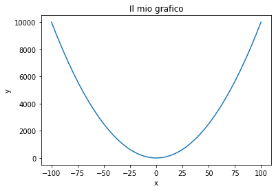
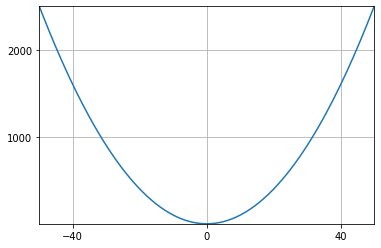
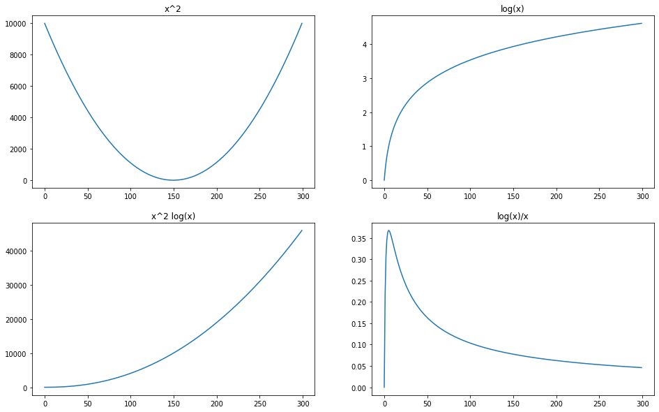
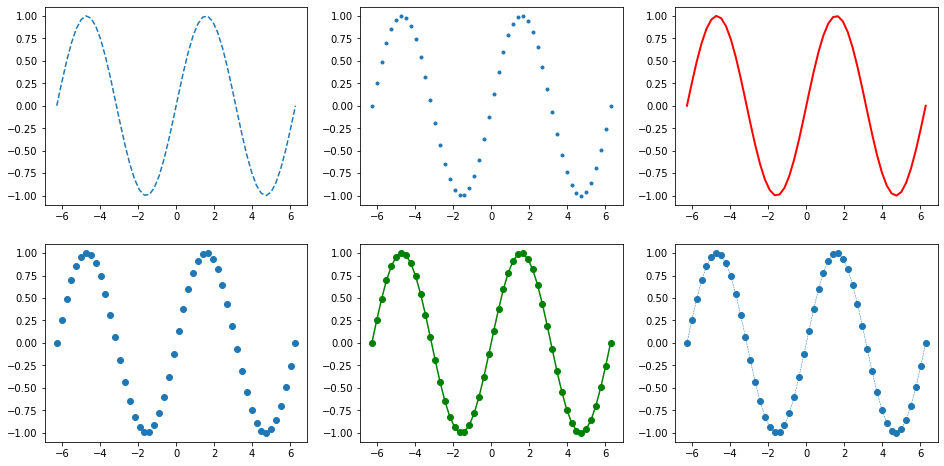
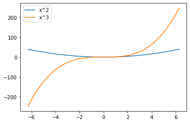

<!--
>  Note del corso di <a target="_blank" href="http://web.dmi.unict.it/corsi/l-31/insegnamenti?seuid=E59DD757-A4B8-4756-9515-CA16C1D616BE">Social Media Management 2022/2023</a> <br>
> Corso di Laurea in Informatica, Università di Catania <br>
> Note a cura di Antonino Furnari - <a href="mailto:antonino.furnari@unict.it">antonino.furnari@unict.it</a>
-->

Python è un linguaggio di programmazione ad alto livello, interpretato e pensato per la programmazione "general purpose". Python supporta un sistema dei tipi dimanico e diversi paradigmi di programmazione tra cui la programmazione orientata agli oggetti, la programmazione imperativa, la programmazione funzionale e la programmazione procedurale. Il linguaggio è stato ideato nel 1991 da Guido van Rossum e il suo nome è ispirato alla serie TV satirica Monty Python's Flying Circus (https://en.wikipedia.org/wiki/Monty_Python%27s_Flying_Circus ).

Benché Python non sia nato come linguaggio di programmazione per il calcolo scientifico e il machine learning, la sua estrema versatilità ha contribuito al nascere di una serie di librerire che rendono la computazione numerica in Python comoda ed efficiente. Buona parte di queste librerie fanno parte di "SciPy" (https://www.scipy.org/), un ecosistema di software open-source per il calcolo scientifico. Altre librerie, quali ad esempio PyTorch (http://pytorch.org/) mettono a disposizione una serie di strumenti per il calcolo parallelo su GPU orientato al Machine Learning. In queste dispense introdurremo il linguaggio Python 3, vedremo i fondamenti di NumPy, libreria per il calcolo scientifico e Matplotlib, libreria per il plot 2D/3D, e introdurremo gli elementi fondamentali di PyTorch, libreria per il calcolo parallelo su GPU e l'ottimizzazione di algoritmi di machine learning basati sulla discesa del gradiente.

**NOTA**: Questo laboratorio contiene molte nozioni di base. Il materiale più importante è denotato da un asterisco '*'.

Referenze importanti da consultare durante il corso, solo le seguenti documentazioni:
 * Python 3.8: https://docs.python.org/3.8/index.html;
 * Numpy: http://www.numpy.org/;
 * Matplotlib: https://matplotlib.org/;
 * Pandas: https://pandas.pydata.org/.

# 1 Introduzione a Python
## 1.1 Numeri
I tipi di dato numerici in Python sono int, float e complex. Noi ci concentreremo su int e float. Alcuni esempi di operazioni tra numeri:


```python
3 + 5 #somma
```


    8


```python
2 - 8 #differenza
```


    -6


```python
3 * 5 #prodotto
```


    15


```python
3 / 2 #divisione, da notare che in Python 3, la divisione tra numeri interi restituisce un float
```


    1.5


```python
3 // 2 #divisione intera
```


    1


```python
9 ** 2 #elevamento a potenza
```


    81


```python
4 % 2 #modulo
```


    0


```python
(1 + 4) * (3 - 2) #uso delle parentesi
```


    5


## 1.2 Variabili e Tipi
In generale, i numeri senza virgola vengono interpretati come int, mentre quelli con virgola come float. Dato che Python è tipizzato dinamicamente, non dobbiamo esplicitamente dichiarare il tipo di una variabile. Il tipo verrà associato alla variabile non appena vi assegniamo un valore. Possiamo controllare il tipo di una variabile mediante la funzione `type`:


```python
x = 3
y = 9
z = 1.5
h = x/y
l = x//y
type(x), type(y), type(z), type(h), type(l)
```


    (int, int, float, float, int)


E' possibile effettuare il casting da un tipo a un altro mediante le funzioni `int` e `float`:


```python
int(2.5)
```


    2


```python
float(3)
```


    3.0


Come in C, sono definite le operazioni "in place" tra variabili:


```python
x = 8
y = 12
x+=y #del tutto equivalente a x=x+y
x
```


    20


Non sono definite le notazioni "++" e "--". Per effettuare un incremento di una unità, va utilizzata la notazione +=1:


```python
a=1
a+=1
a
```


    2


<table class="question">
<tr>
<td></td>
<td>

**Domanda 1**

Qual è il tipo della seguente variabile?
```python
x = (3//2*2)**2+(3*0.0)
``` 
 </td>
</tr>
</table>


## 1.3 Booleani
I booleani vengono rappresentati mediante le parole chiave `True` e `False` (iniziano entrambe per maiuscola).


```python
print(True)
print(False)
```

    True
    False


```python
type(True)
```


    bool


E' possibile generare booleani mediante gli operatori di confronto:


```python
5==5
```


    True


```python
7==5
```


    False


```python
5>4
```


    True


```python
9>10
```


    False


```python
9<=10
```


    True


```python
11<=10
```


    False


Gli operatori logici sono `and` e `or`:


```python
print(5==5 and 3<5)
print(3>5 or 3<5)
print(3>9 or 3<2)
```

    True
    True
    False


E' possibile effettuare in controllo sui tipi mediante `type` e `==`:


```python
type(2.5)==float
```


    True


```python
type(2)==float
```


    False


In alternativa, è possibile utilizzare la funzione `isinstance`:


```python
isinstance(2.5,float)
```


    True


```python
isinstance(2.5,int)
```


    False


La funzione `isinstance` è particolarmente comoda quando si vuole controllare che una variabile appartenga a uno tra una serie di tipi. Ad esempio, se vogliamo controllare che una variabile contenga un numero:


```python
isinstance(2.5,(float,int))
```


    True


```python
isinstance(5,(float,int))
```


    True


## 1.4 Stampa

La stampa avviene mediante la funzione `print`:


```python
var = 2.2
print(var)
```

    2.2


Possiamo stampare una riga vuota omettendo il parametro di print:


```python
print(2)
print()
print(3)
```

    2
    
    3


Alternativamente, possiamo specificare di inserire due "a capo" alla fine della stampa specificando il parametro `end="\n\n"` ("\n\n" è una stringa - approfondiremo le stringhe in seguito):


```python
print(2, end="\n\n")
print(3)
```

    2
    
    3


Lo stesso metodo può essere usato per omettere l'inserimento di spazi tra due stampe consecutive:


```python
print(2, end="") #"" rappresenta una stringa vuota
print(3)
```

    23


Possiamo stampare più elementi di seguito separando gli argomenti di `print` con delle virgole. Inoltre, la funzione `print` permette di stampare anche numeri, oltre a stringhe:


```python
print(1,8/2,7,14%6,True)
```

    1 4.0 7 2 True


## 1.5 Liste

Le liste sono una struttura dati di tipo sequenziali che possono essere utilizzate per rappresentare sequenze di valori di qualsiasi tipo. Le liste possono anche contenere elementi di tipi misti. Una lista si definisce utilizzando le parentesi quadre:


```python
l = [1,2,3,4,5] #questa è una lista (parentesi quadre)
print(l)
```

    [1, 2, 3, 4, 5]


Le liste possono essere indicizzate utilizzando le parentesi quadre. L'indicizzazione inizia da 0 come in C:


```python
print(l[0],l[2])
l[0]=8 #assegnamento di un nuovo valore alla prima locazione di memoria
print(l)
```

    1 3
    [8, 2, 3, 4, 5]


E' possibile aggiungere nuovi valori a una lista mediante la funzione `append`:


```python
l = []
print(l)
l.append(1)
l.append(2.5)
l.append(8)
l.append(-12)
print(l)
```

    []
    [1, 2.5, 8, -12]


Le liste possono essere concatenate mediante l'operatore somma:


```python
l1 = [1,5]
l2 = [4,6]
print(l1+l2)
```

    [1, 5, 4, 6]


L'operatore di moltiplicazione può essere utilizzato per ripetere una lista. Ad esempio:


```python
l1 = [1,3]
print(l1*2) #concatena l1 a se stessa per due volte
```

    [1, 3, 1, 3]


Utilizzando l'operatore di moltiplicazione, è possibile creare velocemente liste con un numero arbitrario di valori uguali. Ad esempio:


```python
print([0]*5) #lista di 5 zeri
print([0]*4+[1]*1) #4 zeri seguiti da 1 uno
```

    [0, 0, 0, 0, 0]
    [0, 0, 0, 0, 1]


La lunghezza di una lista può essere ottenuta utilizzando la funzione `len`:


```python
print(l2)
print(len(l2))
```

    [4, 6]
    2


L'operatore `==` non controlla se le lunghezze sono uguali, ma verifica che il contenuto delle due liste sia effettivamente uguale:


```python
print([1,2,3]==[1,2,3])
print([1,2,3]==[1,3,2])
```

    True
    False


E' possibile controllare che un elemento appartenga alla lista mediante la parola chiave `in`:


```python
print(7 in [1,3,4])
print(3 in [1,3,4])
```

    False
    True


Le funzioni `max` e `min` possono essere utilizzate per calcolare il massimo e il minimo di una lista:


```python
l=[-5,2,10,6]
print(max(l))
print(min(l))
```

    10
    -5


E' possibile rimuovere un valore da una lista mediante il metodo `remove`:


```python
l=[1,2,3,4,2]
print(l)
l.remove(2)
print(l)
```

    [1, 2, 3, 4, 2]
    [1, 3, 4, 2]


Tale metodo tuttavia rimuove solo **la prima occorrenza** del valore passato. Se vogliamo rimuovere un valore identificato da uno specifico indice, possiamo usare il costrutto `del`:


```python
l=[1,2,3,4,2]
print(l)
del l[4]
print(l)
```

    [1, 2, 3, 4, 2]
    [1, 2, 3, 4]


Inoltre, per accedere all'ultimo elemento e rimuoverlo, possiamo usare il metodo `pop`:


```python
l=[1,2,3,4,5]
print(l)
print(l.pop())
print(l)
```

    [1, 2, 3, 4, 5]
    5
    [1, 2, 3, 4]


### 1.5.1 Indicizzazione e Slicing *
E' possibile estrarre una sottolista da una lista specificando il primo indice (incluso) e l'ultimo indice (escluso) separati dal simbolo `:`. Questa notazione è in qualche modo reminiscende del metodo `substr` delle stringhe di C++.


```python
l = [1,2,3,4,5,6,7,8]
print("Lista l     ->", l)
print("l[0:3]      ->", l[0:3]) #dall'indice 0 (incluso) all'indice 3 (escluso)
print("l[1:2]      ->", l[1:2]) #dall'indice 1 (incluso) all'indice 2 (escluso)
```

    Lista l     -> [1, 2, 3, 4, 5, 6, 7, 8]
    l[0:3]      -> [1, 2, 3]
    l[1:2]      -> [2]


Quando il primo indice è omesso, questo viene automaticamente sostituito con "0":


```python
print("l[:2]       ->", l[:2]) #dall'indice 0 (incluso) all'indice 2 (escluso)
#equivalente al seguente:
print("l[0:2]      ->", l[0:2]) #dall'indice 0 (incluso) all'indice 2 (escluso)
```

    l[:2]       -> [1, 2]
    l[0:2]      -> [1, 2]


Analogamente, se omettiamo il secondo indice, esso viene sostituito con l'ultimo indice della lista:


```python
print("Ultimo indice della lista:",len(l))
print("l[3:]       ->", l[3:]) #dall'indice 3 (incluso) all'indice 5 (escluso)
#equivalente al seguente:
print("l[3:5]      ->", l[3:8]) #dall'indice 3 (incluso) all'indice 5 (escluso)
```

    Ultimo indice della lista: 8
    l[3:]       -> [4, 5, 6, 7, 8]
    l[3:5]      -> [4, 5, 6, 7, 8]


Omettendo entrambi gli indici:


```python
print("l[:]         ->", l[:]) #dall'indice 0 (incluso) all'indice 5 (escluso)
#equivalente a:
print("l[0:8]       ->", l[0:8]) #dall'indice 0 (incluso) all'indice 8 (escluso)
```

    l[:]         -> [1, 2, 3, 4, 5, 6, 7, 8]
    l[0:8]       -> [1, 2, 3, 4, 5, 6, 7, 8]


E' inoltre possibile specificare il "passo", come terzo numero separato da un altro simbolo `:`:


```python
print("l[0:8:2]    ->", l[0:8:2]) 
#da 0 (incluso) a 8 (escluso) a un passo di 2 (un elemento sì e uno no)
#equivalente a:
print("l[::2]      ->", l[0:8:2]) 
#da 0 (incluso) a 8 (escluso) a un passo di 2 (un elemento sì e uno no)
```

    l[0:8:2]    -> [1, 3, 5, 7]
    l[::2]      -> [1, 3, 5, 7]


Per invertire l'ordine degli elementi, è inoltre possibile specificare un passo negativo. In questo caso, bisogna assicurarsi che il primo indice sia maggiore del secondo:


```python
print("l[5:2:-1]    ->", l[5:2:-1]) 
#da 5 (incluso) a 2 (escluso) a un passo di -1
print("l[2:5:-1]    ->", l[2:5:-1]) 
#in questo caso, il primo indice è più piccolo del secondo, 
#quindi il risultato sarà una lista vuota
```

    l[5:2:-1]    -> [6, 5, 4]
    l[2:5:-1]    -> []


Anche in questo caso, omettendo degli indici, questi verranno rimpiazzati con le scelte più ovvie. Nel caso dell'omissione però, cambiano le condizioni di inclusione ed esclusione degli indici. Vediamo qualche esempio:


```python
print("l[:2:-1]     ->", l[:2:-1]) 
#dall'ultimo indice (incluso) a 2 (escluso) a un passo di -1
#equivalente a:
print("l[8:2:-1]    ->", l[8:2:-1]) 

print()
print("l[3::-1]     ->", l[3::-1]) 
#dal terzo indice (incluso) a 0 (incluso, in quanto omesso) a un passo di -1
#simile, ma non equivalente a:
print("l[3:0:-1]    ->", l[3:0:-1]) 
#dal terzo indice (incluso) a 0 (escluso) a un passo di -1

print()
print("l[::-1]      ->", l[::-1])
#dall'ultimo indice (incluso) al primo (incluso, in quanto omesso) a un passo di -1
#simile, ma non equivalente a:
print("l[8:0:-1]    ->", l[8:0:-1]) 
#dall'ultimo indice (incluso) al primo (escluso) a un passo di -1
```

    l[:2:-1]     -> [8, 7, 6, 5, 4]
    l[8:2:-1]    -> [8, 7, 6, 5, 4]
    
    l[3::-1]     -> [4, 3, 2, 1]
    l[3:0:-1]    -> [4, 3, 2]
    
    l[::-1]      -> [8, 7, 6, 5, 4, 3, 2, 1]
    l[8:0:-1]    -> [8, 7, 6, 5, 4, 3, 2]


La notazione `::-1`, in particolare, è utile per invertire le liste:


```python
print(l)
print(l[::-1])
```

    [1, 2, 3, 4, 5, 6, 7, 8]
    [8, 7, 6, 5, 4, 3, 2, 1]


Indicizzazione e slicing possono essere utilizzate anche per assegnare valori agli elementi delle liste. Ad esempio:


```python
l = [5,7,9,-1,2,6,5,4,-6]
print(l)
l[3]=80
print(l)
```

    [5, 7, 9, -1, 2, 6, 5, 4, -6]
    [5, 7, 9, 80, 2, 6, 5, 4, -6]


E' anche possibile assegnare più di un elemento alla volta:


```python
l[::2]=[0,0,0,0,0] #assegno 0 ai numeri di posizione dispari
print(l)
```

    [0, 7, 0, 80, 0, 6, 0, 4, 0]


Le liste possono anche essere annidate:


```python
a1 = [1,2,[4,8,[7,5]],[9],2]
print(a1)
```

    [1, 2, [4, 8, [7, 5]], [9], 2]


L'indicizzazione di queste strutture annidate avviene concatenando gli indici come segue:


```python
print(a1[2][2][0]) #il primo indice seleziona la lista [4,8,...]
#il secondo indice seleziona la lista [7,5]
#il terzo indice seleziona l'elemento 7
```

    7


<table class="question">
<tr>
<td></td>
<td>

**Domanda 2**

Estrarre la lista `[3, 1.2]` dalla seguente lista:
```python
l = [1, 4, 5, [7, 9, -1, [0, 3, 2, 1.2], 8, []]]
```
 </td>
</tr>
</table>


## 1.6 Tuple

Le tuple sono simili alle liste, ma sono immutabili. Non possono cioè essere modificate dopo la loro inizializzazione. A differenza delle liste, le tuple vengono definite utilizzando le parentesi tonde:


```python
l = [1,2,3,4,5] #questa è una lista (parentesi quadre)
t = (1,2,3,4,5) #questa è una tupla (parentesi tonde)
print(l)
print(t)
```

    [1, 2, 3, 4, 5]
    (1, 2, 3, 4, 5)


Le regole di indicizzazione e slicing viste per le liste valgono anche per tuple. Tuttavia, come accennato prima, le tuple non possono essere modificate:


```python
t = (1,3,5)
try:
    t[0]=8 #restituisce un errore in quanto le tuple sono immutabili
except Exception as e:
    print(e)
```

    'tuple' object does not support item assignment


Inizializzare una tupla con un solo elemento produrrà un numero. Ciò avviene in quanto le parentesi tonde vengono utilizzate anche per raggruppare i diversi termini di una operazione:


```python
t=(1)
print(t)
```

    1


Per definire una tupla monodimensionale, dobbiamo aggiungere esplicitamente una virgola, dopo il primo elemento:


```python
t=(1,)
print(t)
```

    (1,)


E' inoltre possibile omettere le parentesi nella definizione delle tuple:


```python
t1=1,3,5
t2=1,
print(t1,t2)
```

    (1, 3, 5) (1,)


E' possibile convertire tuple in liste e viceversa:


```python
l=[1,2,3,4,5,6,7,8]
t=(4,5,6,7,4,8,2,4)
ttl = list(t)
ltt = tuple(l)

print(ttl)
print(ltt)
```

    [4, 5, 6, 7, 4, 8, 2, 4]
    (1, 2, 3, 4, 5, 6, 7, 8)


Le tuple possono inoltre essere create e "spacchettate" al volo:


```python
t1=1,2,3

print(t1)

a,b,c=t1 #spacchettamento della tupla
print(a,b,c)
```

    (1, 2, 3)
    1 2 3


Questo sistema permette di effettuare lo swap di due variabili in una sola riga di codice:


```python
var1 = "Var 1"
var2 = "Var 2"

print(var1,var2)

var1,var2=var2,var1
print(var1,var2)

#equivalente a:
var1 = "Var 1"
var2 = "Var 2"
t = (var2,var1)
var1=t[0]
var2=t[1]
print(var1,var2)
```

    Var 1 Var 2
    Var 2 Var 1
    Var 2 Var 1


Le tuple annidate possono essere spacchetate come segue:


```python
t = (1,(2,3),(4,5,6))
x,(t11,t12),(t21,t22,t23) = t
print(t)
print(x, t11, t12, t21, t22, t23)
#La notazione a,b,c,d,e,f = t restituirebbe un errore
```

    (1, (2, 3), (4, 5, 6))
    1 2 3 4 5 6


<table class="question">
<tr>
<td></td>
<td>

**Domanda 3**

Qual è la differenza principale tra tuple e liste? Si faccia l'esempio di un caso in cui una tupla è un tipo più appropriato rispetto a una lista.

 </td>
</tr>
</table>


## 1.7 Stringhe
In Python possiamo definire le stringhe in tre modi:


```python
s1 = 'Singoli apici'
s2 = "Doppi apici, possono contenere anche apici singoli '' "
s3 = """Tripli
doppi apici
possono essere definite su più righe"""
type(s1), type(s2), type(s3)
```


    (str, str, str)


La stampa avviene mediante la funzione "print":


```python
print(s1)
print(s2)
print(s3)
```

    Singoli apici
    Doppi apici, possono contenere anche apici singoli '' 
    Tripli
    doppi apici
    possono essere definite su più righe


Le stringhe hanno inoltre una serie di metodi predefiniti:


```python
print("ciao".upper()) #rendi tutto maiuscolo
print("CIAO".lower()) #tutto minuscolo
print("ciao come stai".capitalize()) #prima lettera maiuscola
print("ciao come stai".split()) #spezza una stringa e restituisce una lista
print("ciao, come stai".split(','))# spezza quando trova la virgola
print("-".join(["uno","due","tre"])) #costruisce una stringa concatenando gli elementi 
#della lista e separandoli mediante il delimitatore
```

    CIAO
    ciao
    Ciao come stai
    ['ciao', 'come', 'stai']
    ['ciao', ' come stai']
    uno-due-tre


Le stringhe possono essere indicizzate in maniera simile agli array per ottenere delle sottostringhe:


```python
s = "Hello World"
print(s[:4]) #primi 4 caratteri
print(s[4:]) #dal quarto carattere alla fine
print(s[4:7]) #dal quarto al sesto carattere
print(s[::-1]) #inversione della stringa
```

    Hell
    o World
    o W
    dlroW olleH


Il metodo `split` in particolare può essere utilizzato per la tokenizzazione o per estrarre sottostringhe in maniera agevole. Ad esempio, supponiamo di voler estrarre il numero `2017` dalla stringa `A-2017-B2`:


```python
print("A-2017-B2".split('-')[1])
```

    2017


L'operatore `==` controlla che due stringhe siano uguali:


```python
print("ciao"=="ciao")
print("ciao"=="ciao2")
```

    True
    False


Gli altri operatori rispecchiano l'ordinamento lessicografico tra stringhe:


```python
print("abc"<"def")
print("Abc">"def")
```

    True
    False


<table class="question">
<tr>
<td></td>
<td>

**Domanda 4**

Quale codice permette di manipolare la stringa `azyp-kk9-382` per ottenere la stringa `Kk9`?
 </td>
</tr>
</table>


### 1.7.1 Formattazione di Stringhe *
Possiamo costruire stringhe formattate seguendo una sintassi simile a quella di printf:


```python
#per costruire la stringa formattata, faccio seguire la stringa dal simbolo "%" e poi inserisco
#una tupla contenente gli argomenti
s1 = "Questa %s è formattata. Posso inserire numeri, as esempio %0.2f" % ("stringa",3.00002)
print(s1)
```

    Questa stringa è formattata. Posso inserire numeri, as esempio 3.00


Un modo alternativo e più recente di formattare le strighe consiste nell'usare il metodo "format":


```python
s2 = "Questa {} è formattata. Posso inserire numeri, ad esempio {}"\
    .format("stringa",3.000002)# il carattere "\" permette di spezzare la riga
print(s2)
```

    Questa stringa è formattata. Posso inserire numeri, ad esempio 3.000002


E' possibile specificare il tipo di ogni argomento utilizzando i due punti:


```python
print("Questa {:s} è formattata. Posso inserire numeri, ad esempio {:0.2f}"\
      .format("stringa",3.00002)) #parametri posizionali, senza speci
```

    Questa stringa è formattata. Posso inserire numeri, ad esempio 3.00


E' anche possibile assegnare nomi agli argomenti in modo da richiamarli in maniera non ordinata:


```python
print("Questa {str:s} è formattata. Posso inserire numeri, ad esempio {num:0.2f}"\
    .format(num=3.00002, str="stringa"))
```

    Questa stringa è formattata. Posso inserire numeri, ad esempio 3.00


<table class="question">
<tr>
<td></td>
<td>

**Domanda 5**

Date le variabili:

```python
a = "hello"
b = "world"
c = 2.0
```

Usare la formattazione delle stringhe per stampare la stringa `hello 2 times world`.

 </td>
</tr>
</table>


### 1.7.2 Formattazione di Stringhe mediante F-Strings *
Le f-string permettono di formattare le stringhe in maniera ancora più compatta ed elegante. In particolare, la notazione 'f' permette di includere all'interno di una stringa i valori di variabili contenuti in variabili disponibili nello scope corrente. Esempio:


```python
x = 2
print(f"x={x}")
```

    x=2


La 'f' prima della stringa denota l'inizio di una f-string. Il contenuto tra le parentesi graffe viene di fatto valutato come del codice. Ciò permette di fare cose del genere:


```python
print(f"x={x+2}")
```

    x=4


O cose del genere:


```python
a={'x':2, 'y':'string'}
print(f"x={a['x']}, y={a['y']}")
```

    x=2, y=string


Anche in questo caso è possibile specificare un formato dopo il simbolo ':' all'interno delle parentesi graffe:


```python
print(f"x={a['x']:0.2f}")
```

    x=2.00


### 1.7.3 Espressioni Regolari *
Spesso può tornare utile manipolare stringhe mediante le espressioni regolari. Ciò permette di cercare pattern, isolarli ed eliminarli. Le espressioni regolari sono fornite dal pacchetto **re**. Vediamo una stringa di esempio:


```python
s = "Stringa con nmero 029876 e testo"
```

Vediamo ad esempio come estrarre il numero all'interno della stringa:


```python
import re
re.search('[0-9]+',s)
```


    <re.Match object; span=(18, 24), match='029876'>


Il metodo `search` restituisce un oggetto di tipo `re.Match` che specifica gli indici di inizio e fine del match nella stringa (span) e il testo trovato. Per accedere al testo, dobbiamo utilizzare il metodo `group`:


```python
re.search('[0-9]+',s).group()
```


    '029876'


Il metodo `search` restituisce solo il primo match. In alcuni casi, può essere utile cercare lo stesso pattern più volte all'interno di una stringa. Per farlo, possiamo utilizzare il metodo `finditer`, come nell'esempio seguente:


```python
s = "Stringa con numeri 029845 18029 numeri formattati 0234-672, 0xxx-1o2 indirizzi@email.com, #hashtags, @names"
re.finditer('[0-9]+',s)
```


    <callable_iterator at 0x7ffbf0132128>


Questo restituisce un iterator che permette di accedere ai diversi match. Per estrarre il testo contenuto in ogni match possiamo fare come segue:


```python
[m.group() for m in re.finditer('[0-9]+',s)]
```


    ['029845', '18029', '0234', '672', '0', '1', '2']


Cerchiamo solo i numeri strutturati del tipo ####-###:


```python
[m.group() for m in re.finditer('[0-9]{4}-[0-9]{3}',s)]
```


    ['0234-672']


Cerchiamo gli indirizzi email:


```python
[m.group() for m in re.finditer('[a-zA-Z0-9-_.]+@[a-zA-Z0-9-_.]+',s)]
```


    ['indirizzi@email.com']


E' possibile rimuovere alcuni pattern mediante il metodo `sub`. Ad esempio, possiamo eliminare le email con:


```python
re.sub('[a-zA-Z0-9-_.]+@[a-zA-Z0-9-_.]+','',s)
```


    'Stringa con numeri 029845 18029 numeri formattati 0234-672, 0xxx-1o2 , #hashtags, @names'


Possiamo anche suddividere una riga in più righe sulla base di un pattern. Per esempio, suddividiamo ogni volta che troviamo un trattino:


```python
re.split('-',s)
```


    ['Stringa con numeri 029845 18029 numeri formattati 0234',
     '672, 0xxx',
     '1o2 indirizzi@email.com, #hashtags, @names']


Suddividiamo ogni volta che troviamo un numero di una o più cifre:


```python
re.split('[0-9]+',s)
```


    ['Stringa con numeri ',
     ' ',
     ' numeri formattati ',
     '-',
     ', ',
     'xxx-',
     'o',
     ' indirizzi@email.com, #hashtags, @names']


E' possibile trovare maggiori informazioni nella documentazione ufficiale: https://docs.python.org/3/library/re.html.

## 1.8 Dizionari *
I dizionari sono simili a delle liste, ma vengono indicizzate da oggetti di tipo "hashable", ad esempio stringhe:


```python
d = {"val1":1, "val2":2}
print(d)

print(d["val1"])
```

    {'val1': 1, 'val2': 2}
    1


E' possibile ottenere la lista delle chiavi e dei valori come segue:


```python
print(d.keys()) #chiavi e valori sono in ordine casuale
print(d.values())
```

    dict_keys(['val1', 'val2'])
    dict_values([1, 2])


E' possibile indicizzare dizionari con tuple (che sono "hashable")


```python
d = {(2,3):5, (4,6):11}

print(d[(2,3)])
```

    5


I dizionari possono anche essere estesi dinamicamente:


```python
d = dict() #dizionario vuoto
d["chiave"]="valore"
print(d)
```

    {'chiave': 'valore'}


Possiamo controllare che un elemento si trovi tra le chiavi di un dizionario come segue:


```python
d = {1:'ciao', '5': 5, 8: -1}
print(5 in d)
print('5' in d)
```

    False
    True


E' possibile controllare che un elemento si trovi tra i valori di un dizionario come segue:


```python
print(-1 in d.values())
```

    True


## 1.9 Set
I set sono delle strutture dati che possono contenere solo una istanza di un dato elemento:


```python
s = {1,2,3,3}
print(s) #può essere contenuto solo un "3"
```

    {1, 2, 3}


Possiamo aggiungere un elemento a un set mediante il metodo "add":


```python
print(s)
s.add(5)
print(s)
s.add(1) #non ha effetto. 1 è già presente
print(s)
```

    {1, 2, 3}
    {1, 2, 3, 5}
    {1, 2, 3, 5}


Anche in questo caso, possiamo controllare l'appartenenza di un elemento ad un set mediante la parola chiave `in`:


```python
s={1,5,-1}
print(-1 in s)
print(8 in s)
```

    True
    False


E' inoltre possibile creare set da liste:


```python
set([1,3,3,2,5,1])
```


    {1, 2, 3, 5}


## 1.10 Costrutti if/elif/else

I costrutti condizionali funzionano in maniera simile ai linguaggi basati su C. A differenza di tali linguaggi tuttavia, Python sostituisce le parentesi con l'indentazione obbligatoria. Il seguente codice C++:

```c++
int var1 = 5;
int var2 = 10;
if(var1<var2) {
    int var3 = var1+var2;
    cout << "Hello World "<<var3;
}
cout << "End";```
viene invece scritto come segue:


```python
var1 = 5
var2 = 10
if var1<var2:
    var3 = var1+var2
    print("Hello World",var3)
print("End")
```

    Hello World 15
    End


In pratica:
 * la condizione da verificare non è racchiusa tra parentesi;
 * i due punti indicano l'inizio del corpo dell'if;
 * l'indentazione stabilisce cosa appartiene al corpo dell'if e cosa non appartiene al corpo dell'if.
 
Dal momento che l'indentazione ha valore sintattico, essa diventa obbligatoria. Inoltre, non è possibile indentare parti di codice ove ciò non è significativo. Ad esempio, il seguente codice restituirebbe un errore:

```python
print("Hello")
    print("World")
```

Le regole di indentazione appena viste, valgono anche per i cicli e altri costrutti in cui è necessario deliminare blocchi di codice. Il costrutto if, permette anche di specificare un ramo `else` e un ramo `elif` per i controlli in cascata. Vediamo alcuni esempi:


```python
true_condition = True
false_condition = False

if true_condition: #i due punti ":" sono obbligatori
    word="cool!"
    print(word) #l'indentazione è obbligatoria
    
if false_condition:
    print("not cool :(")
    
if not false_condition: #neghiamo la condizione con "not"
    word="cool"
    print(word,"again :)")
    
if false_condition:
    word="this"
    print(word+" is "+"false")
else: #due punti + indentazione
    print("true")
    
if false_condition:
    print("false")
elif 5>4: #implementa un "else if"
    print("5>4")
else:
    print("4<5??")
```

    cool!
    cool again :)
    true
    5>4


E' anche possibile verificare se un valore appartiene a una lista. Ciò è molto utile per verificare se un parametro è ammesso.


```python
allowed_parameters = ["single", "double", 5, -2]

parameter = "double"

if parameter in allowed_parameters:
    print(parameter,"is ok")
else:
    print(parameter,"not in",allowed_parameters)

x=8
if x in allowed_parameters:
    print(x,"is not ok")
else:
    print(x,"not in",allowed_parameters)
```

    double is ok
    8 not in ['single', 'double', 5, -2]


Una variante "inline" del costrutto if può essere utilizzata per gli assegnamenti condizionali:


```python
var1 = 5
var2 = 3
m = var1 if var1>var2 else var2 #calcola il massimo
print(m)
```

    5


In Python non esiste il costrutto switch, per implementare il quale si utilizza una lista di elif in cascata:


```python
s = "ciao"
if s=="help":
    print("help")
elif s=="world":
    print("hello",s)
elif s=="ciao":
    print(s,"mondo")
else:
    print("Default")
```

    ciao mondo


<table class="question">
<tr>
<td></td>
<td>

**Domanda 6**

Si consideri il seguente codice:

```python
x=2
if x>0:
    y=12
    x=x+y
    print y
else:
        z=28
        h=12
        print z+h
```

Si evidenziino eventuali errori sintattici. Si riscriva il codice in C++ o Java e si confrontino le due versioni del codice.

 </td>
</tr>
</table>


## 1.11 Cicli while e for
I cicli while, si definiscono come segue:


```python
i=0
while i<5: #due punti ":"
    print(i) #indentazione
    i+=1
```

    0
    1
    2
    3
    4


La sintassi dei cicli for è un po' diversa dalla sintassi standard del C. I cicli for in Python sono più simili a dei **foreach** e richiedono un "iterable" (ad esempio una lista o una tupla) per essere eseguiti:


```python
l=[1,7,2,5]
for v in l:
    print(v)
```

    1
    7
    2
    5


Per scrivere qualcosa di equivalente al seguente codice C:

```c++
for (int i=0; i<5; i++) {...}
```

possiamo utilizzare la funzione **range** che genera numeri sequenziali al volo:


```python
for i in range(5):
    print(i)
```

    0
    1
    2
    3
    4


Range non genera direttamente una lista, ma un "generator" di tipo range, ovvero un oggetto capace di generare numeri. Se vogliamo convertirlo in una lista, dobbiamo farlo esplicitamente:


```python
print(range(5)) #oggetto di tipo range, genera numeri da 0 a 5 (escluso)
print(list(range(5))) #range non fa altro che generare numeri consecutivi
#convertendo range in una lista, possiamo verificare quali numeri vengono generati
```

    range(0, 5)
    [0, 1, 2, 3, 4]


Se volessimo scorrere contemporaneamente indici e valori di un array potremmo scrivere:


```python
array=[1,7,2,4,5] 
for i in range(len(array)):
    print(i,"->",array[i])
```

    0 -> 1
    1 -> 7
    2 -> 2
    3 -> 4
    4 -> 5


In Python però, è possibile utilizzare la funzione `enumerate` per ottenere lo stesso risultato in maniera più compatta:


```python
for index,value in enumerate(array): #get both index and value
    print(index,"->",value)
```

    0 -> 1
    1 -> 7
    2 -> 2
    3 -> 4
    4 -> 5


Supponiamo adesso di voler scorrere contemporaneamente tutti gli iesimi elementi di più liste. Ad esempio:


```python
a1=[1,6,2,5]
a2=[1,8,2,7]
a3=[9,2,5,2]

for i in range(len(a1)):
    print(a1[i],a2[i],a3[i])
```

    1 1 9
    6 8 2
    2 2 5
    5 7 2


Una funzione molto utile quando si lavora con i cicli è `zip`, che permette di raggruppare gli elementi corrispondenti di diverse liste:


```python
l1 = [1,6,5,2]
l2 = [3,8,9,2]
zipped=list(zip(l1,l2))
print(zipped)
```

    [(1, 3), (6, 8), (5, 9), (2, 2)]


In pratica, `zip` raggruppa gli elementi i-esimi delle liste in tuple. La i-esima tupla di `zipped` contiene gli i-esimi elementi delle due liste. Combinando `zip` con un ciclo for, possiamo ottenere il seguente risultato:


```python
for v1,v2,v3 in zip(a1,a2,a3):
    print(v1,v2,v3)
```

    1 1 9
    6 8 2
    2 2 5
    5 7 2


che è equivalente al codice visto in precedenza. E' anche possibile combinare zip e enumerate come segue:


```python
for i,(v1,v2,v3) in enumerate(zip(a1,a2,a3)):
    print(i,"->",v1,v2,v3)
```

    0 -> 1 1 9
    1 -> 6 8 2
    2 -> 2 2 5
    3 -> 5 7 2


Attenzione, anche `zip`, come `range`, produce un generator. Pertanto è necessario convertirlo esplicitamente in una lista per stamparne i valori:


```python
print(zip(l1,l2))
print(list(zip(l1,l2)))
```

    <zip object at 0x7ffbf014f108>
    [(1, 3), (6, 8), (5, 9), (2, 2)]


## 1.12 Comprensione di liste e dizionari *

La comprensione di liste è uno strumento sintattico che permette di definire liste al volo a partire da altre liste, in maniera iterativa. Ad esempio, è possibile moltiplicare tutti gli elementi di una lista per un valore, come segue:


```python
a = list(range(8))

b = [x*3 for x in a] #la lista "a" viene iterata. La variabile "x" conterrà di volta in volta i valori di a

print(a)
print(b)
```

    [0, 1, 2, 3, 4, 5, 6, 7]
    [0, 3, 6, 9, 12, 15, 18, 21]


E' anche possibile includere solo alcuni elementi selettivamente:


```python
print([x for x in a if x%2==0]) #include solo i numeri pari
```

    [0, 2, 4, 6]


```python
a = [1,3,8,2,9]
b = [4,9,2,1,4]

c = [x+y for x,y in zip(a,b)]

print(a)
print(b)
print(c) #i suoi elementi sono le somme degli elementi di a e b
```

    [1, 3, 8, 2, 9]
    [4, 9, 2, 1, 4]
    [5, 12, 10, 3, 13]


I meccanismi di comprensione si possono utilizzare anche nel caso dei dizionari:


```python
a = ["one","two","three","four","five","six","seven"]
b = range(1,8)
d = {i:s for i,s in zip(a,b)}
print(d)
```

    {'one': 1, 'two': 2, 'three': 3, 'four': 4, 'five': 5, 'six': 6, 'seven': 7}


<table class="question">
<tr>
<td></td>
<td>

**Domanda 7**

Tutte le operazioni che si possono fare mediante comprensione di liste e dizionari possono essere fatte mediante un ciclo for? Quali sono i vantaggi principali di queste tecniche rispetto a l'utilizzo dei cicli for?


 </td>
</tr>
</table>

## 1.13 Definizione di Funzioni

Considerato quanto già detto sulla indentazione, la definizione di una funzione è molto naturale:


```python
def fun(x, y):
    return x**y

print(fun(3,2)) #il valore di default "2" viene utilizzato
```

    9


 Inoltre, in maniera simile a quanto avviene con il linguaggio C, è possibile definire valori di default per i parametri:


```python
def fun(x, y=2):
    return x**y

print(fun(3)) #il valore di default "2" viene utilizzato
```

    9


I parametri di una funzione possono essere specificati in un ordine diverso rispetto a quello in cui essi sono stati definiti richiamandone il nome:


```python
print(fun(y=3,x=2))
```

    8


E' possibile definire una funzione che restituisce più di un elemento utilizzando le tuple:


```python
def soMuchFun(x,y):
    return x**y, y**x

print(soMuchFun(2,3))

a,b=soMuchFun(2,3) #posso "spacchettare" la tupla restituita
print(a,b)
```

    (8, 9)
    8 9


E' inoltre possibile definire funzioni anonime come segue:


```python
myfun = lambda x: x**2 #un input e un output
print(myfun(2))

myfun1 = lambda x,y: x+y #due input e un output
print(myfun1(2,3))

myfun2 = lambda x,y: (x**2,y**2) #due input e due output
print(myfun2(2,3))
```

    4
    5
    (4, 9)


<table class="question">
<tr>
<td></td>
<td>

**Domanda 8**

Qual è il vantaggio di definire una funzione mediante **lambda**? Quali sono i suoi limiti?
 </td>
</tr>
</table>


## 1.14 Map e Filter

Le funzioni **map** e **filter** permettono di eseguire operazioni sugli elementi di una lista. In particolare, **map** applica una funzione a tutti gli elementi di una lista:


```python
def pow2(x):
    return(x**2)

l1 = list(range(6))
l2 = list(map(pow2,l1)) #applica pow2 a tutti gli elementi della lista
print(l1)
print(l2)
```

    [0, 1, 2, 3, 4, 5]
    [0, 1, 4, 9, 16, 25]


Quando si utilizzano **map** e **filter**, tornano particolarmente utili le funzioni anonime, che ci permettono di scrivere in maniera più compatta. Ad esempio, possiamo riscrivere quanto visto sopra come segue:


```python
l2 = list(map(lambda x: x**2, l1))
print(l2)
```

    [0, 1, 4, 9, 16, 25]


**Filter** permette di selezionare un sottoinsieme degli elementi di una lista sulla base di una condizione. La condizione viene specificata passando una funzione che prende in input l'elemento della lista e restituisce un booleano:


```python
print(list(filter(lambda x: x%2==0,l1))) #filtra solo i numeri pari
```

    [0, 2, 4]


## 1.15 Programmazione Orientata agli Oggetti - Definizione di Classi

La programmazione orientata agli oggetti in Python è intuitiva. Le principali differenze rispetto ai più diffusi linguaggi di programmazione orientata agli oggetti sono le seguenti:
 * non esistono i modificatori di visibilità (**private**, **protected** e **public**). Per convenzione, tutti i simboli privati vanno preceduti da "\_\_";
 * ogni metodo è una funzione con un argomento di default (**self**) che rappresenta lo stato dell'oggetto;
 * il costruttore si chiama "\_\_init\_\_".


```python
class Classe(object): #ereditiamo dalla classe standard "object"
    def __init__(self, x): #costruttore
        self.x=x #inserisco il valore x nello stato dell'oggetto
    
    def prt(self):
        print(self.x)
    
    def power(self,y=2):
        self.x =  self.x**y
        
c = Classe(3)
c.prt()
c.power(3)
c.prt()
c.power()
c.prt()
```

    3
    27
    729


Per estendere una classe, si fa come segue:


```python
class Classe2(Classe): #derivo la classe "Classe" ed eredito metodi e proprietà
    def __init__(self,x):
        super(Classe2, self).__init__(x) #chiamo il costruttore della classe madre
    def prt(self): #ridefinisco il metodo prt
        print("yeah",self.x)
        
c2 = Classe2(2)
c2.power()
c2.prt()
```

    yeah 4


## 1.16 Duck Typing

Per identificare i tipi dei dati, Python segue il principio del <a href="https://en.wikipedia.org/wiki/Duck_typing">duck typing</a>. Secondo tale principio, i tipi sono definiti utilizzando il _duck test_:

<blockquote>If it looks like a duck, swims like a duck, and quacks like a duck, then it probably is a duck.</blockquote>

Ciò significa che i tipi sono definiti in relazione alle operazioni che possono essere eseguite su di essi. Vediamo un esempio (preso da Wikipedia).


```python
class Sparrow(object):
    def fly(self):
        print("Sparrow flying")

class Airplane(object):
    def fly(self):
        print("Airplane flying")

class Whale(object):
    def swim(self):
        print("Whale swimming")

def lift_off(entity):
    entity.fly()

sparrow = Sparrow()
airplane = Airplane()
whale = Whale()

try:
    lift_off(sparrow) 
    lift_off(airplane) 
    lift_off(whale) #Errore, il "tipo" di questo oggetto non permette di eseguire il metodo "fly". 
                    #Secondo il duck test, questo tipo è incompatibile
except AttributeError as e:
    print("Error:",e)
        
```

    Sparrow flying
    Airplane flying
    Error: 'Whale' object has no attribute 'fly'


## 1.17 Eccezioni *
In maniera simile a molti linguaggi moderni, Python supporta l'uso delle eccezioni. E' possibile catturare una eccezione con il costrutto `try - except`:


```python
try:
    5/0
except:
    print("Houston, abbiamo un problema!")
```

    Houston, abbiamo un problema!


In Python, le eccezioni sono tipizzate. Possiamo decidere quali tipi di eccezioni catturare come segue:


```python
try:
    5/0
except ZeroDivisionError:
    print("Houston, abbiamo un problema!")
```

    Houston, abbiamo un problema!


Possiamo avere accesso all'eccezione scatenata (ad esempio ottenere maggiori informazioni) come segue:


```python
try:
    5/0
except ZeroDivisionError as e:
    print("Houston, abbiamo un problema!")
    print(e)
```

    Houston, abbiamo un problema!
    division by zero


E' possibile lanciare una eccezione mediante `raise`:


```python
def div(x,y):
    if y==0:
        raise ZeroDivisionError("Cannot divide by zero!")
    else:
        return x/y
try:
    div(5,2)
    div(5,0)
except Exception as e:
    print(e)
```

    Cannot divide by zero!


Possiamo definire nuove eccezioni estendendo la classe `Exception`:


```python
class MyException(Exception):
    def __init__(self, message):
        self.message = message

try:
    raise MyException("Exception!")
except Exception as e:
    print(e)
```

    Exception!


Un modo veloce e comodo per lanciare una eccezione (un AssertionError nello specifico) quando qualcosa va male, è utilizzare `assert`, che prende in input un booleano e, opzionalmente, un messaggio di errore. Il booleano va posto uguale a `False` se qualcosa è andato storto. Vediamo un esempio:


```python
def div(x,y):
    assert y!=0, "Cannot divide by zero!"
    return x/y

try:
    div(5,2)
    div(5,0)
except:
    print('Assert failed')
```

    Assert failed


## 1.18 Definizione di Moduli
Quando si costruiscono programmi complessi, può essere utile raggruppare le definizioni di funzione e classi in moduli. Il modo più semplice di definire un modulo in Python consiste nell'inserire le definizioni all'interno di un file apposito `modulo.py`. Le definizioni potranno poi essere importati mediante la sintassi `from modulo import funzione`, a patto che il file che richiama le funzioni e quello che definisce il modulo si trovino nella stessa cartella. Vediamo un esempio:

```python
#file modulo.py
def mysum(a,b):
    return a+b

def myprod(a,b):
    return a*b
```

```python
#file main.py (stessa cartella di modulo.py)
from modulo import mysum, myprod
print(mysum(2,3)) #5
print(myprod(2,3)) #6
```

Altre informazioni su usi più avanzati di moduli e pacchetti possono essere reperite qui: https://docs.python.org/3/tutorial/modules.html.

# 2 Numpy

**Numpy** è la libreria di riferimento di **scipy** per il calcolo scientifico. Il cuore della libreria è costituito dai **numpy array** che permettono di gestire agevolmente operazioni tra vettori e matrici. Gli array di Python sono in generale **tensori**, ovvero strutture numeriche dal numero di dimensioni variabili, che possono dunque essere array monodimensionali, matrici bidimensionali, o strutture a più dimensioni (es. cuboidi 10 x 10 x 10). Per utilizzare gli array di numpy, dobbiamo prima importare il pacchetto **numpy**:


```python
import numpy as np #la notazione "as" ci permette di referenziare il namespace numpy semplicemente con np in futuro
```

## 2.1 Numpy Arrays *
Un array multidimensionale di numpy può essere definito a partire da una lista di liste, come segue:


```python
l = [[1,2,3],[4,5,2],[1,8,3]] #una lista contenente tre liste
print("List of lists:",l) #viene visualizzata così come l'abbiamo definita
a = np.array(l) #costruisco un array di numpy a partire dalla lista di liste
print("Numpy array:\n",a) #ogni lista interna viene identificata come una riga di una matrice bidimensionale
print("Numpy array from tuple:\n",np.array(((1,2,3),(4,5,6)))) #posso creare numpy array anche da tuple
```

    List of lists: [[1, 2, 3], [4, 5, 2], [1, 8, 3]]
    Numpy array:
     [[1 2 3]
     [4 5 2]
     [1 8 3]]
    Numpy array from tuple:
     [[1 2 3]
     [4 5 6]]


Ogni array di numpy ha una proprietà _shape_ che ci permette di determinare il numero di dimensioni della struttura:


```python
print(a.shape) #si tratta di una matrice 3 x 3
```

    (3, 3)


Vediamo qualche altro esempio


```python
array = np.array([1,2,3,4]) 
matrice = np.array([[1,2,3,4],[5,4,2,3],[7,5,3,2],[0,2,3,1]]) 
tensore = np.array([[[1,2,3,4],['a','b','c','d']],[[5,4,2,3],['a','b','c','d']],[[7,5,3,2],['a','b','c','d']],[[0,2,3,1],['a','b','c','d']]]) 
print('Array:',array, array.shape) #array monodimensionale, avrà una sola dimensione
print('Matrix:\n',matrice, matrice.shape)
print('matrix:\n',tensore, tensore.shape) #tensore, avrà due dimensioni
```

    Array: [1 2 3 4] (4,)
    Matrix:
     [[1 2 3 4]
     [5 4 2 3]
     [7 5 3 2]
     [0 2 3 1]] (4, 4)
    matrix:
     [[['1' '2' '3' '4']
      ['a' 'b' 'c' 'd']]
    
     [['5' '4' '2' '3']
      ['a' 'b' 'c' 'd']]
    
     [['7' '5' '3' '2']
      ['a' 'b' 'c' 'd']]
    
     [['0' '2' '3' '1']
      ['a' 'b' 'c' 'd']]] (4, 2, 4)


Vediamo qualche operazione tra numpy array:


```python
a1 = np.array([1,2,3,4]) 
a2 = np.array([4,3,8,1]) 
print("Sum:",a1+a2) #somma tra vettori
print("Elementwise multiplication:",a1*a2) #moltiplicazione tra elementi corrispondenti
print("Power of two:",a1**2) #quadrato degli elementi
print("Elementwise power:",a1**a2) #elevamento a potenza elemento per elemento
print("Vector product:",a1.dot(a2)) #prodotto vettoriale
print("Minimum:",a1.min()) #minimo dell'array
print("Maximum:",a1.max()) #massimo dell'array
print("Sum:",a2.sum()) #somma di tutti i valori dell'array
print("Product:",a2.prod()) #prodotto di tutti i valori dell'array
print("Mean:",a1.mean()) #media di tutti i valori dell'array
```

    Sum: [ 5  5 11  5]
    Elementwise multiplication: [ 4  6 24  4]
    Power of two: [ 1  4  9 16]
    Elementwise power: [   1    8 6561    4]
    Vector product: 38
    Minimum: 1
    Maximum: 4
    Sum: 16
    Product: 96
    Mean: 2.5


Operazioni tra matrici:


```python
m1 = np.array([[1,2,3,4],[5,4,2,3],[7,5,3,2],[0,2,3,1]]) 
m2 = np.array([[8,2,1,4],[0,4,6,1],[4,4,2,0],[0,1,8,6]]) 

print("Sum:",m1+m2) #somma tra matrici
print("Elementwise product:\n",m1*m2) #prodotto elemento per elemento
print("Power of two:\n",m1**2) #quadrato degli elementi
print("Elementwise power:\n",m1**m2) #elevamento a potenza elemento per elemento
print("Matrix multiplication:\n",m1.dot(m2)) #prodotto matriciale
print("Minimum:",m1.min()) #minimo
print("Maximum:",m1.max()) #massimo
print("Minimum along columns:",m1.min(0)) #minimo per colonne
print("Minimum along rows:",m1.min(1)) #minimo per righe
print("Sum:",m1.sum()) #somma dei valori
print("Mean:",m1.mean()) #valore medio
print("Diagonal:",m1.diagonal()) #diagonale principale della matrice
print("Transposed:\n",m1.T) #matrice trasposta
```

    Sum: [[ 9  4  4  8]
     [ 5  8  8  4]
     [11  9  5  2]
     [ 0  3 11  7]]
    Elementwise product:
     [[ 8  4  3 16]
     [ 0 16 12  3]
     [28 20  6  0]
     [ 0  2 24  6]]
    Power of two:
     [[ 1  4  9 16]
     [25 16  4  9]
     [49 25  9  4]
     [ 0  4  9  1]]
    Elementwise power:
     [[   1    4    3  256]
     [   1  256   64    3]
     [2401  625    9    1]
     [   1    2 6561    1]]
    Matrix multiplication:
     [[20 26 51 30]
     [48 37 57 42]
     [68 48 59 45]
     [12 21 26  8]]
    Minimum: 0
    Maximum: 7
    Minimum along columns: [0 2 2 1]
    Minimum along rows: [1 2 2 0]
    Sum: 47
    Mean: 2.9375
    Diagonal: [1 4 3 1]
    Transposed:
     [[1 5 7 0]
     [2 4 5 2]
     [3 2 3 3]
     [4 3 2 1]]


## 2.2 Linspace, Arange, Zeros, Ones, Eye e Random *

Le funzioni **linspace**, **arange**, **zeros**, **ones**, **eye** e **random** di **numpy** sono utili a generare array numerici al volo. In particolare, la funzione **linspace**, permette di generare una sequenza di **n** numeri equispaziati che vanno da un valore minimo a un valore massimo:


```python
a=np.linspace(10,20,5) # genera 5 valori equispaziati che vanno da 10 a 20
print(a)
```

    [10.  12.5 15.  17.5 20. ]


**arange** è molto simile a **range**, ma restituisce direttamente un array di **numpy**:


```python
print(np.arange(10)) #numeri da 0 a 9
print(np.arange(1,6)) #numeri da 1 a 5
print(np.arange(0,7,2)) #numeri pari da 0 a 6
```

    [0 1 2 3 4 5 6 7 8 9]
    [1 2 3 4 5]
    [0 2 4 6]


Possiamo creare array contenenti zero o uno di forme arbitrarie mediante **zeros** e **ones**:


```python
print(np.zeros((3,4)))#zeros e ones prendono come parametro una tupla contenente le dimensioni desiderate
print(np.ones((2,1)))
```

    [[0. 0. 0. 0.]
     [0. 0. 0. 0.]
     [0. 0. 0. 0.]]
    [[1.]
     [1.]]


La funzione **eye** permette di creare una matrice quadrata identità:


```python
print(np.eye(3))
print(np.eye(5))
```

    [[1. 0. 0.]
     [0. 1. 0.]
     [0. 0. 1.]]
    [[1. 0. 0. 0. 0.]
     [0. 1. 0. 0. 0.]
     [0. 0. 1. 0. 0.]
     [0. 0. 0. 1. 0.]
     [0. 0. 0. 0. 1.]]


Per costruire un array di valori casuali (distribuzione uniforme) tra 0 e 1 (zero incluso, uno escluso), basta scrivere:


```python
print(np.random.rand(5)) #un array con 5 valori casuali tra 0 e 1
print(np.random.rand(3,2)) #una matrice 3x2 di valori casuali tra 0 e 1
```

    [0.2702533  0.52855705 0.82430719 0.99905097 0.76738557]
    [[0.84779247 0.2424875 ]
     [0.46516776 0.28358575]
     [0.28519302 0.29411536]]


Possiamo generare un array di valori casuali distribuiti in maniera normale (Gaussiana) con **randn**:


```python
print(np.random.randn(5,2))
```

    [[ 0.62930799 -0.89210824]
     [-0.15464818 -0.13463005]
     [-0.52705111 -1.37919243]
     [ 1.85208699 -0.78306297]
     [ 2.41591078  0.90399183]]


Possiamo generare numeri interi compresi tra un minimo (incluso) e un massimo (escluso) usando **randint**:


```python
print(np.random.randint(0,50,3))#tre valori compresi tra 0 e 50 (escluso)
print(np.random.randint(0,50,(2,3)))#matrice 2x3 di valori interi casuali tra 0 e 50 (escluso)
```

    [30 49 44]
    [[ 4 28 24]
     [14 35 28]]


Per generare valori casuali in maniera replicabile, è possibile specificare un seed:


```python
np.random.seed(123)
print(np.random.rand(5))
```

    [0.69646919 0.28613933 0.22685145 0.55131477 0.71946897]


Il codice sopra (inclusa la definizione del seed) restituisce gli stessi risultati se rieseguito:


```python
np.random.seed(123)
print(np.random.rand(5))
```

    [0.69646919 0.28613933 0.22685145 0.55131477 0.71946897]


## 2.3 max, min, sum, argmax, argmin

È possibile calcolare massimi e minimi e somme di una matrice per righe e colonne come segue:


```python
mat = np.array([[1,-5,0],[4,3,6],[5,8,-7],[10,6,-12]])
print(mat)
print()
print( mat.max(0))# massimi per colonne
print()
print(mat.max(1))# massimi per righe
print()
print (mat.min(0))# minimi per colonne
print()
print(mat.min(1))# minimi per righe
print()
print(mat.sum(0))# somma per colonne
print()
print(mat.sum(1))# somma per righe
print()
print(mat.max())# massimo globale
print(mat.min())# minimo globale
print(mat.sum())# somma globale
```

    [[  1  -5   0]
     [  4   3   6]
     [  5   8  -7]
     [ 10   6 -12]]
    
    [10  8  6]
    
    [ 1  6  8 10]
    
    [  1  -5 -12]
    
    [ -5   3  -7 -12]
    
    [ 20  12 -13]
    
    [-4 13  6  4]
    
    10
    -12
    19


È inoltre possibile ottenere gli indici in corrispondenza dei quali si hanno massimi e minimi usando la funzione argmax:


```python
print(mat.argmax(0))
```

    [3 2 1]


Abbiamo un massimo alla quarta riga nella prima colonna, uno alla terza riga nella seconda colonna e uno alla seconda riga nella terza colonna. Verifichiamolo:


```python
print(mat[3,0])
print(mat[2,1])
print(mat[1,2])
print(mat.max(0))
```

    10
    8
    6
    [10  8  6]


Analogamente:


```python
print(mat.argmax(1))
print(mat.argmin(0))
print(mat.argmin(1))
```

    [0 2 1 0]
    [0 0 3]
    [1 1 2 2]


## 2.4 Indicizzazione e Slicing *
Gli array di numpy possono essere indicizzati in maniera simile a quanto avviene per le liste di Python:


```python
arr = np.array([1,2,3,4,5])
print("arr[0]       ->",arr[0]) #primo elemento dell'array
print("arr[:3]      ->",arr[:3]) #primi tre elementi
print("arr[1:5:2]   ->",arr[1:4:2]) #dal secondo al quarto (incluso) a passo 2
```

    arr[0]       -> 1
    arr[:3]      -> [1 2 3]
    arr[1:5:2]   -> [2 4]


Quando si indicizza un array a più di una dimensioni con un unico indice, viene in automatico indicizzata la prima dimensione. Vediamo qualche esempio con le matrici bidimensionali:


```python
mat = np.array(([1,5,2,7],[2,7,3,2],[1,5,2,1])) 
print("Matrice:\n",mat,mat.shape) #matrice 3 x 4
print("mat[0]     ->",mat[0]) #una matrice è una collezione di righe, per cui mat[0] restituisce la prima riga
print("mat[-1]     ->",mat[-1]) #ultima riga
print("mat[::2]     ->",mat[::2]) #righe dispari
```

    Matrice:
     [[1 5 2 7]
     [2 7 3 2]
     [1 5 2 1]] (3, 4)
    mat[0]     -> [1 5 2 7]
    mat[-1]     -> [1 5 2 1]
    mat[::2]     -> [[1 5 2 7]
     [1 5 2 1]]


Vediamo qualche esempio con tensori a più dimensioni:


```python
tens = np.array(([[1,5,2,7],
                [2,7,3,2],
                [1,5,2,1]],
                [[1,5,2,7],
                [2,7,3,2],
                [1,5,2,1]])) 
print("Matrice:\n",tens,tens.shape) #tensore 2x3x4
print("tens[0]    ->",tens[0])#si tratta della prima matrice 3x4
print("tens[-1]    ->",tens[-1])#ultima mtraice 3x4
```

    Matrice:
     [[[1 5 2 7]
      [2 7 3 2]
      [1 5 2 1]]
    
     [[1 5 2 7]
      [2 7 3 2]
      [1 5 2 1]]] (2, 3, 4)
    tens[0]    -> [[1 5 2 7]
     [2 7 3 2]
     [1 5 2 1]]
    tens[-1]    -> [[1 5 2 7]
     [2 7 3 2]
     [1 5 2 1]]


L'indicizzazione può proseguire attraverso le altre dimensioni specificando un ulteriore indice in parentesi quadre o separando i vari indici con la virgola:


```python
mat = np.array(([1,5,2,7],[2,7,3,2],[1,5,2,1])) 
print("Matrice:\n",mat,mat.shape) #matrice 3 x 4
print("mat[2][1]  ->",mat[2][1]) #terza riga, seconda colonna
print("mat[0,0]   ->",mat[0,0]) #prima riga, prima colonna (notazione più compatta)

print("mat[0]     -> ",mat[0]) #restituisce l'intera prima riga della matrice
print("mat[:,0]   -> ",mat[:,0]) #restituisce la prima colonna della matrice. 
                                #I due punti ":" significano "lascia tutto inalterato lungo questa dimensione"
print("mat[0,:]   ->",mat[0,:]) #notazione alternativa per ottenere la prima riga della matrice
print("mat[0:2,:] ->\n",mat[0:2,:]) #prime due righe
print("mat[:,0:2] ->\n",mat[:,0:2]) #prime due colonne
print("mat[-1]    ->",mat[-1]) #ultima riga
```

    Matrice:
     [[1 5 2 7]
     [2 7 3 2]
     [1 5 2 1]] (3, 4)
    mat[2][1]  -> 5
    mat[0,0]   -> 1
    mat[0]     ->  [1 5 2 7]
    mat[:,0]   ->  [1 2 1]
    mat[0,:]   -> [1 5 2 7]
    mat[0:2,:] ->
     [[1 5 2 7]
     [2 7 3 2]]
    mat[:,0:2] ->
     [[1 5]
     [2 7]
     [1 5]]
    mat[-1]    -> [1 5 2 1]


Caso di tensori a più dimensioni:


```python
mat=np.array([[[1,2,3,4],['a','b','c','d']],
              [[5,4,2,3],['a','b','c','d']],
              [[7,5,3,2],['a','b','c','d']],
              [[0,2,3,1],['a','b','c','d']]]) 
print("mat[:,:,0] ->", mat[:,:,0]) #matrice 3 x 3 contenuta nel "primo canale" del tensore
print("mat[:,:,1] ->",mat[:,:,1]) #matrice 3 x 3 contenuta nel "secondo canale" del tensore
print("mat[...,0] ->", mat[...,0]) #matrice 3 x 3 contenuta nel "primo canale" del tensore (notazione alternativa)
print("mat[...,1] ->",mat[...,1]) #matrice 3 x 3 contenuta nel "secondo canale" del tensore (notazione alternativa)
#la notazione "..." serve a dire "lascia tutto invariato lungo le dimensioni omesse"
```

    mat[:,:,0] -> [['1' 'a']
     ['5' 'a']
     ['7' 'a']
     ['0' 'a']]
    mat[:,:,1] -> [['2' 'b']
     ['4' 'b']
     ['5' 'b']
     ['2' 'b']]
    mat[...,0] -> [['1' 'a']
     ['5' 'a']
     ['7' 'a']
     ['0' 'a']]
    mat[...,1] -> [['2' 'b']
     ['4' 'b']
     ['5' 'b']
     ['2' 'b']]


In genere, quando da un array si estrae un sottoinsieme di dati, si parla di **slicing**.

## 2.4.1 Indicizzazione e Slicing Logici

In numpy è inoltre possibile indicizzare gli array in maniera "logica", ovvero passando come indici un array di valori booleani. Ad esempio, se vogliamo selezionare il primo e il terzo valore di un array, dobbiamo passare come indici l'array `[True, False, True]`:


```python
x = np.array([1,2,3])
print(x[np.array([True,False,True])]) #per selezionare solo 1 e 3
print(x[np.array([False,True,False])]) #per selezionare solo 2
```

    [1 3]
    [2]


L'indicizzazione logica è molto utile se combinata alla possibilità di costruire array logici "al volo" specificando una condizione che gli elementi di un array possono o non possono soddisfare. Ad esempio:


```python
x = np.arange(10)
print(x)
print(x>2) #genera un array di valori booleani
#che conterrà True in presenza dei valori di x
#che verificano la condizione x>2
print(x==3) #True solo in presenza del valore 3
```

    [0 1 2 3 4 5 6 7 8 9]
    [False False False  True  True  True  True  True  True  True]
    [False False False  True False False False False False False]


Unendo questi due principi, è semplice selezionare solo alcuni valori da un array, sulla base di una condizione:


```python
x = np.arange(10)
print(x[x%2==0]) #seleziona i valori pari
print(x[x%2!=0]) #seleziona i valori dispari
print(x[x>2]) #seleziona i valori maggiori di 2
```

    [0 2 4 6 8]
    [1 3 5 7 9]
    [3 4 5 6 7 8 9]


## 2.5 Reshape *
In alcuni casi può essere utile cambiare la "shape" di una matrice. Ad esempio, una matrice 3x2 può essere modificata riarrangiando gli elementi in modo da ottenere una matrice 2x3, una matrice 1x6 o una matrice 6x1. Ciò si può fare mediante il metodo "reshape":


```python
mat = np.array([[1,2],[3,4],[5,6]])
print(mat)
print(mat.reshape(2,3))
print(mat.reshape(1,6))
print(mat.reshape(6,1)) #matrice 6 x 1
print(mat.reshape(6)) #vettore unidimensionale
print(mat.ravel())#equivalente al precedente, ma aparametrico
```

    [[1 2]
     [3 4]
     [5 6]]
    [[1 2 3]
     [4 5 6]]
    [[1 2 3 4 5 6]]
    [[1]
     [2]
     [3]
     [4]
     [5]
     [6]]
    [1 2 3 4 5 6]
    [1 2 3 4 5 6]


Notiamo che, se leggiamo per righe (da sinistra verso destra, dall'alto verso il basso), l'ordine degli elementi resta immutato. Possiamo anche lascire che numpy clacoli una delle dimensioni sostituendola con -1:


```python
print(mat.reshape(2,-1))
print(mat.reshape(-1,6))
```

    [[1 2 3]
     [4 5 6]]
    [[1 2 3 4 5 6]]


Reshape può prendere in input le singole dimensioni o una tupla contenente la shape. Nell'ultimo caso, risulta comodo fare operazioni di questo genere:


```python
mat1 = np.random.rand(3,2)
mat2 = np.random.rand(2,3)
print(mat2.reshape(mat1.shape)) #diamo a mat2 la stessa shape di mat1
```

    [[0.72904971 0.43857224]
     [0.0596779  0.39804426]
     [0.73799541 0.18249173]]


## 2.6 Composizione di Array Mediante `concatenate` e `stack`
Numpy permette di unire diversi array mediante due principali funzioni: `concatenate` e `vstack`. La funzione `concatenate` prende in input una lista (o tupla) di array e permette di concatenarli lungo una dimensione (`axis`) esistente specificata, che di default è pari a zero (concatenazione per righe):


```python
a=np.arange(9).reshape(3,3)
print(a,a.shape,"\n")
cat=np.concatenate([a,a])
print(cat,cat.shape,"\n")
cat2=np.concatenate([a,a,a])
print(cat2,cat2.shape)
```

    [[0 1 2]
     [3 4 5]
     [6 7 8]] (3, 3) 
    
    [[0 1 2]
     [3 4 5]
     [6 7 8]
     [0 1 2]
     [3 4 5]
     [6 7 8]] (6, 3) 
    
    [[0 1 2]
     [3 4 5]
     [6 7 8]
     [0 1 2]
     [3 4 5]
     [6 7 8]
     [0 1 2]
     [3 4 5]
     [6 7 8]] (9, 3)


E' possibile concatenare array su una dimensione diversa specificandola mediante il parametro `axis`:


```python
a=np.arange(9).reshape(3,3)
print(a,a.shape,"\n")
cat=np.concatenate([a,a], axis=1) #concatenazione per colonne
print(cat,cat.shape,"\n")
cat2=np.concatenate([a,a,a], axis=1) #concatenazione per colonne
print(cat2,cat2.shape)
```

    [[0 1 2]
     [3 4 5]
     [6 7 8]] (3, 3) 
    
    [[0 1 2 0 1 2]
     [3 4 5 3 4 5]
     [6 7 8 6 7 8]] (3, 6) 
    
    [[0 1 2 0 1 2 0 1 2]
     [3 4 5 3 4 5 3 4 5]
     [6 7 8 6 7 8 6 7 8]] (3, 9)


Affinché la concatenazione sia compatibile, gli array della lista devono avere lo stesso numero di dimensioni lungo quelle che **non vengono concatenate**:


```python
print(cat.shape,a.shape) #concatenazione lungo l'asse 0, le dimensioni lungo gli altri assi devono essere uguali
```

    (3, 6) (3, 3)


La funzione `stack`, a differenza di `concatenate` permette di concatenare array lungo una nuova dimensione. Si confrontino gli output delle due funzioni:


```python
cat=np.concatenate([a,a])
print(cat,cat.shape)
stack=np.stack([a,a])
print(stack,stack.shape)
```

    [[0 1 2]
     [3 4 5]
     [6 7 8]
     [0 1 2]
     [3 4 5]
     [6 7 8]] (6, 3)
    [[[0 1 2]
      [3 4 5]
      [6 7 8]]
    
     [[0 1 2]
      [3 4 5]
      [6 7 8]]] (2, 3, 3)


Nel caso di `stack`, gli array sono stati concatenati lungo una nuova dimensione. E' possibile specificare dimensioni alternative come nel caso di `concatenate`:


```python
stack=np.stack([a,a],axis=1)
print(stack,stack.shape)
```

    [[[0 1 2]
      [0 1 2]]
    
     [[3 4 5]
      [3 4 5]]
    
     [[6 7 8]
      [6 7 8]]] (3, 2, 3)


In questo caso, gli array sono stati concatenati lungo la seconda dimensione.


```python
stack=np.stack([a,a],axis=2)
print(stack,stack.shape)
```

    [[[0 0]
      [1 1]
      [2 2]]
    
     [[3 3]
      [4 4]
      [5 5]]
    
     [[6 6]
      [7 7]
      [8 8]]] (3, 3, 2)


In questo caso, gli array sono stati concatenati lungo l'ultima dimensione.

## 2.7 Tipi
Ogni array di numpy ha il suo tipo (si veda https://docs.scipy.org/doc/numpy-1.13.0/user/basics.types.html per la lista di tipi supportati). Possiamo vedere il tipo di un array ispezionando la proprietà dtype:


```python
print(mat1.dtype)
```

    float64


Possiamo specificare il tipo in fase di costruzione dell'array:


```python
mat = np.array([[1,2,3],[4,5,6]],int)
print(mat.dtype)
```

    int64


Possiamo inoltre cambiare il tipo di un array al volo utilizzando `astype`. Questo è comodo ad esempio se vogliamo effettuare una divisione non intera:


```python
print(mat/2)
print(mat.astype(float)/2)
```

    [[0.5 1.  1.5]
     [2.  2.5 3. ]]
    [[0.5 1.  1.5]
     [2.  2.5 3. ]]


## 2.8 Gestione della Memoria in Numpy
Numpy gestisce la memoria in maniera dinamica per questioni di efficienza. Pertanto, un assegnamento o una operazione di slicing, in genere **non creano una nuova copia dei dati**. Si consideri ad esempio questo codice:


```python
a=np.array([[1,2,3],[4,5,6]])
print(a)
b=a[0,0:2]
print(b)
```

    [[1 2 3]
     [4 5 6]]
    [1 2]


L'operazione di slicing `b=a[0,0:2]` ha solo permesso di ottenere una nuova "vista" di una parte di `a`, ma i dati non sono stati replicati in memoria. Pertanto, se modifichiamo un elemento di b, la modifica verrà applicata in realtà ad `a`:


```python
b[0]=-1
print(b)
print(a)
```

    [-1  2]
    [[-1  2  3]
     [ 4  5  6]]


Per evitare questo genere di comportamenti, è possibile utilizzare il metodo `copy` che forza numpy a creare una nuova copia dei dati:


```python
a=np.array([[1,2,3],[4,5,6]])
print(a)
b=a[0,0:2].copy()

print(b)
b[0]=-1
print(b)
print(a)
```

    [[1 2 3]
     [4 5 6]]
    [1 2]
    [-1  2]
    [[1 2 3]
     [4 5 6]]


In questa nuova versione del codice, `a` non viene più modificato alla modifica di `b`.

## 2.9 Broadcasting
Numpy gestisce in maniera intelligente le operazioni tra array che presentano shape diverse sotto determinate condizioni. Vediamo un esempio pratico: supponiamo di avere una matrice $2\times3$ e un array $1\times3$:


```python
mat=np.array([[1,2,3],[4,5,6]],dtype=np.float)
arr=np.array([2,3,8])
print(mat)
print(arr)
```

    [[1. 2. 3.]
     [4. 5. 6.]]
    [2 3 8]


Supponiamo adesso di voler dividere, elemento per elemento, tutti i valori di ogni riga della matrice per i valori dell'array. Possiamo eseguire l'operazione richiesta mediante un ciclo for:


```python
mat2=mat.copy() #copia il contenuto della matrice per non sovrascriverla
for i in range(mat2.shape[0]):#indicizza le righe
    mat2[i]=mat2[i]/arr
print(mat2)
```

    [[0.5        0.66666667 0.375     ]
     [2.         1.66666667 0.75      ]]


```python
arr.shape
```


    (3,)


Se non volessimo utilizzare cicli for, potremmo replicare _arr_ in modo da ottenere una matrice $2 \times 3$ e poi effettuare una semplice divisione elemento per elemento:


```python
arr2=np.stack([arr,arr])
print(arr2)

print(mat/arr2)
```

    [[2 3 8]
     [2 3 8]]
    [[0.5        0.66666667 0.375     ]
     [2.         1.66666667 0.75      ]]


Lo stesso risultato si può ottenere semplicemente chiedendo a numpy di dividere mat per arr:


```python
print(mat/arr)
```

    [[0.5        0.66666667 0.375     ]
     [2.         1.66666667 0.75      ]]


Ciò avviene in quanto **numpy** confronta le dimensioni dei due operandi ($2 \times 3$ e $1 \times 3$) e adatta l'operando con shape più piccola a quello con shape più grande, replicandone gli elementi lungo la dimensione unitaria (la prima). Il broadcasting in pratica generalizza le operazioni tra scalari e vettori/matrici del tipo:


```python
print(2*mat)
print(2*arr)
```

    [[ 2.  4.  6.]
     [ 8. 10. 12.]]
    [ 4  6 16]


In generale, quando vengono effettuate operazioni tra due array, numpy compara le shape dimensione per dimensione, dall'ultima alla prima. Due dimensioni sono compatibili se:
 * Sono uguali;
 * Una di loro è uguale a uno.

Inoltre, le due shape non devono avere necessariamente lo stesso numero di dimensioni.
 
Ad esempio, le seguenti shape sono compatibili:
 \begin{eqnarray}
 2 \times 3 \times 5 \\
 2 \times 3 \times 5
 \end{eqnarray}
 
 \begin{eqnarray}
 2 \times 3 \times 5 \\
 2 \times 1 \times 5
 \end{eqnarray}
 
 \begin{eqnarray}
 2 \times 3 \times 5 \\
 3 \times 5
 \end{eqnarray}
 
 \begin{eqnarray}
 2 \times 3 \times 5 \\
 3 \times 1
 \end{eqnarray}
 
Vediamo altri esempi di broadcasting:


```python
mat1=np.array([[[1,3,5],[7,6,2]],[[6,5,2],[8,9,9]]])
mat2=np.array([[2,1,3],[7,6,2]])
print("Mat1 shape",mat1.shape)
print("Mat2 shape",mat2.shape)
print()
print("Mat1\n",mat1)
print()
print("Mat2\n",mat2)
print()
print("Mat1*Mat2\n",mat1*mat2)
```

    Mat1 shape (2, 2, 3)
    Mat2 shape (2, 3)
    
    Mat1
     [[[1 3 5]
      [7 6 2]]
    
     [[6 5 2]
      [8 9 9]]]
    
    Mat2
     [[2 1 3]
     [7 6 2]]
    
    Mat1*Mat2
     [[[ 2  3 15]
      [49 36  4]]
    
     [[12  5  6]
      [56 54 18]]]


Il prodotto tra i due tensori è stato effettuato moltiplicando le matrici bidimensionali `mat1[0,...]` e `mat2[0,...]` per `mat2`. Ciò è equivalente a ripetere gli elementi di `mat2` lungo la dimensione mancante ed effettuare un prodotto punto a punto tra `mat1` e la versione adattata di `mat2`.


```python
mat1=np.array([[[1,3,5],[7,6,2]],[[6,5,2],[8,9,9]]])
mat2=np.array([[[1,3,5]],[[6,5,2]]])
print("Mat1 shape",mat1.shape)
print("Mat2 shape",mat2.shape)
print()
print("Mat1\n",mat1)
print()
print("Mat2\n",mat2)
print()
print("Mat1*Mat2\n",mat1*mat2)
```

    Mat1 shape (2, 2, 3)
    Mat2 shape (2, 1, 3)
    
    Mat1
     [[[1 3 5]
      [7 6 2]]
    
     [[6 5 2]
      [8 9 9]]]
    
    Mat2
     [[[1 3 5]]
    
     [[6 5 2]]]
    
    Mat1*Mat2
     [[[ 1  9 25]
      [ 7 18 10]]
    
     [[36 25  4]
      [48 45 18]]]


In questo caso, il prodotto tra i due tensori è stato ottenuto moltiplicando tutte le righe delle matrici bidimensionali `mat1[0,...]` per `mat2[0]` (prima riga di mat2) e tutte le righe delle matrici bidimensionali `mat1[1,...]` per `mat2[1]` (seconda riga di mat2). Ciò è equivalente a ripetere tutti gli elementi di `mat2` lungo la seconda dimensione (quella contenente $1$) ed effettuare un prodotto punto a punto tra `mat1` e la versione adattata di `mat2`.

# 3. Matplotlib

**Matplotlib** è la libreria di riferimento per la creazione di grafici in Python. Si tratta di una libreria molto potente e ben documentata (https://matplotlib.org/). Vediamo alcuni esempi classici di utilizzo della libreria.

## 3.1 Plot bidimensionale *

Vediamo come stampare la funzione:

\begin{equation}
y = x^2.
\end{equation}

Per stampare la funzione, dovremo fornire a matplotlib una serie di coppie di valori $(x,y)$ che verifichino l'equazione riportata sopra. Il modo più semplice per farlo consiste nel:
 * Definire un vettore arbitrario di valori $x$ estratti dal dominio della funzione;
 * Calcolare i rispettivi punti $y$ utilizzando la forma analitica riportata sopra;
 * Eseguire il plot dei valori mediante matplotlib.
 
I due vettori possono essere definiti così:


```python
x = np.linspace(-100,100,300) #campioniamo in maniera lineare 300 punti tra -100 e 100
y = x**2 #calcoliamo il quadrato di ognuno dei punti di x
```

Procediamo alla stampa:


```python
from matplotlib import pyplot as plt #importo il modulo pyplot da matplotlib e lo chiamo plt

plt.plot(x,y) #stampa le coppie x,y come punti nello spazio cartesiano
plt.xlabel('x') #imposta una etichetta per l'asse x
plt.ylabel('y') #imposta una etichetta per l'asse y
plt.title('Il mio grafico') #imposta il titolo del grafico
plt.show() #mostra il grafico
```


    

    


E' possibile controllare diversi aspetti del plot, tra cui i limiti degli assi x e y, la posizione dei "tick" (le lineette che orizzontali e verticali sugli assi) o aggiungere una griglia. Vediamo qualche esempio:


```python
plt.plot(x,y) #stampiamo lo stesso plot
plt.xlim([-50,50]) #visualizziamo i valori x solo tra -20 e 40
plt.ylim([0,2500]) #e i valori y solo tra 0 e 4000
plt.xticks([-40,0,40]) #inseriamo solo -40, 0 e 40 come "tick" sull'asse x
plt.yticks([1000,2000]) #solo 1000 e 2000 come tick y
plt.grid() #aggiungiamo una griglia
plt.show()
```


    

    


## 3.2 Subplot

Spesso può essere utile confrontare diversi grafici. Per fare ciò, possiamo avvalerci della funzione subplot, che permette di costruire una "griglia di grafici".

Vediamo ad esempio come stampare le seguenti funzioni in una griglia 2 x 2:

\begin{equation}
y=x^2, \ \ \ y=log(x), \ \ \  y=x^2 \cdot log(x), \ \ \  y=log(x)/x
\end{equation}


```python
plt.figure(figsize=(16,10)) #definisce una figura con una data dimensione (in pollici)
plt.subplot(2,2,1) #definisce una griglia 2x2 e seleziona la prima cella come cella corrente
x = np.linspace(-100,100,300)
plt.plot(x**2) #primo grafico
plt.title('x^2') #imposta un titolo per la cella corrente

plt.subplot(2,2,2) #sempre nella stessa grliglia 2x2, seleziona la seconda cella
x = np.linspace(1,100,300)
plt.plot(np.log(x)) #secondo grafico
plt.title('log(x)') #imposta un titolo per la cella corrente

plt.subplot(2,2,3) #seleziona la terza cella
x = np.linspace(1,100,300)
plt.plot(x**2*np.log(x)) #terzo grafico
plt.title('x^2 log(x)') #imposta un titolo per la cella corrente

plt.subplot(2,2,4) #seleziona la quarta cella
x = np.linspace(1,100,300)
plt.plot(np.log(x)/x) #quarto grafico
plt.title('log(x)/x') #imposta un titolo per la cella corrente

plt.show() #mostra la figura
```


    

    


## 3.3 Colori e stili

E' possibile utilizzare diversi colori e stili per i grafici. Sotto alcuni esempi:


```python
x = np.linspace(-2*np.pi,2*np.pi,50)
y = np.sin(x)

plt.figure(figsize=(16,8))
plt.subplot(231) #versione abbreviata di plt.subplot(2,3,1)
plt.plot(x,y,'--') #linea tratteggiata
plt.subplot(232)
plt.plot(x,y,'.') #solo punti
plt.subplot(233)
plt.plot(x,y,'r', linewidth=2) #linea rossa, spessore 2
plt.subplot(234)
plt.plot(x,y,'o') #cerchietti
plt.subplot(235)
plt.plot(x,y,'o-g') #cerchietti uniti da linee verdi
plt.subplot(236)
plt.plot(x,y,'o--', linewidth=0.5) #cerchietti uniti da linee tratteggiate, spessore 0.5

plt.show()
```


    

    


## 3.4 Sovrapposizione di linee e legenda

E' semplice sovrapporre più linee mediante **matplotlib**:


```python
plt.figure()
plt.plot(x,x**2)
plt.plot(x,x**3) #al secondo plot, matplotlib cambierà automaticamente colore
plt.legend(['x^2','x^3']) #possiamo anche inserire una legenda. 
#GLi elementi della legenda verranno associati alle linee nell'ordine in cui sono stati plottati
plt.show()
```


    

    


Matplotlib è una librerira molto versatile. Sul sito ufficiale di Matplotlib è presente una galleria di esempi di plot con relativo codice (https://matplotlib.org/2.1.1/gallery/index.html).

# 4 Pandas

Pandas è una libreria di alto livello che mette a disposizione diversi strumenti e strutture dati per l'analisi dei dati. In particolare, Pandas è molto utile per caricare, manipolare e visualizzare i dati i maniera veloce e conveniente prima di passare all'analisi vera e propria. Le due strutture dati principali di Pandas sono le `Series` e i `DataFrame`.

## 4.1 Series
Una `Series` è una struttura monodimensionale (una serie di dati) molto simile a un array di numpy. A differenza di esso, i suoi elementi possono essere indicizzati mediante delle etichette, oltre che mediante numeri. I valori contenuti in una serie possono essere di qualsiasi tipo. 

### Creazione di Series
E' possibile definire una `Series` a partire da una lista o da un array di numpy:


```python
import pandas as pd
import numpy as np
np.random.seed(123) #impostiamo un seed per ripetibilità
s1 = pd.Series([7,5,2,8,9,6])# alternativamente print(pd.Series(np.array([7,5,2])))
print(s1)
```

    0    7
    1    5
    2    2
    3    8
    4    9
    5    6
    dtype: int64


I numeri visualizzati sulla sinistra rappresentano le etichette dei valori contenute nella serie, che, di default sono di tipo numerico e sequenziale. Durante la definizione di una serie, è possibile specificare delle opportune etichette (una per ogni valore):


```python
valori = [7,5,2,8,9,6]
etichette = ['a','b','c','d','e','f']
s2 = pd.Series(valori, index=etichette)
print(s2)
```

    a    7
    b    5
    c    2
    d    8
    e    9
    f    6
    dtype: int64


E' possibile definire una serie anche mediante un dizionario che specifica contemporaneamente etichette e valori:


```python
s3=pd.Series({'a':14,'h':18,'m':72})
print(s3)
```

    a    14
    h    18
    m    72
    dtype: int64


Opzionalmente, è possibile assegnare un nome a una serie:


```python
pd.Series([1,2,3], name='Mia Serie')
```


    0    1
    1    2
    2    3
    Name: Mia Serie, dtype: int64

<table class="question">
<tr>
<td></td>
<td>

**Domanda 9**


Qual è la principale differenza tra `Series` di Pandas e `array` di Numpy?

 </td>
</tr>
</table>


### Indicizzazione di Series
Quando gli indici sono numerici, le serie possono essere indicizzate come gli array di numpy:


```python
print(s1[0]) #indicizzazione
print(s1[0:4:2]) #slicing
```

    7
    0    7
    2    2
    dtype: int64


Quando gli indici sono delle più generiche etichette, l'indicizzazione avviene in maniera simile, ma non è possibile utilizzare lo slicing:


```python
print(s2['c'])
```

    2


Chiaramente, è possibile modificare i valori di una serie mediante l'indicizzazione:


```python
s2['c']=4
s2
```


    a    7
    b    5
    c    4
    d    8
    e    9
    f    6
    dtype: int64


Qualora l'indice specificato non esistesse, un nuovo elemento verrà creato:


```python
s2['z']=-2
s2
```


    a    7
    b    5
    c    4
    d    8
    e    9
    f    6
    z   -2
    dtype: int64


Qualora volessimo specificare più di una etichetta alla volta, potremmo passare una lista di etichette:


```python
print(s2[['a','c','d']])
```

    a    7
    c    4
    d    8
    dtype: int64


Le serie con etichette alfanumeriche possono essere indicizzate anche seguendo l'ordine in cui i dati sono inseriti nella serie, in un certo senso "scartando" le etichette alfanumeriche e indicizzando gli elementi in maniera posizionale. Questo effetti si ottiene mediante il metodo `iloc`:


```python
print(s2,'\n')
print("Elemento di indice 'a':",s2['a'])
print("Primo elemento della serie:",s2.iloc[0])
```

    a    7
    b    5
    c    4
    d    8
    e    9
    f    6
    z   -2
    dtype: int64 
    
    Elemento di indice 'a': 7
    Primo elemento della serie: 7


In certi casi, può essere utile ripristinare la numerazione degli indici. Ciò può essere fatto usando il metodo `reset_index`:


```python
print(s3,'\n')
print(s3.reset_index(drop=True))#drop=True indica di scartare i vecchi indici
```

    a    14
    h    18
    m    72
    dtype: int64 
    
    0    14
    1    18
    2    72
    dtype: int64


Le serie ammettono anche l'indicizzazione logica:


```python
print(s1,'\n') #serie s1
print(s1>2,'\n') #indicizzazione logica per selezionare gli elementi maggiori di 2
print(s1[s1>2],'\n') #applicazione dell'indicizzazione logica
```

    0    7
    1    5
    2    2
    3    8
    4    9
    5    6
    dtype: int64 
    
    0     True
    1     True
    2    False
    3     True
    4     True
    5     True
    dtype: bool 
    
    0    7
    1    5
    3    8
    4    9
    5    6
    dtype: int64 
    


E' possibile specificare la combinazione tra due condizione mediante gli operatori logici "|" (or) e "&" (and), ricordando di racchiudere gli operandi tra parentesi tonde:


```python
(s1>2) & (s1<6)
```


    0    False
    1     True
    2    False
    3    False
    4    False
    5    False
    dtype: bool


```python
s1[(s1>2) & (s1<6)]
```


    1    5
    dtype: int64


Analogamente per l'or:


```python
(s1<2) | (s1>6)
```


    0     True
    1    False
    2    False
    3     True
    4     True
    5    False
    dtype: bool


```python
print(s1[(s1<2) | (s1>6)])
```

    0    7
    3    8
    4    9
    dtype: int64


Come nel caso degli array di Numpy, l'allocazione della memoria è gestita dinamicamente per le Serie. Pertanto, se assegno una serie ad una nuova variabile e modifico la seconda variabile, verrà modificata anche la prima:


```python
s11=pd.Series([1,2,3])
s12=s11
s12[0]=-1
s11
```


    0   -1
    1    2
    2    3
    dtype: int64


Per ottenere una nuova Serie indipendente, possiamo usare il metodo `copy`:


```python
s11=pd.Series([1,2,3])
s12=s11.copy()
s12[0]=-1
s11
```


    0    1
    1    2
    2    3
    dtype: int64


<table class="question">
<tr>
<td></td>
<td>

**Domanda 10**

Cosa stampa a schermo il seguente codice?

```python
s=pd.Series([1,2,3,4,6])
print(s[s%2])
```

 </td>
</tr>
</table>


### Tipi di dato

Le `Series` possono contenere diversi tipi di dato:


```python
pd.Series([2.5,3.4,5.2])
```


    0    2.5
    1    3.4
    2    5.2
    dtype: float64


Ad una `Series` viene associato un unico tipo di dato. Se specifichiamo dati di tipi eterogenei, la `Series` sarà di tipo "object":


```python
s=pd.Series([2.5,'A',5.2])
s
```


    0    2.5
    1      A
    2    5.2
    dtype: object


E' possibile cambiare il tipo di dato di una serie al volo con `astype` in maniera simile a quanto avviene con gli array di Numpy:


```python
s=pd.Series([2,3,8,9,12,45])
print(s)
print(s.astype(float))
```

    0     2
    1     3
    2     8
    3     9
    4    12
    5    45
    dtype: int64
    0     2.0
    1     3.0
    2     8.0
    3     9.0
    4    12.0
    5    45.0
    dtype: float64

<table class="question">
<tr>
<td></td>
<td>

**Domanda 11**

Considerata la Series definita come segue:

```python
s=pd.Series([2.5,'A',5.2])
```

quali delle seguenti operazioni restituiscono un errore? Perché?

```python
s.astype(str), s.astype(int)
```
 </td>
</tr>
</table>


### Operazioni su e tra Series
Sono definite sulle serie le principali operazioni disponibili per gli array di numpy:


```python
print("Min:",s1.min())
print("Max:",s1.max())
print("Mean:",s1.mean())
```

    Min: 2
    Max: 9
    Mean: 6.166666666666667


E' possibile ottenere la dimensione di una serie mediante la funzione `len`:


```python
print(len(s1))
```

    6


E' possibile ottenere delle statistiche sui valori univoci (ovvero i valori della serie, una volta rimossi i duplicati) contenuti in una serie mediante il metodo `unique`:


```python
print("Unique:",s1.unique()) #restituisce i valori univoci
```

    Unique: [7 5 2 8 9 6]


Per conoscere il numero di valori univoci in una serie, possiamo utilizzare il metodo `nunique`:


```python
s1.nunique()
```


    6


E' possibile ottenere i valori univoci di una serie insieme alle frequenze con le quali essi appaiono nella serie mediante il metodo `value_counts`:


```python
tmp = pd.Series(np.random.randint(0,10,100))
print(tmp.unique()) #valori univoci
tmp.value_counts() #valori univoci con relative frequenze
```

    [2 6 1 3 9 0 4 7 8 5]


    3    15
    6    14
    1    13
    9    10
    4    10
    2    10
    0    10
    7     8
    8     5
    5     5
    dtype: int64


Il risultato di `value_counts` è una `Series` in cui gli indici rappresentano i valori univoci, mentre i valori sono le frequenze con cui essi appaiono nella serie. La serie è ordinata per valori.

Il metodo `describe` permette di calcolare diverse statistiche dei valori contenuti nella serie:


```python
tmp.describe()
```


    count    100.000000
    mean       4.130000
    std        2.830765
    min        0.000000
    25%        2.000000
    50%        4.000000
    75%        6.000000
    max        9.000000
    dtype: float64


Nelle operazioni tra serie, gli elementi vengono associati in base agli indici. Nel caso in cui esiste una perfetta corrispondenza tra gli elementi otteniamo il seguente risultato:


```python
print(pd.Series([1,2,3])+pd.Series([4,4,4]),'\n')
print(pd.Series([1,2,3])*pd.Series([4,4,4]),'\n')
```

    0    5
    1    6
    2    7
    dtype: int64 
    
    0     4
    1     8
    2    12
    dtype: int64 
    


Nel caso in cui alcuni indici dovessero essere mancanti, le caselle corrispondenti verranno riempite con `NaN` (not a number) per indicare l'assenza del valore:


```python
s1 = pd.Series([1,4,2], index = [1,2,3])
s2 = pd.Series([4,2,8], index = [0,1,2])
print(s1,'\n')
print(s2,'\n')
print(s1+s2)
```

    1    1
    2    4
    3    2
    dtype: int64 
    
    0    4
    1    2
    2    8
    dtype: int64 
    
    0     NaN
    1     3.0
    2    12.0
    3     NaN
    dtype: float64


In questo caso, l'indice `0` era presente solo nella seconda serie (`s2`), mentre l'indice `3` era presente solo nella prima serie (`s1`).

Se vogliamo escludere i valori `NaN` (inclusi i relativi indici) possiamo utilizzare il metodo `dropna`:


```python
s3=s1+s2
print(s3)
print(s3.dropna())
```

    0     NaN
    1     3.0
    2    12.0
    3     NaN
    dtype: float64
    1     3.0
    2    12.0
    dtype: float64


E' possibile applicare una funzione a tutti gli elementi di una serie mediante il metodo `apply`. Supponiamo ad esempio di voler trasformare delle stringhe contenute in una serie in uppercase. Possiamo specificare la funzione `str.upper` mediante il metodo `apply`:


```python
s=pd.Series(['aba','cda','daf','acc'])
s.apply(str.upper)
```


    0    ABA
    1    CDA
    2    DAF
    3    ACC
    dtype: object


Mediante apply possiamo applicare anche funzioni definite dall'utente mediante espressioni lambda o mediante la consueta sintassi:


```python
def miafun(x):
    y="Stringa: "
    return y+x
s.apply(miafun)
```


    0    Stringa: aba
    1    Stringa: cda
    2    Stringa: daf
    3    Stringa: acc
    dtype: object


La stessa funzione si può scrivere in maniera più compatta come espressione lambda:


```python
s.apply(lambda x: "Stringa: "+x)
```


    0    Stringa: aba
    1    Stringa: cda
    2    Stringa: daf
    3    Stringa: acc
    dtype: object


E' possibile modificare tutte le occorrenze di un dato valore di una serie mediante il metodo `replace`:


```python
ser = pd.Series([1,2,15,-1,7,9,2,-1])
print(ser)
ser=ser.replace({-1:0}) #sostituisci tutti le occorrenze di "-1" con zeri
print(ser)
```

    0     1
    1     2
    2    15
    3    -1
    4     7
    5     9
    6     2
    7    -1
    dtype: int64
    0     1
    1     2
    2    15
    3     0
    4     7
    5     9
    6     2
    7     0
    dtype: int64


<table class="question">
<tr>
<td></td>
<td>

**Domanda 12**

Si provi ad applicare il metodo `apply` ad una `Series` specificando una funzione che prende in input due argomenti. E' possibile farlo? Perché?
 </td>
</tr>
</table>


### Conversione in array di Numpy

E' possibile accedere ai valori della series in forma di array di numpy mediante la proprietà `values`:


```python
print(s3.values)
```

    [nan  3. 12. nan]


Bisogna fare attenzione al fatto che `values` non crea una copia indipendente della serie, per cui, se modifichiamo l'array di numpy accessibile mediante `values`, di fatto modifichiamo anche la serie:


```python
a = s3.values
print(s3)
a[0]=-1
print(s3)
```

    0     NaN
    1     3.0
    2    12.0
    3     NaN
    dtype: float64
    0    -1.0
    1     3.0
    2    12.0
    3     NaN
    dtype: float64


<table class="question">
<tr>
<td></td>
<td>

**Domanda 13**

Come si può ottenere un array di Numpy da un Series in modo che le due entità siano indipendenti?
 </td>
</tr>
</table>

## 4.2 DataFrame *
Un **DataFrame** è sostanzialmente una tabella di numeri in cui:
 * Ogni riga rappresenta una _osservazione_ diversa;
 * Ogni colonna rappresenta una variabile.
 
Righe e colonne possono avere dei nomi. In particolare, è molto comune assegnare dei nomi alle colonne per indicare a quale variabile corrisponde ognuna di esse.

### Costruzione e visualizzazione di DataFrame *

E' possibile costruire un DataFrame a partire da un array bidimensionale (una matrice) di numpy:


```python
dati = np.random.rand(10,3) #matrice di valori random 10 x 3
#si tratta di una matrice di 10 osservazioni, ognuna caratterizzata da 3 variabili

df = pd.DataFrame(dati,columns=['A','B','C'])

df #in jupyter o in una shell ipython possiamo stampare il dataframe
#semplicemente scrivendo "df". In uno script dovremmo scrivere "print df"
```


<div>
<style scoped>
    .dataframe tbody tr th:only-of-type {
        vertical-align: middle;
    }

    .dataframe tbody tr th {
        vertical-align: top;
    }

    .dataframe thead th {
        text-align: right;
    }
</style>
<table border="1" class="dataframe">
  <thead>
    <tr style="text-align: right;">
      <th></th>
      <th>A</th>
      <th>B</th>
      <th>C</th>
    </tr>
  </thead>
  <tbody>
    <tr>
      <th>0</th>
      <td>0.309884</td>
      <td>0.507204</td>
      <td>0.280793</td>
    </tr>
    <tr>
      <th>1</th>
      <td>0.763837</td>
      <td>0.108542</td>
      <td>0.511655</td>
    </tr>
    <tr>
      <th>2</th>
      <td>0.909769</td>
      <td>0.218376</td>
      <td>0.363104</td>
    </tr>
    <tr>
      <th>3</th>
      <td>0.854973</td>
      <td>0.711392</td>
      <td>0.392944</td>
    </tr>
    <tr>
      <th>4</th>
      <td>0.231301</td>
      <td>0.380175</td>
      <td>0.549162</td>
    </tr>
    <tr>
      <th>5</th>
      <td>0.556719</td>
      <td>0.004135</td>
      <td>0.638023</td>
    </tr>
    <tr>
      <th>6</th>
      <td>0.057648</td>
      <td>0.043027</td>
      <td>0.875051</td>
    </tr>
    <tr>
      <th>7</th>
      <td>0.292588</td>
      <td>0.762768</td>
      <td>0.367865</td>
    </tr>
    <tr>
      <th>8</th>
      <td>0.873502</td>
      <td>0.029424</td>
      <td>0.552044</td>
    </tr>
    <tr>
      <th>9</th>
      <td>0.240248</td>
      <td>0.884805</td>
      <td>0.460238</td>
    </tr>
  </tbody>
</table>
</div>


Ad ogni riga è stato assegnato in automatico un indice numerico. Se vogliamo possiamo specificare nomi anche per le righe:


```python
np.random.seed(123)#imposiamo un seed per ripetitibilità
df = pd.DataFrame(np.random.rand(4,3),columns=['A','B','C'],index=['X','Y','Z','W'])
df
```


<div>
<style scoped>
    .dataframe tbody tr th:only-of-type {
        vertical-align: middle;
    }

    .dataframe tbody tr th {
        vertical-align: top;
    }

    .dataframe thead th {
        text-align: right;
    }
</style>
<table border="1" class="dataframe">
  <thead>
    <tr style="text-align: right;">
      <th></th>
      <th>A</th>
      <th>B</th>
      <th>C</th>
    </tr>
  </thead>
  <tbody>
    <tr>
      <th>X</th>
      <td>0.696469</td>
      <td>0.286139</td>
      <td>0.226851</td>
    </tr>
    <tr>
      <th>Y</th>
      <td>0.551315</td>
      <td>0.719469</td>
      <td>0.423106</td>
    </tr>
    <tr>
      <th>Z</th>
      <td>0.980764</td>
      <td>0.684830</td>
      <td>0.480932</td>
    </tr>
    <tr>
      <th>W</th>
      <td>0.392118</td>
      <td>0.343178</td>
      <td>0.729050</td>
    </tr>
  </tbody>
</table>
</div>


Analogamente a quanto visto nel caso delle serie, è possibile costruire un DataFrame mediante un dizionario che specifica nome e valori di ogni colonna:


```python
pd.DataFrame({'A':np.random.rand(10), 'B':np.random.rand(10), 'C':np.random.rand(10)})
```


<div>
<style scoped>
    .dataframe tbody tr th:only-of-type {
        vertical-align: middle;
    }

    .dataframe tbody tr th {
        vertical-align: top;
    }

    .dataframe thead th {
        text-align: right;
    }
</style>
<table border="1" class="dataframe">
  <thead>
    <tr style="text-align: right;">
      <th></th>
      <th>A</th>
      <th>B</th>
      <th>C</th>
    </tr>
  </thead>
  <tbody>
    <tr>
      <th>0</th>
      <td>0.438572</td>
      <td>0.724455</td>
      <td>0.430863</td>
    </tr>
    <tr>
      <th>1</th>
      <td>0.059678</td>
      <td>0.611024</td>
      <td>0.493685</td>
    </tr>
    <tr>
      <th>2</th>
      <td>0.398044</td>
      <td>0.722443</td>
      <td>0.425830</td>
    </tr>
    <tr>
      <th>3</th>
      <td>0.737995</td>
      <td>0.322959</td>
      <td>0.312261</td>
    </tr>
    <tr>
      <th>4</th>
      <td>0.182492</td>
      <td>0.361789</td>
      <td>0.426351</td>
    </tr>
    <tr>
      <th>5</th>
      <td>0.175452</td>
      <td>0.228263</td>
      <td>0.893389</td>
    </tr>
    <tr>
      <th>6</th>
      <td>0.531551</td>
      <td>0.293714</td>
      <td>0.944160</td>
    </tr>
    <tr>
      <th>7</th>
      <td>0.531828</td>
      <td>0.630976</td>
      <td>0.501837</td>
    </tr>
    <tr>
      <th>8</th>
      <td>0.634401</td>
      <td>0.092105</td>
      <td>0.623953</td>
    </tr>
    <tr>
      <th>9</th>
      <td>0.849432</td>
      <td>0.433701</td>
      <td>0.115618</td>
    </tr>
  </tbody>
</table>
</div>


Nel caso di dataset molto grandi, possiamo visualizzare solo le prime righe usando il metodo **head**:


```python
df_big = pd.DataFrame(np.random.rand(100,3),columns=['A','B','C'])
df_big.head()
```


<div>
<style scoped>
    .dataframe tbody tr th:only-of-type {
        vertical-align: middle;
    }

    .dataframe tbody tr th {
        vertical-align: top;
    }

    .dataframe thead th {
        text-align: right;
    }
</style>
<table border="1" class="dataframe">
  <thead>
    <tr style="text-align: right;">
      <th></th>
      <th>A</th>
      <th>B</th>
      <th>C</th>
    </tr>
  </thead>
  <tbody>
    <tr>
      <th>0</th>
      <td>0.317285</td>
      <td>0.414826</td>
      <td>0.866309</td>
    </tr>
    <tr>
      <th>1</th>
      <td>0.250455</td>
      <td>0.483034</td>
      <td>0.985560</td>
    </tr>
    <tr>
      <th>2</th>
      <td>0.519485</td>
      <td>0.612895</td>
      <td>0.120629</td>
    </tr>
    <tr>
      <th>3</th>
      <td>0.826341</td>
      <td>0.603060</td>
      <td>0.545068</td>
    </tr>
    <tr>
      <th>4</th>
      <td>0.342764</td>
      <td>0.304121</td>
      <td>0.417022</td>
    </tr>
  </tbody>
</table>
</div>


E' anche possibile specificare il numero di righe da mostrare:


```python
df_big.head(2) 
```


<div>
<style scoped>
    .dataframe tbody tr th:only-of-type {
        vertical-align: middle;
    }

    .dataframe tbody tr th {
        vertical-align: top;
    }

    .dataframe thead th {
        text-align: right;
    }
</style>
<table border="1" class="dataframe">
  <thead>
    <tr style="text-align: right;">
      <th></th>
      <th>A</th>
      <th>B</th>
      <th>C</th>
    </tr>
  </thead>
  <tbody>
    <tr>
      <th>0</th>
      <td>0.317285</td>
      <td>0.414826</td>
      <td>0.866309</td>
    </tr>
    <tr>
      <th>1</th>
      <td>0.250455</td>
      <td>0.483034</td>
      <td>0.985560</td>
    </tr>
  </tbody>
</table>
</div>


In maniera simile, possiamo mostrare le ultime righe con **tail**:


```python
df_big.tail(3)
```


<div>
<style scoped>
    .dataframe tbody tr th:only-of-type {
        vertical-align: middle;
    }

    .dataframe tbody tr th {
        vertical-align: top;
    }

    .dataframe thead th {
        text-align: right;
    }
</style>
<table border="1" class="dataframe">
  <thead>
    <tr style="text-align: right;">
      <th></th>
      <th>A</th>
      <th>B</th>
      <th>C</th>
    </tr>
  </thead>
  <tbody>
    <tr>
      <th>97</th>
      <td>0.811953</td>
      <td>0.335544</td>
      <td>0.349566</td>
    </tr>
    <tr>
      <th>98</th>
      <td>0.389874</td>
      <td>0.754797</td>
      <td>0.369291</td>
    </tr>
    <tr>
      <th>99</th>
      <td>0.242220</td>
      <td>0.937668</td>
      <td>0.908011</td>
    </tr>
  </tbody>
</table>
</div>


Possiamo ottenere il numero di righe del **DataFrame** mediante la funzione **len**:


```python
print(len(df_big))
```

    100


Se vogliamo conoscere sia il numero di righe che il numero di colonne, possiamo richiamare la proprietà **shape**:


```python
print(df_big.shape)
```

    (100, 3)


Analogamente a quanto visto per le Series, possiamo visualizzare un DataFrame come un array di numpy richiamando la proprietà `values`:


```python
print(df,'\n')
print(df.values)
```

              A         B         C
    X  0.696469  0.286139  0.226851
    Y  0.551315  0.719469  0.423106
    Z  0.980764  0.684830  0.480932
    W  0.392118  0.343178  0.729050 
    
    [[0.69646919 0.28613933 0.22685145]
     [0.55131477 0.71946897 0.42310646]
     [0.9807642  0.68482974 0.4809319 ]
     [0.39211752 0.34317802 0.72904971]]


Anche per i DataFrame valgono le stesse considerazioni sulla memoria fatte per le Series. Per ottenere una copia indipendente di una DataFrame, è possibile utilizzare il metodo `copy`:


```python
df2=df.copy()
```

<table class="question">
<tr>
<td></td>
<td>

**Domanda 14**

In cosa differisce principalmente un DataFrame da un array bidimensionale di Numpy? Qual è il vantaggio dei DataFrame?


 </td>
</tr>
</table>


### Indicizzazione *
Pandas mette a disposizione una serie di strumenti per indicizzare i `DataFrame` selezionandone righe o colonne. Ad esempio, possiamo selezionare la colonna B come segue:


```python
s=df['B']
print(s,'\n')
print("Tipo di s:",type(s))
```

    X    0.286139
    Y    0.719469
    Z    0.684830
    W    0.343178
    Name: B, dtype: float64 
    
    Tipo di s: <class 'pandas.core.series.Series'>


Da notare che il risultato di questa operazione è una `Series` (un `DataFrame` è in fondo una collezione di `Series`, ognuna rappresentante una colonna) che ha come nome il nome della colonna considerata. Possiamo selezionare più di una riga specificando una lista di righe:


```python
dfAB = df[['A','C']]
dfAB
```


<div>
<style scoped>
    .dataframe tbody tr th:only-of-type {
        vertical-align: middle;
    }

    .dataframe tbody tr th {
        vertical-align: top;
    }

    .dataframe thead th {
        text-align: right;
    }
</style>
<table border="1" class="dataframe">
  <thead>
    <tr style="text-align: right;">
      <th></th>
      <th>A</th>
      <th>C</th>
    </tr>
  </thead>
  <tbody>
    <tr>
      <th>X</th>
      <td>0.696469</td>
      <td>0.226851</td>
    </tr>
    <tr>
      <th>Y</th>
      <td>0.551315</td>
      <td>0.423106</td>
    </tr>
    <tr>
      <th>Z</th>
      <td>0.980764</td>
      <td>0.480932</td>
    </tr>
    <tr>
      <th>W</th>
      <td>0.392118</td>
      <td>0.729050</td>
    </tr>
  </tbody>
</table>
</div>


Il risultato di questa operazione è invece un `DataFrame`. La selezione delle righe avviene mediante la proprietà `loc`:


```python
df5 = df.loc['X']
df5 
```


    A    0.696469
    B    0.286139
    C    0.226851
    Name: X, dtype: float64


Anche il risultato di questa operazione è una `Series`, ma in questo caso gli indici rappresentano i nomi delle colonne, mentre il nome della serie corrisponde all'indice della riga selezionata. Come nel caso delle `Series`, possiamo usare `iloc` per indicizzare le righe in maniera posizionale:


```python
df.iloc[1] #equivalente a df.loc['Y']
```


    A    0.551315
    B    0.719469
    C    0.423106
    Name: Y, dtype: float64


E' anche possibile concatenare le operazioni di indicizzazione per selezionare uno specifico valore:


```python
print(df.iloc[1]['A'])
print(df['A'].iloc[1])
```

    0.5513147690828912
    0.5513147690828912


Anche in questo caso possiamo utilizzare l'indicizzazione logica in in maniera simile a quanto visto per numpy:


```python
df_big2=df_big[df_big['C']>0.5]
print(len(df_big), len(df_big2))
df_big2.head() #alcuni indici sono mancanti in quanto le righe corrispondenti sono state rimosse
```

    100 53


<div>
<style scoped>
    .dataframe tbody tr th:only-of-type {
        vertical-align: middle;
    }

    .dataframe tbody tr th {
        vertical-align: top;
    }

    .dataframe thead th {
        text-align: right;
    }
</style>
<table border="1" class="dataframe">
  <thead>
    <tr style="text-align: right;">
      <th></th>
      <th>A</th>
      <th>B</th>
      <th>C</th>
    </tr>
  </thead>
  <tbody>
    <tr>
      <th>0</th>
      <td>0.317285</td>
      <td>0.414826</td>
      <td>0.866309</td>
    </tr>
    <tr>
      <th>1</th>
      <td>0.250455</td>
      <td>0.483034</td>
      <td>0.985560</td>
    </tr>
    <tr>
      <th>3</th>
      <td>0.826341</td>
      <td>0.603060</td>
      <td>0.545068</td>
    </tr>
    <tr>
      <th>5</th>
      <td>0.681301</td>
      <td>0.875457</td>
      <td>0.510422</td>
    </tr>
    <tr>
      <th>6</th>
      <td>0.669314</td>
      <td>0.585937</td>
      <td>0.624904</td>
    </tr>
  </tbody>
</table>
</div>


E' possibile combinare quanto visto finora per manipolare i dati in maniera semplice e veloce. Supponiamo di voler selezionare le righe per le quali la somma tra i valori di B e C è minore di $0.7$ e supponiamo di essere interessati solo ai valori A di tali righe (e non all'intera riga di valori A,B,C). Il risultato che ci aspettiamo è un array monodimensionale di valori. Possiamo ottenere il risultato voluto come segue:


```python
res = df[(df['B']+df['C'])>0.7]['A']
print(res.head(), res.shape)
```

    Y    0.551315
    Z    0.980764
    W    0.392118
    Name: A, dtype: float64 (3,)


Possiamo applicare l'indicizzazione anche a livello dell'intera tabella (oltre che al livello delle singole colonne):


```python
df>0.3
```


<div>
<style scoped>
    .dataframe tbody tr th:only-of-type {
        vertical-align: middle;
    }

    .dataframe tbody tr th {
        vertical-align: top;
    }

    .dataframe thead th {
        text-align: right;
    }
</style>
<table border="1" class="dataframe">
  <thead>
    <tr style="text-align: right;">
      <th></th>
      <th>A</th>
      <th>B</th>
      <th>C</th>
    </tr>
  </thead>
  <tbody>
    <tr>
      <th>X</th>
      <td>True</td>
      <td>False</td>
      <td>False</td>
    </tr>
    <tr>
      <th>Y</th>
      <td>True</td>
      <td>True</td>
      <td>True</td>
    </tr>
    <tr>
      <th>Z</th>
      <td>True</td>
      <td>True</td>
      <td>True</td>
    </tr>
    <tr>
      <th>W</th>
      <td>True</td>
      <td>True</td>
      <td>True</td>
    </tr>
  </tbody>
</table>
</div>


Se applichiamo questa indicizzazione al `DataFrame` otterremo l'apparizione di alcuni `NaN`, che indicano la presenza degli elementi che non rispettano la condizione considerata:


```python
df[df>0.3]
```


<div>
<style scoped>
    .dataframe tbody tr th:only-of-type {
        vertical-align: middle;
    }

    .dataframe tbody tr th {
        vertical-align: top;
    }

    .dataframe thead th {
        text-align: right;
    }
</style>
<table border="1" class="dataframe">
  <thead>
    <tr style="text-align: right;">
      <th></th>
      <th>A</th>
      <th>B</th>
      <th>C</th>
    </tr>
  </thead>
  <tbody>
    <tr>
      <th>X</th>
      <td>0.696469</td>
      <td>NaN</td>
      <td>NaN</td>
    </tr>
    <tr>
      <th>Y</th>
      <td>0.551315</td>
      <td>0.719469</td>
      <td>0.423106</td>
    </tr>
    <tr>
      <th>Z</th>
      <td>0.980764</td>
      <td>0.684830</td>
      <td>0.480932</td>
    </tr>
    <tr>
      <th>W</th>
      <td>0.392118</td>
      <td>0.343178</td>
      <td>0.729050</td>
    </tr>
  </tbody>
</table>
</div>


Possiamo rimuovere i valori `NaN` mediante il metodo `dropna` come visto nel caso delle `Series`. Tuttavia, in questo caso, verranno rimosse **tutte le righe che presentano almeno un `NaN`**:


```python
df[df>0.3].dropna()
```


<div>
<style scoped>
    .dataframe tbody tr th:only-of-type {
        vertical-align: middle;
    }

    .dataframe tbody tr th {
        vertical-align: top;
    }

    .dataframe thead th {
        text-align: right;
    }
</style>
<table border="1" class="dataframe">
  <thead>
    <tr style="text-align: right;">
      <th></th>
      <th>A</th>
      <th>B</th>
      <th>C</th>
    </tr>
  </thead>
  <tbody>
    <tr>
      <th>Y</th>
      <td>0.551315</td>
      <td>0.719469</td>
      <td>0.423106</td>
    </tr>
    <tr>
      <th>Z</th>
      <td>0.980764</td>
      <td>0.684830</td>
      <td>0.480932</td>
    </tr>
    <tr>
      <th>W</th>
      <td>0.392118</td>
      <td>0.343178</td>
      <td>0.729050</td>
    </tr>
  </tbody>
</table>
</div>


Possiamo chiedere a `dropna` di rimuovere **le colonne che presentano almeno un NaN** specificando `axis=1`:


```python
df[df>0.3].dropna(axis=1)
```


<div>
<style scoped>
    .dataframe tbody tr th:only-of-type {
        vertical-align: middle;
    }

    .dataframe tbody tr th {
        vertical-align: top;
    }

    .dataframe thead th {
        text-align: right;
    }
</style>
<table border="1" class="dataframe">
  <thead>
    <tr style="text-align: right;">
      <th></th>
      <th>A</th>
    </tr>
  </thead>
  <tbody>
    <tr>
      <th>X</th>
      <td>0.696469</td>
    </tr>
    <tr>
      <th>Y</th>
      <td>0.551315</td>
    </tr>
    <tr>
      <th>Z</th>
      <td>0.980764</td>
    </tr>
    <tr>
      <th>W</th>
      <td>0.392118</td>
    </tr>
  </tbody>
</table>
</div>


Alternativamente possiamo sostituire i valori `NaN` al volo mediante la funzione `fillna`:


```python
df[df>0.3].fillna('VAL') #sostiuisce i NaN con 'VAL'
```


<div>
<style scoped>
    .dataframe tbody tr th:only-of-type {
        vertical-align: middle;
    }

    .dataframe tbody tr th {
        vertical-align: top;
    }

    .dataframe thead th {
        text-align: right;
    }
</style>
<table border="1" class="dataframe">
  <thead>
    <tr style="text-align: right;">
      <th></th>
      <th>A</th>
      <th>B</th>
      <th>C</th>
    </tr>
  </thead>
  <tbody>
    <tr>
      <th>X</th>
      <td>0.696469</td>
      <td>VAL</td>
      <td>VAL</td>
    </tr>
    <tr>
      <th>Y</th>
      <td>0.551315</td>
      <td>0.719469</td>
      <td>0.423106</td>
    </tr>
    <tr>
      <th>Z</th>
      <td>0.980764</td>
      <td>0.68483</td>
      <td>0.480932</td>
    </tr>
    <tr>
      <th>W</th>
      <td>0.392118</td>
      <td>0.343178</td>
      <td>0.72905</td>
    </tr>
  </tbody>
</table>
</div>


Anche in questo caso, come visto nel caso delle `Series` possiamo ripristinare l'ordine degli indici mediante il metodo `reset_index`:


```python
print(df)
print(df.reset_index(drop=True))
```

              A         B         C
    X  0.696469  0.286139  0.226851
    Y  0.551315  0.719469  0.423106
    Z  0.980764  0.684830  0.480932
    W  0.392118  0.343178  0.729050
              A         B         C
    0  0.696469  0.286139  0.226851
    1  0.551315  0.719469  0.423106
    2  0.980764  0.684830  0.480932
    3  0.392118  0.343178  0.729050


Se non specifichiamo `drop=True`, i vecchi indici verranno mantenuti come nuova colonna:


```python
print(df.reset_index())
```

      index         A         B         C
    0     X  0.696469  0.286139  0.226851
    1     Y  0.551315  0.719469  0.423106
    2     Z  0.980764  0.684830  0.480932
    3     W  0.392118  0.343178  0.729050


Possiamo impostare qualsiasi colonna come nuovo indice. Ad esempio:


```python
df.set_index('A')
```


<div>
<style scoped>
    .dataframe tbody tr th:only-of-type {
        vertical-align: middle;
    }

    .dataframe tbody tr th {
        vertical-align: top;
    }

    .dataframe thead th {
        text-align: right;
    }
</style>
<table border="1" class="dataframe">
  <thead>
    <tr style="text-align: right;">
      <th></th>
      <th>B</th>
      <th>C</th>
    </tr>
    <tr>
      <th>A</th>
      <th></th>
      <th></th>
    </tr>
  </thead>
  <tbody>
    <tr>
      <th>0.696469</th>
      <td>0.286139</td>
      <td>0.226851</td>
    </tr>
    <tr>
      <th>0.551315</th>
      <td>0.719469</td>
      <td>0.423106</td>
    </tr>
    <tr>
      <th>0.980764</th>
      <td>0.684830</td>
      <td>0.480932</td>
    </tr>
    <tr>
      <th>0.392118</th>
      <td>0.343178</td>
      <td>0.729050</td>
    </tr>
  </tbody>
</table>
</div>


Va notato che questa operazione non modifica di fatto il DataFrame, ma crea una nuova "vista" dei dati con la modifica richiesta:


```python
df
```


<div>
<style scoped>
    .dataframe tbody tr th:only-of-type {
        vertical-align: middle;
    }

    .dataframe tbody tr th {
        vertical-align: top;
    }

    .dataframe thead th {
        text-align: right;
    }
</style>
<table border="1" class="dataframe">
  <thead>
    <tr style="text-align: right;">
      <th></th>
      <th>A</th>
      <th>B</th>
      <th>C</th>
    </tr>
  </thead>
  <tbody>
    <tr>
      <th>X</th>
      <td>0.696469</td>
      <td>0.286139</td>
      <td>0.226851</td>
    </tr>
    <tr>
      <th>Y</th>
      <td>0.551315</td>
      <td>0.719469</td>
      <td>0.423106</td>
    </tr>
    <tr>
      <th>Z</th>
      <td>0.980764</td>
      <td>0.684830</td>
      <td>0.480932</td>
    </tr>
    <tr>
      <th>W</th>
      <td>0.392118</td>
      <td>0.343178</td>
      <td>0.729050</td>
    </tr>
  </tbody>
</table>
</div>


Per utilizzare questa versione modificata del dataframe, possiamo salvarla in un'altra variabile:


```python
df2=df.set_index('A')
df2
```


<div>
<style scoped>
    .dataframe tbody tr th:only-of-type {
        vertical-align: middle;
    }

    .dataframe tbody tr th {
        vertical-align: top;
    }

    .dataframe thead th {
        text-align: right;
    }
</style>
<table border="1" class="dataframe">
  <thead>
    <tr style="text-align: right;">
      <th></th>
      <th>B</th>
      <th>C</th>
    </tr>
    <tr>
      <th>A</th>
      <th></th>
      <th></th>
    </tr>
  </thead>
  <tbody>
    <tr>
      <th>0.696469</th>
      <td>0.286139</td>
      <td>0.226851</td>
    </tr>
    <tr>
      <th>0.551315</th>
      <td>0.719469</td>
      <td>0.423106</td>
    </tr>
    <tr>
      <th>0.980764</th>
      <td>0.684830</td>
      <td>0.480932</td>
    </tr>
    <tr>
      <th>0.392118</th>
      <td>0.343178</td>
      <td>0.729050</td>
    </tr>
  </tbody>
</table>
</div>


<table class="question">
<tr>
<td></td>
<td>

**Domanda 15**

Si consideri il seguente DataFrame:

```python
pd.DataFrame({'A':[1,2,3,4],'B':[3,2,6,7],'C':[0,2,-1,12]})
```

Si utilizzi l'indicizzazione logica per selezionare le righe in cui la somma dei valori di 'C' ed 'A' sia maggiore di $1$.

 </td>
</tr>
</table>


### Manipolazione di DataFrame *
I valori contenuti nelle righe e nelle colonne del dataframe possono essere facilmente modificati. Il seguente esempio moltiplica tutti i valori della colonna B per 2:


```python
df['B']*=2
df.head()
```


<div>
<style scoped>
    .dataframe tbody tr th:only-of-type {
        vertical-align: middle;
    }

    .dataframe tbody tr th {
        vertical-align: top;
    }

    .dataframe thead th {
        text-align: right;
    }
</style>
<table border="1" class="dataframe">
  <thead>
    <tr style="text-align: right;">
      <th></th>
      <th>A</th>
      <th>B</th>
      <th>C</th>
    </tr>
  </thead>
  <tbody>
    <tr>
      <th>X</th>
      <td>0.696469</td>
      <td>0.572279</td>
      <td>0.226851</td>
    </tr>
    <tr>
      <th>Y</th>
      <td>0.551315</td>
      <td>1.438938</td>
      <td>0.423106</td>
    </tr>
    <tr>
      <th>Z</th>
      <td>0.980764</td>
      <td>1.369659</td>
      <td>0.480932</td>
    </tr>
    <tr>
      <th>W</th>
      <td>0.392118</td>
      <td>0.686356</td>
      <td>0.729050</td>
    </tr>
  </tbody>
</table>
</div>


Analogamente possiamo dividere tutti i valori della riga di indice 2 per 3:


```python
df.iloc[2]=df.iloc[2]/3
df.head()
```


<div>
<style scoped>
    .dataframe tbody tr th:only-of-type {
        vertical-align: middle;
    }

    .dataframe tbody tr th {
        vertical-align: top;
    }

    .dataframe thead th {
        text-align: right;
    }
</style>
<table border="1" class="dataframe">
  <thead>
    <tr style="text-align: right;">
      <th></th>
      <th>A</th>
      <th>B</th>
      <th>C</th>
    </tr>
  </thead>
  <tbody>
    <tr>
      <th>X</th>
      <td>0.696469</td>
      <td>0.572279</td>
      <td>0.226851</td>
    </tr>
    <tr>
      <th>Y</th>
      <td>0.551315</td>
      <td>1.438938</td>
      <td>0.423106</td>
    </tr>
    <tr>
      <th>Z</th>
      <td>0.326921</td>
      <td>0.456553</td>
      <td>0.160311</td>
    </tr>
    <tr>
      <th>W</th>
      <td>0.392118</td>
      <td>0.686356</td>
      <td>0.729050</td>
    </tr>
  </tbody>
</table>
</div>


Possiamo definire una nuova colonna con una semplice operazione di assegnamento:


```python
df['D'] = df['A'] + df['C']
df['E'] = np.ones(len(df))*5
df.head()
```


<div>
<style scoped>
    .dataframe tbody tr th:only-of-type {
        vertical-align: middle;
    }

    .dataframe tbody tr th {
        vertical-align: top;
    }

    .dataframe thead th {
        text-align: right;
    }
</style>
<table border="1" class="dataframe">
  <thead>
    <tr style="text-align: right;">
      <th></th>
      <th>A</th>
      <th>B</th>
      <th>C</th>
      <th>D</th>
      <th>E</th>
    </tr>
  </thead>
  <tbody>
    <tr>
      <th>X</th>
      <td>0.696469</td>
      <td>0.572279</td>
      <td>0.226851</td>
      <td>0.923321</td>
      <td>5.0</td>
    </tr>
    <tr>
      <th>Y</th>
      <td>0.551315</td>
      <td>1.438938</td>
      <td>0.423106</td>
      <td>0.974421</td>
      <td>5.0</td>
    </tr>
    <tr>
      <th>Z</th>
      <td>0.326921</td>
      <td>0.456553</td>
      <td>0.160311</td>
      <td>0.487232</td>
      <td>5.0</td>
    </tr>
    <tr>
      <th>W</th>
      <td>0.392118</td>
      <td>0.686356</td>
      <td>0.729050</td>
      <td>1.121167</td>
      <td>5.0</td>
    </tr>
  </tbody>
</table>
</div>


Possiamo rimuovere una colonna mediante il metodo `drop` e specificando `axis=1` per indicare che vogliamo rimuovere una colonna:


```python
df.drop('E',axis=1).head()
```


<div>
<style scoped>
    .dataframe tbody tr th:only-of-type {
        vertical-align: middle;
    }

    .dataframe tbody tr th {
        vertical-align: top;
    }

    .dataframe thead th {
        text-align: right;
    }
</style>
<table border="1" class="dataframe">
  <thead>
    <tr style="text-align: right;">
      <th></th>
      <th>A</th>
      <th>B</th>
      <th>C</th>
      <th>D</th>
    </tr>
  </thead>
  <tbody>
    <tr>
      <th>X</th>
      <td>0.696469</td>
      <td>0.572279</td>
      <td>0.226851</td>
      <td>0.923321</td>
    </tr>
    <tr>
      <th>Y</th>
      <td>0.551315</td>
      <td>1.438938</td>
      <td>0.423106</td>
      <td>0.974421</td>
    </tr>
    <tr>
      <th>Z</th>
      <td>0.326921</td>
      <td>0.456553</td>
      <td>0.160311</td>
      <td>0.487232</td>
    </tr>
    <tr>
      <th>W</th>
      <td>0.392118</td>
      <td>0.686356</td>
      <td>0.729050</td>
      <td>1.121167</td>
    </tr>
  </tbody>
</table>
</div>


Il metodo `drop` non modifica il DataFrame ma genera solo una nuova "vista" senza la colonna da rimuovere:


```python
df.head()
```


<div>
<style scoped>
    .dataframe tbody tr th:only-of-type {
        vertical-align: middle;
    }

    .dataframe tbody tr th {
        vertical-align: top;
    }

    .dataframe thead th {
        text-align: right;
    }
</style>
<table border="1" class="dataframe">
  <thead>
    <tr style="text-align: right;">
      <th></th>
      <th>A</th>
      <th>B</th>
      <th>C</th>
      <th>D</th>
      <th>E</th>
    </tr>
  </thead>
  <tbody>
    <tr>
      <th>X</th>
      <td>0.696469</td>
      <td>0.572279</td>
      <td>0.226851</td>
      <td>0.923321</td>
      <td>5.0</td>
    </tr>
    <tr>
      <th>Y</th>
      <td>0.551315</td>
      <td>1.438938</td>
      <td>0.423106</td>
      <td>0.974421</td>
      <td>5.0</td>
    </tr>
    <tr>
      <th>Z</th>
      <td>0.326921</td>
      <td>0.456553</td>
      <td>0.160311</td>
      <td>0.487232</td>
      <td>5.0</td>
    </tr>
    <tr>
      <th>W</th>
      <td>0.392118</td>
      <td>0.686356</td>
      <td>0.729050</td>
      <td>1.121167</td>
      <td>5.0</td>
    </tr>
  </tbody>
</table>
</div>


Possiamo rimuovere la colonna effettivamente mediante un assegnamento:


```python
df=df.drop('E',axis=1)
df.head()
```


<div>
<style scoped>
    .dataframe tbody tr th:only-of-type {
        vertical-align: middle;
    }

    .dataframe tbody tr th {
        vertical-align: top;
    }

    .dataframe thead th {
        text-align: right;
    }
</style>
<table border="1" class="dataframe">
  <thead>
    <tr style="text-align: right;">
      <th></th>
      <th>A</th>
      <th>B</th>
      <th>C</th>
      <th>D</th>
    </tr>
  </thead>
  <tbody>
    <tr>
      <th>X</th>
      <td>0.696469</td>
      <td>0.572279</td>
      <td>0.226851</td>
      <td>0.923321</td>
    </tr>
    <tr>
      <th>Y</th>
      <td>0.551315</td>
      <td>1.438938</td>
      <td>0.423106</td>
      <td>0.974421</td>
    </tr>
    <tr>
      <th>Z</th>
      <td>0.326921</td>
      <td>0.456553</td>
      <td>0.160311</td>
      <td>0.487232</td>
    </tr>
    <tr>
      <th>W</th>
      <td>0.392118</td>
      <td>0.686356</td>
      <td>0.729050</td>
      <td>1.121167</td>
    </tr>
  </tbody>
</table>
</div>


La rimozione delle righe avviene allo stesso modo, ma bisogna specificare `axis =0`:


```python
df.drop('X', axis=0)
```


<div>
<style scoped>
    .dataframe tbody tr th:only-of-type {
        vertical-align: middle;
    }

    .dataframe tbody tr th {
        vertical-align: top;
    }

    .dataframe thead th {
        text-align: right;
    }
</style>
<table border="1" class="dataframe">
  <thead>
    <tr style="text-align: right;">
      <th></th>
      <th>A</th>
      <th>B</th>
      <th>C</th>
      <th>D</th>
    </tr>
  </thead>
  <tbody>
    <tr>
      <th>Y</th>
      <td>0.551315</td>
      <td>1.438938</td>
      <td>0.423106</td>
      <td>0.974421</td>
    </tr>
    <tr>
      <th>Z</th>
      <td>0.326921</td>
      <td>0.456553</td>
      <td>0.160311</td>
      <td>0.487232</td>
    </tr>
    <tr>
      <th>W</th>
      <td>0.392118</td>
      <td>0.686356</td>
      <td>0.729050</td>
      <td>1.121167</td>
    </tr>
  </tbody>
</table>
</div>


E' inoltre possibile aggiungere una nuova riga in coda al DataFrame mediante il metodo `append`. Dato che le righe di un DataFrame sono delle Series, dovremo costruire una serie con i giusti indici (corrispondenti alle colonne del DataFrame) e il giusto nome (corrispondente al nuovo indice):


```python
new_row=pd.Series([1,2,3,4], index=['A','B','C','D'], name='H')
print(new_row)
df.append(new_row)
```

    A    1
    B    2
    C    3
    D    4
    Name: H, dtype: int64


<div>
<style scoped>
    .dataframe tbody tr th:only-of-type {
        vertical-align: middle;
    }

    .dataframe tbody tr th {
        vertical-align: top;
    }

    .dataframe thead th {
        text-align: right;
    }
</style>
<table border="1" class="dataframe">
  <thead>
    <tr style="text-align: right;">
      <th></th>
      <th>A</th>
      <th>B</th>
      <th>C</th>
      <th>D</th>
    </tr>
  </thead>
  <tbody>
    <tr>
      <th>X</th>
      <td>0.696469</td>
      <td>0.572279</td>
      <td>0.226851</td>
      <td>0.923321</td>
    </tr>
    <tr>
      <th>Y</th>
      <td>0.551315</td>
      <td>1.438938</td>
      <td>0.423106</td>
      <td>0.974421</td>
    </tr>
    <tr>
      <th>Z</th>
      <td>0.326921</td>
      <td>0.456553</td>
      <td>0.160311</td>
      <td>0.487232</td>
    </tr>
    <tr>
      <th>W</th>
      <td>0.392118</td>
      <td>0.686356</td>
      <td>0.729050</td>
      <td>1.121167</td>
    </tr>
    <tr>
      <th>H</th>
      <td>1.000000</td>
      <td>2.000000</td>
      <td>3.000000</td>
      <td>4.000000</td>
    </tr>
  </tbody>
</table>
</div>


Possiamo aggiungere più di una riga alla volta specificando un DataFrame:


```python
new_rows = pd.DataFrame({'A':[0,1],'B':[2,3],'C':[4,5],'D':[6,7]}, index=['H','K'])
new_rows
```


<div>
<style scoped>
    .dataframe tbody tr th:only-of-type {
        vertical-align: middle;
    }

    .dataframe tbody tr th {
        vertical-align: top;
    }

    .dataframe thead th {
        text-align: right;
    }
</style>
<table border="1" class="dataframe">
  <thead>
    <tr style="text-align: right;">
      <th></th>
      <th>A</th>
      <th>B</th>
      <th>C</th>
      <th>D</th>
    </tr>
  </thead>
  <tbody>
    <tr>
      <th>H</th>
      <td>0</td>
      <td>2</td>
      <td>4</td>
      <td>6</td>
    </tr>
    <tr>
      <th>K</th>
      <td>1</td>
      <td>3</td>
      <td>5</td>
      <td>7</td>
    </tr>
  </tbody>
</table>
</div>


```python
df.append(new_rows)
```


<div>
<style scoped>
    .dataframe tbody tr th:only-of-type {
        vertical-align: middle;
    }

    .dataframe tbody tr th {
        vertical-align: top;
    }

    .dataframe thead th {
        text-align: right;
    }
</style>
<table border="1" class="dataframe">
  <thead>
    <tr style="text-align: right;">
      <th></th>
      <th>A</th>
      <th>B</th>
      <th>C</th>
      <th>D</th>
    </tr>
  </thead>
  <tbody>
    <tr>
      <th>X</th>
      <td>0.696469</td>
      <td>0.572279</td>
      <td>0.226851</td>
      <td>0.923321</td>
    </tr>
    <tr>
      <th>Y</th>
      <td>0.551315</td>
      <td>1.438938</td>
      <td>0.423106</td>
      <td>0.974421</td>
    </tr>
    <tr>
      <th>Z</th>
      <td>0.326921</td>
      <td>0.456553</td>
      <td>0.160311</td>
      <td>0.487232</td>
    </tr>
    <tr>
      <th>W</th>
      <td>0.392118</td>
      <td>0.686356</td>
      <td>0.729050</td>
      <td>1.121167</td>
    </tr>
    <tr>
      <th>H</th>
      <td>0.000000</td>
      <td>2.000000</td>
      <td>4.000000</td>
      <td>6.000000</td>
    </tr>
    <tr>
      <th>K</th>
      <td>1.000000</td>
      <td>3.000000</td>
      <td>5.000000</td>
      <td>7.000000</td>
    </tr>
  </tbody>
</table>
</div>

<table class="question">
<tr>
<td></td>
<td>

**Domanda 16**

Si consideri il seguente DataFrame:

```python
pd.DataFrame({'A':[1,2,3,4],'B':[3,2,6,7],'C':[0,2,-1,12]})
```

Si inserisca nel DataFrame una nuova colonna 'D' che contenga il valore $1$ in tutte le righe in cui il valore di B è superiore al valore di C.

<b>Suggerimento:</b> si usi `astype(int)` per trasformare i booleani in interi.


 </td>
</tr>
</table>


### Operazioni tra e su DataFrame *

Restano definite sui DataFrame, con le opportune differenze, le operazioni viste nel caso delle serie. In genere, queste vengono applicate a tutte le colonne del DataFrame in maniera indipendente:


```python
df.mean() #media di ogni colonna
```


    A    0.491706
    B    0.788531
    C    0.384830
    D    0.876535
    dtype: float64


```python
df.max() #massimo di ogni colonna
```


    A    0.696469
    B    1.438938
    C    0.729050
    D    1.121167
    dtype: float64


```python
df.describe() #statistiche per ogni colonna
```


<div>
<style scoped>
    .dataframe tbody tr th:only-of-type {
        vertical-align: middle;
    }

    .dataframe tbody tr th {
        vertical-align: top;
    }

    .dataframe thead th {
        text-align: right;
    }
</style>
<table border="1" class="dataframe">
  <thead>
    <tr style="text-align: right;">
      <th></th>
      <th>A</th>
      <th>B</th>
      <th>C</th>
      <th>D</th>
    </tr>
  </thead>
  <tbody>
    <tr>
      <th>count</th>
      <td>4.000000</td>
      <td>4.000000</td>
      <td>4.000000</td>
      <td>4.000000</td>
    </tr>
    <tr>
      <th>mean</th>
      <td>0.491706</td>
      <td>0.788531</td>
      <td>0.384830</td>
      <td>0.876535</td>
    </tr>
    <tr>
      <th>std</th>
      <td>0.165884</td>
      <td>0.443638</td>
      <td>0.255159</td>
      <td>0.272747</td>
    </tr>
    <tr>
      <th>min</th>
      <td>0.326921</td>
      <td>0.456553</td>
      <td>0.160311</td>
      <td>0.487232</td>
    </tr>
    <tr>
      <th>25%</th>
      <td>0.375818</td>
      <td>0.543347</td>
      <td>0.210216</td>
      <td>0.814298</td>
    </tr>
    <tr>
      <th>50%</th>
      <td>0.471716</td>
      <td>0.629317</td>
      <td>0.324979</td>
      <td>0.948871</td>
    </tr>
    <tr>
      <th>75%</th>
      <td>0.587603</td>
      <td>0.874502</td>
      <td>0.499592</td>
      <td>1.011108</td>
    </tr>
    <tr>
      <th>max</th>
      <td>0.696469</td>
      <td>1.438938</td>
      <td>0.729050</td>
      <td>1.121167</td>
    </tr>
  </tbody>
</table>
</div>


Dato che le colonne di un DataFrame sono delle serie, ad esse può essere applicato il metodo `apply`:


```python
df['A']=df['A'].apply(lambda x: "Numero: "+str(x))
df
```


<div>
<style scoped>
    .dataframe tbody tr th:only-of-type {
        vertical-align: middle;
    }

    .dataframe tbody tr th {
        vertical-align: top;
    }

    .dataframe thead th {
        text-align: right;
    }
</style>
<table border="1" class="dataframe">
  <thead>
    <tr style="text-align: right;">
      <th></th>
      <th>A</th>
      <th>B</th>
      <th>C</th>
      <th>D</th>
    </tr>
  </thead>
  <tbody>
    <tr>
      <th>X</th>
      <td>Numero: 0.6964691855978616</td>
      <td>0.572279</td>
      <td>0.226851</td>
      <td>0.923321</td>
    </tr>
    <tr>
      <th>Y</th>
      <td>Numero: 0.5513147690828912</td>
      <td>1.438938</td>
      <td>0.423106</td>
      <td>0.974421</td>
    </tr>
    <tr>
      <th>Z</th>
      <td>Numero: 0.3269213994615385</td>
      <td>0.456553</td>
      <td>0.160311</td>
      <td>0.487232</td>
    </tr>
    <tr>
      <th>W</th>
      <td>Numero: 0.3921175181941505</td>
      <td>0.686356</td>
      <td>0.729050</td>
      <td>1.121167</td>
    </tr>
  </tbody>
</table>
</div>


E' possibile ordinare le righe di un DataFrame rispetto ai valori di una delle colonne mediante il metodo `sort_values`:


```python
df.sort_values(by='D')
```


<div>
<style scoped>
    .dataframe tbody tr th:only-of-type {
        vertical-align: middle;
    }

    .dataframe tbody tr th {
        vertical-align: top;
    }

    .dataframe thead th {
        text-align: right;
    }
</style>
<table border="1" class="dataframe">
  <thead>
    <tr style="text-align: right;">
      <th></th>
      <th>A</th>
      <th>B</th>
      <th>C</th>
      <th>D</th>
    </tr>
  </thead>
  <tbody>
    <tr>
      <th>Z</th>
      <td>Numero: 0.3269213994615385</td>
      <td>0.456553</td>
      <td>0.160311</td>
      <td>0.487232</td>
    </tr>
    <tr>
      <th>X</th>
      <td>Numero: 0.6964691855978616</td>
      <td>0.572279</td>
      <td>0.226851</td>
      <td>0.923321</td>
    </tr>
    <tr>
      <th>Y</th>
      <td>Numero: 0.5513147690828912</td>
      <td>1.438938</td>
      <td>0.423106</td>
      <td>0.974421</td>
    </tr>
    <tr>
      <th>W</th>
      <td>Numero: 0.3921175181941505</td>
      <td>0.686356</td>
      <td>0.729050</td>
      <td>1.121167</td>
    </tr>
  </tbody>
</table>
</div>


Per rendere l'ordinamento permanente, dobbiamo effettuare un assegnamento:


```python
df=df.sort_values(by='D')
df
```


<div>
<style scoped>
    .dataframe tbody tr th:only-of-type {
        vertical-align: middle;
    }

    .dataframe tbody tr th {
        vertical-align: top;
    }

    .dataframe thead th {
        text-align: right;
    }
</style>
<table border="1" class="dataframe">
  <thead>
    <tr style="text-align: right;">
      <th></th>
      <th>A</th>
      <th>B</th>
      <th>C</th>
      <th>D</th>
    </tr>
  </thead>
  <tbody>
    <tr>
      <th>Z</th>
      <td>Numero: 0.3269213994615385</td>
      <td>0.456553</td>
      <td>0.160311</td>
      <td>0.487232</td>
    </tr>
    <tr>
      <th>X</th>
      <td>Numero: 0.6964691855978616</td>
      <td>0.572279</td>
      <td>0.226851</td>
      <td>0.923321</td>
    </tr>
    <tr>
      <th>Y</th>
      <td>Numero: 0.5513147690828912</td>
      <td>1.438938</td>
      <td>0.423106</td>
      <td>0.974421</td>
    </tr>
    <tr>
      <th>W</th>
      <td>Numero: 0.3921175181941505</td>
      <td>0.686356</td>
      <td>0.729050</td>
      <td>1.121167</td>
    </tr>
  </tbody>
</table>
</div>


<table class="question">
<tr>
<td></td>
<td>

**Domanda 17**

Si consideri il seguente DataFrame:

```python
pd.DataFrame({'A':[1,2,3,4],'B':[3,2,6,7],'C':[0,2,-1,12]})
```

Si trasformi la colonna "B" in modo che i nuovi valori siano:
 * uguali a zero se precedentemente pari;
 * uguali a -1 se precedentemente dispari.
 </td>
</tr>
</table>

### Groupby *
Il metodo `groupby` permette di raggruppare le righe di un `DataFrame` e richiamare delle funzioni aggreggate su di esse. Consideriamo un `DataFrame` un po' più rappresentativo:


```python
df=pd.DataFrame({'income':[10000,11000,9000,3000,1000,5000,7000,2000,7000,12000,8000],\
                 'age':[32,32,45,35,28,18,27,45,39,33,32],\
                 'sex':['M','F','M','M','M','F','F','M','M','F','F'],\
                 'company':['CDX','FLZ','PTX','CDX','PTX','CDX','FLZ','CDX','FLZ','PTX','FLZ']})
df
```


<div>
<style scoped>
    .dataframe tbody tr th:only-of-type {
        vertical-align: middle;
    }

    .dataframe tbody tr th {
        vertical-align: top;
    }

    .dataframe thead th {
        text-align: right;
    }
</style>
<table border="1" class="dataframe">
  <thead>
    <tr style="text-align: right;">
      <th></th>
      <th>income</th>
      <th>age</th>
      <th>sex</th>
      <th>company</th>
    </tr>
  </thead>
  <tbody>
    <tr>
      <th>0</th>
      <td>10000</td>
      <td>32</td>
      <td>M</td>
      <td>CDX</td>
    </tr>
    <tr>
      <th>1</th>
      <td>11000</td>
      <td>32</td>
      <td>F</td>
      <td>FLZ</td>
    </tr>
    <tr>
      <th>2</th>
      <td>9000</td>
      <td>45</td>
      <td>M</td>
      <td>PTX</td>
    </tr>
    <tr>
      <th>3</th>
      <td>3000</td>
      <td>35</td>
      <td>M</td>
      <td>CDX</td>
    </tr>
    <tr>
      <th>4</th>
      <td>1000</td>
      <td>28</td>
      <td>M</td>
      <td>PTX</td>
    </tr>
    <tr>
      <th>5</th>
      <td>5000</td>
      <td>18</td>
      <td>F</td>
      <td>CDX</td>
    </tr>
    <tr>
      <th>6</th>
      <td>7000</td>
      <td>27</td>
      <td>F</td>
      <td>FLZ</td>
    </tr>
    <tr>
      <th>7</th>
      <td>2000</td>
      <td>45</td>
      <td>M</td>
      <td>CDX</td>
    </tr>
    <tr>
      <th>8</th>
      <td>7000</td>
      <td>39</td>
      <td>M</td>
      <td>FLZ</td>
    </tr>
    <tr>
      <th>9</th>
      <td>12000</td>
      <td>33</td>
      <td>F</td>
      <td>PTX</td>
    </tr>
    <tr>
      <th>10</th>
      <td>8000</td>
      <td>32</td>
      <td>F</td>
      <td>FLZ</td>
    </tr>
  </tbody>
</table>
</div>


Il metodo `groupby` ci permette di raggruppare le righe del `DataFrame` per valore, rispetto a una colonna specificata. Supponiamo di voler raggruppare tutte le righe che hanno lo stesso valore di **sex**:


```python
df.groupby('sex')
```


    <pandas.core.groupby.generic.DataFrameGroupBy object at 0x7ffbbbe17940>


Questa operazione restituisce un oggetto di tipo `DataFrameGroupby` sul quale sarà possibile effettuare delle operazioni aggregate (ad esempio, somme e medie). Supponiamo adesso di voler calcolare la media di tutti i valori che ricadono nello stesso gruppo (ovvero calcoliamo la media delle righe che hanno lo stesso valore di sex):


```python
df.groupby('sex').mean()
```


<div>
<style scoped>
    .dataframe tbody tr th:only-of-type {
        vertical-align: middle;
    }

    .dataframe tbody tr th {
        vertical-align: top;
    }

    .dataframe thead th {
        text-align: right;
    }
</style>
<table border="1" class="dataframe">
  <thead>
    <tr style="text-align: right;">
      <th></th>
      <th>income</th>
      <th>age</th>
    </tr>
    <tr>
      <th>sex</th>
      <th></th>
      <th></th>
    </tr>
  </thead>
  <tbody>
    <tr>
      <th>F</th>
      <td>8600.000000</td>
      <td>28.400000</td>
    </tr>
    <tr>
      <th>M</th>
      <td>5333.333333</td>
      <td>37.333333</td>
    </tr>
  </tbody>
</table>
</div>


Se siamo interessati a una sola delle variabili, possiamo selezionarla prima o dopo l'operazione sui dati aggregati:


```python
df.groupby('sex')['age'].mean() #equivalentemente: df.groupby('sex').mean()['age']
```


    sex
    F    28.400000
    M    37.333333
    Name: age, dtype: float64


La tabella mostra il reddito medio e l'età media dei soggetti di sesso maschile e femminile. Dato che l'operazione di media si può applicare solo a valori numerici, la colonna Company è stata esclusa. Possiamo ottenere una tabella simile in cui mostriamo la somma dei redditi e la somma delle età cambiando `mean` in `sum`:


```python
df.groupby('sex').sum()
```


<div>
<style scoped>
    .dataframe tbody tr th:only-of-type {
        vertical-align: middle;
    }

    .dataframe tbody tr th {
        vertical-align: top;
    }

    .dataframe thead th {
        text-align: right;
    }
</style>
<table border="1" class="dataframe">
  <thead>
    <tr style="text-align: right;">
      <th></th>
      <th>income</th>
      <th>age</th>
    </tr>
    <tr>
      <th>sex</th>
      <th></th>
      <th></th>
    </tr>
  </thead>
  <tbody>
    <tr>
      <th>F</th>
      <td>43000</td>
      <td>142</td>
    </tr>
    <tr>
      <th>M</th>
      <td>32000</td>
      <td>224</td>
    </tr>
  </tbody>
</table>
</div>


In generale, è possibile utilizzare diverse funzioni aggregate oltre a `mean` e `sum`. Alcuni esempi sono `min`, `max`, `std`. Due funzioni particolarmente interessanti da usare in questo contesto sono `count` e `describe`. In particolare, `count` conta il numero di elementi interessati, mentre describe calcola diverse statistiche dei valori interessati. Vediamo due esempi:


```python
df.groupby('sex').count()
```


<div>
<style scoped>
    .dataframe tbody tr th:only-of-type {
        vertical-align: middle;
    }

    .dataframe tbody tr th {
        vertical-align: top;
    }

    .dataframe thead th {
        text-align: right;
    }
</style>
<table border="1" class="dataframe">
  <thead>
    <tr style="text-align: right;">
      <th></th>
      <th>income</th>
      <th>age</th>
      <th>company</th>
    </tr>
    <tr>
      <th>sex</th>
      <th></th>
      <th></th>
      <th></th>
    </tr>
  </thead>
  <tbody>
    <tr>
      <th>F</th>
      <td>5</td>
      <td>5</td>
      <td>5</td>
    </tr>
    <tr>
      <th>M</th>
      <td>6</td>
      <td>6</td>
      <td>6</td>
    </tr>
  </tbody>
</table>
</div>


Il numero di elementi è uguale per le varie colonne in quanto non ci sono valori `NaN` nel DataFrame.


```python
df.groupby('sex').describe()
```


<div>
<style scoped>
    .dataframe tbody tr th:only-of-type {
        vertical-align: middle;
    }

    .dataframe tbody tr th {
        vertical-align: top;
    }

    .dataframe thead tr th {
        text-align: left;
    }

    .dataframe thead tr:last-of-type th {
        text-align: right;
    }
</style>
<table border="1" class="dataframe">
  <thead>
    <tr>
      <th></th>
      <th colspan="8" halign="left">income</th>
      <th colspan="8" halign="left">age</th>
    </tr>
    <tr>
      <th></th>
      <th>count</th>
      <th>mean</th>
      <th>std</th>
      <th>min</th>
      <th>25%</th>
      <th>50%</th>
      <th>75%</th>
      <th>max</th>
      <th>count</th>
      <th>mean</th>
      <th>std</th>
      <th>min</th>
      <th>25%</th>
      <th>50%</th>
      <th>75%</th>
      <th>max</th>
    </tr>
    <tr>
      <th>sex</th>
      <th></th>
      <th></th>
      <th></th>
      <th></th>
      <th></th>
      <th></th>
      <th></th>
      <th></th>
      <th></th>
      <th></th>
      <th></th>
      <th></th>
      <th></th>
      <th></th>
      <th></th>
      <th></th>
    </tr>
  </thead>
  <tbody>
    <tr>
      <th>F</th>
      <td>5.0</td>
      <td>8600.000000</td>
      <td>2880.972058</td>
      <td>5000.0</td>
      <td>7000.0</td>
      <td>8000.0</td>
      <td>11000.0</td>
      <td>12000.0</td>
      <td>5.0</td>
      <td>28.400000</td>
      <td>6.268971</td>
      <td>18.0</td>
      <td>27.00</td>
      <td>32.0</td>
      <td>32.0</td>
      <td>33.0</td>
    </tr>
    <tr>
      <th>M</th>
      <td>6.0</td>
      <td>5333.333333</td>
      <td>3829.708431</td>
      <td>1000.0</td>
      <td>2250.0</td>
      <td>5000.0</td>
      <td>8500.0</td>
      <td>10000.0</td>
      <td>6.0</td>
      <td>37.333333</td>
      <td>6.947422</td>
      <td>28.0</td>
      <td>32.75</td>
      <td>37.0</td>
      <td>43.5</td>
      <td>45.0</td>
    </tr>
  </tbody>
</table>
</div>


Per ogni variabile numerica (age e income) sono state calcolate diverse statistiche. A volte può essere più chiaro visualizzare il dataframe trasposto:


```python
df.groupby('sex').describe().transpose()
```


<div>
<style scoped>
    .dataframe tbody tr th:only-of-type {
        vertical-align: middle;
    }

    .dataframe tbody tr th {
        vertical-align: top;
    }

    .dataframe thead th {
        text-align: right;
    }
</style>
<table border="1" class="dataframe">
  <thead>
    <tr style="text-align: right;">
      <th></th>
      <th>sex</th>
      <th>F</th>
      <th>M</th>
    </tr>
  </thead>
  <tbody>
    <tr>
      <th rowspan="8" valign="top">income</th>
      <th>count</th>
      <td>5.000000</td>
      <td>6.000000</td>
    </tr>
    <tr>
      <th>mean</th>
      <td>8600.000000</td>
      <td>5333.333333</td>
    </tr>
    <tr>
      <th>std</th>
      <td>2880.972058</td>
      <td>3829.708431</td>
    </tr>
    <tr>
      <th>min</th>
      <td>5000.000000</td>
      <td>1000.000000</td>
    </tr>
    <tr>
      <th>25%</th>
      <td>7000.000000</td>
      <td>2250.000000</td>
    </tr>
    <tr>
      <th>50%</th>
      <td>8000.000000</td>
      <td>5000.000000</td>
    </tr>
    <tr>
      <th>75%</th>
      <td>11000.000000</td>
      <td>8500.000000</td>
    </tr>
    <tr>
      <th>max</th>
      <td>12000.000000</td>
      <td>10000.000000</td>
    </tr>
    <tr>
      <th rowspan="8" valign="top">age</th>
      <th>count</th>
      <td>5.000000</td>
      <td>6.000000</td>
    </tr>
    <tr>
      <th>mean</th>
      <td>28.400000</td>
      <td>37.333333</td>
    </tr>
    <tr>
      <th>std</th>
      <td>6.268971</td>
      <td>6.947422</td>
    </tr>
    <tr>
      <th>min</th>
      <td>18.000000</td>
      <td>28.000000</td>
    </tr>
    <tr>
      <th>25%</th>
      <td>27.000000</td>
      <td>32.750000</td>
    </tr>
    <tr>
      <th>50%</th>
      <td>32.000000</td>
      <td>37.000000</td>
    </tr>
    <tr>
      <th>75%</th>
      <td>32.000000</td>
      <td>43.500000</td>
    </tr>
    <tr>
      <th>max</th>
      <td>33.000000</td>
      <td>45.000000</td>
    </tr>
  </tbody>
</table>
</div>


Questa vista ci permette di comparare diverse statistiche delle due variabili `age` e `income` per `M` e `F`.


<table class="question">
<tr>
<td></td>
<td>

**Domanda 18**

Considerando il DataFrame precedentemente creato, si usi `groupby` per ottenere la somma dei redditi dei dipendenti di una data compagnia.

 </td>
</tr>
</table>


### Crosstab
Le `Crosstab` permettono di descrivere le relazioni tra due o più variabili **categoriche**. Una volta specificata una 
coppia di variabili categoriche, le righe e colonne della crosstab (nota anche come "tabella di contingenza") enumerano indipendentemente tutti i valori univoci delle due variabili categoriche, così che ogni cella della crosstab identifica una determinata coppia di volari. All'interno delle celle, vengono dunque riportati i numeri di elementi per i quali le due variabili categoriche assumono una determinata coppia di valori. 

Supponiamo di voler studiare le relazioni tra `company` e `sex`:


```python
pd.crosstab(df['sex'],df['company'])
```


<div>
<style scoped>
    .dataframe tbody tr th:only-of-type {
        vertical-align: middle;
    }

    .dataframe tbody tr th {
        vertical-align: top;
    }

    .dataframe thead th {
        text-align: right;
    }
</style>
<table border="1" class="dataframe">
  <thead>
    <tr style="text-align: right;">
      <th>company</th>
      <th>CDX</th>
      <th>FLZ</th>
      <th>PTX</th>
    </tr>
    <tr>
      <th>sex</th>
      <th></th>
      <th></th>
      <th></th>
    </tr>
  </thead>
  <tbody>
    <tr>
      <th>F</th>
      <td>1</td>
      <td>3</td>
      <td>1</td>
    </tr>
    <tr>
      <th>M</th>
      <td>3</td>
      <td>1</td>
      <td>2</td>
    </tr>
  </tbody>
</table>
</div>


La tabella sopra ci dice ad esempio che nella compagnia CDX, $1$ soggetto è di sesso femminile, mentre $3$ soggetti sono di sesso maschile. Allo stesso modo, un soggetto della compagnia FLZ è di sesso maschile, mentre tre soggetti sono di sesso femminile. E' possibile ottenere delle frequenze invece che dei conteggi, mediante `normalize=True`:


```python
pd.crosstab(df['sex'],df['company'], normalize=True)
```


<div>
<style scoped>
    .dataframe tbody tr th:only-of-type {
        vertical-align: middle;
    }

    .dataframe tbody tr th {
        vertical-align: top;
    }

    .dataframe thead th {
        text-align: right;
    }
</style>
<table border="1" class="dataframe">
  <thead>
    <tr style="text-align: right;">
      <th>company</th>
      <th>CDX</th>
      <th>FLZ</th>
      <th>PTX</th>
    </tr>
    <tr>
      <th>sex</th>
      <th></th>
      <th></th>
      <th></th>
    </tr>
  </thead>
  <tbody>
    <tr>
      <th>F</th>
      <td>0.090909</td>
      <td>0.272727</td>
      <td>0.090909</td>
    </tr>
    <tr>
      <th>M</th>
      <td>0.272727</td>
      <td>0.090909</td>
      <td>0.181818</td>
    </tr>
  </tbody>
</table>
</div>


Alternativamente, possiamo normalizzare la tabella solo per righe o solo per colonne specificando `normalize='index'` o `normalize='columns'`:


```python
pd.crosstab(df['sex'],df['company'], normalize='index')
```


<div>
<style scoped>
    .dataframe tbody tr th:only-of-type {
        vertical-align: middle;
    }

    .dataframe tbody tr th {
        vertical-align: top;
    }

    .dataframe thead th {
        text-align: right;
    }
</style>
<table border="1" class="dataframe">
  <thead>
    <tr style="text-align: right;">
      <th>company</th>
      <th>CDX</th>
      <th>FLZ</th>
      <th>PTX</th>
    </tr>
    <tr>
      <th>sex</th>
      <th></th>
      <th></th>
      <th></th>
    </tr>
  </thead>
  <tbody>
    <tr>
      <th>F</th>
      <td>0.2</td>
      <td>0.600000</td>
      <td>0.200000</td>
    </tr>
    <tr>
      <th>M</th>
      <td>0.5</td>
      <td>0.166667</td>
      <td>0.333333</td>
    </tr>
  </tbody>
</table>
</div>


Questa tabella riporta le percentuali di persone che lavorano nelle tre diverse compagnie per ciascun sesso, es., "il 20% delle donne lavora presso CDX". Analogamente possiamo normalizzare per colonne come segue:


```python
pd.crosstab(df['sex'],df['company'], normalize='columns')
```


<div>
<style scoped>
    .dataframe tbody tr th:only-of-type {
        vertical-align: middle;
    }

    .dataframe tbody tr th {
        vertical-align: top;
    }

    .dataframe thead th {
        text-align: right;
    }
</style>
<table border="1" class="dataframe">
  <thead>
    <tr style="text-align: right;">
      <th>company</th>
      <th>CDX</th>
      <th>FLZ</th>
      <th>PTX</th>
    </tr>
    <tr>
      <th>sex</th>
      <th></th>
      <th></th>
      <th></th>
    </tr>
  </thead>
  <tbody>
    <tr>
      <th>F</th>
      <td>0.25</td>
      <td>0.75</td>
      <td>0.333333</td>
    </tr>
    <tr>
      <th>M</th>
      <td>0.75</td>
      <td>0.25</td>
      <td>0.666667</td>
    </tr>
  </tbody>
</table>
</div>


Questa tabella riporta le percentuali di uomini e donne che lavorano in ciascuna compagnia, es., "il 25% dei lavoratori di CDX sono donne".

Se vogliamo studiare le relazioni tra più di due variabili categoriche, possiamo specificare una lista di colonne quando costruiamo la crosstab:


```python
pd.crosstab(df['sex'],[df['age'],df['company']])
```


<div>
<style scoped>
    .dataframe tbody tr th:only-of-type {
        vertical-align: middle;
    }

    .dataframe tbody tr th {
        vertical-align: top;
    }

    .dataframe thead tr th {
        text-align: left;
    }

    .dataframe thead tr:last-of-type th {
        text-align: right;
    }
</style>
<table border="1" class="dataframe">
  <thead>
    <tr>
      <th>age</th>
      <th>18</th>
      <th>27</th>
      <th>28</th>
      <th colspan="2" halign="left">32</th>
      <th>33</th>
      <th>35</th>
      <th>39</th>
      <th colspan="2" halign="left">45</th>
    </tr>
    <tr>
      <th>company</th>
      <th>CDX</th>
      <th>FLZ</th>
      <th>PTX</th>
      <th>CDX</th>
      <th>FLZ</th>
      <th>PTX</th>
      <th>CDX</th>
      <th>FLZ</th>
      <th>CDX</th>
      <th>PTX</th>
    </tr>
    <tr>
      <th>sex</th>
      <th></th>
      <th></th>
      <th></th>
      <th></th>
      <th></th>
      <th></th>
      <th></th>
      <th></th>
      <th></th>
      <th></th>
    </tr>
  </thead>
  <tbody>
    <tr>
      <th>F</th>
      <td>1</td>
      <td>1</td>
      <td>0</td>
      <td>0</td>
      <td>2</td>
      <td>1</td>
      <td>0</td>
      <td>0</td>
      <td>0</td>
      <td>0</td>
    </tr>
    <tr>
      <th>M</th>
      <td>0</td>
      <td>0</td>
      <td>1</td>
      <td>1</td>
      <td>0</td>
      <td>0</td>
      <td>1</td>
      <td>1</td>
      <td>1</td>
      <td>1</td>
    </tr>
  </tbody>
</table>
</div>


Ofni cella della crosstab sopra conta il numero di osservazioni che riportano una determinata terna di valori. Ad esempio, $1$ soggetto è di sesso maschile, lavora per PTX e ha $28$ anni, mentre $2$ soggetti sono di sesso femminile, lavorano per FLZ e hanno $32$ anni.

Oltre a riportare conteggi e frequenze, una crosstab permette di calcolare statistiche di terze variabili considerate non categoriche. Supponiamo di voler conoscere l'età media delle persone di un dato sesso che lavorano in una data azienda. Possiamo costruire una crosstab specificando una nuova variabile (age) per `values`. Dato che di questa variabile bisognerà calcolare un qualche valore aggregato, dobbiamo anche specificare `aggfunc` per esempio pari a `mean` (per calcolare la media dei valori interessati:


```python
pd.crosstab(df['sex'],df['company'], values=df['age'], aggfunc='mean')
```


<div>
<style scoped>
    .dataframe tbody tr th:only-of-type {
        vertical-align: middle;
    }

    .dataframe tbody tr th {
        vertical-align: top;
    }

    .dataframe thead th {
        text-align: right;
    }
</style>
<table border="1" class="dataframe">
  <thead>
    <tr style="text-align: right;">
      <th>company</th>
      <th>CDX</th>
      <th>FLZ</th>
      <th>PTX</th>
    </tr>
    <tr>
      <th>sex</th>
      <th></th>
      <th></th>
      <th></th>
    </tr>
  </thead>
  <tbody>
    <tr>
      <th>F</th>
      <td>18.000000</td>
      <td>30.333333</td>
      <td>33.0</td>
    </tr>
    <tr>
      <th>M</th>
      <td>37.333333</td>
      <td>39.000000</td>
      <td>36.5</td>
    </tr>
  </tbody>
</table>
</div>


La tabella ci dice che l'età media delle persone di sesso maschile che lavorano per CDX è di $37,33$ anni.


<table class="question">
<tr>
<td></td>
<td>

**Domanda 19**

Si costruisca una crosstab che, per ogni compagnia, riporti il numero di dipendenti di una data età.


 </td>
</tr>
</table>


### Manipolazione "esplicita" di DataFrame

In alcuni casi può essere utile trattare i DataFrame "esplicitamente" come matrici di valori. Consideriamo ad esempio il seguente DataFrame:


```python
df123 = pd.DataFrame({'Category':[1,2,3], 'NumberOfElements':[3,1,2]})
df123
```


<div>
<style scoped>
    .dataframe tbody tr th:only-of-type {
        vertical-align: middle;
    }

    .dataframe tbody tr th {
        vertical-align: top;
    }

    .dataframe thead th {
        text-align: right;
    }
</style>
<table border="1" class="dataframe">
  <thead>
    <tr style="text-align: right;">
      <th></th>
      <th>Category</th>
      <th>NumberOfElements</th>
    </tr>
  </thead>
  <tbody>
    <tr>
      <th>0</th>
      <td>1</td>
      <td>3</td>
    </tr>
    <tr>
      <th>1</th>
      <td>2</td>
      <td>1</td>
    </tr>
    <tr>
      <th>2</th>
      <td>3</td>
      <td>2</td>
    </tr>
  </tbody>
</table>
</div>


Supponiamo di voler costruire un nuovo DataFrame che, per ogni riga del dataframe `df123` contenga esattamente "NumberOfElements" righe con valore di "NumberOfElements" pari a uno. Vogliamo in pratica "espandere" il DataFrame  sopra come segue:


```python
df123 = pd.DataFrame({'Category':[1,1,1,2,3,3], 'NumberOfElements':[1,1,1,1,1,1]})
df123
```


<div>
<style scoped>
    .dataframe tbody tr th:only-of-type {
        vertical-align: middle;
    }

    .dataframe tbody tr th {
        vertical-align: top;
    }

    .dataframe thead th {
        text-align: right;
    }
</style>
<table border="1" class="dataframe">
  <thead>
    <tr style="text-align: right;">
      <th></th>
      <th>Category</th>
      <th>NumberOfElements</th>
    </tr>
  </thead>
  <tbody>
    <tr>
      <th>0</th>
      <td>1</td>
      <td>1</td>
    </tr>
    <tr>
      <th>1</th>
      <td>1</td>
      <td>1</td>
    </tr>
    <tr>
      <th>2</th>
      <td>1</td>
      <td>1</td>
    </tr>
    <tr>
      <th>3</th>
      <td>2</td>
      <td>1</td>
    </tr>
    <tr>
      <th>4</th>
      <td>3</td>
      <td>1</td>
    </tr>
    <tr>
      <th>5</th>
      <td>3</td>
      <td>1</td>
    </tr>
  </tbody>
</table>
</div>


Per farlo in maniera automatica, possiamo trattare il DataFrame più "esplicitamente" come una matrice di valori iterandone le righe. Il nuovo DataFrame sarà dapprima costruito come una lista di Series (le righe del DataFrame) e poi trasformato in un DataFrame:


```python
newdat = []
for i, row in df123.iterrows(): #iterrows permette di iterare le righe di un DataFrame
    for j in range(row['NumberOfElements']):
        newrow = row.copy()
        newrow['NumberOfElements']=1
        newdat.append(newrow)
pd.DataFrame(newdat)
```


<div>
<style scoped>
    .dataframe tbody tr th:only-of-type {
        vertical-align: middle;
    }

    .dataframe tbody tr th {
        vertical-align: top;
    }

    .dataframe thead th {
        text-align: right;
    }
</style>
<table border="1" class="dataframe">
  <thead>
    <tr style="text-align: right;">
      <th></th>
      <th>Category</th>
      <th>NumberOfElements</th>
    </tr>
  </thead>
  <tbody>
    <tr>
      <th>0</th>
      <td>1</td>
      <td>1</td>
    </tr>
    <tr>
      <th>1</th>
      <td>1</td>
      <td>1</td>
    </tr>
    <tr>
      <th>2</th>
      <td>1</td>
      <td>1</td>
    </tr>
    <tr>
      <th>3</th>
      <td>2</td>
      <td>1</td>
    </tr>
    <tr>
      <th>4</th>
      <td>3</td>
      <td>1</td>
    </tr>
    <tr>
      <th>5</th>
      <td>3</td>
      <td>1</td>
    </tr>
  </tbody>
</table>
</div>


```python
pd.DataFrame({'Category':[1,2,3], 'NumberOfElements':[3,5,3], 'CheckedElements':[1,2,1]})
```


<div>
<style scoped>
    .dataframe tbody tr th:only-of-type {
        vertical-align: middle;
    }

    .dataframe tbody tr th {
        vertical-align: top;
    }

    .dataframe thead th {
        text-align: right;
    }
</style>
<table border="1" class="dataframe">
  <thead>
    <tr style="text-align: right;">
      <th></th>
      <th>Category</th>
      <th>NumberOfElements</th>
      <th>CheckedElements</th>
    </tr>
  </thead>
  <tbody>
    <tr>
      <th>0</th>
      <td>1</td>
      <td>3</td>
      <td>1</td>
    </tr>
    <tr>
      <th>1</th>
      <td>2</td>
      <td>5</td>
      <td>2</td>
    </tr>
    <tr>
      <th>2</th>
      <td>3</td>
      <td>3</td>
      <td>1</td>
    </tr>
  </tbody>
</table>
</div>


### Input/Output

Pandas mette a disposizione diverse funzioni per leggere e scrivere dati. Vedremo in particolare le funzioni per leggere e scrivere file `csv`. E' possibile leggere file csv (https://it.wikipedia.org/wiki/Comma-separated_values) mediante la funzione `pd.read_csv`. La lettura può avvenire da file locali passando il path relativo o da URL:


```python
data=pd.read_csv('http://iplab.dmi.unict.it/furnari/downloads/students.csv')
data.head()
```


<div>
<style scoped>
    .dataframe tbody tr th:only-of-type {
        vertical-align: middle;
    }

    .dataframe tbody tr th {
        vertical-align: top;
    }

    .dataframe thead th {
        text-align: right;
    }
</style>
<table border="1" class="dataframe">
  <thead>
    <tr style="text-align: right;">
      <th></th>
      <th>admit</th>
      <th>gre</th>
      <th>gpa</th>
      <th>prestige</th>
    </tr>
  </thead>
  <tbody>
    <tr>
      <th>0</th>
      <td>0</td>
      <td>380</td>
      <td>3.61</td>
      <td>3</td>
    </tr>
    <tr>
      <th>1</th>
      <td>1</td>
      <td>660</td>
      <td>3.67</td>
      <td>3</td>
    </tr>
    <tr>
      <th>2</th>
      <td>1</td>
      <td>800</td>
      <td>4.00</td>
      <td>1</td>
    </tr>
    <tr>
      <th>3</th>
      <td>1</td>
      <td>640</td>
      <td>3.19</td>
      <td>4</td>
    </tr>
    <tr>
      <th>4</th>
      <td>0</td>
      <td>520</td>
      <td>2.93</td>
      <td>4</td>
    </tr>
  </tbody>
</table>
</div>


Allo stesso modo, è possibile scrivere un DataFrame su file csv come segue:


```python
data.to_csv('file.csv')
```

Dato che gli indici possono non essere sequenziali in un DataFrame, Pandas li inserisce nel csv come "colonna senza nome". Ad esempio, le prime righe del file che abbiamo appena scritto (file.csv) sono le seguenti:

```
,admit,gre,gpa,prestige
0,0,380,3.61,3
1,1,660,3.67,3
2,1,800,4.0,1
3,1,640,3.19,4
4,0,520,2.93,4
```

Come si può vedere, la prima colonna contiene i valori degli indici, ma non ha nome. Ciò può causare problemi quando carichiamo nuovamente il DataFrame:


```python
data=pd.read_csv('file.csv')
data.head()
```


<div>
<style scoped>
    .dataframe tbody tr th:only-of-type {
        vertical-align: middle;
    }

    .dataframe tbody tr th {
        vertical-align: top;
    }

    .dataframe thead th {
        text-align: right;
    }
</style>
<table border="1" class="dataframe">
  <thead>
    <tr style="text-align: right;">
      <th></th>
      <th>Unnamed: 0</th>
      <th>admit</th>
      <th>gre</th>
      <th>gpa</th>
      <th>prestige</th>
    </tr>
  </thead>
  <tbody>
    <tr>
      <th>0</th>
      <td>0</td>
      <td>0</td>
      <td>380</td>
      <td>3.61</td>
      <td>3</td>
    </tr>
    <tr>
      <th>1</th>
      <td>1</td>
      <td>1</td>
      <td>660</td>
      <td>3.67</td>
      <td>3</td>
    </tr>
    <tr>
      <th>2</th>
      <td>2</td>
      <td>1</td>
      <td>800</td>
      <td>4.00</td>
      <td>1</td>
    </tr>
    <tr>
      <th>3</th>
      <td>3</td>
      <td>1</td>
      <td>640</td>
      <td>3.19</td>
      <td>4</td>
    </tr>
    <tr>
      <th>4</th>
      <td>4</td>
      <td>0</td>
      <td>520</td>
      <td>2.93</td>
      <td>4</td>
    </tr>
  </tbody>
</table>
</div>


Possiamo risolvere il problema di diversi modi:
 * Eliminare la colonna "Unnamed: 0" dal DataFrame appena caricato (solo se gli indici sono sequenziali);
 * Specificare di usare la colonna "Unnamed: 0" come colonna degli indici durante il caricamento;
 * Salvare il DataFrame senza indici (solo se gli indici sono sequenziali).
 
Vediamo i tre casi:


```python
data=pd.read_csv('file.csv')
data.drop('Unnamed: 0', axis=1).head()
```


<div>
<style scoped>
    .dataframe tbody tr th:only-of-type {
        vertical-align: middle;
    }

    .dataframe tbody tr th {
        vertical-align: top;
    }

    .dataframe thead th {
        text-align: right;
    }
</style>
<table border="1" class="dataframe">
  <thead>
    <tr style="text-align: right;">
      <th></th>
      <th>admit</th>
      <th>gre</th>
      <th>gpa</th>
      <th>prestige</th>
    </tr>
  </thead>
  <tbody>
    <tr>
      <th>0</th>
      <td>0</td>
      <td>380</td>
      <td>3.61</td>
      <td>3</td>
    </tr>
    <tr>
      <th>1</th>
      <td>1</td>
      <td>660</td>
      <td>3.67</td>
      <td>3</td>
    </tr>
    <tr>
      <th>2</th>
      <td>1</td>
      <td>800</td>
      <td>4.00</td>
      <td>1</td>
    </tr>
    <tr>
      <th>3</th>
      <td>1</td>
      <td>640</td>
      <td>3.19</td>
      <td>4</td>
    </tr>
    <tr>
      <th>4</th>
      <td>0</td>
      <td>520</td>
      <td>2.93</td>
      <td>4</td>
    </tr>
  </tbody>
</table>
</div>


```python
data=pd.read_csv('file.csv', index_col='Unnamed: 0')
data.head()
```


<div>
<style scoped>
    .dataframe tbody tr th:only-of-type {
        vertical-align: middle;
    }

    .dataframe tbody tr th {
        vertical-align: top;
    }

    .dataframe thead th {
        text-align: right;
    }
</style>
<table border="1" class="dataframe">
  <thead>
    <tr style="text-align: right;">
      <th></th>
      <th>admit</th>
      <th>gre</th>
      <th>gpa</th>
      <th>prestige</th>
    </tr>
  </thead>
  <tbody>
    <tr>
      <th>0</th>
      <td>0</td>
      <td>380</td>
      <td>3.61</td>
      <td>3</td>
    </tr>
    <tr>
      <th>1</th>
      <td>1</td>
      <td>660</td>
      <td>3.67</td>
      <td>3</td>
    </tr>
    <tr>
      <th>2</th>
      <td>1</td>
      <td>800</td>
      <td>4.00</td>
      <td>1</td>
    </tr>
    <tr>
      <th>3</th>
      <td>1</td>
      <td>640</td>
      <td>3.19</td>
      <td>4</td>
    </tr>
    <tr>
      <th>4</th>
      <td>0</td>
      <td>520</td>
      <td>2.93</td>
      <td>4</td>
    </tr>
  </tbody>
</table>
</div>


```python
data.to_csv('file.csv', index=False)
pd.read_csv('file.csv').head()
```


<div>
<style scoped>
    .dataframe tbody tr th:only-of-type {
        vertical-align: middle;
    }

    .dataframe tbody tr th {
        vertical-align: top;
    }

    .dataframe thead th {
        text-align: right;
    }
</style>
<table border="1" class="dataframe">
  <thead>
    <tr style="text-align: right;">
      <th></th>
      <th>admit</th>
      <th>gre</th>
      <th>gpa</th>
      <th>prestige</th>
    </tr>
  </thead>
  <tbody>
    <tr>
      <th>0</th>
      <td>0</td>
      <td>380</td>
      <td>3.61</td>
      <td>3</td>
    </tr>
    <tr>
      <th>1</th>
      <td>1</td>
      <td>660</td>
      <td>3.67</td>
      <td>3</td>
    </tr>
    <tr>
      <th>2</th>
      <td>1</td>
      <td>800</td>
      <td>4.00</td>
      <td>1</td>
    </tr>
    <tr>
      <th>3</th>
      <td>1</td>
      <td>640</td>
      <td>3.19</td>
      <td>4</td>
    </tr>
    <tr>
      <th>4</th>
      <td>0</td>
      <td>520</td>
      <td>2.93</td>
      <td>4</td>
    </tr>
  </tbody>
</table>
</div>


## 4.3 Esempio di manipolazione dati

Spesso, i dati devono essere opportunamente trattati per poterli analizzare. Vediamo un esempio di come combinare gli strumenti discussi sopra per manipolare un dataset reale.

Considereremo dataset disponibile a questo URL: https://www.kaggle.com/lava18/google-play-store-apps. Una copia del dataset è disponibile al seguente URL per scopi didattici: http://iplab.dmi.unict.it/furnari/downloads/googleplaystore.csv. Carichiamo il dataset e visualizziamo le prime righe per assicurarci che sia stato caricato correttamente:


```python
data = pd.read_csv('http://iplab.dmi.unict.it/furnari/downloads/googleplaystore.csv')
data.head()
```


<div>
<style scoped>
    .dataframe tbody tr th:only-of-type {
        vertical-align: middle;
    }

    .dataframe tbody tr th {
        vertical-align: top;
    }

    .dataframe thead th {
        text-align: right;
    }
</style>
<table border="1" class="dataframe">
  <thead>
    <tr style="text-align: right;">
      <th></th>
      <th>App</th>
      <th>Category</th>
      <th>Rating</th>
      <th>Reviews</th>
      <th>Size</th>
      <th>Installs</th>
      <th>Type</th>
      <th>Price</th>
      <th>Content Rating</th>
      <th>Genres</th>
      <th>Last Updated</th>
      <th>Current Ver</th>
      <th>Android Ver</th>
    </tr>
  </thead>
  <tbody>
    <tr>
      <th>0</th>
      <td>Photo Editor &amp; Candy Camera &amp; Grid &amp; ScrapBook</td>
      <td>ART_AND_DESIGN</td>
      <td>4.1</td>
      <td>159</td>
      <td>19M</td>
      <td>10,000+</td>
      <td>Free</td>
      <td>0</td>
      <td>Everyone</td>
      <td>Art &amp; Design</td>
      <td>January 7, 2018</td>
      <td>1.0.0</td>
      <td>4.0.3 and up</td>
    </tr>
    <tr>
      <th>1</th>
      <td>Coloring book moana</td>
      <td>ART_AND_DESIGN</td>
      <td>3.9</td>
      <td>967</td>
      <td>14M</td>
      <td>500,000+</td>
      <td>Free</td>
      <td>0</td>
      <td>Everyone</td>
      <td>Art &amp; Design;Pretend Play</td>
      <td>January 15, 2018</td>
      <td>2.0.0</td>
      <td>4.0.3 and up</td>
    </tr>
    <tr>
      <th>2</th>
      <td>U Launcher Lite – FREE Live Cool Themes, Hide ...</td>
      <td>ART_AND_DESIGN</td>
      <td>4.7</td>
      <td>87510</td>
      <td>8.7M</td>
      <td>5,000,000+</td>
      <td>Free</td>
      <td>0</td>
      <td>Everyone</td>
      <td>Art &amp; Design</td>
      <td>August 1, 2018</td>
      <td>1.2.4</td>
      <td>4.0.3 and up</td>
    </tr>
    <tr>
      <th>3</th>
      <td>Sketch - Draw &amp; Paint</td>
      <td>ART_AND_DESIGN</td>
      <td>4.5</td>
      <td>215644</td>
      <td>25M</td>
      <td>50,000,000+</td>
      <td>Free</td>
      <td>0</td>
      <td>Teen</td>
      <td>Art &amp; Design</td>
      <td>June 8, 2018</td>
      <td>Varies with device</td>
      <td>4.2 and up</td>
    </tr>
    <tr>
      <th>4</th>
      <td>Pixel Draw - Number Art Coloring Book</td>
      <td>ART_AND_DESIGN</td>
      <td>4.3</td>
      <td>967</td>
      <td>2.8M</td>
      <td>100,000+</td>
      <td>Free</td>
      <td>0</td>
      <td>Everyone</td>
      <td>Art &amp; Design;Creativity</td>
      <td>June 20, 2018</td>
      <td>1.1</td>
      <td>4.4 and up</td>
    </tr>
  </tbody>
</table>
</div>


Visualizziamo le proprietà del dataset:


```python
data.info()
```

    <class 'pandas.core.frame.DataFrame'>
    RangeIndex: 10841 entries, 0 to 10840
    Data columns (total 13 columns):
    App               10841 non-null object
    Category          10841 non-null object
    Rating            9367 non-null float64
    Reviews           10841 non-null object
    Size              10841 non-null object
    Installs          10841 non-null object
    Type              10840 non-null object
    Price             10841 non-null object
    Content Rating    10840 non-null object
    Genres            10841 non-null object
    Last Updated      10841 non-null object
    Current Ver       10833 non-null object
    Android Ver       10838 non-null object
    dtypes: float64(1), object(12)
    memory usage: 1.1+ MB


Il dataset contiene $10841$ osservazioni e $13$ variabili. Osserviamo che molte delle variabili (tranne "Rating") sono di tipo "object", anche se rappresentano dei valori numerici (es., Reviews, Size, Installs e Price). Osservando le prime righe del DataFrame visualizzate sopra possiamo dedurre che:

 * Size non è rappresentato come valore numerico in quanto contiene l'unità di misura "M";
 * Installs è in realtà una variabile categorica (riporta un "+" alla fine, quindi indica la classe "più di xxxx installazioni");

Non ci sono motivazioni apparenti per cui Reviews e Rating non siano stati interpretati come numeri. Costruiamo una funzione filtro che identifichi se un valori è convertibile in un dato tipo o meno:


```python
def cannot_convert(x, t=float):
    try:
        t(x)
        return False
    except:
        return True
print(cannot_convert('12'))
print(cannot_convert('12f'))
```

    False
    True


Applichiamo il filtro alla colonna Review per visualizzare i valori che non possono essere convertiti:


```python
list(filter(cannot_convert,data['Reviews']))
```


    ['3.0M']


Possiamo sostituire questo valore con la sua versione per esteso mediante il metodo `replace`:


```python
data['Reviews']=data['Reviews'].replace({'3.0M':3000000})
```

A questo punto possiamo convertire i tipi dei valori della colonna in interi:


```python
data['Reviews']=data['Reviews'].astype(int)
```

Visualizziamo nuovamente le informazioni del DataFrame:


```python
data.info()
```

    <class 'pandas.core.frame.DataFrame'>
    RangeIndex: 10841 entries, 0 to 10840
    Data columns (total 13 columns):
    App               10841 non-null object
    Category          10841 non-null object
    Rating            9367 non-null float64
    Reviews           10841 non-null int64
    Size              10841 non-null object
    Installs          10841 non-null object
    Type              10840 non-null object
    Price             10841 non-null object
    Content Rating    10840 non-null object
    Genres            10841 non-null object
    Last Updated      10841 non-null object
    Current Ver       10833 non-null object
    Android Ver       10838 non-null object
    dtypes: float64(1), int64(1), object(11)
    memory usage: 1.1+ MB


Reviews è adesso un intero. Eseguiamo una analisi simile sulla variabile Price:


```python
list(filter(cannot_convert, data['Price']))[:10] #visualizziamo solo i primi 10 elementi
```


    ['$4.99',
     '$4.99',
     '$4.99',
     '$4.99',
     '$3.99',
     '$3.99',
     '$6.99',
     '$1.49',
     '$2.99',
     '$3.99']


Possiamo convertire le stringhe in float eliminando il dollaro iniziale mediante `apply`:


```python
def strip_dollar(x):
    if x[0]=='$':
        return x[1:]
    else:
        return x
data['Price']=data['Price'].apply(strip_dollar)
```

Vediamo se ci sono ancora valori che non possono essere convertiti:


```python
list(filter(cannot_convert, data['Price']))
```


    ['Everyone']


Dato che non sappiamo come interpretare il valore "Everyone", sostituiamolo con un NaN:


```python
data['Price']=data['Price'].replace({'Everyone':np.nan})
```

Adesso possiamo procedere alla conversione:


```python
data['Price']=data['Price'].astype(float)
data.info()
```

    <class 'pandas.core.frame.DataFrame'>
    RangeIndex: 10841 entries, 0 to 10840
    Data columns (total 13 columns):
    App               10841 non-null object
    Category          10841 non-null object
    Rating            9367 non-null float64
    Reviews           10841 non-null int64
    Size              10841 non-null object
    Installs          10841 non-null object
    Type              10840 non-null object
    Price             10840 non-null float64
    Content Rating    10840 non-null object
    Genres            10841 non-null object
    Last Updated      10841 non-null object
    Current Ver       10833 non-null object
    Android Ver       10838 non-null object
    dtypes: float64(2), int64(1), object(10)
    memory usage: 1.1+ MB


Modifichiamo anche "Size" eliminando la "M" finale:


```python
data['Size']=data['Size'].apply(lambda x : x[:-1])
```

Verifichiamo l'esistenza di valori non convertibili:


```python
list(filter(cannot_convert,data['Size']))[:10]
```


    ['Varies with devic',
     'Varies with devic',
     'Varies with devic',
     'Varies with devic',
     'Varies with devic',
     'Varies with devic',
     'Varies with devic',
     'Varies with devic',
     'Varies with devic',
     'Varies with devic']


Sostituiamo questi valori con NaN:


```python
data['Size']=data['Size'].replace({'Varies with devic':np.nan})
```

Verifichiamo nuovamente la presenza di valori che non possono essere convertiti:


```python
list(filter(cannot_convert,data['Size']))
```


    ['1,000']


Possiamo rimuovere la virgola usata per indicare le migliaia e convertire in float:


```python
data['Size']=data['Size'].apply(lambda x: float(str(x).replace(',','')))
```


```python
data.info()
```

    <class 'pandas.core.frame.DataFrame'>
    RangeIndex: 10841 entries, 0 to 10840
    Data columns (total 13 columns):
    App               10841 non-null object
    Category          10841 non-null object
    Rating            9367 non-null float64
    Reviews           10841 non-null int64
    Size              9146 non-null float64
    Installs          10841 non-null object
    Type              10840 non-null object
    Price             10840 non-null float64
    Content Rating    10840 non-null object
    Genres            10841 non-null object
    Last Updated      10841 non-null object
    Current Ver       10833 non-null object
    Android Ver       10838 non-null object
    dtypes: float64(3), int64(1), object(9)
    memory usage: 1.1+ MB


Valutiamo se è il caso di trasformare anche "Installs" in un valore numerico. Vediamo quanti valori univoci di "Installs" ci sono nel dataset:


```python
data['Installs'].nunique()
```


    22


Abbiamo solo $22$ valori, che paragonati alle 10841 osservazioni, indicano che "Installs" è una variabile molto quantizzata, per cui probabilmente ha senso considerarla come categorica, piuttosto che come un valore numerico.

Il DataFrame contiene dei `NaN`. A seconda dei casi può avere senso tenerli o rimuoverli. Dato che i dati sono molti, possiamo rimuoverli con `dropna`:


```python
data=data.dropna()
```

Possiamo quindi iniziare a esplorare i dati con gli strumenti visti. Visualizziamo ad esempio i valori medi delle variabili numeriche per categoria:


```python
data.groupby('Category').mean()
```


<div>
<style scoped>
    .dataframe tbody tr th:only-of-type {
        vertical-align: middle;
    }

    .dataframe tbody tr th {
        vertical-align: top;
    }

    .dataframe thead th {
        text-align: right;
    }
</style>
<table border="1" class="dataframe">
  <thead>
    <tr style="text-align: right;">
      <th></th>
      <th>Rating</th>
      <th>Reviews</th>
      <th>Size</th>
      <th>Price</th>
    </tr>
    <tr>
      <th>Category</th>
      <th></th>
      <th></th>
      <th></th>
      <th></th>
    </tr>
  </thead>
  <tbody>
    <tr>
      <th>ART_AND_DESIGN</th>
      <td>4.381034</td>
      <td>1.874517e+04</td>
      <td>12.939655</td>
      <td>0.102931</td>
    </tr>
    <tr>
      <th>AUTO_AND_VEHICLES</th>
      <td>4.147619</td>
      <td>1.575057e+04</td>
      <td>24.728571</td>
      <td>0.000000</td>
    </tr>
    <tr>
      <th>BEAUTY</th>
      <td>4.291892</td>
      <td>5.020243e+03</td>
      <td>15.513514</td>
      <td>0.000000</td>
    </tr>
    <tr>
      <th>BOOKS_AND_REFERENCE</th>
      <td>4.320139</td>
      <td>2.815291e+04</td>
      <td>23.543750</td>
      <td>0.145069</td>
    </tr>
    <tr>
      <th>BUSINESS</th>
      <td>4.119919</td>
      <td>2.497765e+04</td>
      <td>26.217480</td>
      <td>0.249593</td>
    </tr>
    <tr>
      <th>COMICS</th>
      <td>4.130612</td>
      <td>1.254822e+04</td>
      <td>34.626531</td>
      <td>0.000000</td>
    </tr>
    <tr>
      <th>COMMUNICATION</th>
      <td>4.102844</td>
      <td>5.549962e+05</td>
      <td>60.765403</td>
      <td>0.197773</td>
    </tr>
    <tr>
      <th>DATING</th>
      <td>3.957803</td>
      <td>2.254489e+04</td>
      <td>18.312717</td>
      <td>0.086590</td>
    </tr>
    <tr>
      <th>EDUCATION</th>
      <td>4.387273</td>
      <td>6.435159e+04</td>
      <td>30.588182</td>
      <td>0.163273</td>
    </tr>
    <tr>
      <th>ENTERTAINMENT</th>
      <td>4.146667</td>
      <td>1.621530e+05</td>
      <td>21.853333</td>
      <td>0.033222</td>
    </tr>
    <tr>
      <th>EVENTS</th>
      <td>4.478947</td>
      <td>3.321605e+03</td>
      <td>23.213158</td>
      <td>0.000000</td>
    </tr>
    <tr>
      <th>FAMILY</th>
      <td>4.190347</td>
      <td>1.801297e+05</td>
      <td>37.459963</td>
      <td>1.390074</td>
    </tr>
    <tr>
      <th>FINANCE</th>
      <td>4.112030</td>
      <td>3.903023e+04</td>
      <td>31.249624</td>
      <td>9.172444</td>
    </tr>
    <tr>
      <th>FOOD_AND_DRINK</th>
      <td>4.097619</td>
      <td>5.103793e+04</td>
      <td>24.163095</td>
      <td>0.059405</td>
    </tr>
    <tr>
      <th>GAME</th>
      <td>4.269507</td>
      <td>1.386276e+06</td>
      <td>46.827823</td>
      <td>0.281704</td>
    </tr>
    <tr>
      <th>HEALTH_AND_FITNESS</th>
      <td>4.223767</td>
      <td>4.519072e+04</td>
      <td>29.658296</td>
      <td>0.154350</td>
    </tr>
    <tr>
      <th>HOUSE_AND_HOME</th>
      <td>4.162500</td>
      <td>2.935998e+04</td>
      <td>17.505357</td>
      <td>0.000000</td>
    </tr>
    <tr>
      <th>LIBRARIES_AND_DEMO</th>
      <td>4.204918</td>
      <td>1.632359e+04</td>
      <td>225.267213</td>
      <td>0.000000</td>
    </tr>
    <tr>
      <th>LIFESTYLE</th>
      <td>4.093571</td>
      <td>3.109027e+04</td>
      <td>28.650714</td>
      <td>6.976429</td>
    </tr>
    <tr>
      <th>MAPS_AND_NAVIGATION</th>
      <td>4.013684</td>
      <td>3.858909e+04</td>
      <td>26.282105</td>
      <td>0.157474</td>
    </tr>
    <tr>
      <th>MEDICAL</th>
      <td>4.184259</td>
      <td>4.392454e+03</td>
      <td>49.643827</td>
      <td>3.077901</td>
    </tr>
    <tr>
      <th>NEWS_AND_MAGAZINES</th>
      <td>4.143787</td>
      <td>5.826802e+04</td>
      <td>14.948521</td>
      <td>0.023550</td>
    </tr>
    <tr>
      <th>PARENTING</th>
      <td>4.347727</td>
      <td>1.999950e+04</td>
      <td>21.579545</td>
      <td>0.113409</td>
    </tr>
    <tr>
      <th>PERSONALIZATION</th>
      <td>4.323381</td>
      <td>1.257211e+05</td>
      <td>50.115827</td>
      <td>0.427338</td>
    </tr>
    <tr>
      <th>PHOTOGRAPHY</th>
      <td>4.147034</td>
      <td>3.260313e+05</td>
      <td>18.970763</td>
      <td>0.331992</td>
    </tr>
    <tr>
      <th>PRODUCTIVITY</th>
      <td>4.143830</td>
      <td>1.854692e+05</td>
      <td>38.899149</td>
      <td>0.225362</td>
    </tr>
    <tr>
      <th>SHOPPING</th>
      <td>4.227933</td>
      <td>2.624461e+05</td>
      <td>33.397207</td>
      <td>0.030615</td>
    </tr>
    <tr>
      <th>SOCIAL</th>
      <td>4.257062</td>
      <td>1.830882e+05</td>
      <td>24.317514</td>
      <td>0.011186</td>
    </tr>
    <tr>
      <th>SPORTS</th>
      <td>4.204858</td>
      <td>2.128411e+05</td>
      <td>30.159109</td>
      <td>0.324818</td>
    </tr>
    <tr>
      <th>TOOLS</th>
      <td>4.010742</td>
      <td>1.663130e+05</td>
      <td>47.929068</td>
      <td>0.290047</td>
    </tr>
    <tr>
      <th>TRAVEL_AND_LOCAL</th>
      <td>4.043125</td>
      <td>4.824554e+04</td>
      <td>25.357500</td>
      <td>0.165687</td>
    </tr>
    <tr>
      <th>VIDEO_PLAYERS</th>
      <td>4.025862</td>
      <td>2.074172e+05</td>
      <td>22.881897</td>
      <td>0.008534</td>
    </tr>
    <tr>
      <th>WEATHER</th>
      <td>4.241176</td>
      <td>7.639225e+04</td>
      <td>24.805882</td>
      <td>0.459608</td>
    </tr>
  </tbody>
</table>
</div>

<table class="question">
<tr>
<td></td>
<td>

**Domanda 20**


Visualizzare il numero medio di review per tipo (variabile Type).

 </td>
</tr>
</table>


```python
data=pd.read_csv('https://raw.githubusercontent.com/agconti/kaggle-titanic/master/data/train.csv')
```


```python
data[data['Ticket']=='345779']
```


<div>
<style scoped>
    .dataframe tbody tr th:only-of-type {
        vertical-align: middle;
    }

    .dataframe tbody tr th {
        vertical-align: top;
    }

    .dataframe thead th {
        text-align: right;
    }
</style>
<table border="1" class="dataframe">
  <thead>
    <tr style="text-align: right;">
      <th></th>
      <th>PassengerId</th>
      <th>Survived</th>
      <th>Pclass</th>
      <th>Name</th>
      <th>Sex</th>
      <th>Age</th>
      <th>SibSp</th>
      <th>Parch</th>
      <th>Ticket</th>
      <th>Fare</th>
      <th>Cabin</th>
      <th>Embarked</th>
    </tr>
  </thead>
  <tbody>
    <tr>
      <th>81</th>
      <td>82</td>
      <td>1</td>
      <td>3</td>
      <td>Sheerlinck, Mr. Jan Baptist</td>
      <td>male</td>
      <td>29.0</td>
      <td>0</td>
      <td>0</td>
      <td>345779</td>
      <td>9.5</td>
      <td>NaN</td>
      <td>S</td>
    </tr>
  </tbody>
</table>
</div>


# Esercizi


<table class="question">
<tr>
<td></td>
<td>

**Esercizio 1**

Definire la lista `[1,8,2,6,15,21,76,22,0,111,23,12,24]`, dunque:
 * Stampare il primo numero della lista;
 * Stampare l'ultimo numero della lista;
 * Stampare la somma dei numeri con indici dispari (e.g., 1,3,5,...) nella lista;
 * Stampare la lista ordinata in senso inverso;
 * Stampare la media dei numeri contenuti nella lista.

 </td>
</tr>
</table>


<table class="question">
<tr>
<td></td>
<td>

**Esercizio 2**

Si definisca un dizionario `mesi` che mappi i nomi dei mesi nei loro corrispettivi numerici. Ad esempio, il risultato di:
```python
print mesi['Gennaio']
```
deve essere
```python
1
```


 </td>
</tr>
</table>

<table class="question">
<tr>
<td></td>
<td>

**Esercizio 3**

Si considerino le seguenti liste:

```python
l1 = [1,2,3]
l2 = [4,5,6]
l3 = [5,2,6]
```

Si combinino un ciclo for, **zip** e **enumerate** per ottenere il seguente output:

```
0 -> 10
1 -> 9
2 -> 15
```


 </td>
</tr>
</table>

<table class="question">
<tr>
<td></td>
<td>

**Esercizio 4**


Si ripeta l'esercizio **2** utilizzando la comprensione di dizionari. A tale scopo, si definisca prima la lista `['Gennaio','Febbraio','Marzo','Aprile','Maggio','Giugno',`
`'Luglio','Agosto','Settembre','Ottobre','Novembre','Dicembre']`. 

Si costruisca dunque il dizionario desiderato utilizzando la comprensione di dizionari e la funzione `enum`


 </td>
</tr>
</table>

<table class="question">
<tr>
<td></td>
<td>

**Esercizio 5**

Date le variabili:

```python
obj='triangolo'
area=21.167822
```

stampare le stringhe:
 * L'area del triangolo è 21.16
 * 21.1678 è l'area del triangolo

Utilizzare la formattazione di stringhe per ottenere il risultato.


 </td>
</tr>
</table>

<table class="question">
<tr>
<td></td>
<td>

**Esercizio 6**


Scrivere una funzione che estragga il dominio da un indirizzo email. Ad esempio, se l'indirizzo è "furnari@dmi.unict.it", la funzione deve estrarre "dmi.unict.it".


 </td>
</tr>
</table>

<table class="question">
<tr>
<td></td>
<td>

**Esercizio 7**

Definire una matrice 3x4, poi:
 * Stampare la prima riga della matrice;
 * Stampare la seconda colonna della matrice;
 * Sommare la prima e l'ultima colonna della matrice;
 * Sommare gli elementi lungo la diagonale principale;
 * Stampare il numero di elementi della matrice.


 </td>
</tr>
</table>

<table class="question">
<tr>
<td></td>
<td>

**Esercizio 8**

Si generi un array di $100$ numeri compresi tra $2$ e $4$ e si calcoli la somma degli elementi i cui quadrati hanno un valore maggiore di $8$.


 </td>
</tr>
</table>

<table class="question">
<tr>
<td></td>
<td>

**Esercizio 9**
Si generi la seguente matrice scrivendo la minore quantità di codice possibile:

```
0 1 2
3 4 5
6 7 8
```

Si ripeta l'esercizio generando una matrice $25 \times 13$ dello stesso tipo.


 </td>
</tr>
</table>

<table class="question">
<tr>
<td></td>
<td>

**Esercizio 10**


Si scriva il codice per ottenere il seguente grafico:


 </td>
</tr>
</table>

<table class="question">
<tr>
<td></td>
<td>

**Esercizio 11**
Si carichi il dataset disponibile al seguente URL: https://raw.githubusercontent.com/agconti/kaggle-titanic/master/data/train.csv in modo da utilizzare i valori della colonna "PassengerId" come indici e si applichino le seguenti trasfromazioni:

 * Si rimuovano le righe che contengono dei valori NaN;
 * Si modifichi il DataFrame sostituendo nella colonna "Sex" ogni occorrenza di "male" con "M" e ogni occorrenza di "female" con "F";
 * Si inserisca una nuova colonna "Old" con valore pari a "1" se Age è superiore all'età media dei passeggeri e "0" altrimenti;
 * Si convertano i valori della colonna "Age" in interi.
 


 </td>
</tr>
</table>

<table class="question">
<tr>
<td></td>
<td>

**Esercizio 12**


Si consideri il dataset caricato e modificato nell'esercizio precedente. Si trovi il nome del passeggero con ticket dal codice "345779".


 </td>
</tr>
</table>

<table class="question">
<tr>
<td></td>
<td>

**Esercizio 13**
Quali sono i nomei dei 5 passeggeri più giovani?


 </td>
</tr>
</table>

<table class="question">
<tr>
<td></td>
<td>

**Esercizio 14**
Si consideri il dataset caricato e modificato nell'esercizio precedente. Si selezionino tutte le osservazioni relative a passeggeri di età compresa tra 20 e 30 anni.


 </td>
</tr>
</table>

<table class="question">
<tr>
<td></td>
<td>

**Esercizio 15**
Si consideri il dataset caricato e modificato negli esercizi precedenti. Si calcoli la tariffa media pagata dai passeggeri di sesso femminile in seconda classe.


 </td>
</tr>
</table>

<table class="question">
<tr>
<td></td>
<td>

**Esercizio 16**
Si consideri il dataset caricato e modificato negli esercizi precedenti. Si costruisca una crosstab che permetta di rispondere alle seguenti domande:
 * Quanti passeggeri di sesso maschile sono sopravvisuti?
 * Quanti passeggeri di sesso femminile non sono sopravvisuti?


 </td>
</tr>
</table>

<table class="question">
<tr>
<td></td>
<td>

**Esercizio 17**
Si consideri il dataset caricato e modificato negli esercizi precedenti. Si costruisca una crosstab che permetta di rispondere alle seguenti domande:
 * Quanti passeggeri di sesso maschile sono sopravvisuti in prima classe?
 * Quanti passeggeri di sesso femminile sono sopravvisuti in terza classe?
 * Quanti passeggeri di sesso maschile sono sopravvisuti in terza classe?


 </td>
</tr>
</table>

<table class="question">
<tr>
<td></td>
<td>

**Esercizio 18**
Si consideri il seguente DataFrame:

```python 
pd.DataFrame({'Category':[1,2,3], 'NumberOfElements':[3,2,3], 'CheckedElements':[1,2,1]})
```

Si costruisca un nuovo DataFrame che contenga le stesse colonne del DataFrame considerato e che per ogni riga di esso contenga `NumberOfElements` nuove righe con categoria uguale a `Category`  di cui `CheckedElements` con valore di `CheckedElements` pari a uno e le restanti con valore di `CheckedElements` pari a zero.

Il risultato della manipolazione dovrà essere uguale al seguente dataset:

```python
pd.DataFrame({'Category':[1,1,1,2,2,3,3,3], 
              'NumberOfElements':[1,1,1,1,1,1,1,1], 
              'CheckedElements':[1,0,0,1,1,1,0,0]})
```

 </td>
</tr>
</table>


# Referenze
 * Documentazione di Python 3. https://docs.python.org/3/
 * Documentazione di Numpy. http://www.numpy.org/
 * Documentazione di Pandas: https://pandas.pydata.org/pandas-docs/stable/
