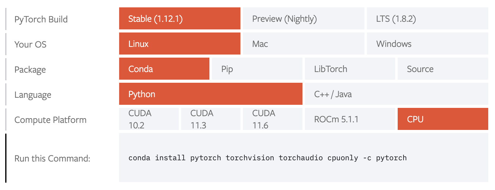
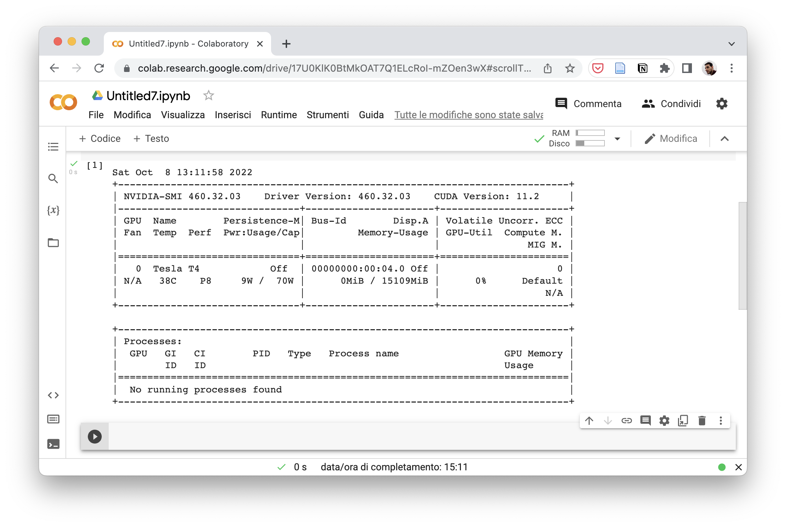

Queste note discutono come impostare l'ambiente di lavoro per i laboratori del corso nelle principali piattaforme.

## Installazione di Python
Nel corso, utilizzeremo il linguaggio Python. Scegliamo Python in quanto un linguaggio moderno, diffuso, multi-piattaforma, portabile, facile da usare ed elegante e dotato di una modalità interattiva. Questa ultima caratteristica risulterà molto utile per sperimentare con il codice e apprendere bene il funzionamento del linguaggio e delle librerie.

Python è un linguaggio fortemente modulare: alcune funzionalità di base sono incluse nel linguaggio, mentre molte altre sono fornite da pacchetti di terze parti, gestite mediante un vero e proprio gestore dei pacchetti chiamato `pip`. Per avere un ambiente di lavoro pronto per l'utilizzo in applicazioni che richiedono l'analisi dei dati, utilizzeremo una distribuzione chiamata [Anaconda](https://www.anaconda.com/). Va notato che in passato esistevano due branch di Python: il 2.x e il 3.x. Oggi il 2.x non è più utilizzato. La distribuzione di Anaconda utilizzata nel momento in cui si scrive installerà Python 3.9.

Scarichiamo la distribuzione per la nostra piattaforma dal seguente link: https://www.anaconda.com/products/distribution e installiamola. Una volta fatto ciò, dovremmo poter accedere a un terminale con l'accesso agli eseguibili messi a disposizione da Anaconda. In particolare:
 * Su windows, sarà disponbile il progamma "Anaconda Prompt";
 * Su MacOS e su Linux gli eseguibili dovrebbero già trovarsi nel path dell'utente e dunque dovrebbe essere sufficiente aprire un semplice terminale.

 Se anaconda è stato correttamente installato, apparirà l'indicazione `(base)` prima del prompt dei comandi, come mostrato di seguito:

 

 `(base)` indica l'`environment` (di default è l'environement di base) in cui stiamo operando. Anaconta infatti permette di definire e utilizzare diversi evironment indipendenti tra di loro in cui è possibile installare pacchetti diversi (anche in termini di versioni).

## Supporto per la GPU
Gli algoritmi di machine learning basati su reti neurali sono fortemente paralleli. In quanto tale, è consigliabile attivare il supporto per la GPU. PyTorch supporta le seguenti GPU al momento in cui si scrive:
* GPU NVIDIA compatibili con CUDA 10.2, 11.3, o 11.6;
* GPU AMD con supporto ROCm (solo su piattaforma Linux);
* GPU Apple M1 su sistemi MacOS.

Per verificare il supporto di PyTorch per le diverse GPU e piattaforme, è possibile andare su https://pytorch.org/get-started/locally/ e scorrere fino alla seguente interfaccia:



Alcune risorse utili:
 * É possibile installare i driver NVIDIA per Windows o Linux dal sito https://www.nvidia.it/Download/index.aspx?lang=it
 * Per maggiori informazioni sul supporto alle schede AMD, consultare: https://pytorch.org/blog/pytorch-for-amd-rocm-platform-now-available-as-python-package/
 * Informazioni sull'accelerazione GPU per Apple M1: https://towardsdatascience.com/installing-pytorch-on-apple-m1-chip-with-gpu-acceleration-3351dc44d67c
 

## Installazione di PyTorch

 Una volta installato Anaconda, possiamo installare PyTorch da https://pytorch.org/get-started/locally/

 Selezioniamo la build (es. "Stable"), il sistema operativo, il tipo di pacchetto (si consiglia "Conda" o "Pip"), il linguaggio (scegliamo "Python") e la compute platform (esempio "CUDA 10.2"). 
 
 
 
 La selezione ci suggerirà il comando da usare per installare il pacchetto. Ad esempio:

 `conda install pytorch torchvision torchaudio cpuonly -c pytorch`

 Questo comando va copiato e incollato nel terminale con accesso a conda. Seguire le istruzioni per procedere all'installazione del pacchetto e delle relative dipendenze.

 ## PyTorch Lightning
 Faremo grande uso di PyTorch Lightning. É possibile installarlo seguendo le istruzioni riportate qui: https://www.pytorchlightning.ai/

 In genere, mediante il seguente comando:

 `https://www.pytorchlightning.ai/`

 ## Programmare in Python
Con Anaconda verranno installati diversi strumenti. Tra questi:
* L’interprete python;
* La shell interattiva ipython;
* L’IDE Spyder;
* Jupyter Notebook.

### Interprete Python
L'interprete Python permette di eseguire un programma Python mediante un comando del genere:

`python programma.py`

Dove `programma.py` è il file di testo sorgente del programma. Alla prima esecuzione, Python compilerà il programma e genererà un file bytecode `programma.pyc`.

### Shell interattiva ipython
La shell interattiva è una versione più "evoluta" dell’interprete Python che permette di:

* Interpretare comandi;
* Eseguire programmi Python;
* Analizzare il contenuto delle variabili del workspace;

Possiamo lanciare la shell interattiva con il comando `ipytyon`:


### IDE
Un IDE generalmente integra una shell ipython e diversi strumenti per il debugging. É un ottimo strumento per progetti di medie o grandi dimensioni. Un ide molto usato per la programmazione in Python è [Visual Studio Code](https://code.visualstudio.com/).


### Notebook Jupyter
È possibile avviare jupyter mediante il comando:

`jupyter notebook`


Jupyter permette di creare (mediante interfaccia web) dei "notebook", ovvero degli archivi contenenti:
* Testo formattato;
* Il codice da eseguire;
* Le immagini ottenuti come risultati dell'esecuzione del codice.

Si tratta di uno strumento molto potente, in quanto permette di generare dei veri e propri report delle sperimentazioni.

### IDE vs Notebook
C'è da chiedersi quando sia utile usare uno degli strumenti rispetto agli altri.

Gli IDE sono ottimi per:
 * medi o grossi progetti, con diversi moduli e classi;
 * computazione interattiva (ad esempio elaborare un video in tempo reale).

I Notebook di Jupyter sono ottimi per:
 * documentare i processi di analisi dei dati
sperimentare nuove idee;
 * scrivere documentazione e tutorials.

 ## Google Colab
 In alternativa alla installazione di un ambiente di lavoro sul proprio computer, è possibile utilizzare un servizio gratuito messo a disposizione da Google chiamato "Colab": https://colab.research.google.com/

 Il servizio mette a disposizione dei notebook in Python (simili a quelli di Jupyter) con supporto GPU.

 

 Una volta creato un nuovo notebook, è possibile ottenere il supporto GPU cliccando sul menù "Runtime", poi "Cambia tipo di runtime", e infine selezionando "GPU" come acceleratore hardware e cliccando su "Salva".

 Si possono eseguire dei comandi shell dal notebook eseguendo una cella contenente il comando preceduto dal punto esclamativo `!`. Ad esempio, possiamo controllare che GPU ci è stata assegnata con il comando `nvidia-smi`:

 

 In maniera analoga, possiamo installare dei pacchetti mediante comandi del tipo:

 `!pip install pytorch_lightning`

### Risorse limitate
Google Colab è un ottimo strumento per sperimentare o fare piccoli esperimenti. Tuttavia, tenete a mente che le risorse sono limitate e l'accesso alla GPU potrebbe essere revocato dopo alcune ore di computazione o se il computer è inattivo per diverso tempo. Pertanto, potrebbe essere diffiile usarlo per progetti medio-grandi.

### Persistenza dei dati
 Ad ogni esecuzione di un notebook, Google Colab mette a disposizione uno spazio temporaneo su cui è possibile scrivere e dal quale è possibile leggere dei dati. Ogni volta che il notebook è chiuso e riaperto, lo spazio viene liberato e il contenuto eliminato. Se si vuole avere accesso a uno spazio persistente, è possibile montare una specifica cartella del proprio Google Drive eseguendo una cella con il seguente codice:

 ```python
from google.colab import drive
drive.mount('/content/drive/path/to/folder')
```

Dove `/path/to/folder` è il path alla cartella all'interno del drive.