In questo laboratorio vedremo un esempio di Web Scraping mediante la libreria `BeautifulSoup4`. In particolare, vedremo che il web scraping consiste in due fasi (che vengono in genere alternate):

 * Esplorare la struttura (DOM) del documento mediante un browser;
 * Scrivere il codice per scaricare le pagine da internet e decodificarle.
 
In questo laboratorio, mostreremo degli esempi di esplorazione DOM con Google Chrome, ma altri browsers (per esempio Mozilla Firefox) possono essere utilizzati in maniera simile.
 
Per prima cosa installiamo la libreria mediante il seguente comando: `pip install bs4`.

## 1 Analisi del DOM ed Estrazione Automatica
Consideriamo la seguente pagina web:https://www.thomann.de/it/ukulele_soprani.html e apriamola nel browser.

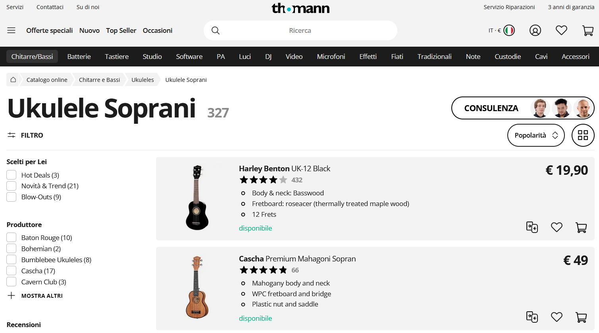

Si tratta di una pagina di un e-commerce che vende strumenti musicali. In particolare, la pagina mostra la lista degli 'ukulele soprani' in vendita sul sito. Notiamo che per ogni prodotto sono riportate diverse informazioni, quali ad esempio:
 * Il produttore dello strumento (es. 'Harley Benton');
 * Il modello dello strumento (es. 'UK-11 DW Brown');
 * L'immagine dello strumento;
 * Il prezzo (es. €17,90);
 * La disponibilità;
 * Il numero di recensioni (es. 422);
 * La votazione media ottenuta nelle recensioni (es. 4/5 stelle).
 
Notiamo inoltre, che la pagina mostra solo una parte dell'elenco (articoli 1-25 di 145) e che in fondo alla pagina sono disponibili dei link per passare alle pagine successive.

In questo laboratorio vedremo come costruire uno script che permette di navigare tra le pagine ed estrarre le informazioni elencate sopra in maniera automatica. Dato che il sito non espone una API, questo processo resta 'semi-manuale'. Sfrutteremo infatti il contenuto HTML. Va notato che, benché HTML è strutturato, esso non è stato pensato per permettere a delle macchine di comunicare tra loro (non è una API!), ma per permettere al browser di visualizzare delle pagine per l'utente finale. Pertanto le strutture HTML delle pagine sono in genere ambigue e poco standard. Per questo motivo sarà necessario esplorare manualmente il DOM caso per caso.

Iniziamo facendo click col tasto destro sulla parte della pagina che contiene l'item e facendo click su 'inspect'. Si aprirà un inspector sulla destra (o in basso). Uno degli elementi HTML verrà automaticamente evidenziato. Scorriamo la lista degli elementi HTML nell'inspector e facciamo click su di essi per vedere a quali elementi grafici essi corrispondono. Navigando nel DOM, dovremmo trovare un `div` contraddistinto da diverse classi, tra cui `extensible-article`.

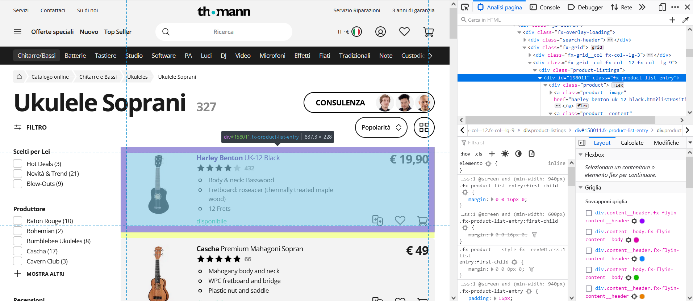

Se scorriamo la struttura del documento nell'inspector, notiamo che la pagina contiene una lista di elementi `div` di classe `fx-product-list-entry`. Ciascuno di questi div contiene a sua volta gli elementi relativi a ciascun prodotto. Per verificare la nostra intuizione, iniziamo ad analizzare la pagina html mediante BeautifulSoup. Per poterlo fare, dovremo prima scaricare il contenuto grezzo della pagina HTML mediante `urllib`:


```python
from urllib.request import urlopen as uRequest
uClient=uRequest("https://www.thomann.de/it/ukulele_soprani.html")
page_html = uClient.read()
print(type(page_html))
```

    <class 'bytes'>


La variabile `page_html` contiene il contenuto 'grezzo' della pagina. La pagina può essere molto lunga, quindi **è in genere sconsigliato provare a stamparla nella sua interezza con una print** (ciò può bloccare il programma). Visualizziamo i primi $1000$ caratteri:


```python
print(page_html[:1000])
```

    b'<!DOCTYPE HTML PUBLIC "-//W3C//DTD HTML 4.01 Transitional//EN"\n            "http://www.w3.org/TR/html4/loose.dtd">\n\n<html lang="it" class="no-js">\n<head>\n\n<link rel="preconnect" href="https://fonts.static-thomann.de" crossorigin>\n<link href="https://fonts.static-thomann.de/pics/fonts/open-sans.css?v=1" rel="stylesheet">\n\n<meta name="charset" content="utf-8">\n<meta http-equiv="Content-Type" content="text/html; charset=utf-8">\n<meta http-equiv="X-UA-Compatible" content="IE=edge">\n<title>Ukulele Soprani &ndash; Thomann Italia</title>\n\n<meta name="description" content="Pi&ugrave; di {numberOfArticlesInCategory} a partire da {minPrice} in stock - Sul nostro sito trovi sempre lo strumento adatto per te. Spese di spedizione gratuite, 30 giorni &quot;soddisfatto o rimborsato&quot; e 3 anni di garanzia. \nThomann - Il negozio di musica pi&ugrave; grande d\'Europa">\n\n<meta name="Language" content="it-IT">\n<meta name="Content-Language" content="it-IT">\n<meta name="viewport" content="width=device-wi'


Teoricamente, potremmo fare il parsing della pagina in maniera manuale. In pratica, dato che le pagine HTML hanno una struttura generale simile (sono tutte composte da tag organizzati in maniera gerarchica), esistono diverse librerie per semplificare la loro manipolazione. Importiamo BeautifulSoup e processiamo la pagina:


```python
from bs4 import BeautifulSoup as soup
page_soup = soup(page_html)
print(type(page_soup))
```

    <class 'bs4.BeautifulSoup'>


La variabile `page_soup` è adesso un oggetto di tipo `BeautifulSoup`. Tale oggetto ha a disposizione una serie di metodi che permettono di manipolare facilmente il documento, come vedremo a breve. Proviamo ad esempio a cercare tutti i `div` di classe `fx-product-list-entry` per vedere se la nostra intuizione è corretta:


```python
containers=page_soup.findAll('div',{'class':'fx-product-list-entry'})
print(type(containers))
```

    <class 'bs4.element.ResultSet'>


La chiamata a `findAll` ha restituito un oggetto di tipo `ResultSet`. Vediamo quanti elementi sono contenuti nel set:


```python
print(len(containers))
```

    25

<table class="question">
<tr>
<td></td>
<td>

**Domanda 1**

Sarebbe possibile ottenere lo stesso risultato ottenuto con `BeautifulSoup` con le espressioni regolari? Si pensi a una possibile espressione regolare da utilizzare in questo contesto. Quanto sarebbe più complesso rispetto a utilizzare la libreria come da esempio?

 </td>
</tr>
</table>


Dato che la pagina contiene esattamente $25$ prodotti, ciò conferma la nostra intuizione che le informazioni di ciascun prodotto sono contenute dentro i div di classe `fx-product-list-entry`. Per avere una ulteriore verifica, proviamo a visualizzare il contenuto del primo container:


```python
container=containers[0]
print(container)
```

    <div class="fx-product-list-entry">
    <div class="product">
    <a class="product__image" href="harley_benton_uk_12_black.htm?listPosition=0&amp;type=category">
    <picture class="fx-picture">
    <source data-srcset="https://thumbs.static-thomann.de/thumb//thumb220x220/pics/prod/257768.webp" srcset="" type="image/webp"> <source data-srcset="https://thumbs.static-thomann.de/thumb//thumb220x220/pics/prod/257768.jpg" srcset=""> 
    </source></source></picture>
    </a>
    <a class="product__content" href="harley_benton_uk_12_black.htm?listPosition=0&amp;type=category">
    <div class="product__details">
    <div class="product__title fx-text">
    <span class="title__manufacturer">Harley Benton</span>
    <span class="title__name">UK-12 Black</span>
    </div>
    <div class="product__meta-container">
    <div class="product__meta-line">
    <div class="product__rating-stars">
    <div class="fx-rating-stars">
    <div class="fx-rating-stars__stars">
    <svg class="fx-icon fx-icon-star-fill fx-rating-stars__icon product__rating-star">
    <use xlink:href="/static/icons/fxicons.svg?v=9822#star-fill"></use>
    </svg> <svg class="fx-icon fx-icon-star-fill fx-rating-stars__icon product__rating-star">
    <use xlink:href="/static/icons/fxicons.svg?v=9822#star-fill"></use>
    </svg> <svg class="fx-icon fx-icon-star-fill fx-rating-stars__icon product__rating-star">
    <use xlink:href="/static/icons/fxicons.svg?v=9822#star-fill"></use>
    </svg> <svg class="fx-icon fx-icon-star-fill fx-rating-stars__icon product__rating-star">
    <use xlink:href="/static/icons/fxicons.svg?v=9822#star-fill"></use>
    </svg> <svg class="fx-icon fx-icon-star-fill fx-rating-stars__icon product__rating-star">
    <use xlink:href="/static/icons/fxicons.svg?v=9822#star-fill"></use>
    </svg>
    <div class="fx-rating-stars__filler" style="width: 100%">
    <svg class="fx-icon fx-icon-star-fill fx-rating-stars__filler-icon product__rating-star">
    <use xlink:href="/static/icons/fxicons.svg?v=9822#star-fill"></use>
    </svg> <svg class="fx-icon fx-icon-star-fill fx-rating-stars__filler-icon product__rating-star">
    <use xlink:href="/static/icons/fxicons.svg?v=9822#star-fill"></use>
    </svg> <svg class="fx-icon fx-icon-star-fill fx-rating-stars__filler-icon product__rating-star">
    <use xlink:href="/static/icons/fxicons.svg?v=9822#star-fill"></use>
    </svg> <svg class="fx-icon fx-icon-star-fill fx-rating-stars__filler-icon product__rating-star">
    <use xlink:href="/static/icons/fxicons.svg?v=9822#star-fill"></use>
    </svg> <svg class="fx-icon fx-icon-star-fill fx-rating-stars__filler-icon product__rating-star">
    <use xlink:href="/static/icons/fxicons.svg?v=9822#star-fill"></use>
    </svg> </div>
    </div>
    <div class="fx-rating-stars__description">461</div>
    </div>
    </div>
    </div>
    </div>
    <div class="product__description">
    <ul class="fx-list">
    <li class="product__description-item fx-list__item fx-list__item--circle">Body &amp; neck: Basswood</li>
    <li class="product__description-item fx-list__item fx-list__item--circle">Fretboard: roseacer (thermally treated maple wood)</li>
    <li class="product__description-item fx-list__item fx-list__item--circle">12 Frets</li>
    </ul>
    </div>
    <div class="product__availability fx-availability fx-availability--in-stock">
                            disponibile
                        </div>
    </div>
    <div class="product__price">
    <div class="fx-price-group product__price-group">
    <span class="fx-typography-price-primary fx-price-group__primary product__price-primary">            € 19,90
        </span>
    </div>
    </div> </a>
    <div class="product__actions">
    <div class="action__compare js-action__compare" data-number="257768" data-reference-tracking="">
    <svg class="fx-icon fx-icon-compare compare-icon">
    <use xlink:href="/static/icons/fxicons.svg?v=9822#compare"></use>
    </svg> </div>
    <div class="action__wishlist js-action__wishlist" data-caid="" data-is-on-wishlist="" data-number="257768" data-reference-tracking="" data-wishlist-entry-id="" data-wishlist-url="">
    <svg class="fx-icon fx-icon-heart wishlist-icon fx-size--md-md-lg">
    <use xlink:href="/static/icons/fxicons.svg?v=9822#heart"></use>
    </svg> <svg class="fx-icon fx-icon-heart-filled wishlist-icon fx-size--md-md-lg fx-icon--active fx-icon--hidden">
    <use xlink:href="/static/icons/fxicons.svg?v=9822#heart-filled"></use>
    </svg> </div>
    <div class="action__basket js-action__basket" data-is-download="" data-is-voucher="" data-number="257768" data-reference-tracking="">
    <form action="" class="basket-form" method="post">
    <input name="ar" type="hidden" value="257768"/>
    <button class="basket-button" type="submit">
    <svg class="fx-icon fx-icon-cart basket-icon">
    <use xlink:href="/static/icons/fxicons.svg?v=9822#cart"></use>
    </svg> </button>
    </form>
    </div>
    </div>
    </div>
    </div>


```python
type(container)
```


    bs4.element.Tag


Se guardiamo attentamente, vedremo del testo compatibile con gli elementi disponibili per ogni prodotto. Ad esempio, possiamo scorgere un `Aggiungi al carrello`, un `Harley Benton` e un `€17,90`. Possiamo procedere analizzando ricorsivamente il contenuto di ciascun container per estrarre le informazioni che ci servono.

Cerchiamo di estrarre adesso il manufacturer (`Harley Benton`, nel caso del primo container). Se ispezioniamo il DOM con il browser (click con il tasto destro sul manufacturer e click su inspect), notiamo che esso è contenuto in uno span di classe `title__manufacturer`.

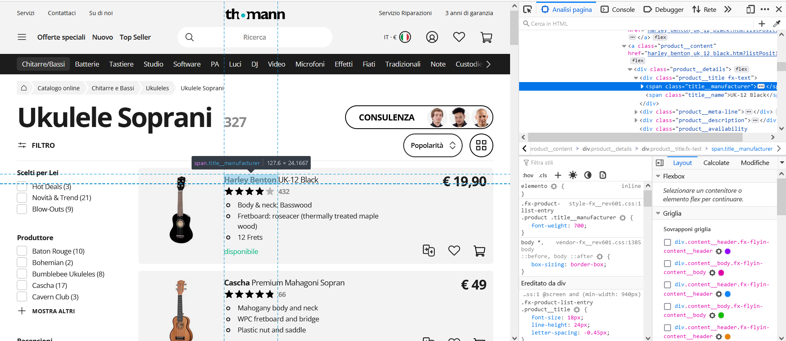

Proviamo ad analizzare il primo container per vedere se contiene uno span di quella classe:


```python
container.findAll('span',{'class':'title__manufacturer'})
```


    [<span class="title__manufacturer">Harley Benton</span>]


```python
container.findAll('span',{'class':'title__manufacturer'})[0].text
```


    'Harley Benton'


Abbiamo trovato il manufacturer! Il comando findAll, ci restituisce però una lista di oggetti (uno solo in questo caso). Possiamo accedere al testo contenuto nell'oggetto come segue:


```python
manufacturer = container.findAll('span',{'class':'title__manufacturer'})[0].text
print(manufacturer)
```

    Harley Benton


Allo stesso modo, ispezionando il DOM, notiamo che il nome del modello è contenuto in uno span di classe `title__name`:

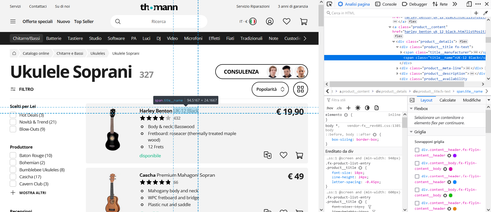

Estraiamo il modello dal container come segue:


```python
model = container.findAll('span',{'class':'title__name'})[0].text
print(model)
```

    UK-12 Black


Similmente notiamo che le immagini dei prodotti si trovano in un `div` di classe `product-image`:


```python
container.findAll('a',{'class':'product__image'})
```


    [<a class="product__image" href="harley_benton_uk_12_black.htm?listPosition=0&amp;type=category">
     <picture class="fx-picture">
     <source data-srcset="https://thumbs.static-thomann.de/thumb//thumb220x220/pics/prod/257768.webp" srcset="" type="image/webp"> <source data-srcset="https://thumbs.static-thomann.de/thumb//thumb220x220/pics/prod/257768.jpg" srcset=""> 
     </source></source></picture>
     </a>]


Notiamo che l'immagine si trova dentro il tag `img` all'interno di `picture`, `source` e nuovamente `source`. Possiamo accedere come segue:


```python
container.findAll('a',{'class':'product__image'})[0].picture.source.source
```


    <source data-srcset="https://thumbs.static-thomann.de/thumb//thumb220x220/pics/prod/257768.jpg" srcset=""> 
    </source>


La URL della immagine, si trova nell'attributo `data-srcset`, al quale possiamo accedere come segue:


```python
img_url = container.findAll('a',{'class':'product__image'})[0].picture.source.source['data-srcset']
print(img_url)
```

    https://thumbs.static-thomann.de/thumb//thumb220x220/pics/prod/257768.jpg


Possiamo verificare che l'immagine sia corretta inserendo la URL nel browser, o caricandola mediante IPython:


```python
import IPython
IPython.display.Image(img_url)
```


    

    


In maniera simile (analizzando il DOM manualmente e controllando) possiamo estrarre il prezzo:


```python
price = container.findAll('span',{'class':'product__price-primary'})[0].text
print(price)
```

                € 19,90
        


Convertiamo la stringa in un numero rimuovendo il simbolo dell'euro e sostituendo la virgola con un punto:


```python
price = float(price.replace('€','').replace(',','.'))
print(price)
```

    19.9


<table class="question">
<tr>
<td></td>
<td>

**Domanda 2**

Sarebbe possibile ottenere lo stesso risultato senza rimuovere esplicitamente il simbolo dell'euro e utilizzando invece le espressioni regolari? Che espressione regolare servirebbe in questo caso?

 </td>
</tr>
</table>


In maniera del tutto analoga otteniamo il numero di revisioni e la disponibilità:


```python
review_count = int(container.findAll('div',{'class':'fx-rating-stars__description'})[0].text)
availability = container.findAll('div',{'class':'product__availability'})[0].text.strip()
print(review_count, availability)
```

    461 disponibile


Estrarre il rating del prodotto è un po' meno immediato, in quanto esso non è riportato direttamente in termini numerici, ma solo mostrato mediante le stelline. Per ottenere l'informazione relativa al rating, dobbiamo quandi analizzare il CSS usato per mostrare il numero corretto di stelle. Ispezionando gli elementi grafici relativi alle stelline, scopriamo che il numero corretto di stelle viene mostrato mediante un overlay:

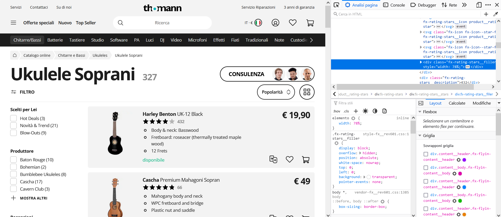

La quantità di stelline da mostrare è specificata mediante la larghezza dell'overlay, espressa in percentuale `width: 83.971%`. Per ottenere il rating, dobbiamo dunque isolare questo numero. Iniziamo cercando i div di classe `fx-rating-stars__filler`:


```python
container.findAll('div',{'class':'fx-rating-stars__filler'})
```


    [<div class="fx-rating-stars__filler" style="width: 100%">
     <svg class="fx-icon fx-icon-star-fill fx-rating-stars__filler-icon product__rating-star">
     <use xlink:href="/static/icons/fxicons.svg?v=9822#star-fill"></use>
     </svg> <svg class="fx-icon fx-icon-star-fill fx-rating-stars__filler-icon product__rating-star">
     <use xlink:href="/static/icons/fxicons.svg?v=9822#star-fill"></use>
     </svg> <svg class="fx-icon fx-icon-star-fill fx-rating-stars__filler-icon product__rating-star">
     <use xlink:href="/static/icons/fxicons.svg?v=9822#star-fill"></use>
     </svg> <svg class="fx-icon fx-icon-star-fill fx-rating-stars__filler-icon product__rating-star">
     <use xlink:href="/static/icons/fxicons.svg?v=9822#star-fill"></use>
     </svg> <svg class="fx-icon fx-icon-star-fill fx-rating-stars__filler-icon product__rating-star">
     <use xlink:href="/static/icons/fxicons.svg?v=9822#star-fill"></use>
     </svg> </div>]


Abbiamo una serie di `div` annidati. Siamo interessati allo stile di quello più esterno:


```python
rating = container.findAll('div',{'class':'fx-rating-stars__filler'})[0]['style']
print(rating)
```

    width: 100%


```python
rating.replace('width: ','').replace('%','')
```


    '80'


Possiamo isolare il numero mediante una espressione regolare:


```python
import re
re.search('[0-9]+(\.[0-9]+)?', rating).group()
```


    '80'


<table class="question">
<tr>
<td></td>
<td>

**Domanda 3**

E' possibile ottenere lo stesso risultato senza usare le espressioni regolari? Come?

 </td>
</tr>
</table>


Per cui scriviamo:


```python
rating = float(re.search('[0-9]+(\.[0-9]+)?', rating).group())
print(rating)
```

    80.0


Possiamo automatizzare l'estrazione di queste informazioni in tutta la pagina mediante un ciclo for:


```python
def scrape_page(page_url, _records = None):
    if _records is None:
        _records = []
    page_html=uRequest(page_url).read()
    page_soup=soup(page_html)
    containers=page_soup.findAll('div',{'class':'fx-product-list-entry'})
    for container in containers:
        manufacturer = container.findAll('span',{'class':'title__manufacturer'})[0].text
        model = container.findAll('span',{'class':'title__name'})[0].text
        img_url = container.findAll('a',{'class':'product__image'})[0].picture.source.source['data-srcset']	
        price = container.findAll('span',{'class':'product__price-primary'})[0].text
        price = float(price.replace('€','').replace(',','.'))
        try:
            review_count = int(container.findAll('div',{'class':'fx-rating-stars__description'})[0].text)
        except:
            review_count = 0
        availability = container.findAll('div',{'class':'product__availability'})[0].text.strip()
        try:
            rating = container.findAll('div',{'class':'fx-rating-stars__filler'})[0]['style']
            rating = float(re.search('[0-9]+(\.[0-9]+)?', rating).group())
        except:
            rating=0
        _records.append([manufacturer, model, img_url, price, review_count, availability, rating])
    return _records
```

Adesso facciamo scraping della pagina e inseriamo il risultato in un DataFrame:


```python
import pandas as pd
page_url = 'https://www.thomann.de/it/ukulele_soprani.html'
records = scrape_page(page_url)
data = pd.DataFrame(records, columns=['manufacturer','model','img_url','price','review_count','availability','rating'])
```

Visualizziamo le prime righe del DataFrame:


```python
print(data.info())
data.head()
```

    <class 'pandas.core.frame.DataFrame'>
    RangeIndex: 25 entries, 0 to 24
    Data columns (total 7 columns):
     #   Column        Non-Null Count  Dtype  
    ---  ------        --------------  -----  
     0   manufacturer  25 non-null     object 
     1   model         25 non-null     object 
     2   img_url       25 non-null     object 
     3   price         25 non-null     float64
     4   review_count  25 non-null     int64  
     5   availability  25 non-null     object 
     6   rating        25 non-null     float64
    dtypes: float64(2), int64(1), object(4)
    memory usage: 1.5+ KB
    None


<div>
<style scoped>
    .dataframe tbody tr th:only-of-type {
        vertical-align: middle;
    }

    .dataframe tbody tr th {
        vertical-align: top;
    }

    .dataframe thead th {
        text-align: right;
    }
</style>
<table border="1" class="dataframe">
  <thead>
    <tr style="text-align: right;">
      <th></th>
      <th>manufacturer</th>
      <th>model</th>
      <th>img_url</th>
      <th>price</th>
      <th>review_count</th>
      <th>availability</th>
      <th>rating</th>
    </tr>
  </thead>
  <tbody>
    <tr>
      <th>0</th>
      <td>Harley Benton</td>
      <td>UK-12 Black</td>
      <td>https://thumbs.static-thomann.de/thumb//thumb2...</td>
      <td>19.9</td>
      <td>461</td>
      <td>disponibile</td>
      <td>80.0</td>
    </tr>
    <tr>
      <th>1</th>
      <td>Harley Benton</td>
      <td>Ukulele UK-11DW Brown</td>
      <td>https://thumbs.static-thomann.de/thumb//thumb2...</td>
      <td>18.9</td>
      <td>745</td>
      <td>disponibile</td>
      <td>84.0</td>
    </tr>
    <tr>
      <th>2</th>
      <td>Harley Benton</td>
      <td>DOTU UKE-S Pirate Skull</td>
      <td>https://thumbs.static-thomann.de/thumb//thumb2...</td>
      <td>24.9</td>
      <td>10</td>
      <td>disponibile</td>
      <td>98.0</td>
    </tr>
    <tr>
      <th>3</th>
      <td>Harley Benton</td>
      <td>Hawaii Koa Soprano Ukulele</td>
      <td>https://thumbs.static-thomann.de/thumb//thumb2...</td>
      <td>89.0</td>
      <td>16</td>
      <td>disponibile</td>
      <td>92.0</td>
    </tr>
    <tr>
      <th>4</th>
      <td>Harley Benton</td>
      <td>UK-12 Soprano Ukulele Blue</td>
      <td>https://thumbs.static-thomann.de/thumb//thumb2...</td>
      <td>19.9</td>
      <td>172</td>
      <td>disponibile</td>
      <td>78.0</td>
    </tr>
  </tbody>
</table>
</div>


Il DataFrame contiene $25$ righe relative ai $25$ oggetti presenti nella pagina.

## 2.1 Download delle Immagini
Abbiamo conservato le URL alle immagini nel DataFrame. Tuttavia, vista la natura dinamica dei siti web, queste potrebbero cambiare URL ed essere in futuro irraggiungibili. E' quindi in genere una buona idea scaricare anche questo tipo di dato e inserirlo in una cartella apposita. Iniziamo creando una cartella `thumann_img`:


```python
import os
dest_dir = 'thomann_img'
os.makedirs(dest_dir, exist_ok=True)
```

Adesso dobbiamo scaricare ogni immagine e conservarla con un nome di file univoco. Per evitare che immagini diverse abbiano lo stesso nome, derivereremo il nome del file dall'id del DataFrame. Vediamo un esempio di download e salvataggio dell'immagine nel caso in una riga del dataframe:


```python
row = data.iloc[0]
row
```


    manufacturer                                        Harley Benton
    model                                                 UK-12 Black
    img_url         https://thumbs.static-thomann.de/thumb//thumb2...
    price                                                        19.9
    review_count                                                  461
    availability                                          disponibile
    rating                                                       80.0
    Name: 0, dtype: object


Deriveremo il nome dell'immagine dall'id della riga (contenuta in `name`) secondo il seguente formato:


```python
fname = "img_{id:05d}.{ext:s}"
```

Dove `id` indica l'id della riga, mentre `ext` è l'estensione. Per ottenere l'estensione corretta, recuperiamo quella contenuta nell URL mediante una espressione regolare:


```python
ext = re.search('[^.]+$',row['img_url']).group()
ext
```


    'jpg'


Il nome del file di destinazione diventa dunque:


```python
fname.format(id=int(row.name),ext=ext)
```


    'img_00000.jpg'


Il percorso completo del file di destinazione possiamo ottenerlo concatenando il path della cartella e il nome del file mediante la funzione `join` di `os.dir`:


```python
from os.path import join
fullpath = join(dest_dir,fname.format(id=int(row.name),ext=ext))
fullpath
```


    'thomann_img/img_00000.jpg'


Possiamo dunque scaricare il file mediante `urllib` come segue:


```python
from urllib.request import urlretrieve as retrieve
retrieve(row['img_url'], fullpath)
```


    ('thomann_img/img_00000.jpg', <http.client.HTTPMessage at 0x7fb0529486a0>)


Proviamo a caricare l'immagine con `PIL` per controllare che sia stata correttamente salvata su disco:


```python
from PIL import Image
Image.open(fullpath)
```


    
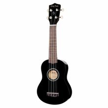
    


Scriviamo adesso una funzione per automatizzare il download delle immagini. Per poter tenere traccia delle immagini che salviamo sul disco, inseriremo un nuovo campo `img_path` al DataFrame.


```python
def download_images(data, dest_dir, fname="img_{id:05d}.{ext:s}"):
    data=data.copy() #preserva il dataframe originale
    img_paths= []
    data['img_path']=None #crea una nuova colonna
    for i, row in data.iterrows():
        ext = re.search('[^.]+$',row['img_url']).group()
        fullpath = join(dest_dir,fname.format(id=int(row.name),ext=ext))
        retrieve(row['img_url'], fullpath)
        img_paths.append(fullpath)
        
    data['img_path']=img_paths
    return data
```

Utilizziamo la funzione per scaricare le immagini:


```python
data2 = download_images(data, 'thomann_img')
```

Visualizziamo le prime righe del nuovo DataFrame:


```python
data2.head()
```


<div>
<style scoped>
    .dataframe tbody tr th:only-of-type {
        vertical-align: middle;
    }

    .dataframe tbody tr th {
        vertical-align: top;
    }

    .dataframe thead th {
        text-align: right;
    }
</style>
<table border="1" class="dataframe">
  <thead>
    <tr style="text-align: right;">
      <th></th>
      <th>manufacturer</th>
      <th>model</th>
      <th>img_url</th>
      <th>price</th>
      <th>review_count</th>
      <th>availability</th>
      <th>rating</th>
      <th>img_path</th>
    </tr>
  </thead>
  <tbody>
    <tr>
      <th>0</th>
      <td>Harley Benton</td>
      <td>UK-12 Black</td>
      <td>https://thumbs.static-thomann.de/thumb//thumb2...</td>
      <td>19.9</td>
      <td>461</td>
      <td>disponibile</td>
      <td>80.0</td>
      <td>thomann_img/img_00000.jpg</td>
    </tr>
    <tr>
      <th>1</th>
      <td>Harley Benton</td>
      <td>Ukulele UK-11DW Brown</td>
      <td>https://thumbs.static-thomann.de/thumb//thumb2...</td>
      <td>18.9</td>
      <td>745</td>
      <td>disponibile</td>
      <td>84.0</td>
      <td>thomann_img/img_00001.jpg</td>
    </tr>
    <tr>
      <th>2</th>
      <td>Harley Benton</td>
      <td>DOTU UKE-S Pirate Skull</td>
      <td>https://thumbs.static-thomann.de/thumb//thumb2...</td>
      <td>24.9</td>
      <td>10</td>
      <td>disponibile</td>
      <td>98.0</td>
      <td>thomann_img/img_00002.jpg</td>
    </tr>
    <tr>
      <th>3</th>
      <td>Harley Benton</td>
      <td>Hawaii Koa Soprano Ukulele</td>
      <td>https://thumbs.static-thomann.de/thumb//thumb2...</td>
      <td>89.0</td>
      <td>16</td>
      <td>disponibile</td>
      <td>92.0</td>
      <td>thomann_img/img_00003.jpg</td>
    </tr>
    <tr>
      <th>4</th>
      <td>Harley Benton</td>
      <td>UK-12 Soprano Ukulele Blue</td>
      <td>https://thumbs.static-thomann.de/thumb//thumb2...</td>
      <td>19.9</td>
      <td>172</td>
      <td>disponibile</td>
      <td>78.0</td>
      <td>thomann_img/img_00004.jpg</td>
    </tr>
  </tbody>
</table>
</div>


Controlliamo il numero di immagini in `thomann_img`:


```python
from glob import glob
len(glob('thomann_img/*'))
```


    25


## 2. Navigare Tra le Pagine

Abbiamo visto che la lista dei prodotti si estende su più pagine. Vediamo adesso come navigare tra le pagine per raccogliere le informazioni su tutti i prodotti. Andiamo in fondo alla lista e clicchiamo su uno dei pulsanti per aprire le pagine. Ci accorgiamo che il formato dei link delle pagine è il seguente:

`/it/ukulele_soprani.html?ls=25&pg=1`

Notiamo inoltre, che andando a una pagina non esistente (es. https://www.thomann.de/it/ukulele_soprani.html?ls=25&pg=1000), viene visualizzata una pagina vuota.

Sfrutteremo queste due caratteristiche per navigare tra le pagine.

Dato un numero di pagina, possiamo trovare il link relativo con il formato:


```python
p=1
f"https://www.thomann.de/it/ukulele_soprani.html?pg={p:d}&ls=25"
```


    'https://www.thomann.de/it/ukulele_soprani.html?pg=1&ls=25'


Per rendere il codice indipendente rispetto a pagina e dominio, estraiamo il nome della pagina "https://www.thomann.de/it/ukulele_soprani.html" dalla url della prima pagina mediante espressione regolare:


```python
base_url = re.search('http(s)?://[^/]*/[^?]*',page_url).group(0)
print(base_url)
```

    https://www.thomann.de/it/ukulele_soprani.html


Riscriviamo dunque il formato come segue:


```python
p=1
f"{base_url}?pg={p:d}&ls=25"
```


    'https://www.thomann.de/it/ukulele_soprani.html?pg=1&ls=25'


Preleviamo dunque gli indici della prima (esclusa la corrente) e ultima pagina dalla lista dei link:

Rivediamo lo script precedente per automatizzare la navigazione tra le pagine e lo scraping:


```python
def navigate_and_scrape(base_url, records = None):
    if records is None:
        records = []
    
    all_records = records
    page = 1 #iniziamo dalla pagina 1
    while(True):
        url = f"{base_url}?pg={page:d}&ls=25"
        records = scrape_page(url)
        all_records.extend(records)
        if len(records)==0: #usciamo quando la pagina non contiene più record
            break
        page+=1
    
    return all_records
```

Utilizziamo la funzione per effettuare lo scraping:


```python
records = navigate_and_scrape(page_url)
data = pd.DataFrame(records, columns=['manufacturer','model','img_url','price','review_count','availability','rating'])
```

Visualizziamo alcune informazioni sul DataFrame:


```python
print(data.info())
data.head()
```

    <class 'pandas.core.frame.DataFrame'>
    RangeIndex: 206 entries, 0 to 205
    Data columns (total 7 columns):
     #   Column        Non-Null Count  Dtype  
    ---  ------        --------------  -----  
     0   manufacturer  206 non-null    object 
     1   model         206 non-null    object 
     2   img_url       206 non-null    object 
     3   price         206 non-null    float64
     4   review_count  206 non-null    int64  
     5   availability  206 non-null    object 
     6   rating        206 non-null    float64
    dtypes: float64(2), int64(1), object(4)
    memory usage: 11.4+ KB
    None


<div>
<style scoped>
    .dataframe tbody tr th:only-of-type {
        vertical-align: middle;
    }

    .dataframe tbody tr th {
        vertical-align: top;
    }

    .dataframe thead th {
        text-align: right;
    }
</style>
<table border="1" class="dataframe">
  <thead>
    <tr style="text-align: right;">
      <th></th>
      <th>manufacturer</th>
      <th>model</th>
      <th>img_url</th>
      <th>price</th>
      <th>review_count</th>
      <th>availability</th>
      <th>rating</th>
    </tr>
  </thead>
  <tbody>
    <tr>
      <th>0</th>
      <td>Harley Benton</td>
      <td>UK-12 Black</td>
      <td>https://thumbs.static-thomann.de/thumb//thumb2...</td>
      <td>19.9</td>
      <td>461</td>
      <td>disponibile</td>
      <td>80.0</td>
    </tr>
    <tr>
      <th>1</th>
      <td>Harley Benton</td>
      <td>Ukulele UK-11DW Brown</td>
      <td>https://thumbs.static-thomann.de/thumb//thumb2...</td>
      <td>18.9</td>
      <td>745</td>
      <td>disponibile</td>
      <td>84.0</td>
    </tr>
    <tr>
      <th>2</th>
      <td>Harley Benton</td>
      <td>DOTU UKE-S Pirate Skull</td>
      <td>https://thumbs.static-thomann.de/thumb//thumb2...</td>
      <td>24.9</td>
      <td>10</td>
      <td>disponibile</td>
      <td>98.0</td>
    </tr>
    <tr>
      <th>3</th>
      <td>Harley Benton</td>
      <td>Hawaii Koa Soprano Ukulele</td>
      <td>https://thumbs.static-thomann.de/thumb//thumb2...</td>
      <td>89.0</td>
      <td>16</td>
      <td>disponibile</td>
      <td>92.0</td>
    </tr>
    <tr>
      <th>4</th>
      <td>Harley Benton</td>
      <td>UK-12 Soprano Ukulele Blue</td>
      <td>https://thumbs.static-thomann.de/thumb//thumb2...</td>
      <td>19.9</td>
      <td>172</td>
      <td>disponibile</td>
      <td>78.0</td>
    </tr>
  </tbody>
</table>
</div>


## 2.1 Navigazione tra le Pagine dei Prodotti
Vediamo adesso come usare la navigazione automatica tra le pagine per fare scraping di altri prodotti, oltre a quelli contenuti nella pagina analizzata finora. Osservando la barra di navigazione in alto, notiamo che la pagina che abbiamo analizzato finora è accedibile da una pagina "ukulele":

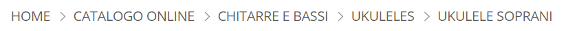

Cliccando su "ukuleles", accediamo alla pagina `https://www.thomann.de/it/ukuleles.html`, che contiene link a diverse altre pagine contenenti le liste di prodotti appartenenti a certe sotto-categorie. Tra queste scorgiamo la pagina "Ukulele Soprani" analizzata in precedenza.

Analizzando il DOM, scropiamo che i vari prodotti sono contenuti all'interno di un elenco puntato dentro un div di classe `fx-category-grid`:

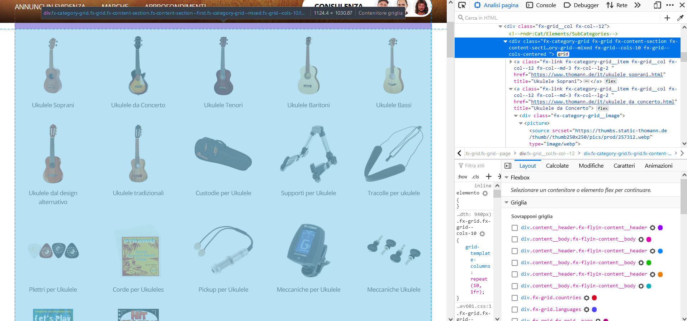

Carichiamo la pagina e accediamo a tutti i link che si trovani nel div `fx-category-grid`:


```python
page_html = uRequest('https://www.thomann.de/it/ukuleles.html').read()
page_soup = soup(page_html)
page_links = [x['href'] for x in page_soup.findAll('div', {'class':'fx-category-grid'})[0].findAll('a')]
page_links
```


    ['https://www.thomann.de/it/ukulele_soprani.html',
     'https://www.thomann.de/it/ukulele_da_concerto.html',
     'https://www.thomann.de/it/ukulele_tenori.html',
     'https://www.thomann.de/it/ukulele_baritoni.html',
     'https://www.thomann.de/it/ukulele_bassi.html',
     'https://www.thomann.de/it/ukulele_design_alternativo.html',
     'https://www.thomann.de/it/ukulele_tradizionali1.html',
     'https://www.thomann.de/it/custodie_per_ukulele.html',
     'https://www.thomann.de/it/supporti_per_ukulele.html',
     'https://www.thomann.de/it/tracolle-per-ukulele.html',
     'https://www.thomann.de/it/plettri_per_ukulele.html',
     'https://www.thomann.de/it/corde-per-ukuleles.html',
     'https://www.thomann.de/it/pickup_per_ukulele.html',
     'https://www.thomann.de/it/meccaniche_per_ukulele.html',
     'https://www.thomann.de/it/meccaniche-ukulele.html',
     'https://www.thomann.de/it/corso_di_ukulele1.html',
     'https://www.thomann.de/it/libri_canzoni_per_ukulele2.html']


Analogamente, possiamo ottenere il testo di ogni link (ovvero il nome della categoria del prodotto) come segue:


```python
categories = [x.text.replace('\n','').strip() for x in page_soup.findAll('div', {'class':'fx-category-grid'})[0].findAll('a')]
categories
```


    ['Ukulele Soprani',
     'Ukulele da Concerto',
     'Ukulele Tenori',
     'Ukulele Baritoni',
     'Ukulele Bassi',
     'Ukulele dal design alternativo',
     'Ukulele tradizionali',
     'Custodie per Ukulele',
     'Supporti per Ukulele',
     'Tracolle per ukulele',
     'Plettri per Ukulele',
     'Corde per Ukuleles',
     'Pickup per Ukulele',
     'Meccaniche per Ukulele',
     'Meccaniche Ukulele',
     'Corso di Ukulele',
     'Spartiti per Ukulele']


Utilizzando le funzioni scritte in precedenza, possiamo dunque automatizzare lo scraping di tutti i prodotti come segue:


```python
records = []
cats = [] #memorizziamo le categorie di ogni record in una lista
for category, link in zip(categories, page_links):
    len_before = len(records)
    records = navigate_and_scrape(link, records)
    num_records = len(records)-len_before
    cats+=[category]*num_records #gli ultimi num_records sono di questa categoria
data = pd.DataFrame(records, columns=['manufacturer','model','img_url','price','review_count','availability','rating'])
data['category'] = cats #aggiungiamo le categorie
```

Visualizziamo alcuni dati relativi al DataFrame ottenuto:


```python
print(data.info())
data.head()
```

    <class 'pandas.core.frame.DataFrame'>
    RangeIndex: 1210 entries, 0 to 1209
    Data columns (total 8 columns):
     #   Column        Non-Null Count  Dtype  
    ---  ------        --------------  -----  
     0   manufacturer  1210 non-null   object 
     1   model         1210 non-null   object 
     2   img_url       1210 non-null   object 
     3   price         1210 non-null   float64
     4   review_count  1210 non-null   int64  
     5   availability  1210 non-null   object 
     6   rating        1210 non-null   float64
     7   category      1210 non-null   object 
    dtypes: float64(2), int64(1), object(5)
    memory usage: 75.8+ KB
    None


<div>
<style scoped>
    .dataframe tbody tr th:only-of-type {
        vertical-align: middle;
    }

    .dataframe tbody tr th {
        vertical-align: top;
    }

    .dataframe thead th {
        text-align: right;
    }
</style>
<table border="1" class="dataframe">
  <thead>
    <tr style="text-align: right;">
      <th></th>
      <th>manufacturer</th>
      <th>model</th>
      <th>img_url</th>
      <th>price</th>
      <th>review_count</th>
      <th>availability</th>
      <th>rating</th>
      <th>category</th>
    </tr>
  </thead>
  <tbody>
    <tr>
      <th>0</th>
      <td>Harley Benton</td>
      <td>UK-12 Black</td>
      <td>https://thumbs.static-thomann.de/thumb//thumb2...</td>
      <td>19.9</td>
      <td>461</td>
      <td>disponibile</td>
      <td>80.0</td>
      <td>Ukulele Soprani</td>
    </tr>
    <tr>
      <th>1</th>
      <td>Harley Benton</td>
      <td>Ukulele UK-11DW Brown</td>
      <td>https://thumbs.static-thomann.de/thumb//thumb2...</td>
      <td>18.9</td>
      <td>745</td>
      <td>disponibile</td>
      <td>84.0</td>
      <td>Ukulele Soprani</td>
    </tr>
    <tr>
      <th>2</th>
      <td>Harley Benton</td>
      <td>DOTU UKE-S Pirate Skull</td>
      <td>https://thumbs.static-thomann.de/thumb//thumb2...</td>
      <td>24.9</td>
      <td>10</td>
      <td>disponibile</td>
      <td>98.0</td>
      <td>Ukulele Soprani</td>
    </tr>
    <tr>
      <th>3</th>
      <td>Harley Benton</td>
      <td>Hawaii Koa Soprano Ukulele</td>
      <td>https://thumbs.static-thomann.de/thumb//thumb2...</td>
      <td>89.0</td>
      <td>16</td>
      <td>disponibile</td>
      <td>92.0</td>
      <td>Ukulele Soprani</td>
    </tr>
    <tr>
      <th>4</th>
      <td>Harley Benton</td>
      <td>UK-12 Soprano Ukulele Blue</td>
      <td>https://thumbs.static-thomann.de/thumb//thumb2...</td>
      <td>19.9</td>
      <td>172</td>
      <td>disponibile</td>
      <td>78.0</td>
      <td>Ukulele Soprani</td>
    </tr>
  </tbody>
</table>
</div>


In poco tempo, siamo riusciti ad estrarre record diversi oggetti.

## 3. Analisi dei Dati Ottenuti

Vediamo adesso di analizzare in breve i dati ottenuti per capire qualcosa di più sui prodotti venduti dallo store. Iniziamo con delle semplici statistiche sulle variabili quantitative, che possono essere ottenute mediante il metodo `describe` dei DataFrame:


```python
data.describe()
```


<div>
<style scoped>
    .dataframe tbody tr th:only-of-type {
        vertical-align: middle;
    }

    .dataframe tbody tr th {
        vertical-align: top;
    }

    .dataframe thead th {
        text-align: right;
    }
</style>
<table border="1" class="dataframe">
  <thead>
    <tr style="text-align: right;">
      <th></th>
      <th>price</th>
      <th>review_count</th>
      <th>rating</th>
    </tr>
  </thead>
  <tbody>
    <tr>
      <th>count</th>
      <td>1210.000000</td>
      <td>1210.000000</td>
      <td>1210.000000</td>
    </tr>
    <tr>
      <th>mean</th>
      <td>117.397620</td>
      <td>30.933058</td>
      <td>66.072727</td>
    </tr>
    <tr>
      <th>std</th>
      <td>158.406797</td>
      <td>238.981080</td>
      <td>40.938793</td>
    </tr>
    <tr>
      <th>min</th>
      <td>0.990000</td>
      <td>0.000000</td>
      <td>0.000000</td>
    </tr>
    <tr>
      <th>25%</th>
      <td>19.900000</td>
      <td>0.000000</td>
      <td>0.000000</td>
    </tr>
    <tr>
      <th>50%</th>
      <td>49.000000</td>
      <td>3.000000</td>
      <td>88.000000</td>
    </tr>
    <tr>
      <th>75%</th>
      <td>149.000000</td>
      <td>12.000000</td>
      <td>96.000000</td>
    </tr>
    <tr>
      <th>max</th>
      <td>999.000000</td>
      <td>6892.000000</td>
      <td>100.000000</td>
    </tr>
  </tbody>
</table>
</div>


Vediamo adesso quanti prodotti sono contenuti in ciascuna categoria:


```python
from matplotlib import pyplot as plt
plt.figure(figsize=(8,8))
data.groupby('category')['category'].count().plot.pie(rotatelabels=True)
plt.show()
```


    
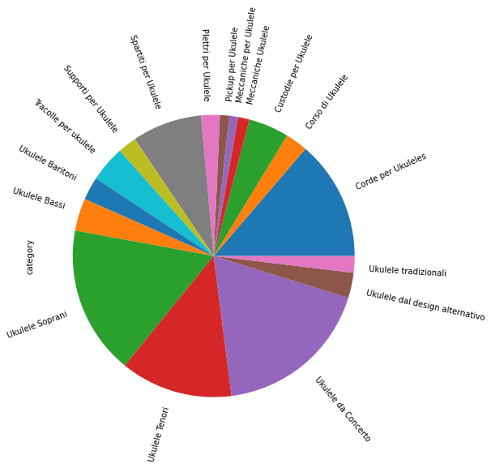
    


Notiamo che le categorie che contengono più oggetti sono quelle relative agli ukulele da concerto, tenori e soprani. Calcoliamo e visualizziamo adesso il prezzo medio per categoria. Questa volta però utilizziamo un grafico a barre:


```python
plt.figure(figsize=(12,6))
data.groupby('category')['price'].mean().plot.bar()
plt.grid()
plt.show()
```


    
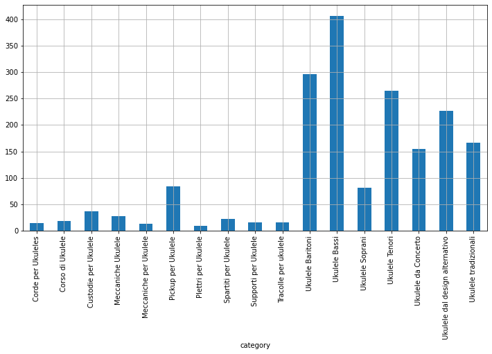
    


Gli oggetti più costosi in media sono gli "Ukulele Bassi" e gli "Ukulele dal design alternativo". Cerchiamo di capire adesso quali sono gli oggetti più popolari. Inizieremo visualizzando il numero di review presenti in ogni categoria:


```python
plt.figure(figsize=(12,6))
data.groupby('category')['review_count'].sum().plot.bar()
plt.grid()
plt.show()
```


    
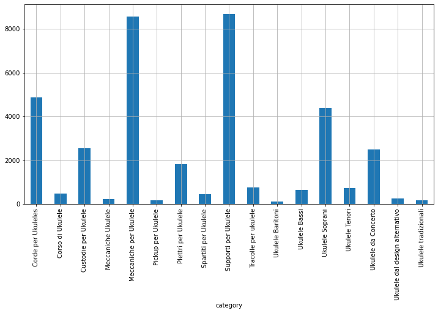
    
<table class="question">
<tr>
<td></td>
<td>

**Domanda 4**

Confrontando l'ultimo grafico con il precedente, sembra esserci una correlazione tra il numero di review e il prezzo degli oggetti? Come la si potrebbe spiegare?

 </td>
</tr>
</table>


Pare che gli oggetti più recensiti siano i supporti per ukulele e le meccaniche per ukulele. Vediamo adesso qual è il rating medio degli oggetti in ogni categoria:


```python
plt.figure(figsize=(12,6))
data.groupby('category')['rating'].mean().plot.bar()
plt.grid()
plt.show()
```


    
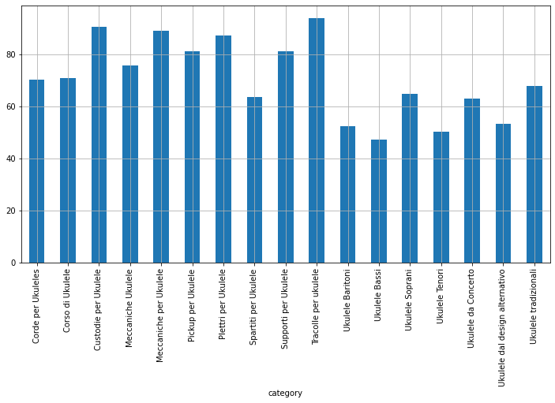
    


GLi oggetti che hanno i rating più bassi sono gli ukulele soprani. Proviamo a vedere perché. Analizziamo solo quella categoria, mostrando il rating medio per marca:


```python
plt.figure(figsize=(12,6))
data[data['category']=='Ukulele Bassi'].groupby('manufacturer')['rating'].mean().plot.bar()
plt.grid()
plt.show()
```


    
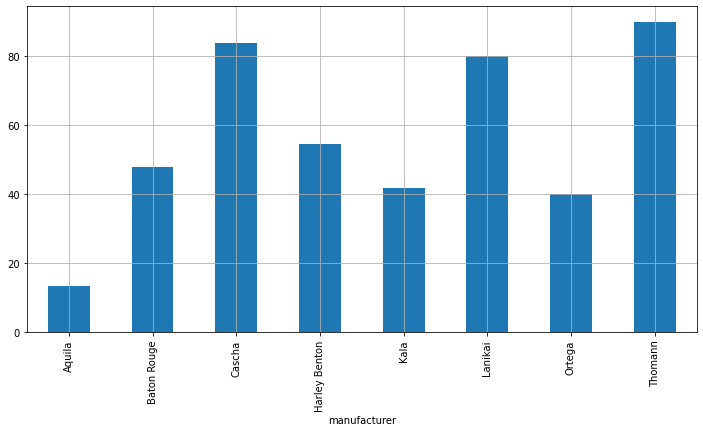
    
<table class="question">
<tr>
<td></td>
<td>

**Domanda 5**

Stando a quanto mostrato nell'ultimo grafico, su che tipo di prodotti si dovrebbe puntare per migliorare gli score ottenuti dal sito?

 </td>
</tr>
</table>

## Esercizi


<table class="question">
<tr>
<td></td>
<td>


**Esercizio 1**

Si scarichino tutte le immagini relative all'ultimo DataFrame creato.

 </td>
</tr>
</table>

<table class="question">
<tr>
<td></td>
<td>


**Esercizio 2**
Le pagine relative ai singoli prodotti contengono delle immagini ad alta risoluzione degli oggetti, mentre le immagini da noi scaricate sono a bassa risoluzione. Si modifichi il codice visto in precedenza per navigare nella pagina ed estrarre una delle immagini associate al prodotto. Si scarichino poi tutte le immagini come visto nel laboratorio.


 </td>
</tr>
</table>

<table class="question">
<tr>
<td></td>
<td>


**Esercizio 3**
Le pagine relative ai singoli prodotti contengono dei link ai testi delle review. Si scriva un codice che permetta di scaricare tutte le review di tutti i prodotti contenuti nell'ultimo DataFrame. Per ogni review, si conservi anche il relativo rating. Si faccia in modo di mantenere una relazione tra i prodotti e le relative review.


 </td>
</tr>
</table>
<table class="question">
<tr>
<td></td>
<td>


**Esercizio 4**

Si scelga un altro sito a piacere e si ripeta su di esso una analisi simile a quella vista in laboratorio.


 </td>
</tr>
</table>

# Referenze
 * Documentazione di Python 3. https://docs.python.org/3/
 * Documentazione di Numpy. http://www.numpy.org/
 * Documentazione di Pandas: https://pandas.pydata.org/pandas-docs/stable/
