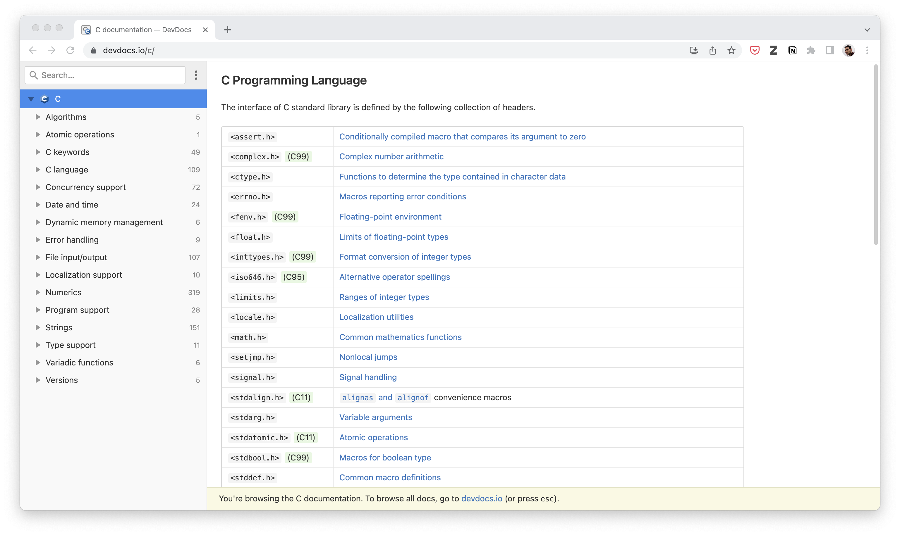
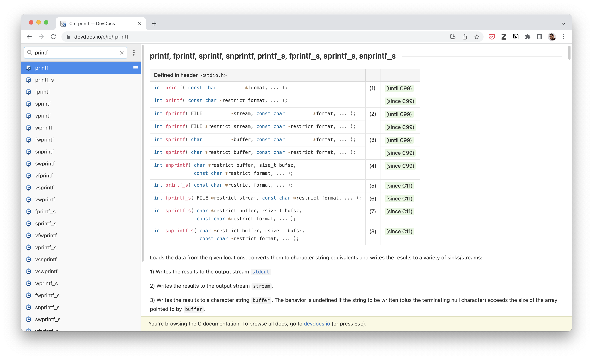

<!--
>  Note del corso di <a target="_blank" href="http://web.dmi.unict.it/corsi/l-31/insegnamenti?seuid=52B6DAFA-58EB-4BF7-AD16-8238324A6855">Laboratorio di Programmazione 1 F-N 2022/2023</a>  
> Corso di Laurea in Informatica, Università di Catania  
> Note a cura di Antonino Furnari - <a href="mailto:antonino.furnari@unict.it">antonino.furnari@unict.it</a>
-->

Man mano che scriveremo programmi sempre più complessi si renderà necessario consultare la documentazione del linguaggio C. Questa fornisce informazioni su come si utilizzano specifiche funzioni e oggetti messi a disposizione dal linguaggio. Va però precisato che, a differenza di altri linguaggi (ad esempio il Java), C e più uno standard del quale esistono diverse implementazioni, per cui non esiste nessuna documentazione "ufficiale" di C, ma diversi sorgenti che offrono informazioni circa lo standard. Noi ci avvarremo di questo sito: https://devdocs.io/c/.

Il sito contiene diverse sezioni che offrono informazioni sui vari moduli della libreria standard di C. Una casella di ricerca in alto permette anche di effettuare ricerche all'interno della documentazione.

 

 

Se vogliamo avere informazioni sulla funzione `printf`, possiamo digitare "printf" nella casella di ricerca in alto a sinistra. Otterremo una lista di diverse funzioni con un nome simile. Cliccando su una di queste è possibile ottenere informazioni sulla funzione, come mostrato di seguito:

 

 

La documentazione è uno strumento importante che bisogna saper imparare a utilizzare. Quando non ci è chiaro come utilizzare una funzione messa a disposizione dal linguaggio, è bene consultare la documentazione.