<!--
>  Note del corso di <a target="_blank" href="http://web.dmi.unict.it/corsi/l-31/insegnamenti?seuid=52B6DAFA-58EB-4BF7-AD16-8238324A6855">Laboratorio di Programmazione 1 F-N 2022/2023</a> <br>
> Corso di Laurea in Informatica, Università di Catania <br>
> Note a cura di Antonino Furnari - <a href="mailto:antonino.furnari@unict.it">antonino.furnari@unict.it</a>-->


## Ambiente di lavoro tipico per la programmazione in C

Per iniziare a scrivere ed eseguire programmi, ci servono due componenti principali: 

 * Un compilatore: ci servirà per tradurre il codice scritto in C in linguaggio macchina pronto per essere eseguito sulla macchina (un file eseguibile);
 * Un editor di testi: ci servirà per scrivere i nostri programmi.

Il processo di installazione e gli strumenti specifici possono cambiare da piattaforma a piattaforma (Windows/MacOS/Linux), ma il flusso di lavoro sarà il medesimo in tutti i casi.

Per avere una piattaforma quanto più unificata possibile, utilizzeremo lo stesso editor di testi (Visual Studio Code, che è disponibile per diverse piattaforme). Visual Studio Code è un editor di testi progettato appositamente per scrivere codice. Questo tipo di programmi offre funzionalità specifiche, quali ad esempio:

 * Evidenziazione della sintassi del codice. Questa funziona colore ciascuna parola in maniera diversa a seconda della sua funzione nel codice;
 * Numeri di righe. Questa funzione mostra i numeri di righe alla sinistra del testo, in modo che sia facile trovare una riga specifica quando il compilatore ci restituisce un messaggio d'errore;
 * Supporto all'indentazione del codice. Rende più semplice ed elegante indentare il codice. Spesso automatizza l'indentazione in modo da risparmiarci qualche "tab";
 * Tab. Permettono di lavorare contemporaneamente su più file con la stessa istanza dell'editor.

Quando questo insieme di funzionalità è molto ricco, questi programmi sono anche chiamati "Integrated Development Environments" (Ambienti di Sviluppo Integrato) o IDE.

Utilizzeremo compilatori simili nelle tre piattaforme. In particolare, su Linux utilizzeremo `gcc` (https://gcc.gnu.org/) il compliatore del sistema operativo GNU, su Windows utilizzeremo il compilatore `gcc` disponibile in WSL, e su MacOS utilizzeremo `clang`, una implementazione di C di Apple largamente compatibile con `gcc`.

## Installazione del compilatore
Mentre l'installazione di Visual Studio Code nelle tre piattaforme è molto semplice e simile all'installazione di altre applicazioni, l'installazione e la configurazione del compilatore sono diverse nelle tre piattaforme. Nelle sezioni che seguono, mostreremo i passi da seguire per installare e configurare il compilatore nelle tre piattaforme princiapli (Windows, MacOS, Linux).

### Piattaforma Windows
Si seguano le istruzioni presenti ai seguenti link:
* https://code.visualstudio.com/docs/remote/wsl
* https://learn.microsoft.com/en-us/windows/wsl/install

### Piattaforma Windows - Setup Alternativo
Mentre il setup descritto in precedenza è quello da preferire e il più conforme all'installazione presente sulle macchine del laboratorio, un setup alternativo consiste nell'installare MinGW, un porting per C di gcc.

Scarichiamo il file di installazione del compilatore da [qui](https://sourceforge.net/projects/mingw/). Avviando l'eseguibile di installazione, apparirà la seguente schermata:

<center>
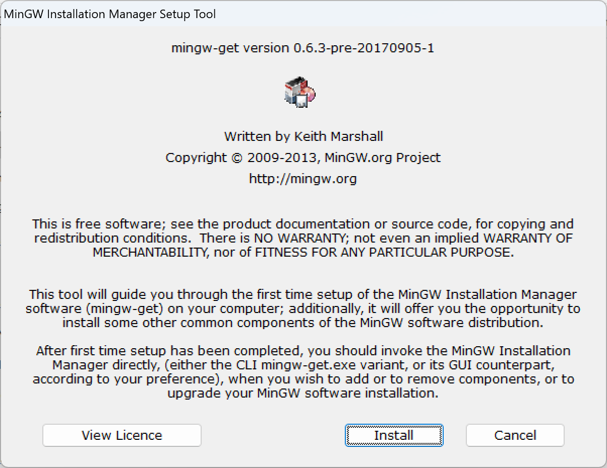
</center>

Clicchiamo su "install" e ci ritroveremo davanti a questa schermata:

<center>
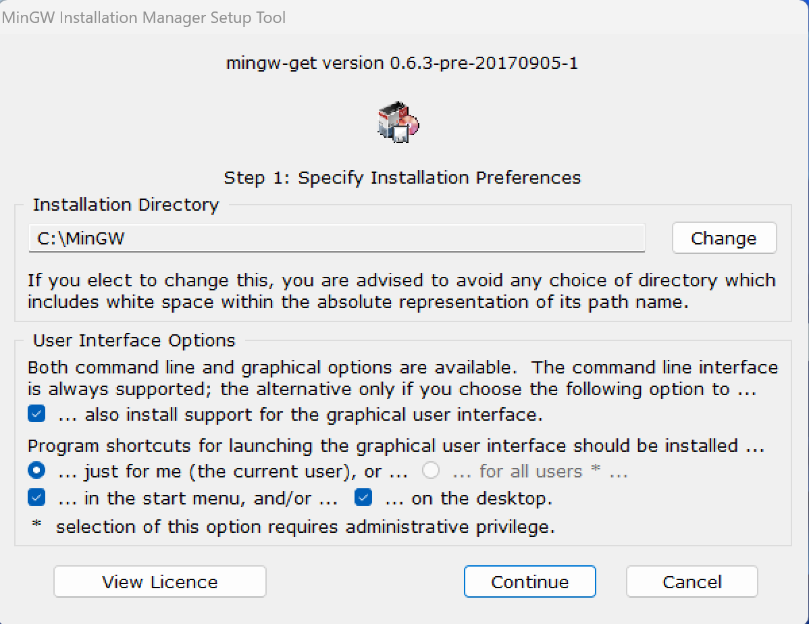
</center>

Lasciamo il percorso di installazione invariato (`C:\MinGW`) e clicchiamo ancora su "continua":

<center>
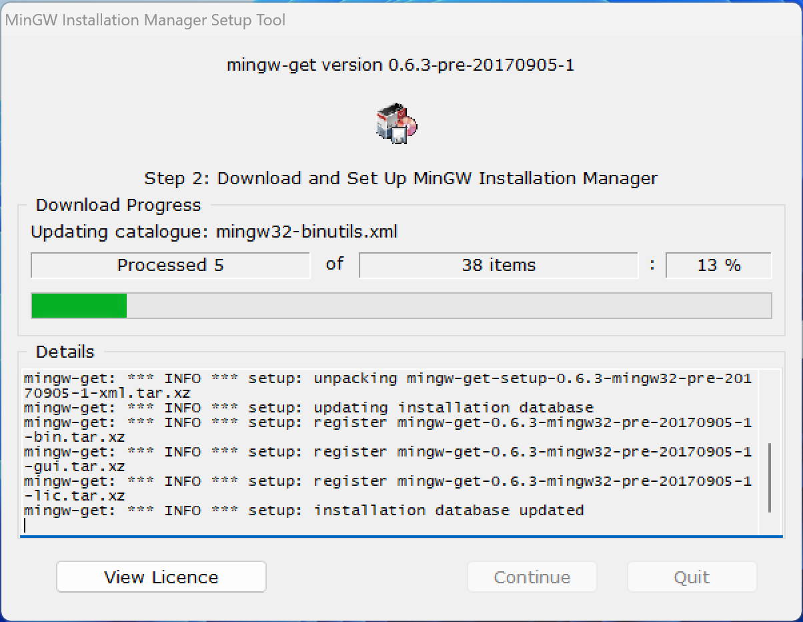
</center>

Questo processo scaricherà e installerà il gestore dell'installazione vera e propria di MinGW, che è un software complesso e composto di diverse parti. Apparirà una schermata simile alla seguente:

<center>
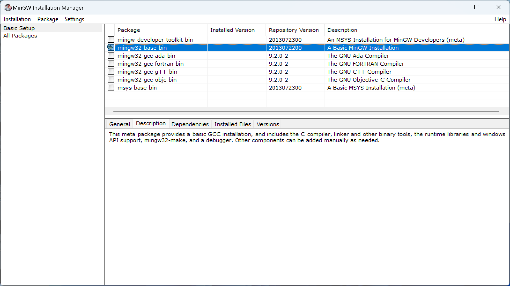
</center>

Clicchiamo sulla checkbox accanto a `mingw32-base-bin` e clicchiamo su `Mark for installation`. A questo punto clicchiamo sul menù `Installation`, poi su `Apply changes` e infine su `Apply`.

Alla fine del processo di installazione, apparirà una finestra simile alla seguente, che possiamo chiudere:

<center>
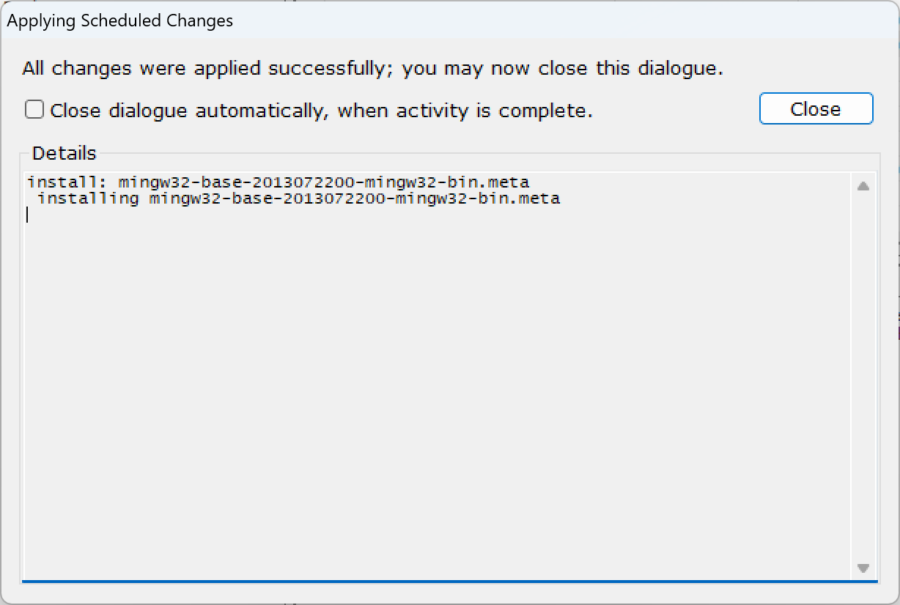
</center>

#### Aggiungere il compilatore al path di sistema

Il compilatore non è un programma dotato di interfaccia grafica. Pertanto, per interagire con esso, dovremo utilizzare il prompt dei comandi di Windows (cmd). Prima di fare ciò, è però necessario aggiungere la posizione del compilatore appena installato nel path di sistema, ovvero la lista delle directory che vengono ispezionate ogni volta che si prova a lanciare un comando da prompt. Per aggiungere il percorso del compilatore al path di sistema, dobbiamo innanzitutto aprire "Modifica le variabili di ambiente relative al sistema" dal pannello di controllo. Per trovare questa funzionalità, basta scrivere "path" nella barra di ricerca di Windows:

<center>
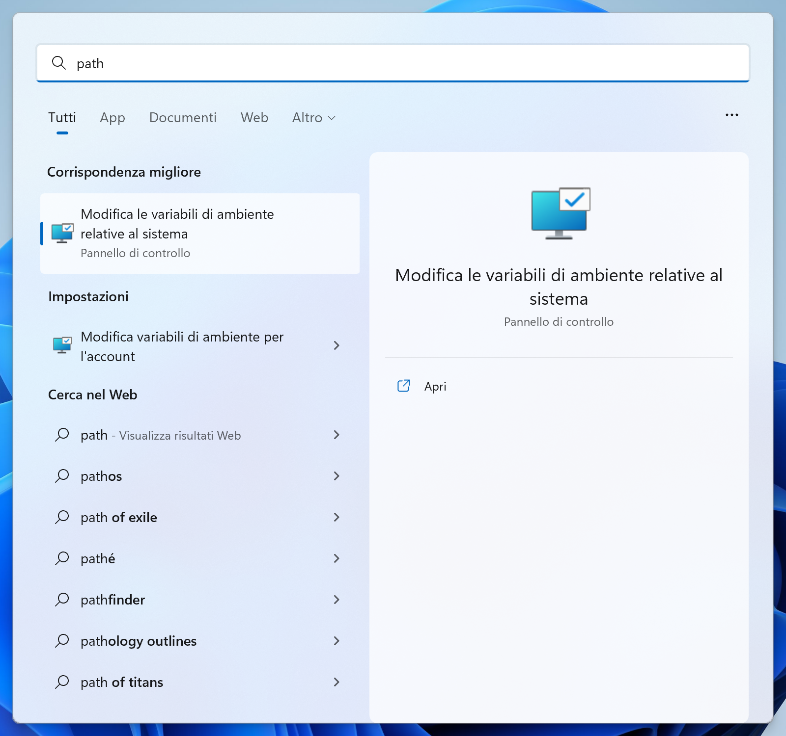
</center>

Una volta aperta la finestra di dialogo, clicchiamo sul pulsante "Variabili d'ambiente":

<center>
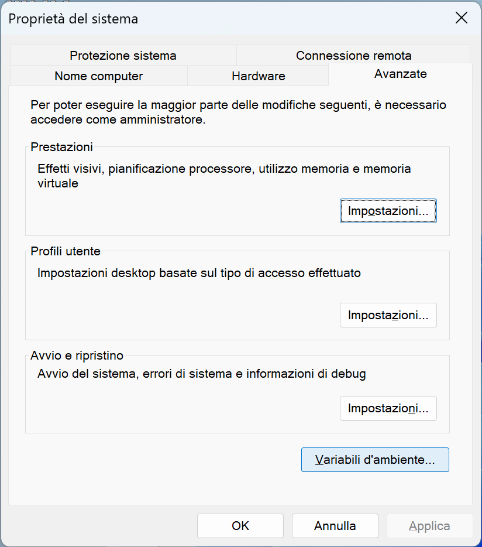
</center>

A questo punto selezioniamo la riga `path` sotto `variabili dell'utente` e clicchiamo su `modifica`:

<center>
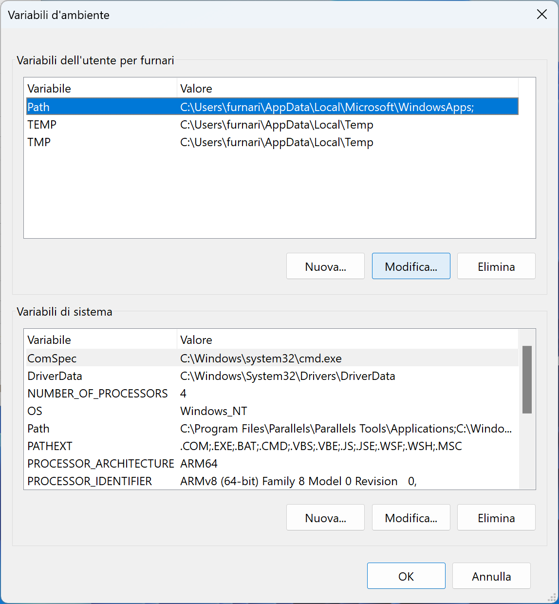
</center>

Clicchiamo dunque su `Nuovo` nella finestra che si aprirà:

<center>
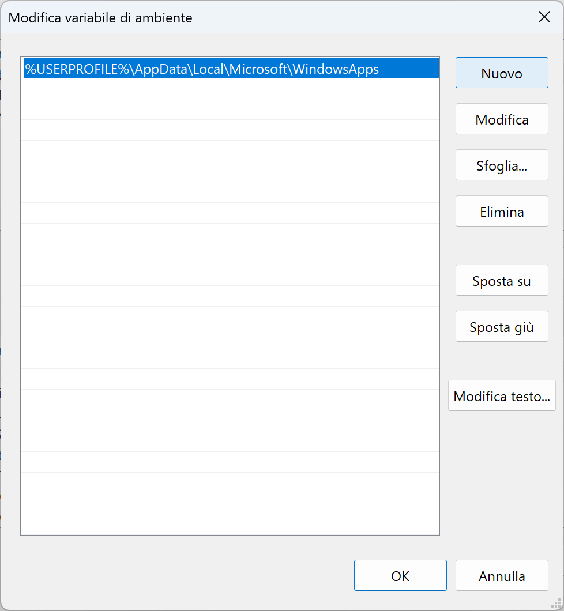
</center>

 Inseriamo il path di installazione di MinGW (es `C:\MinGW`), seguito da `\bin\` (es `C:\MinGW\bin\`):

 <center>
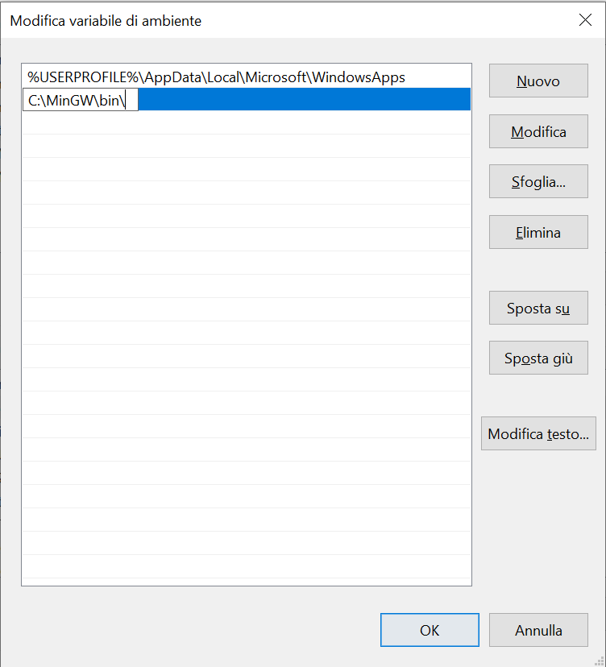
</center>

Clicchiamo su OK in tutte le finestre aperte in modo da salvare le impostazioni.

#### Test del compilatore

Una volta installato il compilatore e aggiunto il percorso corretto al path di sistema, il compilatore dovrebbe essere disponibile per l'uso. Per testare se la configurazione è andata a buon fine, apriamo un nuovo terminale (cerchiamo "cmd" nella barra di ricerca di Windows) e digitiamo il comando 

`gcc --version`

Dovremmo ottenere un messaggio di questo tipo:

<center>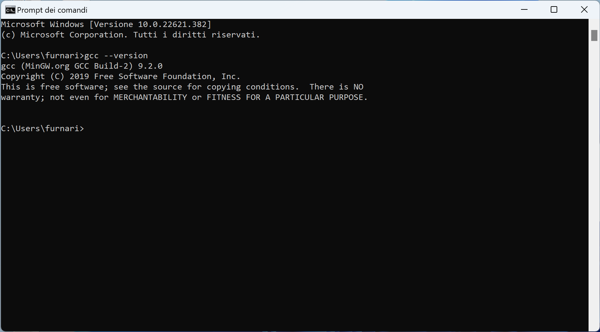</center>

Se ottenete il messaggio mostrato sopra, il compilatore è stato correttamente installato.

### Piattaforma MacOS

Nel caso di MacOS, utilizzeremo il compilatore Apple clang. Per installarlo, è sufficiente aprire un terminale (basta cercare il programma "terminale") e digitare il comando 

`gcc`

Si aprirà una finestra di dialogo di questo tipo:

<center>
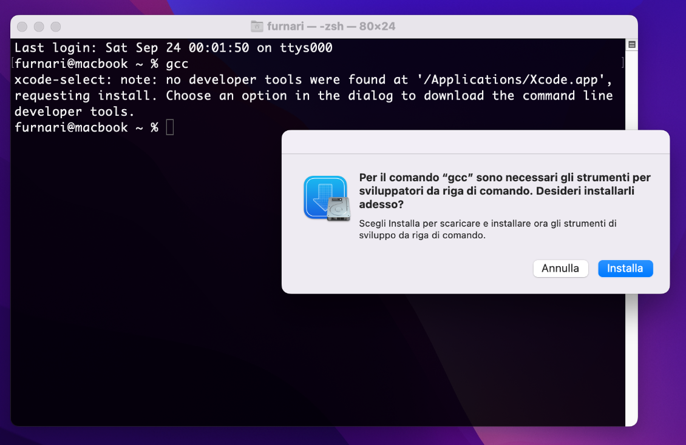
</center>

Clicchiamo su "Installa". Apparirà questa finestra di dialogo:

<center>

</center>

Clicchiamo su "Accetta". Partirà il processo di installazione:

<center>
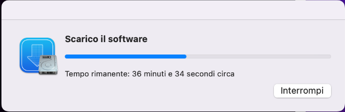
</center>

Il processo potrebbe richiedere del tempo. Una volta terminato, clicchiamo su "Fine":
<center>
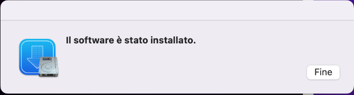
</center>

A questo punto, possiamo verificare che il compilatore sia stato installato digitando:

`gcc --version`

Dovrebbe apparire un messaggio simile al seguente:

<center>
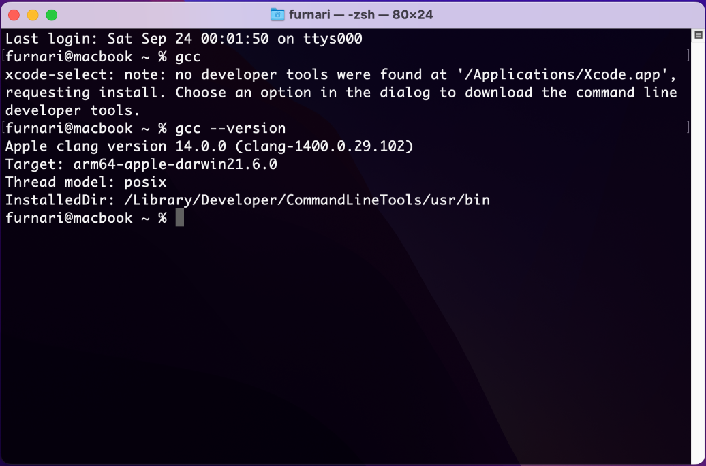
</center>

A differenza di quanto accade nel caso di Windows, il compilatore viene atuomaticamente aggiunto al path di sistema in MacOS.

### Linux
Il compilatore `gcc` dovrebbe essere pre-installato nella maggior parte delle distribuzioni Linux. Per verificare che `gcc` sia installato, aprite un terminale e digitate

`gcc --version`

Su ubuntu 22.04 otterremo il seguente risultato:

<center>
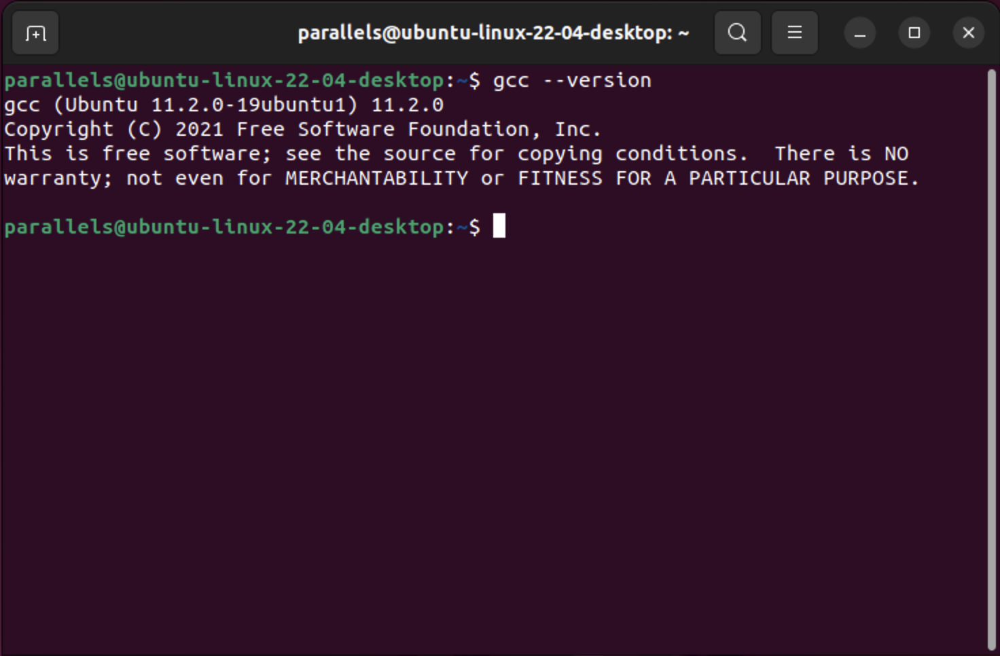
</center>

Qualora il compilatore non fosse installato, otterremmo un errore. In questi casi, le distribuzioni mettono a disposizione un apposito pacchetto attraverso il package manager. Ad esempio, nei sistemi basati su debian, quali linux, dovrebbe essere possibile installare il compilatore mediante i seguenti comandi:

`sudo apt update`
`sudo apt install build-essential`

Terminata l'installazione, possiamo verificare che il programma sia stato correttamente installato mediante il comando `gcc --version` come visto in precedenza.

## Installazione di Visual Studio Code
É possibile installare Visual Studio Code seguendo le istruzioni presenti sul sito ufficiale: [https://code.visualstudio.com/](https://code.visualstudio.com/). 

Dopo l'installazione e la configurazione, Visual Studio Code si presenta come segue:

<center>
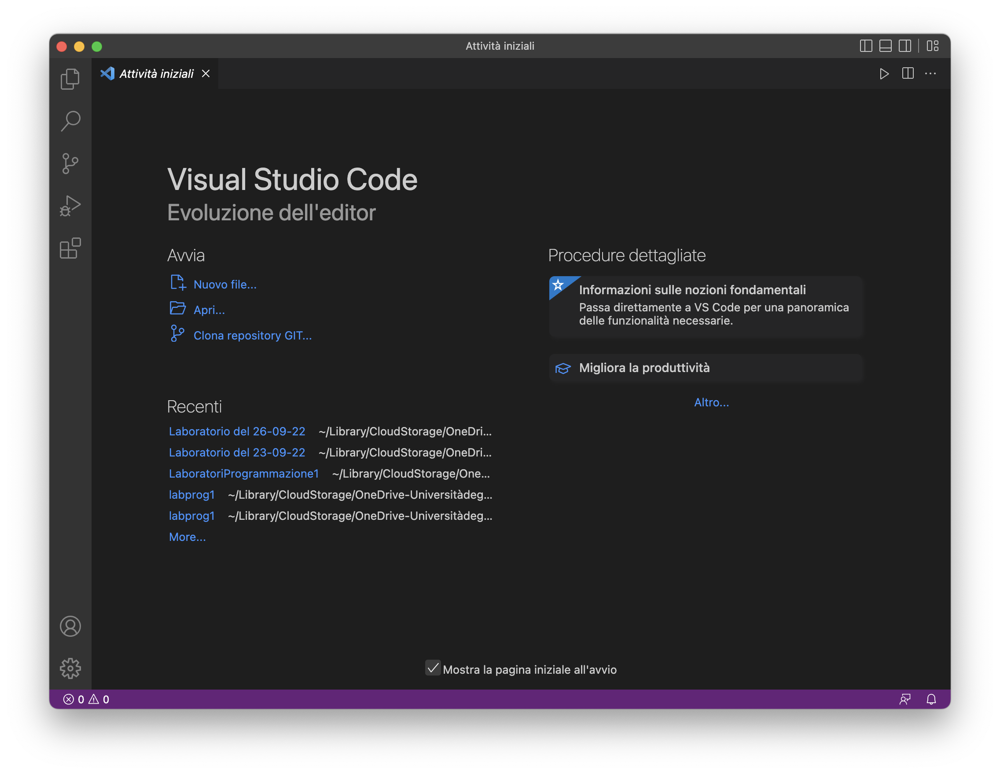
</center>

Una volta installato il programma, dovremo installare delle estensioni che offrono il supporto per la programmazione in C. Possiamo installare le estensioni cliccando sull'ultimo pulsante in basso nella barra di sinistra:

<center>
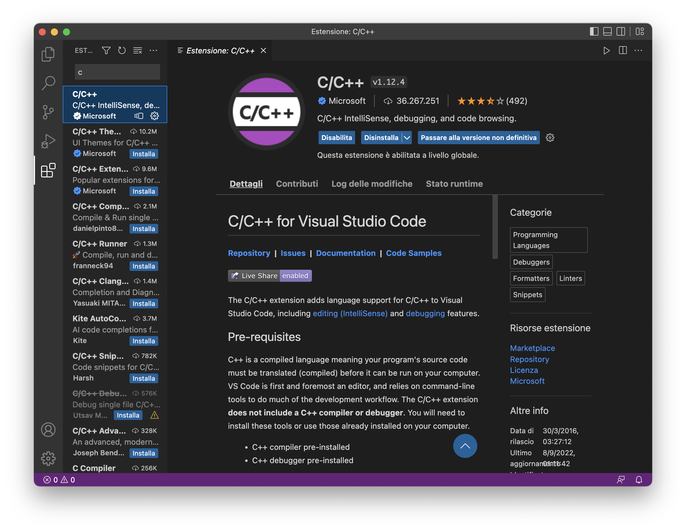
</center>

Per installare una estensione, dobbiamo cercarla nella piccola barra di ricerca in alto a destra, selezionarla e poi cliccare sul pulsante "installa". Installiamo le seguenti estensioni:

 * C/C++ di Microsoft: offre supporto per la programmazione in C;
 * Code Runner di Jun Han: semplifica il processo di compilazione dei programmi in C;
 * Live Share di Microsoft: semplifica la collaborazione su un unico codice sorgente. Trovate maggiori informazioni su come instalalre e utilizzare l'estensione a [questo link](https://code.visualstudio.com/learn/collaboration/live-share).

### Configurazione di Visual Studio Code
VSCode offre molte funzioni avanzate, tra cui intellisense, che offre suggerimenti sul codice che si sta scrivendo. Questa funzione è molto potente e permette di ridurre il tempo necessario a scrivere un programma, ma può essere **controproducente** quando si impara a programmare, in quanto non permette di memorizzare e capire appieno la sintassi di C. E' pertanto una buona idea disabilitare intellisense per questo corso! 

Risulta inoltre necessario configurare Code Runner in modo che possa funzionare in maniera appropriata per la compilazione di programmi in C.

Per farlo, premiamo `F1`, digitiamo "Impostazioni utente json" e premiamo invio. A questo punto inseriamo le seguenti righe tra le parentesi graffe:

```json
"editor.hover.enabled": false,
"code-runner.runInTerminal": true,
"C_Cpp.autocomplete": "Disabled",
"C_Cpp.intelliSenseEngine": "Tag Parser"
```

Dopo questa operazione, il file di configurazione potrebbe essere come il seguente:


<center>
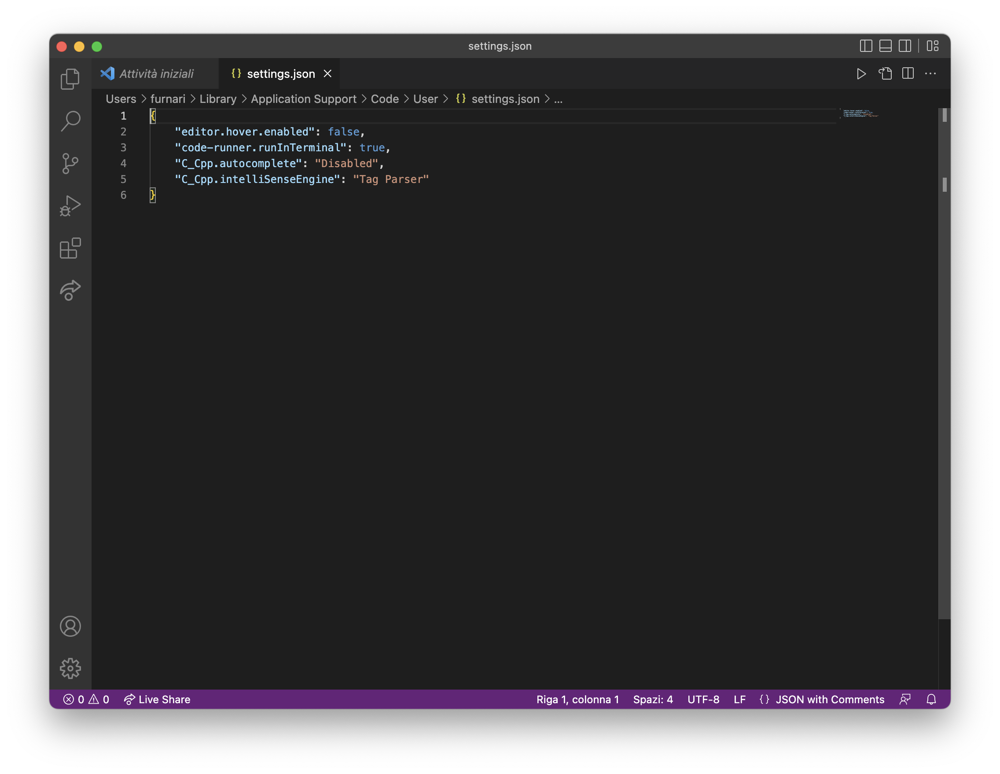
</center>


Salviamo il file `settings.json` (CTRL+S su Windows e Linux o CMD + S su MacOS) e chiudiamo la tab. Riavviamo Visual Studio code.

### Test dell'ambiente di lavoro Visual Studio Code
A questo punto, l'ambiente di lavoro dovrebbe essere pronto all'uso. Per testarlo, creiamo un primo semplice programma di prova. Iniziamo cliccando su "File" e poi "Apri Cartella". Selezioniamo una cartella in cui vogliamo salvare il nostro programma. Clicchiamo su "File" e poi su "Nuovo File di Testo". Copiamo e incolliamo il seguente codice nel nuovo file:

```C
#include<stdio.h>

int main() {
    printf("Hello World\n");
}
```

Salviamo il file con nome `test.c`.

Adesso dobbiamo compilare il programma. Per farlo clicchiamo sul menù "Terminale" e poi su nuovo terminale. Nel terminale scriviamo:

`
gcc test.c -o test
`

Il comando sopra chiede al compilatore di prendere in input `test.c`, di compilarlo, e di restituire in output un file eseguibile `test`. In ambiente Windows, potremmo scrivere `gcc test.c -o test.exe`, in modo che l'eseguibile abbia l'estensione più comune in Windows. Se il compilatore non restituisce errori e se è apparso un nuovo file `test` (o `test.exe`) nella barra a sinistra, allora la compilazione è andata a buon fine. Digitiamo `./test` (o `test.exe` su Windows). Questo dovrebbe eseguire il programma e restituirci un output simile al seguente:

<center>
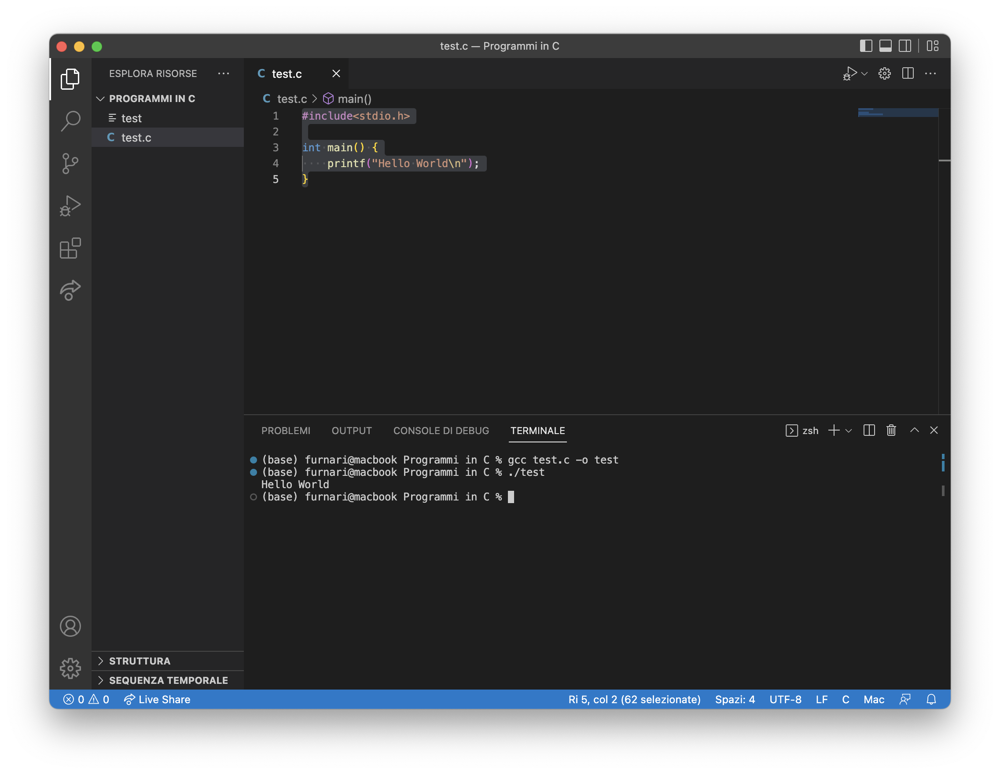
</center>

Alternativamente, è possibile usare l'estensione code-runner per effettuare compilazione ed esecuzione del codice. Per farlo, una volta salvato il file, premiamo la combinazione di tasti `CTRL` + `ALT` + `N` (o `control` + `option` + `N` su MacOS). Il risultato sarà analogo, ma compilazione ed esecuzione avverranno in automatico:

<center>
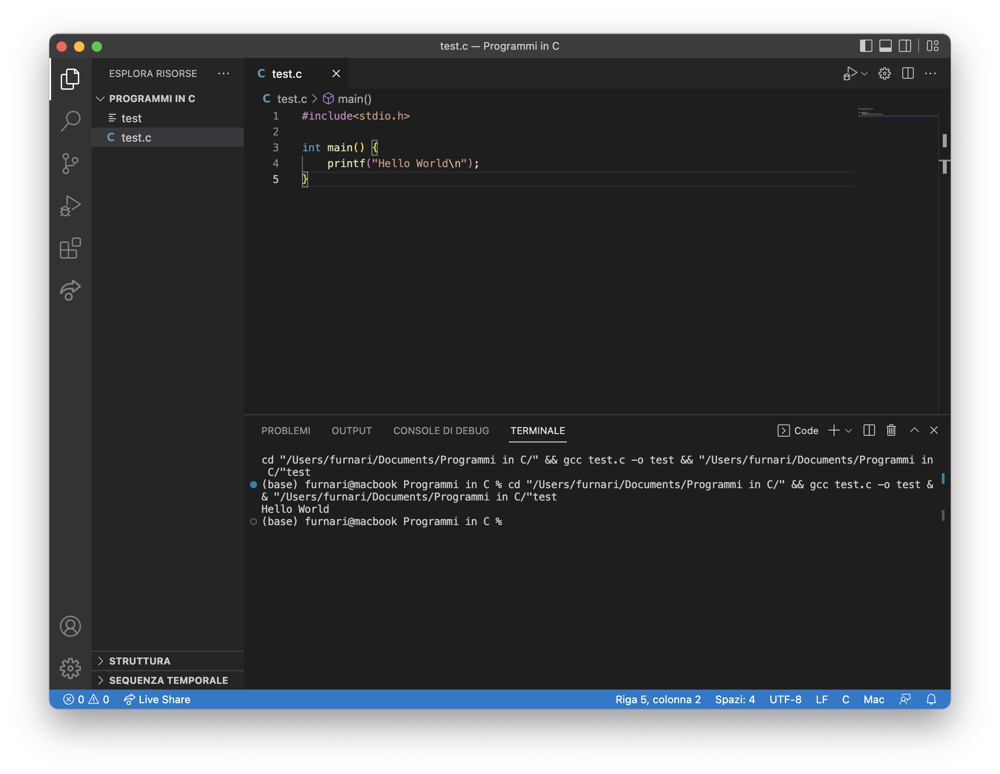
</center>
