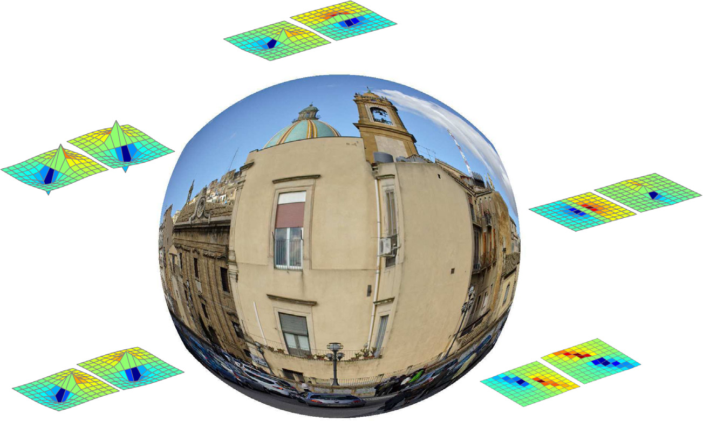
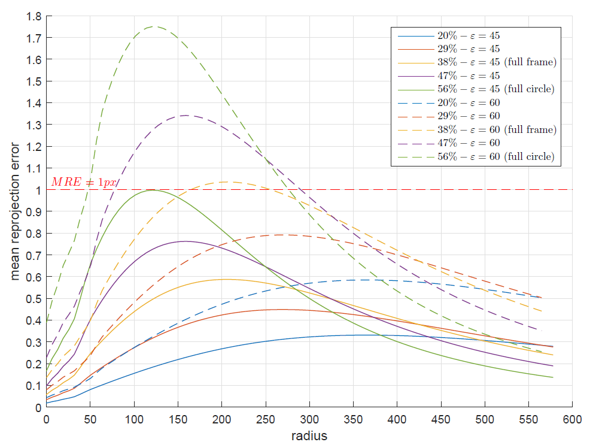
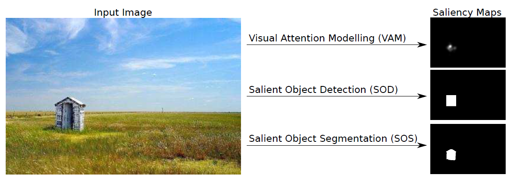

### Distortion Adaptive Sobel Filters
<table id="bibtexify-18" class="display"></table>
<pre id="bibtex-18" class="raw-bibtex js-hidden">
@article{furnari2017distortion,
  url = { http://iplab.dmi.unict.it/DASF/ },
  pdf = { publications/furnari2017distortion.pdf },
  author = { Antonino Furnari and Giovanni Maria Farinella and Arcangelo Ranieri Bruna and Sebastiano Battiato },
  doi = { 10.1016/j.jvcir.2017.03.019 },
  year = { 2017 },
  month = { July },
  pages = { 165 - 175 },
  volume = { 46 },
  journal = { Journal of Visual Communication and Image Representation },
  title = { Distortion Adaptive Sobel Filters for the Gradient Estimation of Wide Angle Images },
}
</pre>

<table id="bibtexify-19" class="display"></table>
<pre id="bibtex-19" class="raw-bibtex js-hidden">
@inproceedings{furnari2015generalized,
  url = { http://iplab.dmi.unict.it/DASF/ },
  pdf = { publications/furnari2015generalized.pdf },
  booktitle = { IEEE International Conference on Image Processing (ICIP), Quebec, Canada, September 27-30 },
  pages = { 3250-3254 },
  year = { 2015 },
  title = { Generalized Sobel Filters for Gradient Estimation of Distorted Images },
  author = { Antonino Furnari and Giovanni Maria Farinella and Arcangelo Bruna and Sebastiano Battiato },
}
</pre>

<table id="bibtexify-20" class="display"></table>
<pre id="bibtex-20" class="raw-bibtex js-hidden">
@inproceedings{furnari2015distortion,
  url = { http://iplab.dmi.unict.it/DASF/ },
  pdf = { publications/furnari2015distortion.pdf },
  doi = { 10.1007/978-3-319-23234-8_20 },
  pages = { 205--215 },
  series = { Lecture Notes in Computer Science },
  volume = { 9280 },
  year = { 2015 },
  publisher = { Springer Lecture Notes in Computer Science },
  booktitle = { International Conference on Image Analysis and Processing (ICIAP), Genova, Italy, September 7-11 },
  title = { Distortion Adaptive Descriptors: Extending Gradient-Based Descriptors to Wide Angle Images },
  author = { Antonino Furnari and Giovanni Maria Farinella and Arcangelo Ranieri Bruna and Sebastiano Battiato },
}
</pre>

We present a family of adaptive Sobel filters for the geometrically correct estimation of the gradients of wide angle images. The proposed filters can be useful in a number of application domains exploiting wide angle cameras, as for instance, surveillance, automotive and robotics. The filters are based on Sobel's rationale and account for the geometric transformation undergone by wide angle images due to the presence of radial distortion. The proposed method is evaluated on a benchmark dataset of images belonging to different scene categories related to applications where wide angle lenses are commonly used and image gradients are often employed. We also propose an objective evaluation procedure to assess the estimation of the gradient of wide angle images. Experiments show that our approach outperforms the current state-of-the-art in both gradient estimation and keypoint matching. [Web Page](http://iplab.dmi.unict.it/DASF/)

### Affine Covariant Feature Extraction on Fisheye Images
<table id="bibtexify-21" class="display"></table>
<pre id="bibtex-21" class="raw-bibtex js-hidden">
@article{furnari2017affine,
  url = { http://iplab.dmi.unict.it/FisheyeAffine/ },
  pdf = { publications/furnari2017affine.pdf },
  issn = { 1057-7149 },
  doi = { 10.1109/TIP.2016.2627816 },
  pages = { 696-710 },
  number = { 2 },
  volume = { 26 },
  year = { 2017 },
  title = { Affine Covariant Features for Fisheye Distortion Local Modeling },
  journal = { IEEE Transactions on Image Processing },
  author = { A. Furnari and G. M. Farinella and A. R. Bruna and S. Battiato },
}
</pre>

<table id="bibtexify-22" class="display"></table>
<pre id="bibtex-22" class="raw-bibtex js-hidden">
@inproceedings{furnari2014affine,
  url = { http://iplab.dmi.unict.it/FisheyeAffine/ },
  pdf = { publications/furnari2014affine.pdf },
  pages = { 5681--5685 },
  doi = { 10.1109/ICIP.2014.7026149 },
  booktitle = { IEEE International Conference on Image Processing, Paris, France, October 27-30 },
  year = { 2014 },
  title = { Affine Region Detectors on the Fisheye Domain (ICIP) },
  author = { Antonino Furnari and Giovanni Maria Farinella and Giovanni Puglisi and Arcangelo Ranieri Bruna and Sebastiano Battiato },
}
</pre>

Perspective cameras are the most popular imaging sensors used in Computer Vision. However, many application fields including automotive, surveillance and robotics, require the use of wide angle cameras (e.g., fisheye) which allow to acquire a larger portion of the scene using a single device at the cost of the introduction of noticeable radial distortion in the images. Affine covariant feature detectors have proven successful in a variety of Computer Vision applications including object recognition, image registration and visual search. Moreover, their robustness to a series of variabilities related to both the scene and the image acquisition process has been thoroughly studied in the literature. In this paper, we investigate their effectiveness on fisheye images providing both theoretical and experimental analyses. As theoretical outcome, we show that even if the radial distortion is not an affine transformation, it can be locally approximated as a linear function with a reasonably small error. The experimental analysis builds on Mikolajczyk's benchmark to assess the robustness of three popular affine region detectors (i.e., Maximally Stable Extremal Regions (MSER), Harris and Hessian affine region detectors), with respect to different variabilities as well as radial distortion. To support the evaluations, we rely on the Oxford dataset and introduce a novel benchmark dataset comprising 50 images depicting different scene categories. The experiments show that the affine region detectors can be effectively employed directly on fisheye images and that the radial distortion is locally modelled as an additional affine variability. [Web Page](http://iplab.dmi.unict.it/FisheyeAffine/)

### Evaluation of Saliency Detection
<table id="bibtexify-23" class="display"></table>
<pre id="bibtex-23" class="raw-bibtex js-hidden">
@inproceedings{furnari2014experimental,
  pdf = { publications/furnari2014experimental.pdf },
  publisher = { Springer Lecture Notes in Computer Science },
  volume = { 8927 },
  series = { Lecture Notes in Computer Science },
  pages = { 806-821 },
  doi = { 10.1007/978-3-319-16199-0_56 },
  booktitle = { Workshop on Assistive Computer Vision and Robotics (ACVR) in conjunction with ECCV, Zurich, Switzerland, September 12 },
  year = { 2014 },
  title = { An Experimental Analysis of Saliency Detection with respect to Three Saliency Levels },
  author = { A. Furnari and G. M. Farinella and S. Battiato },
}
</pre>

Saliency detection is a useful tool for video-based, real-time
Computer Vision applications. It allows to select which locations of the
scene are the most relevant and has been used in a number of related
assistive technologies such as life-logging, memory augmentation and object
detection for the visually impaired, as well as to study autism and the
Parkinson’s disease. Many works focusing on different aspects of saliency
have been proposed in the literature, defining saliency in different ways
depending on the task. In this paper we perform an experimental analysis
focusing on three levels where saliency is defined in different ways,
namely visual attention modelling, salient object detection and salient
object segmentation. We review the main evaluation datasets specifying
the level of saliency which they best describe. Through the experiments
we show that the performances of the saliency algorithms depend on
the level with respect to which they are evaluated and on the nature
of the stimuli used for the benchmark. Moreover, we show that the eye
fixation maps can be effectively used to perform salient object detection
and segmentation, which suggests that pre-attentive bottom-up information
can be still exploited to improve high level tasks such as salient
object detection. Finally, we show that benchmarking a saliency detection
algorithm with respect to a single dataset/saliency level, can lead to
erroneous results and conclude that many datasets/saliency levels should
be considered in the evaluations.

### Vehicle Tracking
<table id="bibtexify-24" class="display"></table>
<pre id="bibtex-24" class="raw-bibtex js-hidden">
@article{battiato2015integrated,
  pdf = {publications/battiato2015integrated.pdf},
  doi = {10.1016/j.eswa.2015.05.055},
  pages = {7263--7275},
  number = {21},
  volume = {42},
  year = {2015},
  journal = {Expert Systems with Applications},
  title = {An integrated system for vehicle tracking and classification},
  author = {S. Battiato and G. M. Farinella and A. Furnari and G. Puglisi and A. Snijders and J. Spiekstra},
}
</pre>
<table id="bibtexify-25" class="display"></table>
<pre id="bibtex-25" class="raw-bibtex js-hidden">
@inproceedings{battiato2014vehicle,
  url = { http://ieeexplore.ieee.org/document/7295012/?reload=true&arnumber=7295012 },
  pdf = { publications/battiato2014vehicle.pdf },
  pages = { 755-760 },
  volume = { 2 },
  year = { 2014 },
  title = { Vehicle tracking based on customized template matching },
  booktitle = { VISAPP International Conference on Computer Vision Theory and Applications, Lisbon, Portugal, January 5-8 },
  author = { Sebastiano Battiato and Giovanni Maria Farinella and Antonino Furnari and Giovanni Puglisi and Anique Snijders and Jelmer Spiekstra },
}
</pre>
<table id="bibtexify-26" class="display"></table>
<pre id="bibtex-26" class="raw-bibtex js-hidden">
@inproceedings{Battiato2016,
  url = { https://doi.org/10.1007/978-3-319-23413-7_2 },
  doi = { 10.1007/978-3-319-23413-7_2 },
  isbn = { 978-3-319-23413-7 },
  pages = { 5--7 },
  publisher = { Springer International Publishing },
  year = { 2016 },
  booktitle = { Progress in Industrial Mathematics at ECMI 2014 },
  title = { A Customized System for Vehicle Tracking and Classification },
  editor = { G. Russo and V. Capasso and G. Nicosia and V. Romano },
  author = { S. Battiato and G. M. Farinella and A. Furnari and G. Puglisi },
}
</pre>

<iframe class='youtube' width="420" height="315"
src="https://youtu.be/OrRxIeRn5L4">
</iframe>

We present a unified system for vehicle tracking and classification which has been developed with a data-driven approach on real-world data. The main purpose of the system is the tracking of the vehicles to understand lane changes, gates transits and other behaviors useful for traffic analysis. The discrimination of the vehicles into two classes (cars vs. trucks) is also required for electronic truck-tolling. Both tracking and classification are performed online by a system made up of two components (tracker and classifier) plus a controller which automatically adapts the configuration of the system to the observed conditions. Experiments show that the proposed system outperforms the state-of-the-art algorithms on the considered data.