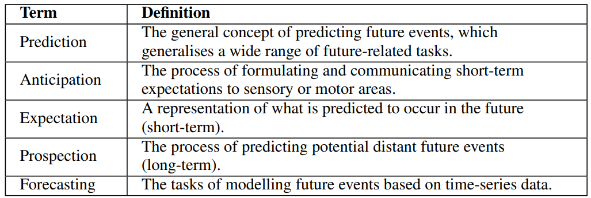

<table id="bibtexify-19" class="display"></table>
<pre id="bibtex-19" class="raw-bibtex js-hidden">
@article{rodin2021predicting,
title={Predicting the Future from First Person (Egocentric) Vision: A Survey},
author={Ivan Rodin and Antonino Furnari and Dimitrios Mavroedis and Giovanni Maria Farinella},
year={2021},
volume = {211},
pages = {103252},
issn = {1077-3142},
doi = {https://doi.org/10.1016/j.cviu.2021.103252},
url = {https://www.sciencedirect.com/science/article/pii/S1077314221000965},
journal={Computer Vision and Image Understanding},
pdf={https://arxiv.org/pdf/2107.13411.pdf}
}
</pre>

Egocentric videos can bring a lot of information about how humans perceive the world and interact with the environment, which
can be beneficial for the analysis of human behaviour. The research in egocentric video analysis is developing rapidly thanks to the
increasing availability of wearable devices and the opportunities offered by new large-scale egocentric datasets. As computer vision
techniques continue to develop at an increasing pace, the tasks related to the prediction of future are starting to evolve from the need
of understanding the present. Predicting future human activities, trajectories and interactions with objects is crucial in applications
such as human-robot interaction, assistive wearable technologies for both industrial and daily living scenarios, entertainment and
virtual or augmented reality. This survey summarises the evolution of studies in the context of future prediction from egocentric
vision making an overview of applications, devices, existing problems, commonly used datasets, models and input modalities. Our
analysis highlights that methods for future prediction from egocentric vision can have a significant impact in a range of applications
and that further research efforts should be devoted to the standardisation of tasks and the proposal of datasets considering real-world
scenarios such as the ones with an industrial vocation.