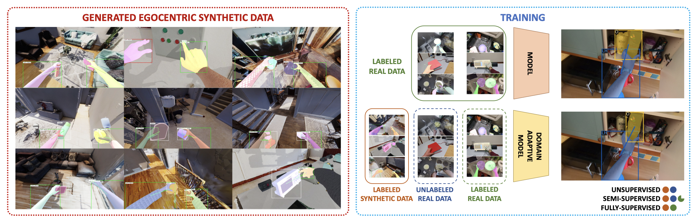

<table id="bibtexify-hoisynth" class="display"></table>
<pre id="bibtex-hoisynth" class="raw-bibtex js-hidden">
@inproceedings{leonardi2024synthetic,
  pdf = { https://arxiv.org/pdf/2312.02672.pdf },
  year = { 2024 },
  booktitle = { European Conference on Computer Vision (ECCV) },
  title = { Are Synthetic Data Useful for Egocentric Hand-Object Interaction Detection? },
  author = { Rosario Leonardi and Antonino Furnari and Francesco Ragusa and Giovanni Maria Farinella },
  url = {https://github.com/fpv-iplab/HOI-Synth}
}
</pre>

In this study, we investigate the effectiveness of synthetic data in enhancing egocentric hand-object interaction detection. Via extensive experiments and comparative analyses on three egocentric datasets, VISOR, EgoHOS, and ENIGMA-51, our findings reveal how to exploit synthetic data for the HOI detection task when real labeled data are scarce or unavailable. Specifically, by leveraging only 10% of real labeled data, we achieve improvements in Overall AP compared to baselines trained exclusively on real data of: +5.67% on EPIC-KITCHENS VISOR, +8.24% on EgoHOS, and +11.69% on ENIGMA-51. Our analysis is supported by a novel data generation pipeline and the newly introduced HOI-Synth benchmark which augments existing datasets with synthetic images of hand-object interactions automatically labeled with hand-object contact states, bounding boxes, and pixel-wise segmentation masks. We publicly release the generated data, code, and data generation tools to support future research. <a href="https://github.com/fpv-iplab/HOI-Synth">Web page</a>