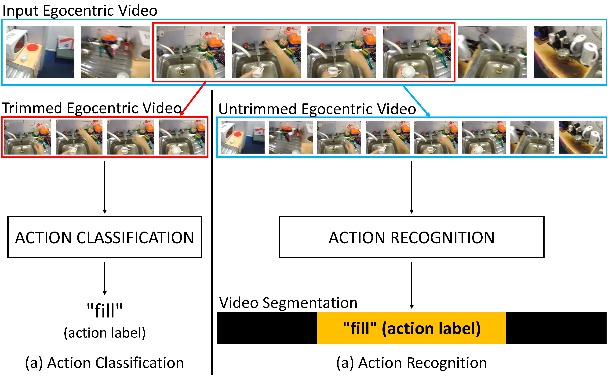

I am interested in developing algorithms and wearable systems based on egocentric vision to support users in their daily tasks, be them related to home/personal scenarios or work-related scenarios. I have been working on egocentric (or first-person) vision since the beginning of my PhD (2013) and developed experience on data collection and labeling, the definition of tasks, the development of algorithms, as well as their evaluation.

## Research Highlights
This highlights recent research aligned to my main research interests. Please see the <a href="/publications/" target="_blank">publications page</a> for a full list of publications.

### EGO4D 
<table id="bibtexify-1" class="display"></table>
<pre id="bibtex-1" class="raw-bibtex js-hidden">
@inproceedings{grauman2022around,
  author={Grauman, Kristen and Westbury, Andrew and Byrne, Eugene and Chavis, Zachary and Furnari, Antonino and Girdhar, Rohit and Hamburger, Jackson and Jiang, Hao and Liu, Miao and Liu, Xingyu and Martin, Miguel and Nagarajan, Tushar and Radosavovic, Ilija and Ramakrishnan, Santhosh Kumar and Ryan, Fiona and Sharma, Jayant and Wray, Michael and Xu, Mengmeng and Xu, Eric Zhongcong and Zhao, Chen and Bansal, Siddhant and Batra, Dhruv and Cartillier, Vincent and Crane, Sean and Do, Tien and Doulaty, Morrie and Erapalli, Akshay and Feichtenhofer, Christoph and Fragomeni, Adriano and Fu, Qichen and Fuegen, Christian and Gebreselasie, Abrham and Gonzalez, Cristina and Hillis, James and Huang, Xuhua and Huang, Yifei and Jia, Wenqi and Khoo, Weslie and Kolar, Jachym and Kottur, Satwik and Kumar, Anurag and Landini, Federico and Li, Chao and Li, Yanghao and Li, Zhenqiang and Mangalam, Karttikeya and Modhugu, Raghava and Munro, Jonathan and Murrell, Tullie and Nishiyasu, Takumi and Price, Will and Puentes, Paola Ruiz and Ramazanova, Merey and Sari, Leda and Somasundaram, Kiran and Southerland, Audrey and Sugano, Yusuke and Tao, Ruijie and Vo, Minh and Wang, Yuchen and Wu, Xindi and Yagi, Takuma and Zhu, Yunyi and Arbelaez, Pablo and Crandall, David and Damen, Dima and Farinella, Giovanni Maria and Ghanem, Bernard and Ithapu, Vamsi Krishna and Jawahar, C. V. and Joo, Hanbyul and Kitani, Kris and Li, Haizhou and Newcombe, Richard and Oliva, Aude and Park, Hyun Soo and Rehg, James M. and Sato, Yoichi and Shi, Jianbo and Shou, Mike Zheng and Torralba, Antonio and Torresani, Lorenzo and Yan, Mingfei and Malik, Jitendra},
  title = {  Around the {W}orld in 3,000 {H}ours of {E}gocentric {V}ideo  },
  booktitle = {  IEEE/CVF International Conference on Computer Vision and Pattern Recognition  },
  year = {  2022  },
  pdf = { https://arxiv.org/pdf/2110.07058.pdf },
  url = { https://ego4d-data.org/ },
}
</pre>

<iframe width="560" height="315" src="https://www.youtube.com/embed/taC2ZKl9IsE" title="YouTube video player" frameborder="0" allow="accelerometer; autoplay; clipboard-write; encrypted-media; gyroscope; picture-in-picture" allowfullscreen></iframe>

Ego4D is a massive-scale Egocentric dataset of unprecedented diversity. It consists of 3,670 hours of video collected by 923 unique participants from 74 worldwide locations in 9 different countries. The project brings together 88 researchers, in an international consortium, to dramatically increases the scale of egocentric data publicly available by an order of magnitude, making it more than 20x greater than any other data set in terms of hours of footage. Ego4D aims to catalyse the next era of research in first-person visual perception. The dataset is diverse in its geographic coverage, scenarios, participants and captured modalities. We consulted a survey from the U.S. Bureau of Labor Statistics that captures how people spend the bulk of their time. Data was captured using seven different off-the-shelf head-mounted cameras: GoPro, Vuzix Blade, Pupil Labs, ZShades, OR- DRO EP6, iVue Rincon 1080, and Weeview. In addition to video, portions of Ego4D offer other data modalities: 3D scans, audio, gaze, stereo, multiple synchronized wearable cameras, and textual narrations.
<a href="https://youtu.be/2dau0W0NVQY">Reveal Session</a>
<a href="https://ego4d-data.org/">Web Page</a>

### Streaming Egocentric Action Anticipation
<table id="bibtexify-2" class="display"></table>
<pre id="bibtex-2" class="raw-bibtex js-hidden">
@inproceedings{furnari2022towards,
  year = {2022},
  booktitle = { International Conference on Pattern Recognition (ICPR) },
  title = { Towards Streaming Egocentric Action Anticipation },
  pdf = { https://arxiv.org/pdf/2110.05386.pdf },
  author = { Antonino Furnari and Giovanni Maria Farinella }
}
</pre>

Egocentric action anticipation is the task of predicting the future actions a camera wearer will likely perform based on past video observations. While in a real-world system it is fundamental to output such predictions before the action begins, past works have not generally paid attention to model runtime during evaluation. Indeed, current evaluation schemes assume that predictions can be made offline, and hence that computational resources are not limited. In contrast, in this paper, we propose a ``streaming'' egocentric action anticipation evaluation protocol which explicitly considers model runtime for performance assessment, assuming that predictions will be available only after the current video segment is processed, which depends on the processing time of a method. Following the proposed evaluation scheme, we benchmark different state-of-the-art approaches for egocentric action anticipation on two popular datasets. Our analysis shows that models with a smaller runtime tend to outperform heavier models in the considered streaming scenario, thus changing the rankings generally observed in standard offline evaluations. Based on this observation, we propose a lightweight action anticipation model consisting in a simple feed-forward 3D CNN, which we propose to optimize using knowledge distillation techniques and a custom loss. The results show that the proposed approach outperforms prior art in the streaming scenario, also in combination with other lightweight models. <a href="https://www.youtube.com/watch?v=pipNfNLQAIo" target="_blank">Video presentationd one at ICPR 2022</a> 

### The MECCANO Dataset
<table id="bibtexify-18" class="display"></table>
<pre id="bibtex-18" class="raw-bibtex js-hidden">
@inproceedings{ragusa2021meccano,
pdf = { https://arxiv.org/pdf/2010.05654.pdf },
url = { https://iplab.dmi.unict.it/MECCANO },
primaryclass = { cs.CV },
booktitle={IEEE Winter Conference on Application of Computer Vision (WACV)},
eprint = { 2010.05654 },
year = {2021},
author = {Francesco Ragusa and Antonino Furnari and Salvatore Livatino and Giovanni Maria Farinella},
title = {The MECCANO Dataset: Understanding Human-Object Interactions from Egocentric Videos in an Industrial-like Domain}
}
</pre>

In this work, we introduce MECCANO, the first dataset of egocentric videos to study human-object interactions in industrial-like settings. MECCANO has been acquired by 20 participants who were asked to build a motorbike model, for which they had to interact with tiny objects and tools. The dataset has been explicitly labeled for the task of recognizing human-object interactions from an egocentric perspective. Specifically, each interaction has been labeled both temporally (with action segments) and spatially (with active object bounding boxes). With the proposed dataset, we investigate four different tasks including 1) action recognition, 2) active object detection, 3) active object recognition and 4) egocentric human-object interaction detection, which is a revisited version of the standard human-object interaction detection task. Baseline results show that the MECCANO dataset is a challenging benchmark to study egocentric human-object interactions in industrial-like scenarios.

<a href="https://iplab.dmi.unict.it/MECCANO/" target="_blank">Web Page</a>

### Future Predictions From First-Person (Egocentric) Vision Survey
<table id="bibtexify-19" class="display"></table>
<pre id="bibtex-19" class="raw-bibtex js-hidden">
@article{rodin2021predicting,
title={Predicting the Future from First Person (Egocentric) Vision: A Survey},
author={Ivan Rodin and Antonino Furnari and Dimitrios Mavroedis and Giovanni Maria Farinella},
year={2021},
volume = {211},
pages = {103252},
issn = {1077-3142},
doi = {https://doi.org/10.1016/j.cviu.2021.103252},
url = {https://www.sciencedirect.com/science/article/pii/S1077314221000965},
journal={Computer Vision and Image Understanding},
pdf={https://arxiv.org/pdf/2107.13411.pdf}
}
</pre>

Egocentric videos can bring a lot of information about how humans perceive the world and interact with the environment, which
can be beneficial for the analysis of human behaviour. The research in egocentric video analysis is developing rapidly thanks to the
increasing availability of wearable devices and the opportunities offered by new large-scale egocentric datasets. As computer vision
techniques continue to develop at an increasing pace, the tasks related to the prediction of future are starting to evolve from the need
of understanding the present. Predicting future human activities, trajectories and interactions with objects is crucial in applications
such as human-robot interaction, assistive wearable technologies for both industrial and daily living scenarios, entertainment and
virtual or augmented reality. This survey summarises the evolution of studies in the context of future prediction from egocentric
vision making an overview of applications, devices, existing problems, commonly used datasets, models and input modalities. Our
analysis highlights that methods for future prediction from egocentric vision can have a significant impact in a range of applications
and that further research efforts should be devoted to the standardisation of tasks and the proposal of datasets considering real-world
scenarios such as the ones with an industrial vocation.

### EPIC - KITCHENS-100 DATASET
<table id="bibtexify-3" class="display"></table>
<pre id="bibtex-3" class="raw-bibtex js-hidden">
@ARTICLE{Damen2020RESCALING,
   title={Rescaling Egocentric Vision},
   author={Damen, Dima and Doughty, Hazel and Farinella, Giovanni Maria  and and Furnari, Antonino 
           and Ma, Jian and Kazakos, Evangelos and Moltisanti, Davide and Munro, Jonathan 
           and Perrett, Toby and Price, Will and Wray, Michael},
           journal   = {CoRR},
           volume    = {abs/2006.13256},
           year      = {2020},
           ee        = {http://arxiv.org/abs/2006.13256},
           pdf        = {http://arxiv.org/pdf/2006.13256.pdf},
	   url 		= {http://epic-kitchens.github.io/2020-100}
} 
</pre>

<iframe width="560" height="315" src="https://www.youtube.com/embed/8IzkrWAfAGg" title="YouTube video player" frameborder="0" allow="accelerometer; autoplay; clipboard-write; encrypted-media; gyroscope; picture-in-picture" allowfullscreen></iframe>

We introduce EPIC-KITCHENS-100, the largest annotated egocentric dataset - 100 hrs, 20M frames, 90K actions - of wearable videos capturing long-term unscripted activities in 45 environments. This extends our previous dataset (EPIC-KITCHENS-55), released in 2018, resulting in more action segments (+128%), environments (+41%) and hours (+84%), using a novel annotation pipeline that allows denser and more complete annotations of fine-grained actions (54% more actions per minute). We evaluate the "test of time" - i.e. whether models trained on data collected in 2018 can generalise to new footage collected under the same hypotheses albeit "two years on".
The dataset is aligned with 6 challenges: action recognition (full and weak supervision), detection, anticipation, retrieval (from captions), as well as unsupervised domain adaptation for action recognition. For each challenge, we define the task, provide baselines and evaluation metrics. The dataset has been released on 01/07/2020. Please watch the recorded webinar of our presentation for more information. [Webinar](https://www.youtube.com/watch?v=VraAGAxF9kc) [Web Page](https://epic-kitchens.github.io/2020-100)

### Rolling-Unrolling LSTMs for Egocentric Action Anticipation
<table id="bibtexify-4" class="display"></table>
<pre id="bibtex-4" class="raw-bibtex js-hidden">
@article{furnari2020rulstm,
  author = {Antonino Furnari and Giovanni Maria Farinella},
  journal = {IEEE Transactions on Pattern Analysis and Machine Intelligence (PAMI)},
  title = {Rolling-Unrolling LSTMs for Action Anticipation from First-Person Video},
  url = {https://iplab.dmi.unict.it/rulstm},
  pdf = {https://arxiv.org/pdf/2005.02190.pdf},
  year = {2020},
  doi = {10.1109/TPAMI.2020.2992889}
}
</pre>

<table id="bibtexify-5" class="display"></table>
<pre id="bibtex-5" class="raw-bibtex js-hidden">
@inproceedings{furnari2019rulstm, 
  title = { What Would You Expect? Anticipating Egocentric Actions with Rolling-Unrolling LSTMs and Modality Attention }, 
  author = { Antonino Furnari and Giovanni Maria Farinella },
  year = { 2019 },
  booktitle = { International Conference on Computer Vision },
  pdf = {https://arxiv.org/pdf/1905.09035.pdf},
  url = {http://iplab.dmi.unict.it/rulstm}
}
</pre>

<iframe width="560" height="315" src="https://www.youtube.com/embed/EjjUdG2EYDo" title="YouTube video player" frameborder="0" allow="accelerometer; autoplay; clipboard-write; encrypted-media; gyroscope; picture-in-picture" allowfullscreen></iframe>

<iframe width="560" height="315" src="https://www.youtube.com/embed/buIEKFHTVIg" title="YouTube video player" frameborder="0" allow="accelerometer; autoplay; clipboard-write; encrypted-media; gyroscope; picture-in-picture" allowfullscreen></iframe>

Egocentric action anticipation consists in understanding which objects the camera wearer will interact with in the near future and which actions they will perform. We tackle the problem proposing an architecture able to anticipate actions at multiple temporal scales using two LSTMs to 1) summarize the past, and 2) formulate predictions about the future. The input video is processed considering three complimentary modalities: appearance (RGB), motion (optical
flow) and objects (object-based features). Modality-specific predictions are fused using a novel Modality ATTention (MATT) mechanism which learns to weigh modalities in an adaptive fashion. Extensive evaluations on three large-scale benchmark datasets show that our method outperforms prior art by up to +7% on the challenging EPIC-Kitchens dataset including more than 2500 actions, and generalizes to EGTEA Gaze+ and Activitynet. Our approach is also shown to generalize to the tasks of early action recognition and action recognition. Our method was ranked first in the public leaderboard of the EPIC-Kitchens egocentric action anticipation challenge 2019. [Web Page](http://iplab.dmi.unict.it/rulstm) - [Code](https://github.com/fpv-iplab/rulstm).

### EPIC - KITCHENS-55 DATASET
<table id="bibtexify-6" class="display"></table>
<pre id="bibtex-6" class="raw-bibtex js-hidden">
@article{damen2020epic,
  author = {Dima Damen and Hazel Doughty and Giovanni Maria Farinella and Sanja Fidler and Antonino Furnari and Evangelos Kazakos and Davide Moltisanti and Jonathan Munro
           and Toby Perrett and Will Price and Michael Wray},
  journal = {IEEE Transactions on Pattern Analysis and Machine Intelligence (PAMI)},
  title = {The EPIC-KITCHENS Dataset: Collection, Challenges and Baselines},
  url = {https://epic-kitchens.github.io/},
  pdf = {https://arxiv.org/pdf/2005.00343.pdf},
  year = {2020},
  doi = {10.1109/TPAMI.2020.2991965}
}
</pre>

<table id="bibtexify-7" class="display"></table>
<pre id="bibtex-7" class="raw-bibtex js-hidden">
@inproceedings{Damen2018EPICKITCHENS,
  year = {2018},
  booktitle= { European Conference on Computer Vision },
  author = { D. Damen and H. Doughty and G. M. Farinella and S. Fidler and A.
Furnari and E. Kazakos and D. Moltisanti and J. Munro
and T. Perrett and W. Price and M. Wray },
  title = { Scaling Egocentric Vision: The EPIC-KITCHENS Dataset },
  url={https://epic-kitchens.github.io/2018},
  pdf={https://arxiv.org/pdf/1804.02748.pdf}
}
</pre>

<iframe width="560" height="315" src="https://www.youtube.com/embed/Dj6Y3H0ubDw" title="YouTube video player" frameborder="0" allow="accelerometer; autoplay; clipboard-write; encrypted-media; gyroscope; picture-in-picture" allowfullscreen></iframe>

We introduced EPIC-KITCHENS-55, a large-scale egocentric video benchmark recorded by 32 participants in their native kitchen environments. Our videos depict nonscripted daily activities. Recording took place in 4 cities (in North America and Europe) by participants belonging to 10 different nationalities, resulting in highly diverse kitchen habits and cooking styles. Our dataset features 55 hours of video consisting of 11.5M frames, which we densely labeled for a total of 39.6K action segments and 454.2K object bounding boxes. We describe our object, action and anticipation challenges, and evaluate several baselines over two test splits, seen and unseen kitchens. This work is a joint collaboration between the University of Catania, the University of Bristol and the University of Toronto. [Web Page](https://epic-kitchens.github.io/)

### Verb-Noun Marginal Cross Entropy Loss for Egocentric Action Anticipation
<table id="bibtexify-8" class="display"></table>
<pre id="bibtex-8" class="raw-bibtex js-hidden">
@inproceedings{furnari2018Leveraging,
  author = { A. Furnari and S. Battiato and G. M. Farinella },
  title = {  Leveraging Uncertainty to Rethink Loss Functions and Evaluation Measures for Egocentric Action Anticipation  },
  booktitle = {  International Workshop on Egocentric Perception, Interaction and Computing (EPIC) in conjunction with ECCV  },
  pdf = { ../publications/furnari2018Leveraging.pdf },
  url = {https://github.com/fpv-iplab/action-anticipation-losses/},
  year = { 2018 },
}
</pre>

<iframe width="560" height="315" src="https://www.youtube.com/embed/w_3FiIcnUlc" title="YouTube video player" frameborder="0" allow="accelerometer; autoplay; clipboard-write; encrypted-media; gyroscope; picture-in-picture" allowfullscreen></iframe>

Current action anticipation approaches often neglect the in-trinsic uncertainty of future predictions when loss functions or evalua-tion  measures  are  designed.  The  uncertainty  of  future  observations  isespecially  relevant  in  the  context  of  egocentric  visual  data,  which  isnaturally  exposed  to  a  great  deal  of  variability.  Considering  the  prob-lem of egocentric action anticipation, we investigate how loss functionsand evaluation measures can be designed to explicitly take into accountthe  natural  multi-modality  of  future  events.  In  particular,  we  discusssuitable measures to evaluate egocentric action anticipation and studyhow  loss  functions  can  be  defined  to  incorporate  the  uncertainty  aris-ing from the prediction of future events. Experiments performed on theEPIC-KITCHENS dataset show that the proposed loss function allowsimproving the results of both egocentric action anticipation and recog-nition methods. [Code](https://github.com/fpv-iplab/action-anticipation-losses/)

### Egocentric Visitors Localization in Cultural Sites
<table id="bibtexify-9" class="display"></table>
<pre id="bibtex-9" class="raw-bibtex js-hidden">
@article{ragusa2019egocentric,
  title = {  Egocentric Visitors Localization in Cultural Sites  },
  journal = {  Journal on Computing and Cultural Heritage (JOCCH)  },
  year = { 2019 },
  pdf = {  ../publications/ragusa2019egocentric.pdf },
  url = {  http://iplab.dmi.unict.it/VEDI/  },
  author = { F. Ragusa and A. Furnari and S. Battiato and G. Signorello and G. M. Farinella },
}
</pre>

<iframe width="560" height="315" src="https://www.youtube.com/embed/VYZ6Awqy1ko" title="YouTube video player" frameborder="0" allow="accelerometer; autoplay; clipboard-write; encrypted-media; gyroscope; picture-in-picture" allowfullscreen></iframe>

We consider the problem of localizing visitors in a cultural site from egocentric (first person) images. Localization information canbe useful both to assist the user during his visit (e.g., by suggesting where to go and what to see next) and to provide behavioralinformation to the manager of the cultural site (e.g., how much time has been spent by visitors at a given location? What has beenliked most?). To tackle the problem, we collected a large dataset of egocentric videos using two cameras: a head-mounted HoloLensdevice and a chest-mounted GoPro. Each frame has been labeled according to the location of the visitor and to what he was looking at.The dataset is freely available in order to encourage research in this domain. The dataset is complemented with baseline experimentsperformed considering a state-of-the-art method for location-based temporal segmentation of egocentric videos. Experiments showthat compelling results can be achieved to extract useful information for both the visitor and the site-manager. [Web Page](http://iplab.dmi.unict.it/VEDI/)

### Market Basket Analysis from Egocentric Videos 
<table id="bibtexify-10" class="display"></table>
<pre id="bibtex-10" class="raw-bibtex js-hidden">
@article{Santarcangelo2018VMBA,
  pdf = {  ../publications/santarcangelo2018market.pdf  },
  title = { Market Basket Analysis from Egocentric Videos },
  journal = { Pattern Recognition Letters },
  pages = { 83-90 },
  issue = { 1 },
  volume = { 112 },
  year = { 2018 },
  url = { http://iplab.dmi.unict.it/vmba15 },
  author = { V. Santarcangelo and G. M. Farinella and A. Furnari and S. Battiato },
  doi = {  https://doi.org/10.1016/j.patrec.2018.06.010 },
}
</pre>

<iframe width="560" height="315" src="https://www.youtube.com/embed/4YU-2xVkhXs" title="YouTube video player" frameborder="0" allow="accelerometer; autoplay; clipboard-write; encrypted-media; gyroscope; picture-in-picture" allowfullscreen></iframe>

This paper presents Visual Market Basket Analysis (VMBA), a novel application domain for egocen-tric vision systems.  The final goal of VMBA is to infer the behaviour of the customers of a storeduring their shopping. The analysis relies on image sequences acquired by cameras mounted on shop-ping carts.  The inferred behaviours can be coupled with classic Market Basket Analysis information(i.e., receipts) to help retailers to improve the management of spaces and marketing strategies. To setup the challenge, we collected a new dataset of egocentric videos during real shopping sessions in aretail store.  Video frames have been labelled according to a proposed hierarchy of 14 different cus-tomer behaviours from the beginning (cart picking) to the end (cart releasing) of their shopping.  Webenchmark different representation and classification techniques and propose a multi-modal methodwhich exploits visual, motion and audio descriptors to perform classification with the Directed AcyclicGraph SVM learning architecture. Experiments highlight that employing multimodal representationsand explicitly addressing the task in a hierarchical way is beneficial.  The devised approach based onDeep Features achieves an accuracy of more than 87% over the 14 classes of the considered dataset. [Web Page](http://iplab.dmi.unict.it/vmba15)

### Egocentric Shopping Cart Localization
<table id="bibtexify-11" class="display"></table>
<pre id="bibtex-11" class="raw-bibtex js-hidden">
@inproceedings{spera2018egocentric,
  author = { Emiliano Spera and Antonino Furnari and Sebastiano Battiato and Giovanni Maria Farinella },
  title = {  Egocentric Shopping Cart Localization  },
  pdf = {../publications/spera2018egocentric.pdf},
  url = {http://iplab.dmi.unict.it/EgocentricShoppingCartLocalization/},
  booktitle = { International Conference on Pattern Recognition (ICPR) },
  year = {2018},
}
</pre>

<iframe width="560" height="315" src="https://www.youtube.com/embed/BxbdgWxFhgc" title="YouTube video player" frameborder="0" allow="accelerometer; autoplay; clipboard-write; encrypted-media; gyroscope; picture-in-picture" allowfullscreen></iframe>

We investigate the new problem of egocentric shopping cart localization in retail stores. We propose a novel large-scale dataset for image-based egocentric shopping cart localization. The dataset has been collected using cameras placed on shopping carts in a large retail store. It contains a total of 19,531 image frames, each labelled with its six Degrees Of Freedom pose. We study the localization problem by analysing how cart locations should be represented and estimated, and how to assess the localization results. We benchmark two families of algorithms: classic methods based on image retrieval and emerging methods based on regression. [Web Page](http://iplab.dmi.unict.it/EgocentricShoppingCartLocalization/)

### Next-Active-Object-Prediction from Egocentric Video
<table id="bibtexify-12" class="display"></table>
<pre id="bibtex-12" class="raw-bibtex js-hidden">
@article{furnari2017next,
  title = {  Next-active-object prediction from egocentric videos  },
  journal = {  Journal of Visual Communication and Image Representation  },
  volume = {  49  },
  number = {  Supplement C  },
  pages = {  401 - 411  },
  year = {  2017  },
  issn = {  1047-3203  },
  doi = {  https://doi.org/10.1016/j.jvcir.2017.10.004  },
  url = {  http://iplab.dmi.unict.it/NextActiveObjectPrediction/  },
  author = { Antonino Furnari and Sebastiano Battiato and Kristen Grauman and Giovanni Maria Farinella },
}
</pre>

<iframe width="560" height="315" src="https://www.youtube.com/embed/P_7dyRQFgZw" title="YouTube video player" frameborder="0" allow="accelerometer; autoplay; clipboard-write; encrypted-media; gyroscope; picture-in-picture" allowfullscreen></iframe>

Although First Person Vision systems can sense the environment from the user's perspective, they are generally unable to predict his intentions and goals. Since human activities can be decomposed in terms of atomic actions and interactions with objects, intelligent wearable systems would benefit from the ability to anticipate user-object interactions. Even if this task is not trivial, the First Person Vision paradigm can provide important cues useful to address this challenge. Specifically, we propose to exploit the dynamics of the scene to recognize next-active-objects before an object interaction actually begins. We train a classifier to discriminate trajectories leading to an object activation from all others and perform next-active-object prediction using a sliding window. Next-active-object prediction is performed by analyzing fixed-length trajectory segments within a sliding window. We investigate what properties of egocentric object motion are most discriminative for the task and evaluate the temporal support with respect to which such motion should be considered. The proposed method compares favorably with respect to several baselines on the ADL egocentric dataset which has been acquired by 20 subjects and contains 10 hours of video of unconstrained interactions with several objects. [Web Page](http://iplab.dmi.unict.it/NextActiveObjectPrediction/)

### Evaluation of Egocentric Action Recognition
<table id="bibtexify-13" class="display"></table>
<pre id="bibtex-13" class="raw-bibtex js-hidden">
@inproceedings {furnari2017how,
    author    = "Furnari, Antonino and Battiato, Sebastiano and Farinella, Giovanni Maria ",
    title     = "How Shall we Evaluate Egocentric Action Recognition?",
    booktitle = "International Workshop on Egocentric Perception, Interaction and Computing (EPIC) in conjunction with ICCV",
    year      = "2017",
    url		  = "http://iplab.dmi.unict.it/EgoActionEvaluation/",
    pdf		  = "../publications/furnari2017how.pdf"
}
</pre>

Egocentric action analysis methods often assume that input videos are trimmed and hence they tend to focus on action classification rather than recognition. Consequently, adopted evaluation schemes are often unable to assess important properties of the desired action video segmentation output, which are deemed to be meaningful in real scenarios (e.g., oversegmentation and boundary localization precision). To overcome the limits of current evaluation methodologies, we propose a set of measures aimed to quantitatively and qualitatively assess the performance of egocentric action recognition methods. To improve exploitability of current action classification methods in the recognition scenario, we investigate how frame-wise predictions can be turned into action-based temporal video segmentations. Experiments on both synthetic and real data show that the proposed set of measures can help to improve evaluation and to drive the design of egocentric action recognition methods. [Web Page + Code](http://iplab.dmi.unict.it/EgoActionEvaluation/)

### Location-Based Temporal Segmentation of Egocentric Videos
<table id="bibtexify-14" class="display"></table>
<pre id="bibtex-14" class="raw-bibtex js-hidden">
@article{furnari2018personal,
  pages = { 1-12 },
  volume = { 52 },
  doi = { https://doi.org/10.1016/j.jvcir.2018.01.019 },
  issn = { 1047-3203 },
  author = { Antonino Furnari and Sebastiano Battiato and Giovanni Maria Farinella },
  url = { http://iplab.dmi.unict.it/PersonalLocationSegmentation/ },
  pdf = { ../publications/furnari2018personal.pdf },
  year = { 2018 },
  journal = { Journal of Visual Communication and Image Representation },
  title = { Personal-Location-Based Temporal Segmentation of Egocentric Video for Lifelogging Applications },
}
</pre>
<table id="bibtexify-15" class="display"></table>
<pre id="bibtex-15" class="raw-bibtex js-hidden">
@inproceedings{furnari2016temporal,
  url = { http://iplab.dmi.unict.it/PersonalLocationSegmentation/ },
  pdf = { ../publications/furnari2016temporal.pdf },
  year = { 2016 },
  publisher = { Springer Lecture Notes in Computer Science },
  series = { Lecture Notes in Computer Science },
  volume = { 9913 },
  pages = { 474--489 },
  booktitle = { International Workshop on Egocentric Perception, Interaction and Computing (EPIC) in conjunction with ECCV, The Netherlands, Amsterdam, October 9 },
  title = { Temporal Segmentation of Egocentric Videos to Highlight Personal Locations of Interest },
  author = { Antonino Furnari and Giovanni Maria Farinella and Sebastiano Battiato },
}
</pre>

<iframe width="560" height="315" src="https://www.youtube.com/embed/URM0EdYuKEw" title="YouTube video player" frameborder="0" allow="accelerometer; autoplay; clipboard-write; encrypted-media; gyroscope; picture-in-picture" allowfullscreen></iframe>

Temporal video segmentation can be useful to improve the exploitation of long egocentric videos. Previous work has focused on general purpose methods designed to work on data acquired by different users. In contrast, egocentric data tends to be very personal and meaningful for the user who acquires it. In particular, being able to extract information related to personal locations can be very useful for life-logging related applications such as indexing long egocentric videos, detecting semantically meaningful video segments for later retrieval or summarization, and estimating the amount of time spent at a given location. In this paper, we propose a method to segment egocentric videos on the basis of the locations visited by user. The method is aimed at providing a personalized output and hence it allows the user to specify which locations he wants to keep track of. To account for negative locations (i.e., locations not specified by the user), we propose an effective negative rejection methods which leverages the continuous nature of egocentric videos and does not require any negative sample at training time. To perform experimental analysis, we collected a dataset of egocentric videos containing 10 personal locations of interest. Results show that the method is accurate and compares favorably with the state of the art. [Web Page](http://iplab.dmi.unict.it/PersonalLocationSegmentation/)

### Recognizing Personal Locations from Egocentric Videos
<table id="bibtexify-16" class="display"></table>
<pre id="bibtex-16" class="raw-bibtex js-hidden">
@article{furnari2016recognizing,
    author={Furnari, Antonino and Farinella, Giovanni Maria and Battiato, Sebastiano}, 
    journal={IEEE Transactions on Human-Machine Systems}, 
    title={Recognizing Personal Locations From Egocentric Videos}, 
    year={2016},
    doi={10.1109/THMS.2016.2612002}, 
    ISSN={2168-2291},
    url={http://iplab.dmi.unict.it/PersonalLocations/},
    pdf={../publications/furnari2016recognizing.pdf}
}
</pre>
<table id="bibtexify-17" class="display"></table>
<pre id="bibtex-17" class="raw-bibtex js-hidden">
@inproceedings{furnari2015recognizing,
  url = { http://iplab.dmi.unict.it/PersonalLocations/ },
  pdf = { ../publications/furnari2015recognizing.pdf },
  year = { 2015 },
  booktitle = { Workshop on Assistive Computer Vision and Robotics (ACVR) in conjunction with ICCV, Santiago, Chile, December 12 },
  page = { 393--401 },
  title = { Recognizing Personal Contexts from Egocentric Images },
  author = { Antonino Furnari and Giovanni Maria Farinella and Sebastiano Battiato },
}
</pre>

<iframe width="560" height="315" src="https://www.youtube.com/embed/5o1vxCZoI3Y" title="YouTube video player" frameborder="0" allow="accelerometer; autoplay; clipboard-write; encrypted-media; gyroscope; picture-in-picture" allowfullscreen></iframe>

Contextual awareness in wearable computing allows for construction of intelligent systems which are able to interact with the user in a more natural way. In this paper, we study how personal locations arising from the user’s daily activities can be recognized from egocentric videos. We assume that few training samples are available for learning purposes. Considering the diversity of the devices available on the market, we introduce a benchmark dataset containing egocentric videos of 8 personal locations acquired by a user with 4 different wearable cameras. To make our analysis useful in real-world scenarios, we propose a method to reject negative locations, i.e., those not belonging to any of the categories of interest for the end-user. We assess the performances of the main state-of-the-art representations for scene and object classification on the considered task, as well as the influence of device-specific factors such as the Field of View (FOV) and the wearing modality. Concerning the different device-specific factors, experiments revealed that the best results are obtained using a head-mounted, wide-angular device. Our analysis shows the effectiveness of using representations based on Convolutional Neural Networks (CNN), employing basic transfer learning techniques and an entropy-based rejection algorithm. [Web Page](http://iplab.dmi.unict.it/PersonalLocations/)
