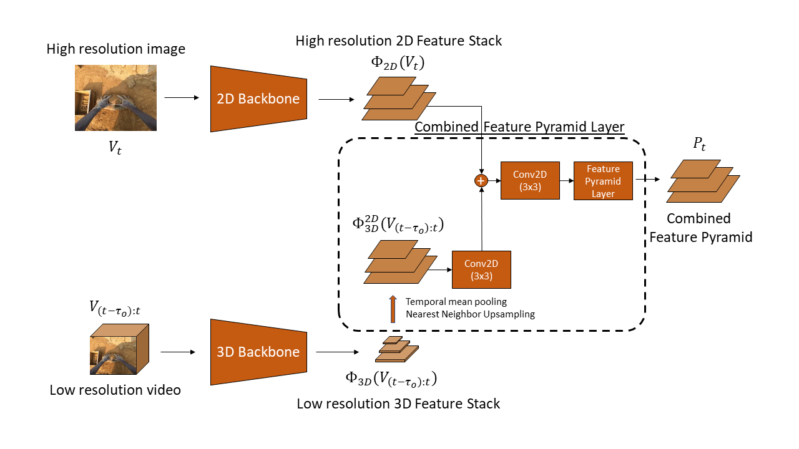

<table id="bibtexify-20" class="display"></table>
<pre id="bibtex-20" class="raw-bibtex js-hidden">
@InProceedings{ragusa2023stillfast,
author={Francesco Ragusa and Giovanni Maria Farinella and Antonino Furnari},
title={StillFast: An End-to-End Approach for Short-Term Object Interaction Anticipation},
 booktitle = {Proceedings of the IEEE/CVF Conference on Computer Vision and Pattern Recognition (CVPR) Workshops},
year      = {2023},
pdf={https://arxiv.org/pdf/2304.03959.pdf}
}
</pre>

Anticipation problems have been studied considering different aspects such as predicting humans' locations, predicting hands and objects trajectories, and forecasting actions and human-object interactions. In this paper, we studied the short-term object interaction anticipation problem from the egocentric point of view, proposing a new end-to-end architecture named StillFast. Our approach simultaneously processes a still image and a video detecting and localizing next-active objects, predicting the verb which describes the future interaction and determining when the interaction will start. Experiments on the large-scale egocentric dataset EGO4D show that our method outperformed state-of-the-art approaches on the considered task. Our method is ranked first in the public leaderboard of the EGO4D short term object interaction anticipation challenge 2022. <a href="https://iplab.dmi.unict.it/stillfast/">Web Page</a>