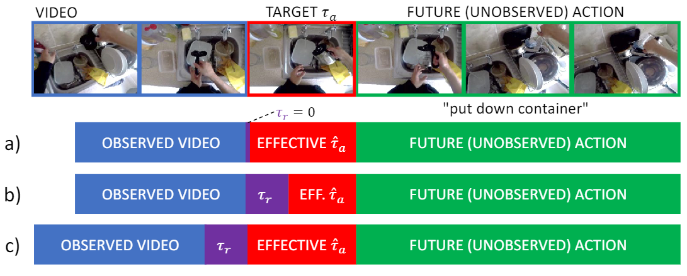

<table id="bibtexify-2" class="display"></table>
<pre id="bibtex-2" class="raw-bibtex js-hidden">
@inproceedings{furnari2022towards,
  year = {2022},
  booktitle = { International Conference on Pattern Recognition (ICPR) },
  title = { Towards Streaming Egocentric Action Anticipation },
  pdf = { https://arxiv.org/pdf/2110.05386.pdf },
  author = { Antonino Furnari and Giovanni Maria Farinella }
}
</pre>

<table id="bibtexify-2b" class="display"></table>
<pre id="bibtex-2b" class="raw-bibtex js-hidden">
@article{furnari2023streaming,
doi = {https://doi.org/10.1016/j.cviu.2023.103763},
  pdf = {https://arxiv.org/pdf/2306.16682.pdf},
  url = {https://www.sciencedirect.com/science/article/pii/S1077314223001431?via%3Dihub},
  year = {2023},
  title = {Streaming egocentric action anticipation: an evaluation scheme and approach},
  journal = {Computer Vision and Image Understanding (CVIU)},
  author = {Antonino Furnari and Giovanni Maria Farinella},
}
</pre>

Egocentric action anticipation is the task of predicting the future actions a camera wearer will likely perform based on past video observations. While in a real-world system it is fundamental to output such predictions before the action begins, past works have not generally paid attention to model runtime during evaluation. Indeed, current evaluation schemes assume that predictions can be made offline, and hence that computational resources are not limited. In contrast, in this paper, we propose a ``streaming'' egocentric action anticipation evaluation protocol which explicitly considers model runtime for performance assessment, assuming that predictions will be available only after the current video segment is processed, which depends on the processing time of a method. Following the proposed evaluation scheme, we benchmark different state-of-the-art approaches for egocentric action anticipation on two popular datasets. Our analysis shows that models with a smaller runtime tend to outperform heavier models in the considered streaming scenario, thus changing the rankings generally observed in standard offline evaluations. Based on this observation, we propose a lightweight action anticipation model consisting in a simple feed-forward 3D CNN, which we propose to optimize using knowledge distillation techniques and a custom loss. The results show that the proposed approach outperforms prior art in the streaming scenario, also in combination with other lightweight models. <a href="https://www.youtube.com/watch?v=pipNfNLQAIo" target="_blank">Video presentation at ICPR 2022</a> 